# Phase 4: Manufacturing WMS Platform — 架构设计

> **文档版本**: v1.0  
> **撰写日期**: 2025-07  
> **撰写人**: 架构师 高见远（Gao）  
> **阶段**: Phase 4 — Architecture Design（架构设计）  
> **项目**: Manufacturing WMS Platform（可复用制造业仓储管理平台）  
> **前置输入**: Phase 3 DDD Domain Design（领域驱动设计）

---

## 文档说明

| 项目 | 内容 |
|------|------|
| **Purpose（目的）** | 基于 Phase 3 DDD 领域设计，设计完整的系统架构，包括框架选型、解决方案结构、ABP 模块结构、分层职责、依赖关系、部署架构、插件策略、AI 辅助工作流和评审检查清单，为 Phase 5 数据库设计和 Phase 6 代码实现提供架构蓝图 |
| **Scope（范围）** | 后端 .NET 8 + ABP 架构、前端 Vue3 + Element Plus 架构、PDA UniApp 架构；14 个 ABP 模块映射；完整解决方案项目结构；分层职责定义；依赖图；部署方案；插件策略；AI 工作流 |
| **Design Principles（设计原则）** | 1. **Modular Monolith**：模块内高内聚、模块间低耦合；2. **Clean Architecture**：依赖方向外层→内层；3. **CQRS 读写分离**：v1.0 同库接口分离、v2.0 物理拆分；4. **事件驱动**：v1.0 进程内 EventBus、v2.0 分布式 EventBus；5. **配置化优先**：行业差异通过配置适配而非代码分支 |
| **Assumptions（假设）** | 1. v1.0 为 Modular Monolith 单体部署；2. ABP Framework 开源版本满足 v1.0 需求；3. v1.0 不使用分布式消息队列；4. SQL Server 为 v1.0 主数据库；5. 前后端分离部署 |
| **Risks（风险）** | 1. ABP 开源版本缺少部分商业功能（权限管理UI等）需自研；2. Modular Monolith 模块边界维护需要严格纪律；3. 14 个模块并行开发协调难度大；4. 库存核心模块性能瓶颈风险 |
| **Alternatives（替代方案）** | 1. 微服务架构替代 Modular Monolith（v1.0 过度设计）；2. ABP 商业版替代开源版（成本高）；3. MongoDB 替代 SQL Server（WMS 事务需求强，不适用） |
| **Review Items（评审项）** | 见 Section 10 |
| **Future Evolution（未来演进）** | v2.0 微服务拆分、分布式 EventBus、Redis 缓存层、读写分库 |

---

## 目录

1. [Implementation Approach（实现方案）](#1-implementation-approach实现方案)
2. [Framework Selection（框架选型）](#2-framework-selection框架选型)
3. [Solution Structure（解决方案结构）](#3-solution-structure解决方案结构)
4. [ABP Module Structure（ABP 模块结构）](#4-abp-module-structureabp-模块结构)
5. [Layer Responsibilities（分层职责）](#5-layer-responsibilities分层职责)
6. [Dependency Graph（依赖图）](#6-dependency-graph依赖图)
7. [Deployment Architecture（部署架构）](#7-deployment-architecture部署架构)
8. [Plugin Strategy（插件策略）](#8-plugin-strategy插件策略)
9. [AI Workflow（AI 辅助开发工作流）](#9-ai-workflowai-辅助开发工作流)
10. [Review Checklist（评审检查清单）](#10-review-checklist评审检查清单)

---

## 1. Implementation Approach（实现方案）

### 1.1 Purpose

定义整体实现策略、分阶段交付路径和模块开发优先级，确保从 DDD 领域模型到可运行系统的清晰演进路径。

### 1.2 Scope

覆盖 v1.0~v2.0 三阶段交付策略，14 个模块的开发优先级排序，以及 Modular Monolith 到微服务的演进路径。

### 1.3 Design Principles

1. **渐进交付**：核心模块优先上线，扩展模块逐步追加
2. **模块独立演进**：每个模块可独立开发、测试、迭代，不阻塞其他模块
3. **架构预留**：v1.0 单体但接口设计支持 v2.0 拆分
4. **质量优先**：核心模块（库存/入出库）要求更高的测试覆盖率和性能标准

### 1.4 整体实现策略

#### ARCH-001：Modular Monolith + 模块独立演进路径

```
v1.0 Modular Monolith → v1.1 模块增强 → v2.0 微服务拆分（可选）
```

| 阶段 | 架构形态 | 部署方式 | 通信方式 | 数据存储 |
|------|----------|----------|----------|----------|
| v1.0 | Modular Monolith | 单进程 IIS | 进程内 EventBus + DI | 单库 SQL Server |
| v1.1 | Modular Monolith | 单进程 IIS + Redis | 进程内 EventBus + DI + Redis | 单库 + Redis 缓存 |
| v2.0 | 微服务（可选拆分） | 多容器 Docker | RabbitMQ + HTTP API | 分库 + Redis + ES |

**关键决策**：

- **ARCH-002**：v1.0 选择 Modular Monolith 而非微服务，原因是：
  - 14 个模块在 v1.0 阶段业务边界尚未完全稳定，过早拆分导致服务间协调成本过高
  - WMS 库存操作要求强事务一致性，进程内调用比分布式调用更可靠
  - 团队规模适合单体并行开发（按模块分工）
  - ABP Framework 的 Module 系统天然支持 Modular Monolith

- **ARCH-003**：所有模块间调用通过 DI 接口而非直接引用实现类，为 v2.0 拆分预留

- **ARCH-004**：领域事件使用 ABP `ILocalEventBus`（v1.0），接口定义预留 `IDistributedEventBus`（v2.0），EventHandler 实现幂等

#### ARCH-005：模块开发优先级

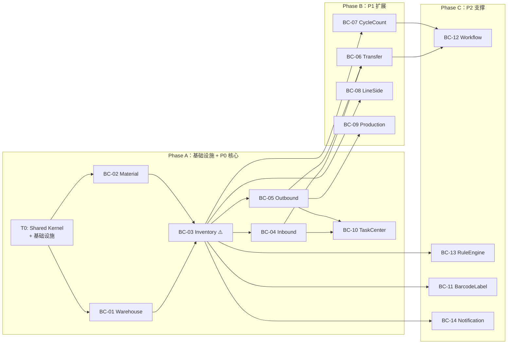

| 交付阶段 | 模块 | 预计工期 | 交付标准 |
|----------|------|----------|----------|
| **Phase A-1** | Shared Kernel + 基础设施 | 2 周 | 项目骨架可运行，ABP 模块注册完成 |
| **Phase A-2** | Warehouse + Material | 3 周 | 主数据 CRUD + 单元测试 ≥ 80% |
| **Phase A-3** | Inventory ⚠️ | 4 周 | 库存余额增减 + 流水 + 冻结/解冻 + 预警 |
| **Phase A-4** | Inbound + Outbound | 4 周 | 入库全流程 + 出库全流程 + 状态机 |
| **Phase A-5** | TaskCenter | 2 周 | 任务创建/分配/完成 + PDA 接口 |
| **Phase B** | Transfer + CycleCount + LineSide + Production | 6 周 | 各模块核心流程 |
| **Phase C** | BarcodeLabel + Workflow + RuleEngine + Notification | 4 周 | 支撑模块基础功能 |
| **集成测试** | 全模块集成 | 2 周 | 端到端流程验证 |

**总计**：约 23 周（~6 个月）

### 1.5 Assumptions

| 假设 | 说明 |
|------|------|
| Phase A 优先交付核心模块 | 库存是平台心脏，必须先稳定 |
| Phase B 模块依赖 Phase A 模块的接口 | Inbound/Outbound/Inventory 接口先定义 |
| Phase C 模块可延迟交付但不阻塞核心流程 | Workflow/RuleEngine v1.0 提供基础能力 |
| v2.0 微服务拆分时机由业务规模决定 | 单体性能瓶颈时再拆分 |

### 1.6 Risks

| 风险 | 应对 | 编号 |
|------|------|------|
| Inventory 模块交付延迟阻塞下游 | Inventory 接口先行定义，实现迭代 | ARCH-R01 |
| 模块边界维护纪律不足 | CI 检查模块间非法引用 | ARCH-R02 |
| 并行开发模块冲突 | 共享内核版本锁定 + 模块独立测试 | ARCH-R03 |
| 库存核心性能瓶颈 | 复合索引 + 连接池 + v1.1 Redis 缓存 | ARCH-R04 |

### 1.7 Alternatives

| 替代方案 | 优劣 | 编号 |
|----------|------|------|
| v1.0 直接微服务 | ✅ 架构纯净；❌ 事务复杂、运维成本高、团队规模不匹配 | ARCH-A01 |
| v1.0 简单三层架构 | ✅ 简单；❌ 无法支持 5 年演进、模块边界模糊 | ARCH-A02 |
| 所有模块一次性交付 | ✅ 功能完整；❌ 工期长、核心模块风险高 | ARCH-A03 |

### 1.8 Review Items

| 评审项 | 标准 |
|--------|------|
| 交付策略覆盖 v1.0 全模块 | ✅ 14 模块分 Phase A/B/C |
| 模块优先级与 DDD 优先级一致 | P0→Phase A, P1→Phase B, P2→Phase C |
| Modular Monolith 演进路径明确 | v1.0→v1.1→v2.0 三阶段 |
| 库存模块优先交付 | Phase A-3 |

### 1.9 Future Evolution

| 演进方向 | 时间线 | 内容 |
|----------|--------|------|
| 微服务拆分 | v2.0 | 按模块拆分为独立服务，优先拆分 Notification/RuleEngine |
| 事件溯源 | v3.0+ | Inventory 模块可选 Event Sourcing |
| 云原生部署 | v2.0 | Kubernetes + Helm Chart |
| 多租户 | v2.0 | ABP Multi-Tenancy 支持 |

---

## 2. Framework Selection（框架选型）

### 2.1 Purpose

深度分析技术选型，列出所有关键 NuGet 包、前端依赖、第三方库，明确版本锁定策略。

### 2.2 Scope

后端 .NET 8 + ABP Framework 选型、前端 Vue3 + Element Plus 选型、PDA UniApp 选型、第三方库选型。

### 2.3 Design Principles

1. **成熟优先**：选择社区成熟、文档完善的框架
2. **版本稳定**：锁定主要依赖版本，避免升级风险
3. **ABP 优先**：ABP 提供的基础设施优先使用，减少自研
4. **最小依赖**：不引入不必要的第三方包

### 2.4 .NET 8 + ABP Framework 选型理由

#### ARCH-010：为什么选择 .NET 8

| 评估维度 | .NET 8 | Java Spring Boot | Go |
|----------|--------|-------------------|-----|
| 企业级生态 | ✅ 强（EF Core, ABP, Identity） | ✅ 强 | ⚠️ 较弱 |
| DDD 支持 | ✅ ABP Framework 天然 DDD | ⚠️ 需自建 | ❌ 缺乏 |
| 性能 | ✅ 高（Kestrel, AOT） | ⚠️ 中等 | ✅ 极高 |
| 团队技能 | ✅ .NET 团队 | ⚠️ 需转型 | ❌ 不匹配 |
| 事务支持 | ✅ EF Core 强事务 | ✅ Spring Data | ⚠️ 较弱 |
| 模块化 | ✅ ABP Module System | ⚠️ Spring Module | ❌ 缺乏 |
| 长期支持 | ✅ LTS 3 年 | ✅ 长期 | ✅ 长期 |

#### ARCH-011：为什么选择 ABP Framework

| 能力 | ABP 提供 | 自研成本 | 说明 |
|------|----------|----------|------|
| DDD 基础设施 | AggregateRoot, Entity, ValueObject, Repository | 高 | 核心依赖 |
| 模块系统 | AbpModule, DependsOn, ServiceConfiguration | 高 | Modular Monolith 核心 |
| 事件总线 | ILocalEventBus, IDistributedEventBus | 中 | 进程内 + 分布式 |
| 身份认证 | Identity Module, JWT, Permission | 高 | 用户/角色/权限 |
| 单元工作 | IUnitOfWork, Transaction | 中 | 事务一致性 |
| 多租户 | IMultiTenant, Tenant Resolve | 高 | 未来多租户 |
| 审计日志 | Auditing, Entity Change Tracking | 中 | 自动审计 |
| 设置管理 | SettingDefinition, ISettingManager | 低 | 配置化 |
| 后台作业 | Background Job/Queue | 中 | 定时任务 |
| 自动 API | Auto API Controllers | 低 | 减少 Controller 代码 |
| 数据过滤 | Data Filter (SoftDelete, MultiTenant) | 中 | 全局过滤 |

#### ARCH-012：ABP 开源版本 vs 商业版本

| 功能 | 开源版 | 商业版 | v1.0 决策 |
|------|--------|--------|-----------|
| DDD 基础设施 | ✅ | ✅ | 开源版 |
| Module System | ✅ | ✅ | 开源版 |
| Identity Module | ✅ | ✅ 增强 UI | 开源版 + 自研 UI |
| Permission System | ✅ | ✅ 增强 UI | 开源版 + 自研 UI |
| Feature System | ✅ | ✅ 增强 UI | 开源版 + 自研 UI |
| Setting Management | ✅ | ✅ 增强 UI | 开源版 + 自研 UI |
| SaaS Module | ❌ | ✅ | v2.0 评估 |
| Audit Log UI | ❌ | ✅ | 自研简化版 |
| Form Builder | ❌ | ✅ | 不需要 |
| Theme | ❌ | ✅ | Vue3 自研主题 |
| Excel Import/Export | ❌ | ✅ | 自研（MagicOnion Excel） |

**决策**：v1.0 使用 ABP 开源版本，权限/设置 UI 自研。v2.0 根据业务需要评估商业版 SaaS Module。

### 2.5 关键 NuGet 包列表

#### 核心框架包

| 包名 | 版本 | 作用说明 | 编号 |
|------|------|----------|------|
| `Volo.Abp.Core` | ^8.3.0 | ABP 核心模块系统、DDD 基础设施 | PKG-001 |
| `Volo.Abp.Data` | ^8.3.0 | 数据基础设施、Repository 基类 | PKG-002 |
| `Volo.Abp.EventBus` | ^8.3.0 | 进程内事件总线 | PKG-003 |
| `Volo.Abp.EventBus.RabbitMQ` | ^8.3.0 | 分布式事件总线（v2.0 使用） | PKG-004 |
| `Volo.Abp.Identity` | ^8.3.0 | 身份认证模块 | PKG-005 |
| `Volo.Abp.PermissionManagement` | ^8.3.0 | 权限管理 | PKG-006 |
| `Volo.Abp.SettingManagement` | ^8.3.0 | 设置管理 | PKG-007 |
| `Volo.Abp.AuditLogging` | ^8.3.0 | 审计日志 | PKG-008 |
| `Volo.Abp.BackgroundJobs` | ^8.3.0 | 后台作业 | PKG-009 |
| `Volo.Abp.AutoHttpApi` | ^8.3.0 | 自动 API Controller 生成 | PKG-010 |

#### EF Core + 数据库包

| 包名 | 版本 | 作用说明 | 编号 |
|------|------|----------|------|
| `Volo.Abp.EntityFrameworkCore` | ^8.3.0 | ABP EF Core 基础设施 | PKG-011 |
| `Volo.Abp.EntityFrameworkCore.SqlServer` | ^8.3.0 | SQL Server Provider | PKG-012 |
| `Microsoft.EntityFrameworkCore` | ^8.0.0 | EF Core 核心 | PKG-013 |
| `Microsoft.EntityFrameworkCore.Tools` | ^8.0.0 | Migration 工具 | PKG-014 |
| `Microsoft.Data.SqlClient` | ^5.2.0 | SQL Server 客户端驱动 | PKG-015 |

#### ASP.NET Core + Web 包

| 包名 | 版本 | 作用说明 | 编号 |
|------|------|----------|------|
| `Volo.Abp.AspNetCore` | ^8.3.0 | ABP ASP.NET Core 集成 | PKG-016 |
| `Volo.Abp.AspNetCore.Serilog` | ^8.3.0 | Serilog 请求日志 | PKG-017 |
| `Volo.Abp.Swashbuckle` | ^8.3.0 | Swagger/OpenAPI 集成 | PKG-018 |
| `Microsoft.AspNetCore.SignalR` | ^8.0.0 | 实时推送（任务通知） | PKG-019 |

#### Redis 缓存包（v1.1 使用）

| 包名 | 版本 | 作用说明 | 编号 |
|------|------|----------|------|
| `Volo.Abp.Caching` | ^8.3.0 | ABP 缓存抽象 | PKG-020 |
| `Volo.Abp.Caching.StackExchangeRedis` | ^8.3.0 | Redis 缓存实现 | PKG-021 |
| `StackExchange.Redis` | ^2.7.0 | Redis 客户端 | PKG-022 |

#### 日志 + 序列化 + 工具包

| 包名 | 版本 | 作用说明 | 编号 |
|------|------|----------|------|
| `Serilog` | ^4.0.0 | 结构化日志 | PKG-023 |
| `Serilog.Sinks.File` | ^6.0.0 | 文件日志输出 | PKG-024 |
| `Serilog.Sinks.Seq` | ^6.0.0 | Seq 日志平台输出 | PKG-025 |
| `Newtonsoft.Json` | ^13.0.3 | JSON 序列化（ABP 默认） | PKG-026 |
| `Mapster` | ^7.4.0 | 对象映射（DTO→Entity） | PKG-027 |
| `FluentValidation` | ^11.9.0 | DTO 验证 | PKG-028 |
| `AutoMapper` | ^13.0.0 | ABP 默认映射替代方案（按模块选用） | PKG-029 |
| `Polly` | ^8.4.0 | 重试/熔断策略（ERP 回传） | PKG-030 |
| `Quartz` | ^3.8.0 | 定时任务调度（预警扫描） | PKG-031 |
| `ClosedXML` | ^0.102.0 | Excel 导入导出 | PKG-032 |
| `BarCode` | ^4.0.0 | 条码生成（NetBarcode） | PKG-033 |

#### v2.0 预留包

| 包名 | 版本 | 作用说明 | 编号 |
|------|------|----------|------|
| `Volo.Abp.EventBus.RabbitMQ` | ^8.3.0 | 分布式事件总线 | PKG-034 |
| `MassTransit.RabbitMQ` | ^8.3.0 | 替代事件总线（可选） | PKG-035 |
| `Elasticsearch.Net` | ^8.15.0 | 搜索引擎（日志/报表查询） | PKG-036 |
| `OpenTelemetry` | ^1.9.0 | 分布式追踪 | PKG-037 |

### 2.6 Vue3 + Element Plus 前端框架选型

#### ARCH-013：为什么选择 Vue3 + Element Plus

| 评估维度 | Vue3 + Element Plus | React + Ant Design | Angular + ng-zorro |
|----------|---------------------|---------------------|---------------------|
| 学习曲线 | ✅ 低 | ⚠️ 中 | ❌ 高 |
| 中文生态 | ✅ 强（制造业行业组件） | ⚠️ 中 | ❌ 弱 |
| TypeScript | ✅ 完善 | ✅ 完善 | ✅ 原生 |
| 组件丰富度 | ✅ 企业级组件 | ✅ 企业级组件 | ⚠️ 一般 |
| 表单/表格 | ✅ 强（WMS 核心） | ✅ 强 | ⚠️ 一般 |
| 性能 | ✅ Vite 构建 | ✅ Vite/Webpack | ⚠️ 一般 |
| 团队技能 | ✅ Vue 团队 | ⚠️ 需转型 | ❌ 不匹配 |

#### 前端关键依赖列表

| 包名 | 版本 | 作用说明 | 编号 |
|------|------|----------|------|
| `vue` | ^3.4.0 | 核心 UI 框架 | FPKG-001 |
| `typescript` | ^5.4.0 | 类型安全 | FPKG-002 |
| `vite` | ^5.4.0 | 构建工具 | FPKG-003 |
| `element-plus` | ^2.7.0 | 组件库 | FPKG-004 |
| `vue-router` | ^4.3.0 | 路由 | FPKG-005 |
| `pinia` | ^2.1.0 | 状态管理 | FPKG-006 |
| `axios` | ^1.7.0 | HTTP 客户端 | FPKG-007 |
| `@vueuse/core` | ^10.11.0 | 组合式 API 工具集 | FPKG-008 |
| `dayjs` | ^1.11.0 | 日期处理 | FPKG-009 |
| `echarts` | ^5.5.0 | 图表（看板/报表） | FPKG-010 |
| `vue-i18n` | ^9.14.0 | 国际化（预留） | FPKG-011 |
| `vuedraggable` | ^4.1.0 | 拖拽（审批流编辑器） | FPKG-012 |
| `print-js` | ^1.6.0 | 打印 | FPKG-013 |
| `qrcode` | ^1.5.0 | 二维码生成 | FPKG-014 |
| `@abp/vue` | 自研 | ABP 前端适配层 | FPKG-015 |

### 2.7 UniApp PDA 技术选型

#### ARCH-014：为什么选择 UniApp

| 评估维度 | UniApp | React Native | Flutter | 原生 Android |
|----------|--------|---------------|---------|-------------|
| 跨平台 | ✅ iOS + Android + 小程序 | ✅ iOS + Android | ✅ iOS + Android | ❌ 单平台 |
| Vue 技术栈 | ✅ 与前端一致 | ❌ React | ❌ Dart | ❌ Kotlin |
| 扫码能力 | ✅ uni.scanCode | ⚠️ 需插件 | ⚠️ 需插件 | ✅ 原生 |
| PDA 适配 | ✅ 宽屏适配 | ⚠️ 需适配 | ⚠️ 需适配 | ✅ 原生 |
| 生态 | ✅ 丰富插件市场 | ✅ 丰富 | ⚠️ 成长中 | ✅ 原生 |
| 开发效率 | ✅ 高（与前端共用组件） | ⚠️ 中 | ⚠️ 中 | ❌ 低 |
| 热更新 | ✅ 支持 | ⚠️ 需配置 | ❌ 不支持 | ❌ 不支持 |

#### PDA 关键依赖列表

| 包名 | 版本 | 作用说明 | 编号 |
|------|------|----------|------|
| `uni-app` | HBuilderX 3.99+ | 核心框架 | PPKG-001 |
| `uview-plus` | ^3.3.0 | UI 组件库 | PPKG-002 |
| `z-paging` | ^2.7.0 | 分页列表 | PPKG-003 |
| `ljs-cryptography` | ^1.0.0 | 加密工具 | PPKG-004 |
| `uni-scancode` | 插件 | 扫码（条码/二维码） | PPKG-005 |
| `uni-networkInfo` | 插件 | 网络状态检测 | PPKG-006 |

### 2.8 版本锁定策略

- **后端**：所有 NuGet 包版本在 `Directory.Build.props` 中统一管理
- **前端**：`package.json` 中锁定版本，使用 `npm ci` 安装
- **PDA**：`manifest.json` 和 `package.json` 锁定版本
- **升级策略**：每季度评估依赖升级，核心包（ABP/EF Core）跟随 LTS 版本

### 2.9 Assumptions

| 假设 | 说明 |
|------|------|
| ABP 8.3.0 为当前最新稳定版 | 发布时根据实际版本调整 |
| Vue3 3.4+ 和 Element Plus 2.7+ 为当前稳定版 | 按实际调整 |
| 团队有 .NET 8 + Vue3 技术储备 | 无需大量学习 |
| SQL Server 2019+ 可用 | 企业标准数据库 |

### 2.10 Risks

| 风险 | 应对 |
|------|------|
| ABP 大版本升级导致 Breaking Changes | 锁定版本 + 季度评估 |
| Element Plus 组件不满足业务需求 | 自研业务组件 |
| UniApp PDA 扫码性能不足 | 备选原生扫码插件 |

### 2.11 Alternatives

| 替代方案 | 优劣 |
|----------|------|
| ABP 商业版 | ✅ 功能丰富 UI；❌ 成本高、定制受限 |
| Blazor Server 前端 | ✅ .NET 全栈；❌ PDA 不支持、生态弱 |
| MAUI PDA | ✅ .NET 全栈；❌ PDA 适配差、生态弱 |
| React Native PDA | ✅ 跨平台；❌ 与 Vue 技术栈不一致 |

### 2.12 Review Items

| 评审项 | 标准 |
|--------|------|
| NuGet 包覆盖 v1.0 全模块需求 | ✅ 37 个包 |
| 前端依赖覆盖 UI 全组件 | ✅ 15 个包 |
| PDA 依赖覆盖扫码+网络 | ✅ 6 个包 |
| 版本锁定策略明确 | ✅ |
| ABP 开源版可行性 | ✅ 自研权限/设置 UI |

### 2.13 Future Evolution

| 演进方向 | 时间线 | 内容 |
|----------|--------|------|
| ABP 商业版评估 | v2.0 | SaaS 多租户需求 |
| React Native PDA | v2.0 | 如 UniApp 不满足 |
| Redis 分布式缓存 | v1.1 | 库存实时数据缓存 |
| OpenTelemetry 集成 | v2.0 | 分布式追踪 |

---

## 3. Solution Structure（解决方案结构）

### 3.1 Purpose

定义 .NET 解决方案完整的项目结构、命名规范、文件列表，前端和 PDA 项目结构。

### 3.2 Scope

后端 .csproj 项目结构、前端 Vue3 项目结构、PDA UniApp 项目结构、项目命名规范、目录与项目约定映射。

### 3.3 Design Principles

1. **模块独立**：每个 ABP Module 有独立的项目分层
2. **命名统一**：统一前缀 `Wms`，统一后缀规则
3. **分层清晰**：Domain / Application / HttpApi / HttpApi.Client / EntityFrameworkCore 5 层
4. **共享内核集中**：Shared Kernel 项目独立管理

### 3.4 项目命名规范

| 规则 | 示例 | 说明 |
|------|------|------|
| 统一前缀 | `Wms.` | 所有项目以 Wms. 开头 |
| 模块名 | `Warehouse`, `Material`, `Inventory` | 与 BC 名称对应 |
| 层后缀 | `.Domain`, `.Application`, `.HttpApi`, `.HttpApi.Client`, `.EntityFrameworkCore` | 5 层标准 |
| 共享内核 | `Wms.Shared` | 跨模块共享 |
| 测试后缀 | `.Tests` | 单元/集成测试 |
| 主项目 | `Wms.Web`, `Wms.Web.Host` | Web 启动项目 |
| 合约项目 | `.Contracts` | DTO + 接口定义（客户端引用） |

### 3.5 .NET 解决方案项目结构

```
ManufacturingWMS/
├── 00_ProjectManagement/
├── 01_PRD/
├── 02_Architecture/
│   └── Phase4_Architecture_Design.md          ← 本文档
├── 03_DDD/
│   └── Phase3_DDD_Design.md
├── 04_Database/
├── 05_API/
├── 06_UI/
├── 07_Backend/
│   └── Wms/
│       ├── Directory.Build.props               ← 全局版本管理
│       ├── Directory.Build.targets              ← 全局构建目标
│       ├── Wms.sln                              ← 解决方案文件
│       │
│       ├── Shared/                              ← 共享内核 + 基础设施
│       │   ├── Wms.Shared/                      ← 共享值对象 + 枚举 + 接口
│       │   │   ├── Domain/
│       │   │   │   ├── ValueObjects/
│       │   │   │   │   ├── MaterialCode.cs      ← VO-04 共享内核
│       │   │   │   │   ├── Quantity.cs
│       │   │   │   │   ├── WarehouseCode.cs
│       │   │   │   │   ├── LocationCode.cs
│       │   │   │   │   └── BatchNumber.cs
│       │   │   │   ├── Enums/
│       │   │   │   │   ├── InventoryStatus.cs   ← VO-08
│       │   │   │   │   ├── TaskPriority.cs
│       │   │   │   │   ├── TaskType.cs
│       │   │   │   │   ├── InboundType.cs
│       │   │   │   │   ├── OutboundType.cs
│       │   │   │   │   └── TransferType.cs
│       │   │   │   ├── Interfaces/
│       │   │   │   │   ├── IBondedWarehouseService.cs ← 保税仓预留
│       │   │   │   │   └── IRuleEngineService.cs
│       │   │   │   ├── Events/
│       │   │   │   │   └── EventDataBase.cs
│       │   │   │   └── Helpers/
│       │   │   │       └── IdGenerator.cs
│       │   │   ├── Wms.Shared.csproj
│       │   │   └── ...
│       │   ├── Wms.Shared.Tests/
│       │   │   ├── Wms.Shared.Tests.csproj
│       │   │   └── ...
│       │
│       ├── Modules/                             ← 14 个业务模块
│       │   ├── Warehouse/                        ← BC-01
│       │   │   ├── Wms.Warehouse.Domain/
│       │   │   │   ├── Aggregates/
│       │   │   │   │   ├── Warehouse.cs          ← AGG-01
│       │   │   │   │   ├── WarehouseArea.cs      ← AGG-02
│       │   │   │   │   ├── Location.cs           ← AGG-03
│       │   │   │   ├── Entities/
│       │   │   │   ├── ValueObjects/
│       │   │   │   ├── Events/
│       │   │   │   ├── Repositories/
│       │   │   │   │   ├── IWarehouseRepository.cs
│       │   │   │   │   ├── IWarehouseAreaRepository.cs
│       │   │   │   │   ├── ILocationRepository.cs
│       │   │   │   ├── Services/
│       │   │   │   ├── WmsWarehouseDomainModule.cs
│       │   │   │   ├── Wms.Warehouse.Domain.csproj
│       │   │   │   └── ...
│       │   │   ├── Wms.Warehouse.Application/
│       │   │   │   ├── Services/
│       │   │   │   │   ├── WarehouseAppService.cs
│       │   │   │   │   ├── WarehouseAreaAppService.cs
│       │   │   │   │   ├── LocationAppService.cs
│       │   │   │   ├── DTOs/
│       │   │   │   │   ├── WarehouseDto.cs
│       │   │   │   │   ├── CreateWarehouseDto.cs
│       │   │   │   │   ├── UpdateWarehouseDto.cs
│       │   │   │   ├── Commands/
│       │   │   │   ├── Queries/
│       │   │   │   ├── Validators/
│       │   │   │   ├── Permissions/
│       │   │   │   │   ├── WarehousePermissions.cs
│       │   │   │   ├── WmsWarehouseApplicationModule.cs
│       │   │   │   ├── Wms.Warehouse.Application.csproj
│       │   │   │   └─ ...
│       │   │   ├── Wms.Warehouse.Application.Contracts/
│       │   │   │   ├── Services/
│       │   │   │   │   ├── IWarehouseAppService.cs
│       │   │   │   ├── DTOs/
│       │   │   │   ├── Permissions/
│       │   │   │   ├── Wms.Warehouse.Application.Contracts.csproj
│       │   │   │   └── ...
│       │   │   ├── Wms.Warehouse.HttpApi/
│       │   │   │   ├── Controllers/
│       │   │   │   │   ├── WarehouseController.cs
│       │   │   │   │   ├── WarehouseAreaController.cs
│       │   │   │   │   ├── LocationController.cs
│       │   │   │   ├── WmsWarehouseHttpApiModule.cs
│       │   │   │   ├── Wms.Warehouse.HttpApi.csproj
│       │   │   │   └─ ...
│       │   │   ├── Wms.Warehouse.HttpApi.Client/
│       │   │   │   ├── WmsWarehouseHttpApiClientModule.cs
│       │   │   │   ├── Wms.Warehouse.HttpApi.Client.csproj
│       │   │   │   └─ ...
│       │   │   ├── Wms.Warehouse.EntityFrameworkCore/
│       │   │   │   ├── Entities/
│       │   │   │   │   ├── WarehouseEfCoreConfiguration.cs
│       │   │   │   │   ├── WarehouseAreaEfCoreConfiguration.cs
│       │   │   │   │   ├── LocationEfCoreConfiguration.cs
│       │   │   │   ├── Migrations/
│       │   │   │   ├── Repositories/
│       │   │   │   │   ├── WarehouseRepository.cs
│       │   │   │   │   ├── WarehouseAreaRepository.cs
│       │   │   │   │   ├── LocationRepository.cs
│       │   │   │   ├── WmsWarehouseEntityFrameworkCoreModule.cs
│       │   │   │   ├── Wms.Warehouse.EntityFrameworkCore.csproj
│       │   │   │   └─ ...
│       │   │   ├── Wms.Warehouse.Tests/
│       │   │   │   ├── Domain/
│       │   │   │   ├── Application/
│       │   │   │   ├── Wms.Warehouse.Tests.csproj
│       │   │   │   └─ ...
│       │   │
│       │   ├── Material/                         ← BC-02（结构同上）
│       │   │   ├── Wms.Material.Domain/
│       │   │   ├── Wms.Material.Application/
│       │   │   ├── Wms.Material.Application.Contracts/
│       │   │   ├── Wms.Material.HttpApi/
│       │   │   ├── Wms.Material.HttpApi.Client/
│       │   │   ├── Wms.Material.EntityFrameworkCore/
│       │   │   ├── Wms.Material.Tests/
│       │   │
│       │   ├── Inventory/                        ← BC-03 ⚠️核心
│       │   │   ├── Wms.Inventory.Domain/
│       │   │   │   ├── Aggregates/
│       │   │   │   │   ├── InventoryBalance.cs     ← AGG-06
│       │   │   │   │   ├── InventoryLedgerEntry.cs  ← AGG-07
│       │   │   │   │   ├── InventoryAdjustment.cs   ← AGG-08
│       │   │   │   │   ├── InventoryFreezeOrder.cs  ← AGG-09
│       │   │   │   ├── Services/
│       │   │   │   │   ├── InventoryDomainService.cs ← DS-01 ⚠️
│       │   │   │   ├── Events/
│       │   │   │   │   ├── InventoryChangedEvent.cs
│       │   │   │   │   ├── SafetyStockAlertEvent.cs
│       │   │   │   │   ├── ExpiryAlertEvent.cs
│       │   │   │   ├── Repositories/
│       │   │   │   │   ├── IInventoryBalanceRepository.cs ← REP-06
│       │   │   │   │   ├── IInventoryLedgerRepository.cs  ← REP-07
│       │   │   │   └─ ...
│       │   │   ├── Wms.Inventory.Application/
│       │   │   ├── Wms.Inventory.Application.Contracts/
│       │   │   ├── Wms.Inventory.HttpApi/
│       │   │   ├── Wms.Inventory.HttpApi.Client/
│       │   │   ├── Wms.Inventory.EntityFrameworkCore/
│       │   │   ├── Wms.Inventory.Tests/
│       │   │
│       │   ├── Inbound/                          ← BC-04
│       │   │   ├── ...（5层同上）
│       │   ├── Outbound/                         ← BC-05
│       │   │   ├── ...（5层同上）
│       │   ├── Transfer/                         ← BC-06
│       │   │   ├── ...（5层同上）
│       │   ├── CycleCount/                       ← BC-07
│       │   │   ├── ...（5层同上）
│       │   ├── LineSide/                         ← BC-08
│       │   │   ├── ...（5层同上）
│       │   ├── Production/                       ← BC-09
│       │   │   ├── ...（5层同上）
│       │   ├── TaskCenter/                       ← BC-10
│       │   │   ├── ...（5层同上）
│       │   ├── BarcodeLabel/                     ← BC-11
│       │   │   ├── ...（5层同上）
│       │   ├── Workflow/                         ← BC-12
│       │   │   ├── ...（5层同上）
│       │   ├── RuleEngine/                       ← BC-13
│       │   │   ├── ...（5层同上）
│       │   ├── Notification/                     ← BC-14
│       │   │   ├── ...（5层同上）
│       │
│       ├── Host/                                 ← 启动项目
│       │   ├── Wms.Web.Host/
│       │   │   ├── Controllers/
│       │   │   │   ├── HomeController.cs
│       │   │   ├── Program.cs
│       │   │   ├── appsettings.json
│       │   │   ├── WmsWebHostModule.cs
│       │   │   ├── Wms.Web.Host.csproj
│       │   │   └─ ...
│       │   ├── Wms.Web.Host.Tests/
│       │   │   ├── Wms.Web.Host.Tests.csproj
│       │   │   └─ ...
│       │
│       ├── HttpApi.Host/                         ← HTTP API Host（可选独立）
│       │   ├── Wms.HttpApi.Host/
│       │   │   ├── Program.cs
│       │   │   ├── WmsHttpApiHostModule.cs
│       │   │   ├── Wms.HttpApi.Host.csproj
│       │   │   └─ ...
│       │
│       ├── DbMigrator/                           ← 数据库迁移工具
│       │   ├── Wms.DbMigrator/
│       │   │   ├── Program.cs
│       │   │   ├── WmsDbMigratorModule.cs
│       │   │   ├── Wms.DbMigrator.csproj
│       │   │   └─ ...
│       │
│       ├── TestBase/                             ← 测试基础设施
│       │   ├── Wms.TestBase/
│       │   │   ├── WmsTestBaseModule.cs
│       │   │   ├── Wms.TestBase.csproj
│       │   │   └─ ...
│       │
│       └── Directory.Build.props                 ← 全局 NuGet 版本
│       └── Directory.Build.targets               ← 全局构建目标
│       └── Wms.sln
│
├── 08_Frontend/
│   └── wms-web/
│       ├── package.json
│       ├── vite.config.ts
│       ├── tsconfig.json
│       ├── src/
│       │   ├── main.ts
│       │   ├── App.vue
│       │   ├── router/
│       │   │   ├── index.ts
│       │   │   ├── routes/
│       │   │   │   ├── warehouse.ts
│       │   │   │   ├── material.ts
│       │   │   │   ├── inventory.ts
│       │   │   │   ├── inbound.ts
│       │   │   │   ├── outbound.ts
│       │   │   │   ├── transfer.ts
│       │   │   │   ├── cycle-count.ts
│       │   │   │   ├── task-center.ts
│       │   │   │   └─ ...
│       │   ├── stores/
│       │   │   ├── index.ts
│       │   │   ├── modules/
│       │   │   │   ├── user.ts
│       │   │   │   ├── warehouse.ts
│       │   │   │   └─ ...
│       │   ├── api/
│       │   │   ├── index.ts                       ← axios 配置
│       │   │   ├── warehouse.ts                   ← BC-01 API
│       │   │   ├── material.ts                    ← BC-02 API
│       │   │   ├── inventory.ts                   ← BC-03 API
│       │   │   ├── inbound.ts                     ← BC-04 API
│       │   │   ├── outbound.ts                    ← BC-05 API
│       │   │   └─ ...
│       │   ├── views/
│       │   │   ├── dashboard/
│       │   │   ├── warehouse/
│       │   │   │   ├── WarehouseList.vue
│       │   │   │   ├── WarehouseAreaList.vue
│       │   │   │   ├── LocationList.vue
│       │   │   │   └─ ...
│       │   │   ├── material/
│       │   │   ├── inventory/
│       │   │   │   ├── BalanceList.vue            ← 库存余额
│       │   │   │   ├── LedgerList.vue             ← 库存流水
│       │   │   │   ├── AlertList.vue              ← 库存预警
│       │   │   │   └─ ...
│       │   │   ├── inbound/
│       │   │   ├── outbound/
│       │   │   ├── task-center/
│       │   │   └─ ...
│       │   ├── components/
│       │   │   ├── common/
│       │   │   │   ├── WmsTable.vue               ← 通用表格
│       │   │   │   ├── WmsForm.vue                ← 通用表单
│       │   │   │   ├── WmsSearch.vue              ← 搜索栏
│       │   │   │   ├── WmsDialog.vue              ← 对话框
│       │   │   │   └─ ...
│       │   │   ├── business/
│       │   │   │   ├── MaterialSelector.vue       ← 物料选择器
│       │   │   │   ├── WarehouseSelector.vue      ← 仓库选择器
│       │   │   │   ├── LocationSelector.vue       ← 库位选择器
│       │   │   │   ├── OrderLineEditor.vue        ← 单据行编辑器
│       │   │   │   └─ ...
│       │   │   ├── charts/
│       │   │   │   ├── InventoryDashboard.vue     ← 库存看板
│       │   │   │   ├── TaskDashboard.vue          ← 任务看板
│       │   │   │   └─ ...
│       │   ├── layouts/
│       │   │   ├── DefaultLayout.vue
│       │   │   ├── Sidebar.vue
│       │   │   ├── Header.vue
│       │   │   └─ ...
│       │   ├── styles/
│       │   │   ├── variables.scss
│       │   │   ├── mixins.scss
│       │   │   ├── global.scss
│       │   │   └─ ...
│       │   ├── utils/
│       │   │   ├── auth.ts
│       │   │   ├── format.ts
│       │   │   ├── permission.ts
│       │   │   └─ ...
│       │   ├── hooks/
│       │   │   ├── useCrud.ts                     ← CRUD 组合式函数
│       │   │   ├── useTable.ts                    ← 表格组合式函数
│       │   │   ├── useForm.ts                     ← 表单组合式函数
│       │   │   └─ ...
│       │   ├── i18n/                              ← 国际化预留
│       │   │   ├── zh-CN/
│       │   │   ├── en/
│       │   │   └─ ...
│       │   └─ types/
│       │       ├── warehouse.d.ts
│       │       ├── material.d.ts
│       │       ├── inventory.d.ts
│       │       └─ ...
│       ├── public/
│       └── env/
│           ├── .env.development
│           ├── .env.staging
│           ├── .env.production
│
├── 09_Test/
│   ├── Backend/
│   │   ├── Wms.IntegrationTests/
│   │   │   ├── Modules/
│   │   │   │   ├── InventoryIntegrationTests.cs
│   │   │   │   ├── InboundIntegrationTests.cs
│   │   │   │   └─ ...
│   │   │   ├── Wms.IntegrationTests.csproj
│   │   │   └─ ...
│   │   ├── Wms.PerformanceTests/
│   │   │   ├── InventoryPerformanceTests.cs
│   │   │   ├── Wms.PerformanceTests.csproj
│   │   │   └─ ...
│   ├── Frontend/
│   │   ├── wms-web/
│   │   │   ├── tests/
│   │   │   │   ├── unit/
│   │   │   │   ├── e2e/
│   │   │   │   └─ ...
│
├── 10_Deployment/
│   ├── docker/
│   │   ├── Dockerfile.backend
│   │   ├── Dockerfile.frontend
│   │   ├── docker-compose.yml
│   │   └─ ...
│   ├── iis/
│   │   ├── web.config
│   │   └─ ...
│   ├── nginx/
│   │   ├── nginx.conf
│   │   └─ ...
│   ├── scripts/
│   │   ├── deploy.ps1
│   │   ├── migrate.ps1
│   │   └─ ...
│
├── 11_Documentation/
│   ├── api/
│   ├── user-guide/
│   ├── ops-guide/
│   └─ ...
│
├── 12_AI_Workflow/
│   ├── prompts/
│   ├── templates/
│   └─ ...
│
└── 99_Assets/
```

### 3.6 项目统计汇总

| 类别 | 项目数 | 说明 |
|------|--------|------|
| Shared Kernel | 2 | Wms.Shared + Wms.Shared.Tests |
| 业务模块（每个 5 层 + Contracts + Tests） | 14 × 8 = 112 | 14 个 BC |
| Host 启动项目 | 3 | Web.Host + HttpApi.Host + DbMigrator |
| TestBase | 1 | 测试基础设施 |
| **后端项目总计** | **~118** | |
| 前端项目 | 1 | wms-web |
| PDA 项目 | 1 | wms-pda |

### 3.7 Assumptions

| 假设 | 说明 |
|------|------|
| 每个模块严格 5 层结构 | 遵循 ABP 模块约定 |
| Contracts 项目独立于 Application | 客户端只引用 Contracts |
| 前端按 BC 组织路由和 API | 与后端模块对应 |
| PDA 独立项目 | 不与前端共用代码 |

### 3.8 Risks

| 风险 | 应对 |
|------|------|
| 118 个后端项目数量庞大 | ABP 模板生成 + CI 构建 |
| 模块间项目引用混乱 | 依赖图 + CI 检查非法引用 |
| 前端代码组织与后端不一致 | 按约定规则生成 |

### 3.9 Alternatives

| 替代方案 | 优劣 |
|----------|------|
| 所有模块共享一个 EF Core 项目 | ✅ 简单；❌ 违反模块独立性 |
| 模块内减少层数（3层） | ✅ 简化；❌ 不符合 ABP 约定 |
| 前端与 PDA 共用代码 | ✅ 复用；❌ 平台差异大 |

### 3.10 Review Items

| 评审项 | 标准 |
|--------|------|
| 项目结构覆盖 14 个模块 | ✅ |
| 命名规范统一 | ✅ |
| 5 层结构完整 | ✅ |
| 目录与项目约定对应 | ✅ |

### 3.11 Future Evolution

| 演进方向 | 时间线 | 内容 |
|----------|--------|------|
| 微服务拆分时模块独立部署 | v2.0 | 每个模块成为独立服务 |
| 模块 EF Core 项目合并为共享 | v1.0 可选 | 减少迁移复杂度 |
| 前端组件库抽离 | v1.1 | npm 包发布 |

---

## 4. ABP Module Structure（ABP 模块结构）

### 4.1 Purpose

定义每个 BC → ABP Module 的映射关系、模块内分层结构、模块间依赖关系、共享模块设计和模块注册配置。

### 4.2 Scope

14 个 ABP Module 的完整定义，模块依赖关系图，共享内核设计，模块注册和启动配置。

### 4.3 Design Principles

1. **BC → Module 一对一映射**：每个限界上下文对应一个 ABP Module
2. **模块依赖声明**：通过 ABP `DependsOn` 声明依赖
3. **接口优先**：模块间通过 Contracts + DI 接口通信
4. **共享内核最小化**：仅共享值对象和枚举

### 4.4 BC → ABP Module 映射表

| BC-ID | BC 名称 | Module 类 | 前缀 | 层级 | 说明 |
|-------|---------|-----------|------|------|------|
| BC-01 | Warehouse | WmsWarehouseModule | Wms.Warehouse | 5 层 | 仓库主数据 |
| BC-02 | Material | WmsMaterialModule | Wms.Material | 5 层 | 物料主数据 |
| BC-03 | Inventory | WmsInventoryModule | Wms.Inventory | 5 层 | ⚠️库存核心 |
| BC-04 | Inbound | WmsInboundModule | Wms.Inbound | 5 层 | 入库 |
| BC-05 | Outbound | WmsOutboundModule | Wms.Outbound | 5 层 | 出库 |
| BC-06 | Transfer | WmsTransferModule | Wms.Transfer | 5 层 | 调拨 |
| BC-07 | CycleCount | WmsCycleCountModule | Wms.CycleCount | 5 层 | 盘点 |
| BC-08 | LineSide | WmsLineSideModule | Wms.LineSide | 5 层 | 线边仓 |
| BC-09 | Production | WmsProductionModule | Wms.Production | 5 层 | 生产协同 |
| BC-10 | TaskCenter | WmsTaskCenterModule | Wms.TaskCenter | 5 层 | 任务中心 |
| BC-11 | BarcodeLabel | WmsBarcodeLabelModule | Wms.BarcodeLabel | 5 层 | 条码标签 |
| BC-12 | Workflow | WmsWorkflowModule | Wms.Workflow | 5 层 | 工作流 |
| BC-13 | RuleEngine | WmsRuleEngineModule | Wms.RuleEngine | 5 层 | 规则引擎 |
| BC-14 | Notification | WmsNotificationModule | Wms.Notification | 5 层 | 通知 |

### 4.5 模块内分层结构（每个模块标准结构）

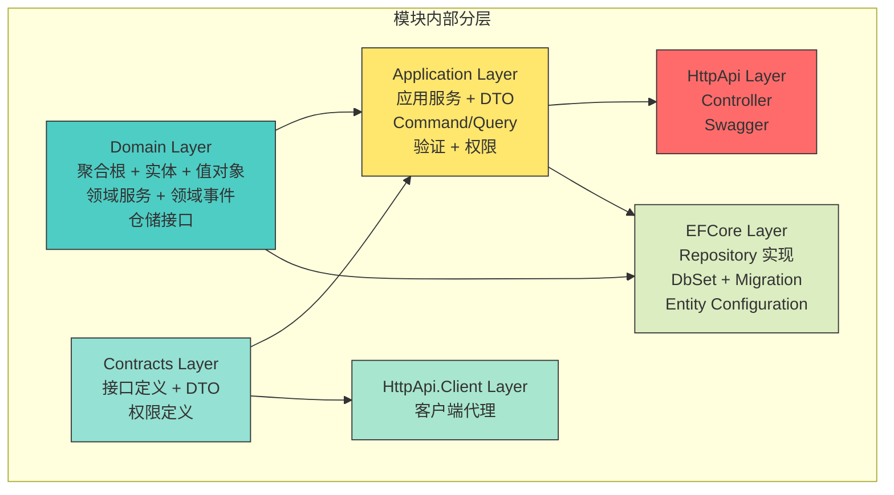

| 层 | 项目名 | 职责 | 依赖 | 被依赖 |
|------|--------|------|------|--------|
| Domain | `Wms.{Module}.Domain` | 聚合根、实体、值对象、领域服务、领域事件、仓储接口 | Wms.Shared | Application, EFCore |
| Application | `Wms.{Module}.Application` | 应用服务、DTO、Command/Query、验证、权限、EventHandler | Domain, Contracts | HttpApi |
| Contracts | `Wms.{Module}.Application.Contracts` | 接口定义、DTO、权限定义 | Wms.Shared | Application, HttpApi.Client |
| HttpApi | `Wms.{Module}.HttpApi` | Controller、Swagger | Application, Contracts | Host |
| HttpApi.Client | `Wms.{Module}.HttpApi.Client` | 客户端代理 | Contracts | 外部客户端 |
| EFCore | `Wms.{Module}.EntityFrameworkCore` | Repository 实现、DbContext、Migration | Domain | Host |

### 4.6 模块间依赖关系图

```mermaid
graph TB
    SK["Wms.Shared<br/>⚠️共享内核"]

    subgraph P0["P0 核心模块"]
        WH_MOD["Wms.Warehouse"]
        MT_MOD["Wms.Material"]
        IV_MOD["Wms.Inventory<br/>⚠️核心"]
        IN_MOD["Wms.Inbound"]
        OB_MOD["Wms.Outbound"]
        TC_MOD["Wms.TaskCenter"]
    end

    subgraph P1["P1 扩展模块"]
        TF_MOD["Wms.Transfer"]
        CC_MOD["Wms.CycleCount"]
        LS_MOD["Wms.LineSide"]
        PD_MOD["Wms.Production"]
        BL_MOD["Wms.BarcodeLabel"]
    end

    subgraph P2["P2 支撑模块"]
        WF_MOD["Wms.Workflow"]
        RE_MOD["Wms.RuleEngine"]
        NT_MOD["Wms.Notification"]
    end

    WH_MOD -->|DependsOn| SK
    MT_MOD -->|DependsOn| SK
    IV_MOD -->|DependsOn| SK
    IV_MOD -->|DependsOn| WH_MOD.Contracts
    IV_MOD -->|DependsOn| MT_MOD.Contracts
    IN_MOD -->|DependsOn| IV_MOD.Contracts
    IN_MOD -->|DependsOn| WH_MOD.Contracts
    IN_MOD -->|DependsOn| MT_MOD.Contracts
    OB_MOD -->|DependsOn| IV_MOD.Contracts
    OB_MOD -->|DependsOn| MT_MOD.Contracts
    TC_MOD -->|DependsOn| SK

    TF_MOD -->|DependsOn| IV_MOD.Contracts
    TF_MOD -->|DependsOn| WH_MOD.Contracts
    TF_MOD -->|DependsOn| WF_MOD.Contracts
    CC_MOD -->|DependsOn| IV_MOD.Contracts
    CC_MOD -->|DependsOn| WH_MOD.Contracts
    CC_MOD -->|DependsOn| WF_MOD.Contracts
    LS_MOD -->|DependsOn| IV_MOD.Contracts
    LS_MOD -->|DependsOn| OB_MOD.Contracts
    PD_MOD -->|DependsOn| IN_MOD.Contracts
    PD_MOD -->|DependsOn| OB_MOD.Contracts
    PD_MOD -->|DependsOn| MT_MOD.Contracts
    BL_MOD -->|DependsOn| WH_MOD.Contracts
    BL_MOD -->|DependsOn| MT_MOD.Contracts

    RE_MOD -->|DependsOn| SK
    WF_MOD -->|DependsOn| NT_MOD.Contracts
    NT_MOD -->|DependsOn| SK

    style IV_MOD fill:#ff6b6b,stroke:#333,color:#fff
    style SK fill:#4ecdc4,stroke:#333,color:#fff
```

> **关键规则**：模块间依赖 **仅通过 Contracts 项目**（接口+DTO），不直接引用 Domain/Application 实现。

### 4.7 共享模块（Shared Kernel）设计

#### MOD-001：Wms.Shared 模块

| 组成 | 内容 | 说明 |
|------|------|------|
| 值对象 | MaterialCode, Quantity, WarehouseCode, LocationCode, BatchNumber | DDD Phase 3 VO-01~VO-06 |
| 枚举 | InventoryStatus, TaskPriority, TaskType, InboundType, OutboundType, TransferType 等 | 全平台统一枚举 |
| 接口 | IBondedWarehouseService, IRuleEngineService, INotificationService | 预留接口 |
| 基类 | EventDataBase, AggregateRootBase（扩展 ABP） | 事件数据基类 |
| 工具 | IdGenerator, DateTimeProvider | 基础工具 |

**设计要点**：
- `WmsSharedModule` 不 DependsOn 任何业务模块
- 所有业务模块 DependsOn `WmsSharedModule`
- 值对象实现为不可变类（readonly struct 或 record）
- 枚举实现为 smart enum（含 Description 属性）

### 4.8 模块注册和启动配置

#### MOD-002：Host 模块注册

```csharp
[DependsOn(
    typeof(WmsSharedModule),
    typeof(WmsWarehouseHttpApiModule),
    typeof(WmsWarehouseApplicationModule),
    typeof(WmsWarehouseEntityFrameworkCoreModule),
    typeof(WmsMaterialHttpApiModule),
    typeof(WmsMaterialApplicationModule),
    typeof(WmsMaterialEntityFrameworkCoreModule),
    typeof(WmsInventoryHttpApiModule),
    typeof(WmsInventoryApplicationModule),
    typeof(WmsInventoryEntityFrameworkCoreModule),
    // ... 所有模块
    typeof(AbpIdentityEntityFrameworkCoreModule),
    typeof(AbpIdentityHttpApiModule),
    typeof(AbpAspNetCoreMvcUiModule),
    typeof(AbpSwashbuckleModule),
    typeof(AbpAutofacModule)
)]
public class WmsWebHostModule : AbpModule
{
    public override void ConfigureServices(ServiceConfigurationContext context)
    {
        // 配置数据库
        // 配置认证
        // 配置 Swagger
        // 配置 CORS
        // 配置 EventBus
        // 配置 SignalR
    }
}
```

### 4.9 Assumptions

| 假设 | 说明 |
|------|------|
| 模块间仅通过 Contracts 依赖 | 不直接引用 Domain/Application |
| Shared Kernel 足够稳定 | 值对象和枚举变更影响所有模块 |
| ABP Module DependsOn 声明完整 | Host 负责组装所有模块 |

### 4.10 Risks

| 风险 | 应对 |
|------|------|
| Shared Kernel 变更传播 | 版本锁定 + 变更评审 |
| 模块依赖声明遗漏 | CI 检查 DependsOn 完整性 |
| Contracts 项目膨胀 | 接口分离 + 按功能分包 |

### 4.11 Alternatives

| 替代方案 | 优劣 |
|----------|------|
| 所有模块共享一个 Domain 项目 | ✅ 简化；❌ 违反模块边界 |
| 不使用 Contracts 分离 | ✅ 简化；❌ 客户端引用过多 |
| 使用 Dynamic Proxy 替代 HttpApi.Client | ✅ 动态；❌ 调试困难 |

### 4.12 Review Items

| 评审项 | 标准 |
|--------|------|
| 14 个 Module 映射完整 | ✅ |
| 模块依赖仅通过 Contracts | ✅ |
| Shared Kernel 内容最小化 | 仅值对象+枚举+接口 |
| Host 模块注册完整 | ✅ |

### 4.13 Future Evolution

| 演进方向 | 时间线 | 内容 |
|----------|--------|------|
| 模块独立部署 | v2.0 | HttpApi.Host 拆分为多个 |
| 共享内核精简 | v1.1 | 枚举移到各模块 Domain |
| 插件动态加载 | v2.0 | ABP Dynamic Module Loading |

---

## 5. Layer Responsibilities（分层职责）

### 5.1 Purpose

详细定义 Clean Architecture 四层（Domain / Application / Infrastructure / Presentation）的职责边界、依赖方向和跨层通信机制。

### 5.2 Scope

四层职责定义、依赖方向规则、跨层通信机制（DI / EventBus / MediatR）、ABP 框架下的分层适配。

### 5.3 Design Principles

1. **依赖倒置**：外层依赖内层，内层不依赖外层
2. **职责单一**：每层有明确的职责边界
3. **通信规范**：跨层通过 DI 接口、EventBus 事件、MediatR 命令
4. **ABP 适配**：利用 ABP 提供的分层基础设施

### 5.4 Clean Architecture 分层详解

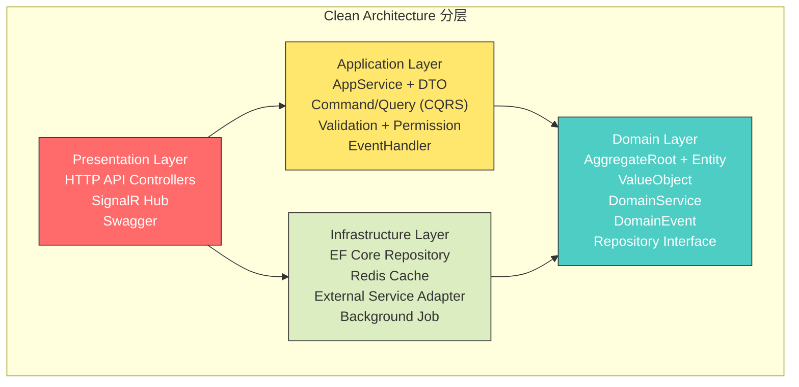

#### LAYER-001：Domain Layer（领域层）

| 职责 | 内容 | ABP 基类 | 编号 |
|------|------|----------|------|
| 聚合根 | `Warehouse`, `InventoryBalance`, `InboundOrder` 等 30 个 | `FullAuditedAggregateRoot<Guid>` | LAYER-D01 |
| 实体 | `InboundLine`, `OutboundLine`, `MaterialSubstituteRelation` 等 | `FullAuditedEntity<Guid>` | LAYER-D02 |
| 值对象 | `MaterialCode`, `Quantity`, `StorageAttribute` 等 17 个 | EF Core Owned Entity | LAYER-D03 |
| 领域服务 | `InventoryDomainService`, `InboundDomainService` 等 6 个 | Scoped DI 注册 | LAYER-D04 |
| 领域事件 | 37 个 EventData 类 | ABP `EventData` 基类 | LAYER-D05 |
| 仓储接口 | 30 个 IRepository 接口 | ABP `IRepository<T, Guid>` | LAYER-D06 |
| 状态机校验 | 聚合根内枚举校验方法 | 自实现 | LAYER-D07 |

**依赖规则**：
- ❌ **不依赖** Application / Infrastructure / Presentation
- ✅ **可依赖** Wms.Shared（共享内核）
- ✅ **可依赖** ABP Core（DDD 基础设施基类）

**关键约束**：
- 所有库存操作通过 `InventoryBalance.ApplyQuantityChange()` 方法完成（LAYER-D08）
- 库存流水不可删除/修改（Repository 层强制）→ `InventoryLedgerRepository` Update/Delete 抛出 NotSupportedException（LAYER-D09）
- 状态机校验封装在聚合根方法内，外部不可直接修改状态（LAYER-D10）

#### LAYER-002：Application Layer（应用层）

| 职责 | 内容 | ABP 基类 | 编号 |
|------|------|----------|------|
| 应用服务 | `WarehouseAppService`, `InventoryAppService` 等 | `ApplicationService` | LAYER-A01 |
| DTO | `WarehouseDto`, `CreateWarehouseDto` 等 | 自定义 | LAYER-A02 |
| CQRS Command | `CreateInboundOrderCommand`, `AllocateInventoryCommand` | MediatR `IRequest` | LAYER-A03 |
| CQRS Query | `GetInventoryBalanceQuery`, `GetAvailableQuantityQuery` | MediatR `IRequest` | LAYER-A04 |
| 验证 | `CreateWarehouseDtoValidator` 等 | FluentValidation | LAYER-A05 |
| 权限 | `WarehousePermissions`, `InventoryPermissions` 等 | ABP `PermissionDefinitionProvider` | LAYER-A06 |
| 事件处理器 | `InventoryChangedEventHandler`, `SafetyStockAlertEventHandler` 等 | ABP `ILocalEventHandler<T>` | LAYER-A07 |

**依赖规则**：
- ✅ **依赖** Domain Layer（调用领域服务和仓储接口）
- ✅ **依赖** Contracts Layer（DTO 定义）
- ❌ **不依赖** Infrastructure Layer（通过 DI 注入仓储实现）
- ✅ **可依赖** MediatR（CQRS）、FluentValidation（验证）

**关键约束**：
- 应用服务不包含业务逻辑，仅编排领域服务调用（LAYER-A08）
- DTO 验证在 Application 层，业务规则校验在 Domain 层（LAYER-A09）
- EventHandler 必须幂等（LAYER-A10）

#### LAYER-003：Infrastructure Layer（基础设施层）

| 职责 | 内容 | ABP 基类 | 编号 |
|------|------|----------|------|
| EF Core Repository | 30 个 Repository 实现 | ABP `EfCoreRepository<TDbContext, TEntity>` | LAYER-I01 |
| DbContext | `WmsDbContext`（按模块拆分） | ABP `AbpDbContext<T>` | LAYER-I02 |
| Entity Configuration | 30+ EfCoreConfiguration | EF Core `IEntityTypeConfiguration` | LAYER-I03 |
| Migration | EF Core Migration 类 | EF Core 工具生成 | LAYER-I04 |
| Redis Cache | 库存余额缓存（v1.1） | ABP `IDistributedCache<T>` | LAYER-I05 |
| 外部服务适配器 | ERP 适配器（ACL） | 自实现 + Polly | LAYER-I06 |
| 后台作业 | 预警扫描、超时扫描 | ABP `IBackgroundJobManager` | LAYER-I07 |

**依赖规则**：
- ✅ **依赖** Domain Layer（实现仓储接口）
- ❌ **不依赖** Application / Presentation
- ✅ **可依赖** EF Core、Redis Client、Polly

**关键约束**：
- 仓储实现不包含业务逻辑（LAYER-I08）
- ERP 适配器实现 `IPurchaseOrderService` 接口（ACL）（LAYER-I09）
- DbContext 按模块拆分表注册（LAYER-I10）

#### LAYER-004：Presentation Layer（表现层）

| 职责 | 内容 | ABP 基类 | 编号 |
|------|------|----------|------|
| HTTP API Controller | ABP 自动生成 + 手动补充 | ABP `AbpControllerBase` | LAYER-P01 |
| SignalR Hub | 任务通知实时推送 | `Hub` | LAYER-P02 |
| Swagger | API 文档自动生成 | ABP Swashbuckle | LAYER-P03 |
| 中间件 | 认证、异常处理、审计 | ABP 中间件 | LAYER-P04 |

**依赖规则**：
- ✅ **依赖** Application Layer
- ✅ **依赖** Infrastructure Layer（通过 Host 注册）
- ❌ **不依赖** Domain Layer（不直接调用领域服务）

### 5.5 跨层通信机制

#### LAYER-005：DI（依赖注入）

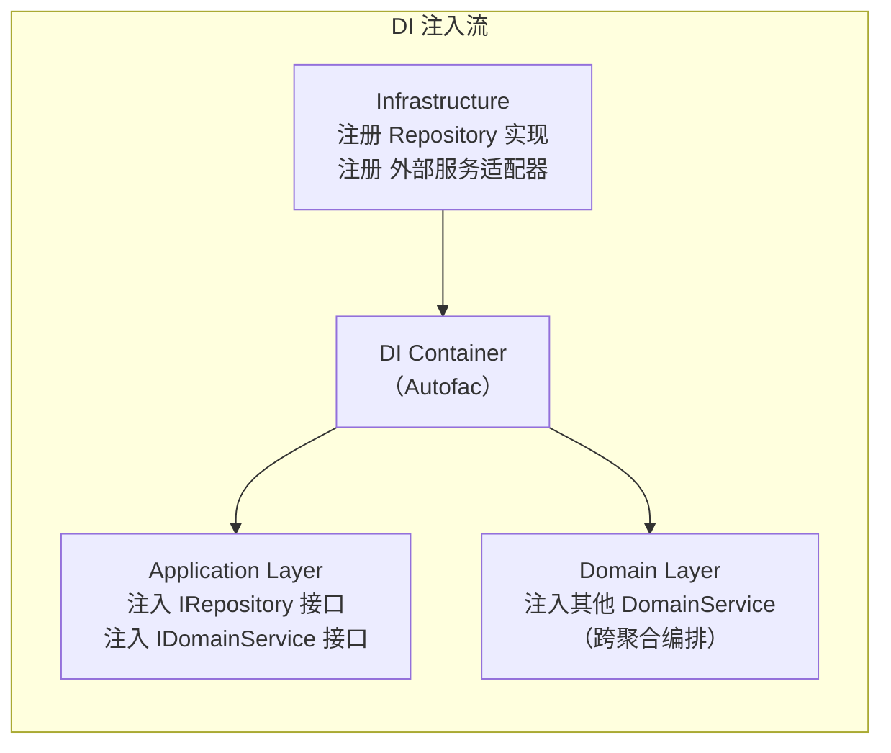

| 注入类型 | 接口 | 实现层 | 注册位置 | 生命周期 |
|----------|------|--------|----------|----------|
| Repository | `IRepository<T>` | Infrastructure | Module ConfigureServices | Scoped |
| DomainService | `IInventoryDomainService` | Domain | Module ConfigureServices | Scoped |
| AppService | `IWarehouseAppService` | Application | ABP 自动注册 | Scoped |
| 外部适配器 | `IPurchaseOrderService` | Infrastructure | Module ConfigureServices | Scoped |
| EventBus | `ILocalEventBus` | ABP 内置 | 自动注册 | Scoped |

#### LAYER-006：EventBus（事件总线）

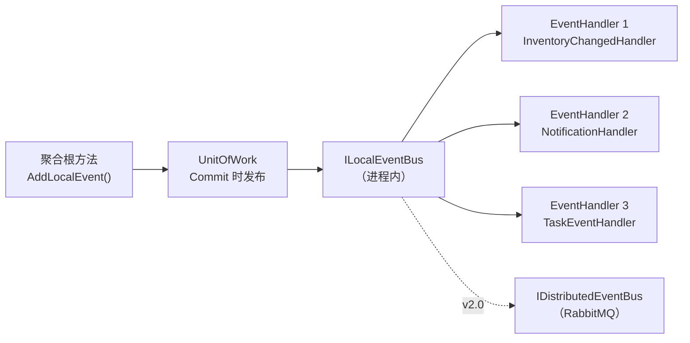

**关键规则**：
- 事件在聚合根方法中创建（`AddLocalEvent`）
- 事件在 UnitOfWork Commit 时发布（ABP 自动）
- EventHandler 实现幂等（重复消费不影响结果）
- v2.0 迁移到 `IDistributedEventBus`（RabbitMQ）

#### LAYER-007：MediatR CQRS

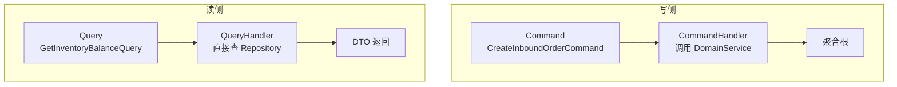

**关键规则**：
- Command 通过 MediatR `IRequestHandler` 处理
- Query 直接通过 Repository / QueryService 查询
- v1.0 读写同库，接口分离
- v1.1 Redis 缓存读侧
- v2.0 读侧独立数据库

### 5.6 Assumptions

| 假设 | 说明 |
|------|------|
| ABP Autofac 作为 DI 容器 | 支持模块化注册 |
| MediatR 用于 CQRS | ABP 集成 MediatR |
| ABP UnitOfWork 自动发布事件 | 聚合根事件在 Commit 时发布 |
| v1.0 所有模块在同一 DbContext | 单库 Modular Monolith |

### 5.7 Risks

| 风险 | 应对 |
|------|------|
| Application 层包含业务逻辑 | 代码审查强制 "AppService 不含业务逻辑" |
| 跨层直接调用绕过接口 | CI 检查非法引用 |
| EventHandler 幂等实现不一致 | 提供幂等基类 + 审查清单 |

### 5.8 Alternatives

| 替代方案 | 优劣 |
|----------|------|
| 不使用 MediatR | ✅ 简化；❌ CQRS 分离不清晰 |
| 不使用 EventBus | ✅ 简化；❌ 模块间同步耦合 |
| 三层架构（无 Domain 层） | ✅ 简化；❌ 业务逻辑分散 |

### 5.9 Review Items

| 评审项 | 标准 |
|--------|------|
| 四层职责定义清晰 | ✅ |
| 依赖方向规则明确 | 外→内 |
| 跨层通信机制完整 | DI + EventBus + MediatR |
| ABP 基类使用正确 | AggregateRoot/Repository/ApplicationService |

### 5.10 Future Evolution

| 演进方向 | 时间线 | 内容 |
|----------|--------|------|
| MediatR Pipeline 行为 | v1.0 | 验证、日志、性能 |
| 分布式 EventBus | v2.0 | RabbitMQ |
| Redis 缓存层 | v1.1 | 库存余额缓存 |
| Event Sourcing | v3.0+ | Inventory 模块可选 |

---

## 6. Dependency Graph（依赖图）

### 6.1 Purpose

绘制完整的项目间依赖关系图（.csproj 引用），定义依赖方向规则和版本锁定策略。

### 6.2 Scope

后端项目间 .csproj 引用关系、依赖方向规则、第三方依赖版本锁定。

### 6.3 Design Principles

1. **依赖方向外→内**：Presentation → Application → Domain，Infrastructure → Domain
2. **模块间仅 Contracts**：模块间 .csproj 引用仅限 Contracts 项目
3. **无循环依赖**：依赖图无环
4. **版本集中管理**：所有包版本在 `Directory.Build.props` 统一

### 6.4 项目间 .csproj 引用关系（以 Warehouse 模块为例）

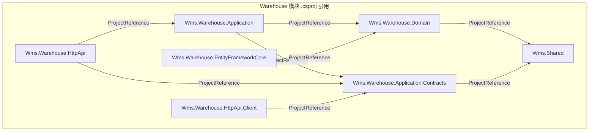

### 6.5 跨模块依赖关系（Contracts 引用）

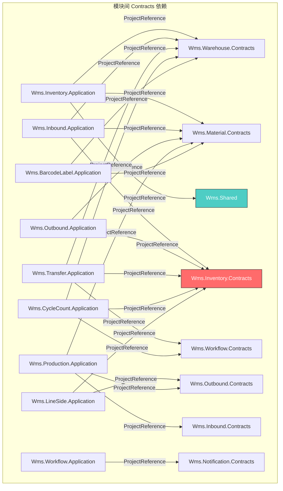

### 6.6 Host 项目引用（组装所有模块）

```mermaid
graph TB
    HOST["Wms.Web.Host"] -->|ProjectReference| WH_API["Wms.Warehouse.HttpApi"]
    HOST -->|ProjectReference| WH_APP["Wms.Warehouse.Application"]
    HOST -->|ProjectReference| WH_EFC["Wms.Warehouse.EntityFrameworkCore"]
    HOST -->|ProjectReference| MT_API["Wms.Material.HttpApi"]
    HOST -->|ProjectReference| MT_APP["Wms.Material.Application"]
    HOST -->|ProjectReference| MT_EFC["Wms.Material.EntityFrameworkCore"]
    HOST -->|ProjectReference| IV_API["Wms.Inventory.HttpApi"]
    HOST -->|ProjectReference| IV_APP["Wms.Inventory.Application"]
    HOST -->|ProjectReference| IV_EFC["Wms.Inventory.EntityFrameworkCore"]
    HOST -->|...| ALL["... 所有 14 模块的 HttpApi + Application + EFCore"]
    HOST -->|NuGet| ABP_MODULES["ABP Identity, Permission, Audit, etc."]
    HOST -->|NuGet| AUTOFAC["Autofac"]
    HOST -->|NuGet| SWASHBUCKLE["Swashbuckle"]
```

### 6.7 依赖方向规则

| 规则 | 说明 | 检查方式 |
|------|------|----------|
| DEP-001 | Domain 不引用 Application/Infrastructure/Presentation | CI 分析 .csproj |
| DEP-002 | Application 仅引用 Domain + Contracts + Shared | CI 分析 |
| DEP-003 | 模块间仅通过 Contracts 引用 | CI 分析 |
| DEP-004 | Infrastructure 仅引用 Domain | CI 分析 |
| DEP-005 | Presentation 仅引用 Application | CI 分析 |
| DEP-006 | 无循环引用 | CI 图分析 |

### 6.8 第三方依赖版本锁定策略

```xml
<!-- Directory.Build.props -->
<Project>
  <PropertyGroup>
    <AbpVersion>8.3.0</AbpVersion>
    <EfCoreVersion>8.0.0</EfCoreVersion>
    <NetVersion>8.0.0</NetVersion>
  </PropertyGroup>
  <ItemGroup>
    <PackageReference Update="Volo.Abp.Core" Version="$(AbpVersion)" />
    <PackageReference Update="Volo.Abp.EntityFrameworkCore" Version="$(AbpVersion)" />
    <PackageReference Update="Volo.Abp.EntityFrameworkCore.SqlServer" Version="$(AbpVersion)" />
    <!-- ... 所有包版本集中管理 -->
  </ItemGroup>
</Project>
```

**升级策略**：
- 季度评估依赖升级
- 核心包（ABP/EF Core）跟随 LTS 版本
- 非核心包（Mapster/Serilog）按需要升级
- 升级前必须通过全部测试

### 6.9 Assumptions

| 假设 | 说明 |
|------|------|
| CI 可检查 .csproj 引用合规 | 自动化依赖审查 |
| ABP 版本 8.3.0 稳定 | 发布时调整 |
| 14 模块 Contracts 引用关系清晰 | 与 DDD Context Map 一致 |

### 6.10 Risks

| 风险 | 应对 |
|------|------|
| 依赖引用错误导致循环 | CI 检查 + 图分析 |
| ABP 大版本升级 Breaking Changes | 锁定版本 + 季度评估 |
| Contracts 项目引用链过长 | 控制模块间依赖层数 ≤ 3 |

### 6.11 Alternatives

| 替代方案 | 优劣 |
|----------|------|
| 模块直接引用 Application | ✅ 简化；❌ 依赖过多 |
| 不使用版本锁定文件 | ✅ 灵活；❌ 版本不一致风险 |
| NuGet 包发布模块 | ✅ 独立版本；❌ 开发期不便 |

### 6.12 Review Items

| 评审项 | 标准 |
|--------|------|
| .csproj 引用关系与 DDD Context Map 一致 | ✅ |
| 依赖方向规则 6 条 | ✅ |
| 版本锁定策略明确 | ✅ |
| 无循环依赖 | ✅ |

### 6.13 Future Evolution

| 演进方向 | 时间线 | 内容 |
|----------|--------|------|
| 模块 NuGet 包发布 | v2.0 | 微服务独立版本 |
| CI 依赖审查自动化 | v1.0 | 自定义 CI 步骤 |
| 依赖图可视化工具 | v1.1 | NuGet DependaBot |

---

## 7. Deployment Architecture（部署架构）

### 7.1 Purpose

设计 v1.0 单体部署方案、Docker 容器化方案、负载均衡、数据库部署、PDA 连接架构和前端部署方案。

### 7.2 Scope

v1.0 IIS + SQL Server + Redis 部署、Docker 可选方案、数据库主从预留、PDA 连接、前端 Nginx + SPA。

### 7.3 Design Principles

1. **简单优先**：v1.0 单体部署，不引入不必要的复杂性
2. **预留扩展**：架构设计预留 v2.0 高可用和微服务拆分
3. **安全第一**：认证/授权/CORS/数据加密
4. **运维友好**：日志集中、监控接入、一键迁移

### 7.4 v1.0 单体部署方案

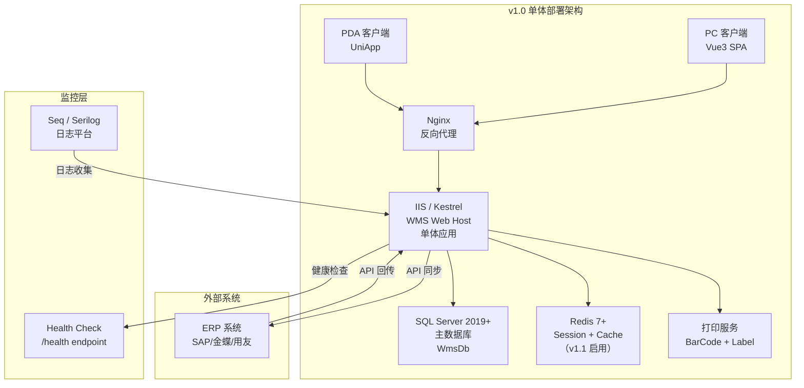

#### DEP-001：v1.0 服务器配置

| 组件 | 服务器规格 | 数量 | 说明 |
|------|----------|------|------|
| WMS Web Host | 4C 8G Windows Server | 1 | IIS / Kestrel 部署 |
| SQL Server | 8C 16G Windows Server | 1 | 主数据库 |
| Redis | 2C 4G Linux | 1 | 缓存（v1.1 启用） |
| Nginx | 2C 4G Linux | 1 | 反向代理 |
| Seq | 2C 4G Linux | 1 | 日志平台 |

#### DEP-002：IIS / Kestrel 部署详情

| 配置项 | 值 | 说明 |
|--------|-----|------|
| 部署方式 | Kestrel + IIS Reverse Proxy | 推荐 |
| 端口 | 5000 (HTTP), 5001 (HTTPS) | Kestrel 默认 |
| 连接池 | Max 100 | SQL Server 连接 |
| 工作线程 | Min 10, Max 200 | 线程池 |
| Session | In-Memory（v1.0）→ Redis（v1.1） | |
| 日志 | Serilog → File + Seq | |
| 认证 | JWT Token | |

### 7.5 Docker 容器化部署方案（可选）

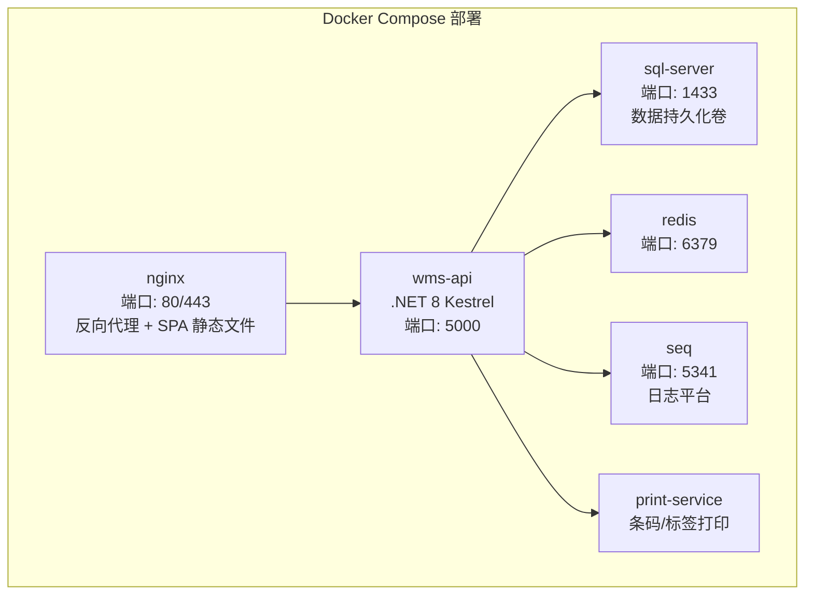

**docker-compose.yml 概要**：

```yaml
version: '3.8'
services:
  nginx:
    image: nginx:alpine
    ports: ["80:80", "443:443"]
    volumes: ["./nginx.conf:/etc/nginx/nginx.conf", "./frontend/dist:/usr/share/nginx/html"]

  wms-api:
    image: wms-api:1.0
    ports: ["5000:5000"]
    depends_on: [sql-server, redis]
    environment:
      - ConnectionStrings__Default=Server=sql-server;Database=WmsDb;...
      - Redis__Configuration=redis:6379

  sql-server:
    image: mcr.microsoft.com/mssql/server:2019-latest
    ports: ["1433:1433"]
    volumes: ["sql-data:/var/opt/mssql"]

  redis:
    image: redis:7-alpine
    ports: ["6379:6379"]

  seq:
    image: datalust/seq:latest
    ports: ["5341:80"]
```

### 7.6 负载均衡和高可用策略

#### DEP-003：v1.0 → v2.0 高可用演进

| 阶段 | 负载均衡 | 高可用 | 说明 |
|------|----------|--------|------|
| v1.0 | Nginx 单实例 | 无 HA | 单体部署 |
| v1.1 | Nginx + 2 WMS 实例 | WMS 双实例热备 | 负载均衡入门 |
| v2.0 | Nginx + 多 WMS 实例 | WMS 集群 + SQL AlwaysOn | 微服务集群 |

### 7.7 数据库部署方案

#### DEP-004：数据库部署演进

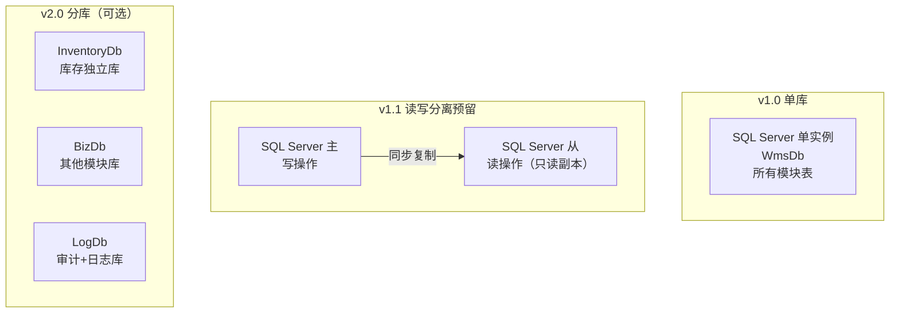

| 阶段 | 数据库 | 读写分离 | 说明 |
|------|--------|----------|------|
| v1.0 | 单库 WmsDb | 无 | 所有表在一个数据库 |
| v1.1 | 单库 + 只读副本 | 主写从读 | ABP Data Filter 支持 |
| v2.0 | 分库 | 主写从读 | Inventory 独立库 |

### 7.8 PDA 连接架构

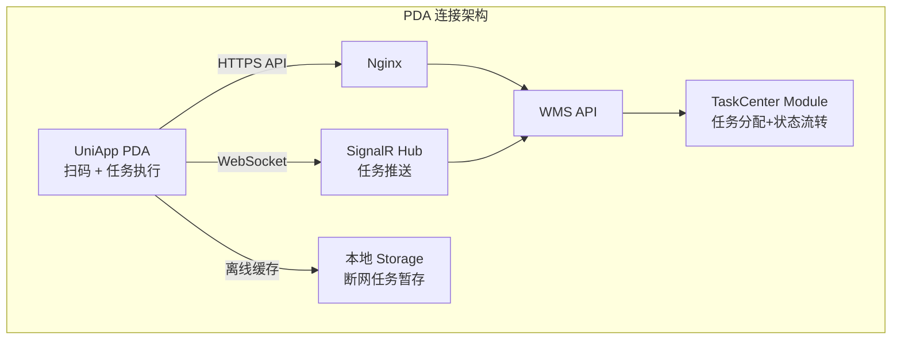

**关键设计**：
- PDA 通过 HTTPS REST API 与 WMS 交互（DEP-005）
- SignalR WebSocket 推送任务分配通知（DEP-006）
- PDA 离线模式：断网时任务暂存本地，恢复后批量上传（DEP-007）
- PDA 扫码调用 `uni.scanCode` API（DEP-008）

### 7.9 前端部署方案

#### DEP-009：Nginx 反向代理 + SPA 部署

```nginx
server {
    listen 80;
    server_name wms.company.com;

    # SPA 静态文件
    location / {
        root /usr/share/nginx/html;
        try_files $uri $uri/ /index.html;
    }

    # API 反向代理
    location /api/ {
        proxy_pass http://wms-api:5000/;
        proxy_set_header Host $host;
        proxy_set_header X-Real-IP $remote_addr;
    }

    # SignalR WebSocket
    location /signalr/ {
        proxy_pass http://wms-api:5000/signalr/;
        proxy_http_version 1.1;
        proxy_set_header Upgrade $http_upgrade;
        proxy_set_header Connection "upgrade";
    }

    # 健康检查
    location /health {
        proxy_pass http://wms-api:5000/health;
    }
}
```

### 7.10 Assumptions

| 假设 | 说明 |
|------|------|
| v1.0 单体部署满足 ≤ 100 用户 | 性能足够 |
| SQL Server 2019+ 可用 | 企业标准 |
| 企业有运维团队 | 可部署和维护 |
| Docker 可选部署 | 按企业实际情况选择 |

### 7.11 Risks

| 风险 | 应对 |
|------|------|
| 单点故障（v1.0 单实例） | v1.1 双实例热备 |
| SQL Server 性能瓶颈 | 索引优化 + 连接池 + v1.1 读写分离 |
| PDA 网络不稳定 | 离线缓存 + 批量上传 |
| Nginx 配置错误 | 配置模板 + 测试环境验证 |

### 7.12 Alternatives

| 替代方案 | 优劣 |
|----------|------|
| Azure 云部署 | ✅ 弹性伸缩；❌ 成本高 |
| Linux + Kestrel 部署 | ✅ 性能好；❌ Windows 团队不熟悉 |
| PostgreSQL 替代 SQL Server | ✅ 免费；❌ ABP SQL Server 生态更好 |

### 7.13 Review Items

| 评审项 | 标准 |
|--------|------|
| v1.0 部署方案可行 | ✅ |
| Docker 方案完整 | ✅ |
| 数据库部署演进路径 | v1.0→v1.1→v2.0 |
| PDA 连接方案完整 | REST + WebSocket + 离线 |
| 前端部署方案完整 | Nginx + SPA |

### 7.14 Future Evolution

| 演进方向 | 时间线 | 内容 |
|----------|--------|------|
| Kubernetes 部署 | v2.0 | Helm Chart + 滚动更新 |
| SQL Server AlwaysOn | v1.1 | 高可用数据库集群 |
| CDN 加速前端 | v1.1 | 静态资源 CDN |
| 消息队列部署 | v2.0 | RabbitMQ 集群 |

---

## 8. Plugin Strategy（插件策略）

### 8.1 Purpose

设计 ABP 模块插件化机制、行业配置包架构、扩展点定义、自定义插件开发指南概要和未来模块接入方式。

### 8.2 Scope

ABP 动态/静态模块加载、行业配置包设计、扩展点接口、插件开发指南、v2.0+ 接入方式。

### 8.3 Design Principles

1. **配置优先**：行业差异通过配置适配而非代码分支
2. **接口预留**：关键扩展点通过接口定义
3. **事件钩子**：业务流程关键节点提供事件钩子
4. **渐进增强**：v1.0 基础能力 → v2.0 完整插件系统

### 8.4 ABP 模块插件化机制

#### PLUG-001：静态引用 vs 动态加载

| 机制 | 说明 | 适用场景 | v1.0/v2.0 |
|------|------|----------|-----------|
| 静态引用（DependsOn） | Host 项目 .csproj 引用 + DependsOn 声明 | v1.0 所有业务模块 | v1.0 ✅ |
| 动态加载（DynamicModule） | ABP `AbpDynamicOptions` + 插件目录扫描 | v2.0 新增行业模块 | v2.0 ✅ |
| NuGet 包安装 | 模块发布为 NuGet 包，Host 安装引用 | v2.0 微服务 | v2.0 ✅ |

**v1.0 决策**：使用静态引用（DependsOn），所有模块在编译时确定。

**v2.0 演进**：新增行业模块（如 BondedWarehouse）通过动态加载或 NuGet 包接入。

### 8.5 行业配置包设计

#### PLUG-002：行业配置包架构

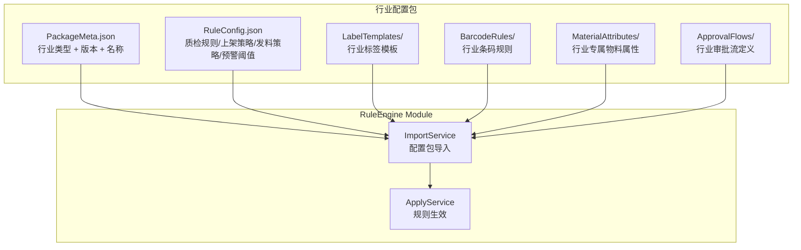

**行业配置包内容**：

| 配置项 | 格式 | 说明 | 编号 |
|--------|------|------|------|
| PackageMeta | JSON | 行业类型、版本号、适用场景 | PLUG-003 |
| RuleConfig | JSON | 质检规则、上架策略、发料策略、预警阈值 | PLUG-004 |
| LabelTemplates | XML/JSON | 行业标签模板（如 VDA 4902 汽车行业） | PLUG-005 |
| BarcodeRules | JSON | 行业条码编码规则 | PLUG-006 |
| MaterialAttributes | JSON | 行业专属物料属性扩展 | PLUG-007 |
| ApprovalFlows | JSON | 行业审批流预定义 | PLUG-008 |

**预置行业包**：

| 行业包 | 内容 | 编号 |
|--------|------|------|
| Automotive（汽车制造） | VDA 4902 标签 + FIFO 发料 + JIT 补料 | PLUG-P01 |
| Electronics（电子制造） | 序列号追踪 + FEFO 发料 + 精益看板 | PLUG-P02 |
| Food（食品制造） | 保质期强制 + 批次追溯 + 温度带管理 | PLUG-P03 |
| Pharmaceutical（医药制造） | GMP 合规 + 批号管理 + 冷链监控 | PLUG-P04 |

### 8.6 扩展点定义

#### PLUG-009：关键扩展点接口

| 扩展点 | 接口 | 说明 | 编号 |
|--------|------|------|------|
| 保税仓 | `IBondedWarehouseService` | v2.0 保税仓模块接入 | PLUG-E01 |
| 规则引擎 | `IRuleEngineService` | 自定义规则执行 | PLUG-E02 |
| 通知渠道 | `INotificationChannelProvider` | 新增通知渠道（如飞书） | PLUG-E03 |
| ERP 适配 | `IErpAdapter` | 新增 ERP 适配器 | PLUG-E04 |
| 上架策略 | `IPutawayStrategyProvider` | 自定义上架策略 | PLUG-E05 |
| 发料策略 | `IIssueStrategyProvider` | 自定义发料策略 | PLUG-E06 |
| 审批流 | `IApprovalFlowProvider` | 自定义审批逻辑 | PLUG-E07 |
| 打印服务 | `IPrintServiceAdapter` | 新增打印机品牌适配 | PLUG-E08 |
| 库位推荐 | `ILocationRecommendationService` | 自定义库位推荐算法 | PLUG-E09 |
| 库存快照 | `IInventorySnapshotProvider` | 自定义快照策略 | PLUG-E10 |

#### PLUG-010：事件钩子

| 业务节点 | 钩子事件 | 说明 | 编号 |
|----------|----------|------|------|
| 入库确认前 | `InboundPreConfirmEvent` | 扩展校验逻辑 | PLUG-H01 |
| 出库分配前 | `OutboundPreAllocateEvent` | 扩展分配策略 | PLUG-H02 |
| 库存变更后 | `InventoryPostChangeEvent` | 扩展库存处理 | PLUG-H03 |
| 任务创建后 | `TaskPostCreateEvent` | 扩展任务处理 | PLUG-H04 |
| 标签打印前 | `PrintPreGenerateEvent` | 扩展标签数据 | PLUG-H05 |
| 审批完成后 | `ApprovalPostCompleteEvent` | 扩展审批后处理 | PLUG-H06 |

### 8.7 自定义插件开发指南概要

#### PLUG-011：插件开发步骤

1. **定义插件 Module**：继承 `AbpModule`，声明 DependsOn
2. **实现扩展点接口**：如 `IPutawayStrategyProvider`
3. **注册 DI 服务**：在 Module `ConfigureServices` 中注册
4. **订阅事件钩子**：实现 `ILocalEventHandler<T>`
5. **测试插件**：独立测试项目
6. **打包发布**：NuGet 包或动态加载目录

**插件目录结构**：

```
Wms.Plugin.CustomPutaway/
├── Wms.Plugin.CustomPutaway.Domain/
├── Wms.Plugin.CustomPutaway.Application/
├── Wms.Plugin.CustomPutaway.HttpApi/
├── Wms.Plugin.CustomPutaway.EntityFrameworkCore/
├── Wms.Plugin.CustomPutaway.Tests/
```

### 8.8 v2.0+ 未来模块接入方式

| 模块 | 接入方式 | 说明 |
|------|----------|------|
| BondedWarehouse（保税仓） | Dynamic Module + NuGet | v2.0 |
| QMS（质量管理） | Dynamic Module | v2.0 |
| MES Integration | Dynamic Module | v2.0 |
| TMS（运输管理） | Dynamic Module | v2.0+ |
| AI Prediction | Dynamic Module | v3.0+ |

### 8.9 Assumptions

| 假设 | 说明 |
|------|------|
| v1.0 所有模块静态引用 | 编译时确定 |
| 行业配置包 JSON 格式 | 可读可编辑 |
| 扩展点接口在 Shared 中定义 | 所有模块可见 |

### 8.10 Risks

| 风险 | 应对 |
|------|------|
| 配置包格式不统一 | Schema 定义 + 校验 |
| 扩展点接口变更影响插件 | 版本化接口 + 向后兼容 |
| 动态加载模块不稳定 | v2.0 充分测试 |

### 8.11 Alternatives

| 替代方案 | 优劣 |
|----------|------|
| 不使用行业配置包 | ✅ 简化；❌ 不支持行业差异 |
| 硬编码行业差异 | ❌ 不可配置 |
| OSGi 式插件系统 | ✅ 动态；❌ .NET 生态不成熟 |

### 8.12 Review Items

| 评审项 | 标准 |
|--------|------|
| 10 个扩展点接口定义 | ✅ |
| 6 个事件钩子定义 | ✅ |
| 4 个预置行业包 | ✅ |
| v2.0 接入方式明确 | ✅ |

### 8.13 Future Evolution

| 演进方向 | 时间线 | 内容 |
|----------|--------|------|
| 动态模块加载 | v2.0 | ABP DynamicModule |
| 行业包可视化编辑器 | v1.1 | RuleEngine Module UI |
| 插件市场 | v3.0+ | 社区插件发布平台 |
| AI 配置包推荐 | v3.0+ | AI 根据行业特征推荐配置 |

---

## 9. AI Workflow（AI 辅助开发工作流）

### 9.1 Purpose

定义 AI 辅助编码、文档、运维策略，以及与 CI/CD 的集成方案，输出到 `12_AI_Workflow/` 目录的规划。

### 9.2 Scope

AI 辅助编码策略、AI 辅助文档策略、AI 辅助运维策略、AI 与 CI/CD 集成、`12_AI_Workflow/` 目录规划。

### 9.3 Design Principles

1. **AI 增效**：AI 作为辅助工具，不替代人工决策
2. **可审计**：AI 产出可追溯、可审查
3. **渐进集成**：v1.0 手动触发 → v2.0 CI/CD 自动集成
4. **安全边界**：AI 不直接操作生产环境

### 9.4 AI 辅助编码策略

#### AIW-001：代码生成

| 场景 | AI 辅助方式 | 工具 | 输出 |
|------|------------|------|------|
| ABP 模块骨架 | 根据 Module 名称自动生成 5 层项目结构 | AI Code Generation | .csproj + Module 类 + 基础文件 |
| CRUD AppService | 根据 DTO 定义自动生成 AppService CRUD 方法 | AI Code Generation | AppService + DTO + Validator |
| Repository 实现 | 根据接口自动生成 EF Core Repository | AI Code Generation | Repository + EfCoreConfiguration |
| 前端 CRUD 页面 | 根据后端 API 自动生成 Vue3 CRUD 页面 | AI Code Generation | .vue + API + Route |
| PDA 扫码页面 | 根据任务类型自动生成 PDA 页面 | AI Code Generation | .vue + API + Scan |

#### AIW-002：代码审查

| 场景 | AI 辅助方式 | 工具 | 输出 |
|------|------------|------|------|
| DDD 合规审查 | 检查聚合根是否继承 ABP 基类、状态机是否封装 | AI Review | 合规报告 |
| 分层合规审查 | 检查 Domain 不引用 Application、模块间仅 Contracts | AI Review | 合规报告 |
| 性能审查 | 检查库存查询是否有索引、连接池配置 | AI Review | 性能建议 |
| 安全审查 | 检查权限标注、输入验证、SQL 注入风险 | AI Review | 安全报告 |

#### AIW-003：测试生成

| 场景 | AI 辅助方式 | 工具 | 输出 |
|------|------------|------|------|
| 单元测试 | 根据聚合根方法自动生成测试用例 | AI Test Generation | Domain Tests |
| 集成测试 | 根据应用服务接口自动生成集成测试 | AI Test Generation | Application Tests |
| 状态机测试 | 根据状态机定义自动生成状态流转测试 | AI Test Generation | State Machine Tests |
| API 测试 | 根据 Swagger 自动生成 HTTP API 测试 | AI Test Generation | HttpApi Tests |

### 9.5 AI 辅助文档策略

#### AIW-004：文档生成

| 文档类型 | AI 辅助方式 | 输出目录 |
|----------|------------|----------|
| API 文档 | 根据 Swagger 自动生成 Markdown API 文档 | `11_Documentation/api/` |
| 用户手册 | 根据前端页面自动生成操作手册 | `11_Documentation/user-guide/` |
| 运维手册 | 根据部署架构自动生成运维手册 | `11_Documentation/ops-guide/` |
| 数据字典 | 根据 EF Core Entity 自动生成数据字典 | `04_Database/` |
| 需求追踪 | 根据 PRD + DDD + Architecture 自动生成追踪矩阵 | `01_PRD/` |

### 9.6 AI 辅助运维策略

#### AIW-005：运维辅助

| 场景 | AI 辅助方式 | 工具 | 输出 |
|------|------------|------|------|
| 日志分析 | 分析 Serilog 日志识别异常模式 | AI Log Analysis | 异常报告 |
| 异常诊断 | 根据异常堆栈推荐修复方案 | AI Diagnosis | 修复建议 |
| 性能优化 | 根据性能指标推荐优化方案 | AI Performance | 优化建议 |
| 数据库优化 | 根据 SQL 执行计划推荐索引优化 | AI DBA | 索引建议 |

### 9.7 AI 与 CI/CD 集成

#### AIW-006：CI/CD 集成方案

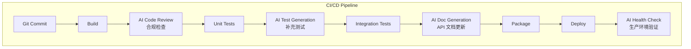

| 集成点 | AI 操作 | 触发时机 | v1.0/v2.0 |
|--------|----------|----------|-----------|
| Code Review | 合规审查 + 性能建议 | PR 提交 | v1.0 手动 |
| Test Generation | 补充测试用例 | PR 合并 | v1.0 手动 |
| Doc Generation | API 文档更新 | Release 构建 | v1.0 手动 |
| Health Check | 生产环境验证 | 部署后 | v2.0 自动 |

### 9.8 12_AI_Workflow/ 目录规划

```
12_AI_Workflow/
├── prompts/                              ← AI Prompt 模板
│   ├── code-generation/
│   │   ├── abp-module-skeleton.md        ← 模块骨架生成 Prompt
│   │   ├── crud-appservice.md            ← CRUD AppService 生成 Prompt
│   │   ├── efcore-repository.md          ← Repository 生成 Prompt
│   │   ├── vue3-crud-page.md             ← 前端 CRUD 页面 Prompt
│   │   └─ ...
│   ├── code-review/
│   │   ├── ddd-compliance.md             ← DDD 合规审查 Prompt
│   │   ├── layer-compliance.md           ← 分层合规审查 Prompt
│   │   ├── performance-review.md         ← 性能审查 Prompt
│   │   └─ ...
│   ├── test-generation/
│   │   ├── unit-test.md                  ← 单元测试生成 Prompt
│   │   ├── integration-test.md           ← 集成测试生成 Prompt
│   │   └─ ...
│   ├── documentation/
│   │   ├── api-doc.md                    ← API 文档生成 Prompt
│   │   ├── user-guide.md                 ← 用户手册生成 Prompt
│   │   └─ ...
│   └── ops/
│       ├── log-analysis.md               ← 日志分析 Prompt
│       ├── diagnosis.md                  ← 异常诊断 Prompt
│       └─ ...
├── templates/                            ← AI 输出模板
│   ├── module-skeleton/                  ← 模块骨架模板文件
│   ├── appservice/                       ← AppService 模板
│   ├── vue-page/                         ← Vue 页面模板
│   └─ ...
├── reports/                              ← AI 产出报告存放
│   ├── code-review/
│   ├── test-reports/
│   ├── doc-reports/
│   └─ ...
├── config/                               ← AI 工具配置
│   ├── ai-workflow-settings.json         ← AI 工作流设置
│   └─ ...
└── README.md                             ← AI Workflow 使用指南
```

### 9.9 Assumptions

| 假设 | 说明 |
|------|------|
| AI 工具为 CodeBuddy / ChatGPT 等 | 按团队实际选择 |
| AI 产出需要人工审查 | AI 不替代人工决策 |
| v1.0 手动触发 AI 辅助 | 不自动集成 CI/CD |
| AI Prompt 模板持续优化 | 按实际效果迭代 |

### 9.10 Risks

| 风险 | 应对 |
|------|------|
| AI 生成代码质量不稳定 | 人工审查 + 单元测试验证 |
| AI Prompt 效果不一致 | 模板标准化 + 持续优化 |
| AI 产出版权风险 | 仅辅助使用，人工最终确认 |

### 9.11 Alternatives

| 替代方案 | 优劣 |
|----------|------|
| 不使用 AI 辅助 | ✅ 纯人工；❌ 效率低 |
| 全自动 AI CI/CD | ✅ 高效；❌ v1.0 不成熟 |
| 自研 AI 工具 | ✅ 定制；❌ 成本高 |

### 9.12 Review Items

| 评审项 | 标准 |
|--------|------|
| AI 辅助编码覆盖 5 个场景 | ✅ |
| AI 辅助文档覆盖 5 个文档类型 | ✅ |
| AI 辅助运维覆盖 4 个场景 | ✅ |
| 12_AI_Workflow 目录规划完整 | ✅ |

### 9.13 Future Evolution

| 演进方向 | 时间线 | 内容 |
|----------|--------|------|
| AI CI/CD 自动集成 | v2.0 | GitHub Actions + AI Review |
| AI 配置包推荐 | v3.0+ | 根据行业特征推荐配置 |
| AI 代码补全 | v1.1 | IDE 插件集成 |
| AI 预测运维 | v3.0+ | 异常预测 + 性能预警 |

---

## 10. Review Checklist（评审检查清单）

### 10.1 Purpose

定义 Phase 4 交付物的完整性评审标准、跨阶段一致性检查、架构可行性检查和 Phase 4 → Phase 5 输入映射。

### 10.2 Phase 4 交付物完整性评审

| 检查项 | 评审标准 | 状态 |
|--------|----------|------|
| **Implementation Approach** | 交付策略 + 模块优先级 + 演进路径 | ✅ |
| **Framework Selection** | NuGet 37 包 + 前端 15 包 + PDA 6 包 + 版本锁定 | ✅ |
| **Solution Structure** | 118 后端项目 + 前端 + PDA + 目录约定 | ✅ |
| **ABP Module Structure** | 14 Module 映射 + 5 层结构 + 依赖图 + Shared Kernel | ✅ |
| **Layer Responsibilities** | 4 层职责 + 依赖方向 + DI/EventBus/MediatR | ✅ |
| **Dependency Graph** | .csproj 引用图 + 6 规则 + 版本锁定 | ✅ |
| **Deployment Architecture** | v1.0 单体 + Docker + DB + PDA + 前端部署图 | ✅ |
| **Plugin Strategy** | 10 扩展点 + 6 事件钩子 + 4 行业包 + 开发指南 | ✅ |
| **AI Workflow** | 编码5场景 + 文档5类型 + 运维4场景 + 目录规划 | ✅ |
| **文档格式** | 每章有 Purpose/Scope/Principles/Assumptions/Risks/Alternatives/Review/Evolution | ✅ |

### 10.3 跨阶段一致性检查（Phase 3 → Phase 4）

| 检查项 | Phase 3 输入 | Phase 4 对应 | 状态 |
|--------|--------------|-------------|------|
| **BC → Module 映射** | 14 个 BC | 14 个 ABP Module | ✅ |
| **Context Map → 模块依赖** | Context Map 通信方式 | Contracts 引用 + DI/EventBus | ✅ |
| **AGG → Domain 项目** | 30 个聚合 | Domain Layer AggregateRoot 类 | ✅ |
| **VO → Shared Kernel** | 17 个值对象 | Wms.Shared 值对象类 | ✅ |
| **DE → EventBus** | 37 个领域事件 | ABP LocalEventBus EventData | ✅ |
| **DS → Domain Service** | 6 个领域服务 | Domain Layer DomainService 类 | ✅ |
| **SM → 聚合根方法** | 5 个状态机 | 聚合根状态校验方法 | ✅ |
| **REP → Repository 接口** | 30 个仓储接口 | Domain Layer IRepository | ✅ |
| **CQRS 策略** | 同库读写分离接口 | MediatR Command/Query | ✅ |
| **ADR-005 裁剪** | 保税仓/危化品/多语言不纳入 | IBondedWarehouseService 预留 | ✅ |

### 10.4 架构可行性检查

| 检查项 | 评审标准 | 风险级别 |
|--------|----------|----------|
| **ABP 开源版功能覆盖** | 权限/设置 UI 自研可行 | 低 |
| **SQL Server 性能** | ≤ 100 用户并发，索引优化 | 中 |
| **Modular Monolith 可维护性** | 模块边界 CI 检查 | 中 |
| **库存核心事务一致性** | UnitOfWork + 进程内 EventBus | 低 |
| **PDA 网络稳定性** | 离线缓存 + 批量上传 | 中 |
| **118 个项目构建时间** | CI 并行构建 | 低 |
| **前端 SPA 性能** | Vite 构建 + 按需加载 | 低 |
| **模块间 Contracts 依赖复杂度** | Inventory 是核心下游，依赖合理 | 中 |

### 10.5 Phase 4 → Phase 5 输入项映射

| Phase 4 产出 | Phase 5 输入 | 用途 |
|--------------|-------------|------|
| 14 Module Domain 层实体定义 | 数据库表设计 | ENT → Table |
| EFCore Configuration 配置 | 列映射、索引、关系 | VO → Owned Entity |
| Repository 接口查询方法 | 索引设计 | REP 查询 → 索引 |
| InventoryBalance 唯一键 | 复合唯一索引 | (MaterialId, WarehouseId, LocationId, BatchNumber, InventoryStatus) |
| 状态机枚举 | 状态列 + 审计日志表 | SM → 状态列 |
| 领域事件 EventData | 事件存储表（v2.0） | DE → EventLog |
| CQRS 策略 | 读写分离视图 | Query → View |
| 部署架构 | 数据库服务器配置 | 部署 → DB 配置 |

### 10.6 关键架构统计摘要

| 统计维度 | 数量 |
|----------|------|
| ABP Module | 14 |
| 后端项目 | ~118 |
| NuGet 包 | 37 |
| 前端依赖包 | 15 |
| PDA 依赖包 | 6 |
| 扩展点接口 | 10 |
| 事件钩子 | 6 |
| 行业配置包 | 4（预置） |
| 部署组件 | 5（IIS + SQL + Redis + Nginx + Seq） |
| AI Prompt 场景 | 5（编码）+ 5（文档）+ 4（运维） |
| 依赖方向规则 | 6 |
| 架构编号 | ARCH-001~014, MOD-001~002, LAYER-001~010, DEP-001~009, PLUG-001~011, AIW-001~006 |

### 10.7 Future Evolution

| 演进方向 | 时间线 | 内容 |
|----------|--------|------|
| Phase 5 数据库设计 | v1.0 开发期 | 基于 Phase 4 实体定义设计数据库 |
| Phase 6 API 设计 | v1.0 开发期 | 基于 Phase 4 Contracts 定义设计 API |
| Phase 7 代码实现 | v1.0 开发期 | 基于 Phase 4 架构蓝图编码 |
| Phase 8 集成测试 | v1.0 开发期 | 基于 Phase 4 依赖图和分层测试 |
| Phase 9 部署上线 | v1.0 交付 | 基于 Phase 4 部署方案 |

---

*文档完成时间：2025-07 | 下一阶段：Phase 5 数据库设计*
