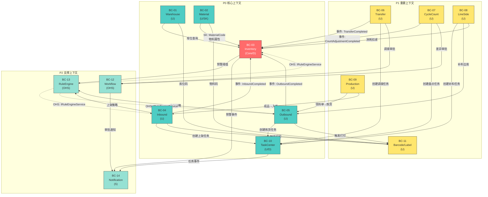
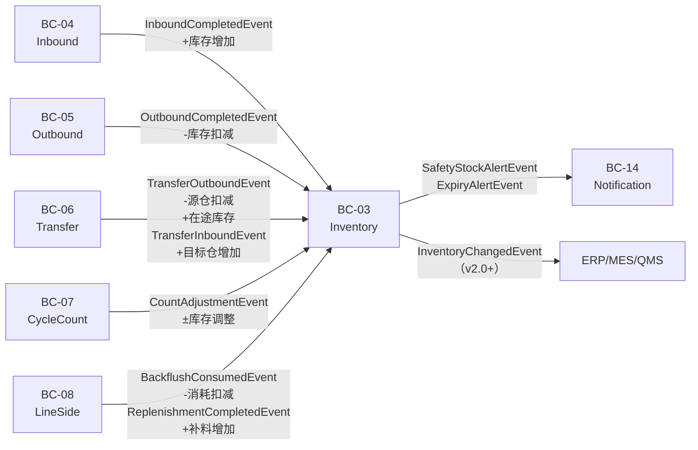
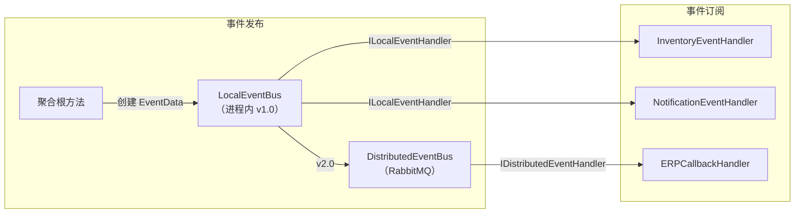
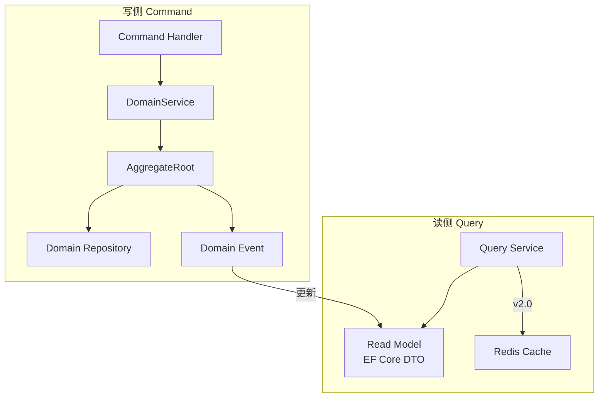
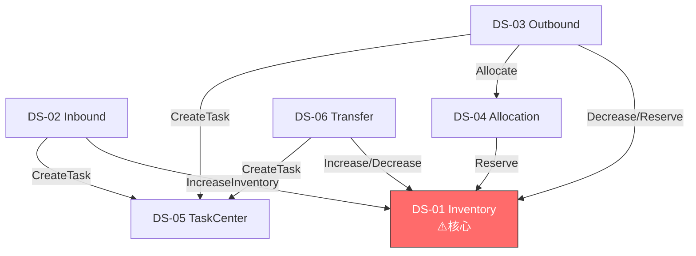
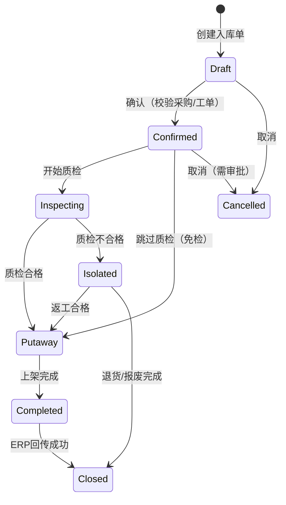
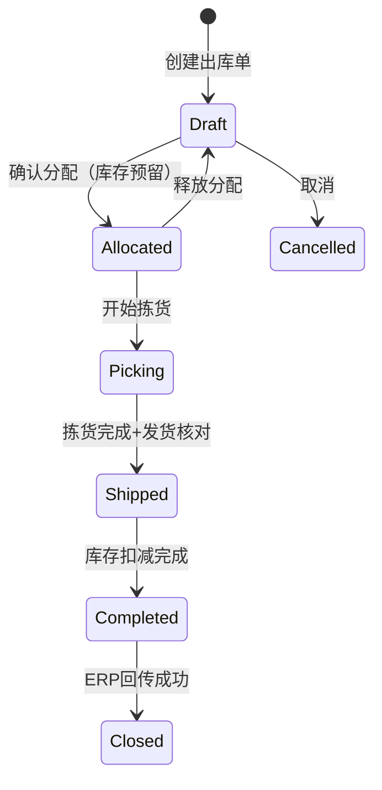
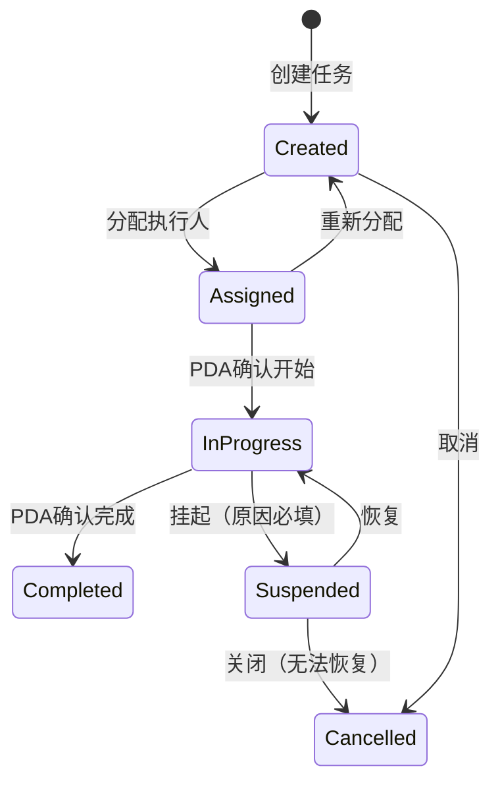
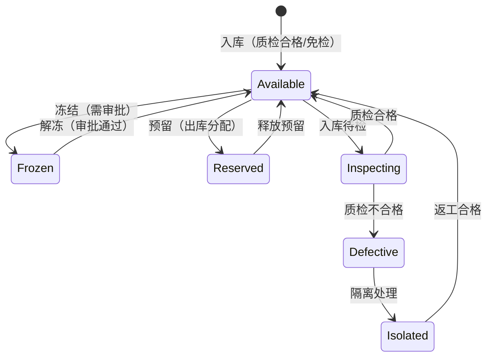
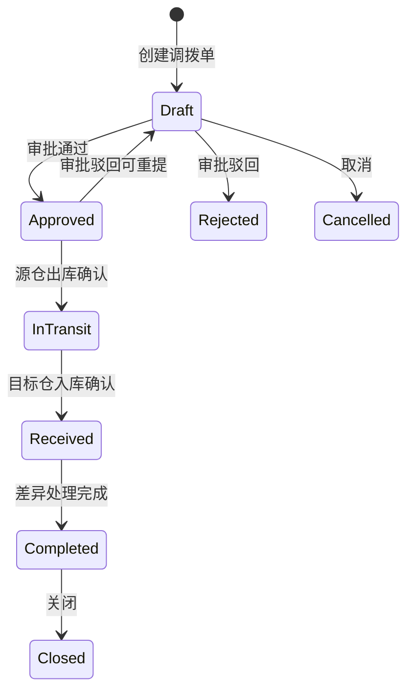

# Phase 3: Manufacturing WMS Platform — DDD 领域设计

> **文档版本**: v1.0  
> **撰写日期**: 2025-07  
> **撰写人**: 架构师 高见远（Gao）  
> **阶段**: Phase 3 — DDD Domain Design（领域驱动设计）  
> **项目**: Manufacturing WMS Platform（可复用制造业仓储管理平台）  
> **前置输入**: Phase 2 Requirement Analysis（需求分析 PRD + 需求追踪矩阵）

---

## 文档说明

| 项目 | 内容 |
|------|------|
| **Purpose（目的）** | 基于 Phase 2 需求分析，运用 DDD 方法对制造业仓储管理平台进行领域建模，划分限界上下文、设计聚合与实体、定义领域事件与值对象、设计领域服务与状态机，为 Phase 4 架构设计提供完整的领域模型输入 |
| **Scope（范围）** | 14 个限界上下文完整设计；P0 核心聚合详细设计；P1/P2 关键聚合设计；领域事件、值对象、领域服务、状态机全面设计 |
| **Design Principles（设计原则）** | 1. **库存优先**：Inventory Context 是核心上下文，所有业务上下文围绕库存展开；2. **聚合要小**：聚合边界严格控制，通过 ID 引用而非对象引用；3. **事件驱动**：跨上下文通信优先使用领域事件，减少同步耦合；4. **配置化建模**：可配置规则抽象为值对象或策略模式，而非硬编码逻辑；5. **状态机管控**：核心业务对象生命周期通过状态机严格管控 |
| **Assumptions（假设）** | 1. v1.0 不含保税仓/海关合规，预留接口；2. v1.0 不含危化品法规深度合规；3. v1.0 不含多语言/多货币；4. 仓库层级为 3 级（仓→区→位），可选 4 级（货格）；5. ABP Framework 提供 EventBus、Repository、UnitOfWork 等基础设施 |
| **Risks（风险）** | 1. 聚合边界划分可能随需求深化而调整；2. 领域事件粒度过细导致事件风暴；3. 状态机设计过于复杂导致实现困难；4. Inventory Context 与多上下文的依赖关系可能导致变更传播风险 |
| **Alternatives（替代方案）** | 1. 可将 Barcode/Label 与 Notification 合并为"支撑服务上下文"降低 BC 数量；2. 可将 Workflow 与 RuleEngine 合并为"规则流程上下文"；3. 可将线边仓并入 Inventory Context 而非独立 BC（当前选择独立 BC 以保持制造业特色） |
| **Review Items（评审项）** | 见 Section 10 |
| **Future Evolution（未来演进）** | Phase 4 架构设计将基于本 DDD 模型确定模块边界与通信机制；v2.0+ 新增 BC（MES/QMS/TMS 等）；聚合可随业务演进拆分或合并 |

---

## 目录

1. [限界上下文（Bounded Context）](#1-限界上下文bounded-context)
2. [上下文映射（Context Map）](#2-上下文映射context-map)
3. [聚合设计（Aggregate Design）](#3-聚合设计aggregate-design)
4. [实体设计（Entity Design）](#4-实体设计entity-design)
5. [值对象设计（Value Objects）](#5-值对象设计value-objects)
6. [领域事件设计（Domain Events）](#6-领域事件设计domain-events)
7. [仓储设计（Repositories）](#7-仓储设计repositories)
8. [领域服务设计（Domain Services）](#8-领域服务设计domain-services)
9. [状态机设计（State Machines）](#9-状态机设计state-machines)
10. [评审检查清单（Review Checklist）](#10-评审检查清单review-checklist)

---

## 1. 限界上下文（Bounded Context）

### 1.1 Purpose

基于 Phase 2 模块划分与需求分析，识别业务领域中的限界上下文，定义每个上下文的职责范围、统一语言与核心需求，为聚合设计和上下文映射提供基础。

### 1.2 Design Principles

1. **业务驱动**：按业务领域而非技术功能划分
2. **语言统一**：每个上下文有独立的统一语言（Ubiquitous Language）
3. **边界清晰**：上下文之间通过明确的接口/事件通信，不共享内部模型
4. **大小适中**：每个上下文覆盖 1 个核心业务能力 + 必要的支撑能力

### 1.3 限界上下文清单

#### BC-01：仓库主数据上下文（Warehouse Context）

| 属性 | 内容 |
|------|------|
| **BC-ID** | BC-01 |
| **名称** | Warehouse Context（仓库主数据上下文） |
| **职责范围** | 仓库、库区、库位的定义和管理；仓库组织架构（集团→工厂→仓库）；仓库类型配置；库位容量/承重/存储条件 |
| **核心需求** | REQ-WH-001~008 |
| **统一语言** | Warehouse（仓库）、WarehouseArea（库区）、Location（库位）、WarehouseType（仓库类型）、OrganizationUnit（组织单元）、Capacity（容量）、StorageCondition（存储条件） |
| **优先级** | P0 |
| **依赖上下文** | BC-02（物料仓储属性用于库位兼容校验）、BC-03（库存查询库位） |

#### BC-02：物料主数据上下文（Material Context）

| 属性 | 内容 |
|------|------|
| **BC-ID** | BC-02 |
| **名称** | Material Context（物料主数据上下文） |
| **职责范围** | 物料定义、分类、属性管理；计量单位与换算关系；批次/序列号/有效期管理开关；发料策略配置；安全库存/ABC分类；替代料关系；危险品属性 |
| **核心需求** | REQ-MT-001~009 |
| **统一语言** | Material（物料）、MaterialClassification（物料分类）、MaterialCode（物料编码）、UnitOfMeasure（计量单位）、IssueStrategy（发料策略）、SafetyStock（安全库存）、ABCClassification（ABC分类）、BatchManagement（批次管理开关）、SerialManagement（序列号管理开关）、ExpiryManagement（有效期管理开关）、SubstituteRelation（替代料关系） |
| **优先级** | P0 |
| **依赖上下文** | BC-03（安全库存预警需要库存数据） |

#### BC-03：库存核心上下文（Inventory Context）

| 属性 | 内容 |
|------|------|
| **BC-ID** | BC-03 |
| **名称** | Inventory Context（库存核心上下文） |
| **职责范围** | 库存总账（物料+仓库+库位+数量+批次+状态）；库存状态管控（可用/冻结/待检/隔离/在途）；库存预警（安全库存/临期/库龄/零库存）；库存流水账；库存调整（盘盈/盘亏/报废）；库存冻结/解冻；库存初始化；负库存管控 |
| **核心需求** | REQ-IV-001~016 |
| **统一语言** | Inventory（库存）、InventoryLedger（库存流水）、InventoryStatus（库存状态）、InventoryAdjustment（库存调整）、InventoryBalance（库存余额）、InventorySnapshot（库存快照）、FrozenInventory（冻结库存）、InTransitInventory（在途库存）、AvailableQuantity（可用量）、ReservedQuantity（预留量）、SafetyStockAlert（安全库存预警）、ExpiryAlert（临期预警） |
| **优先级** | P0 |
| **依赖上下文** | BC-01（库位信息）、BC-02（物料信息）、BC-04~BC-06（入库/出库/调拨触发库存变更）、BC-10（任务触发库存操作） |

> ⚠️ **Inventory Context 是平台核心上下文**，所有入出库、调拨、盘点操作最终都影响库存。设计时需确保库存变更的事务一致性。

#### BC-04：入库上下文（Inbound Context）

| 属性 | 内容 |
|------|------|
| **BC-ID** | BC-04 |
| **名称** | Inbound Context（入库上下文） |
| **职责范围** | 采购入库（关联采购订单）；生产入库（关联工单）；退货入库（关联原始单据）；ASN 预到货；入库数量校验；质检管控；上架库位推荐；PDA扫码入库；入库标签打印触发；入库回传 ERP |
| **核心需求** | REQ-IN-001~012 |
| **统一语言** | InboundOrder（入库单）、InboundLine（入库行）、InboundType（入库类型：Purchase/Production/Return）、ASN（预到货通知）、QualityInspection（质检）、PutawayTask（上架任务）、PutawayStrategy（上架策略）、OverReceiptRatio（超收比例）、InboundConfirmation（入库确认） |
| **优先级** | P0 |
| **依赖上下文** | BC-01（上架库位推荐）、BC-02（物料属性/质检规则）、BC-03（入库后库存增加）、BC-10（上架任务）、BC-11（标签打印） |

#### BC-05：出库上下文（Outbound Context）

| 属性 | 内容 |
|------|------|
| **BC-ID** | BC-05 |
| **名称** | Outbound Context（出库上下文） |
| **职责范围** | 生产领料出库（关联领料单/BOM）；销售出库（关联销售订单）；PDA扫码出库；超领管理；紧急领料绿色通道；发货核对；退料/退库；出库回传 ERP；出库单据打印 |
| **核心需求** | REQ-OB-001~010 |
| **统一语言** | OutboundOrder（出库单）、OutboundLine（出库行）、OutboundType（出库类型：MaterialRequisition/Sales/Shipping/ReturnMaterial）、PickingTask（拣货任务）、IssueStrategy（发料策略匹配）、OverIssueRatio（超领比例）、EmergencyIssue（紧急领料）、ShippingVerification（发货核对）、MaterialReturn（退料） |
| **优先级** | P0 |
| **依赖上下文** | BC-02（发料策略）、BC-03（出库后库存扣减）、BC-09（生产领料关联工单）、BC-10（拣货任务）、BC-11（单据打印） |

#### BC-06：调拨上下文（Transfer Context）

| 属性 | 内容 |
|------|------|
| **BC-ID** | BC-06 |
| **名称** | Transfer Context（调拨上下文） |
| **职责范围** | 调拨申请→审批→源仓出库→在途→目标仓入库全流程；同仓跨区调拨、跨仓调拨、跨工厂调拨；在途库存独立跟踪；调拨审批流配置 |
| **核心需求** | REQ-TF-001~004 |
| **统一语言** | TransferOrder（调拨单）、TransferType（调拨类型：CrossArea/CrossWarehouse/CrossFactory）、InTransitStock（在途库存）、TransferApproval（调拨审批）、SourceWarehouse（源仓）、TargetWarehouse（目标仓） |
| **优先级** | P1 |
| **依赖上下文** | BC-03（源仓扣减、目标仓增加、在途库存管理）、BC-01（仓库信息）、BC-10（调拨出库/入库任务）、BC-12（审批流） |

#### BC-07：盘点上下文（Cycle Count Context）

| 属性 | 内容 |
|------|------|
| **BC-ID** | BC-07 |
| **名称** | Cycle Count Context（盘点上下文） |
| **职责范围** | 盘点计划制定（全盘/循环盘点/抽盘）；盘点期间库存冻结；盘点差异自动计算；差异超阈值审批；PDA扫码盘点（盲盘模式）；盘盈/盘亏自动生成调整单 |
| **核心需求** | REQ-CC-001~005 |
| **统一语言** | CycleCountPlan（盘点计划）、CycleCountTask（盘点任务）、CycleCountMethod（盘点方式：Full/Cycle/Spot）、BlindCount（盲盘）、CountDifference（盘点差异）、DifferenceThreshold（差异阈值）、AdjustmentFromCount（盘点调整单） |
| **优先级** | P1 |
| **依赖上下文** | BC-03（盘点调整库存）、BC-01（盘点范围库位）、BC-10（盘点任务）、BC-12（差异审批） |

#### BC-08：线边仓上下文（Line-Side Warehouse Context）

| 属性 | 内容 |
|------|------|
| **BC-ID** | BC-08 |
| **名称** | Line-Side Warehouse Context（线边仓上下文） |
| **职责范围** | 线边仓独立库位管理（绑定产线+工位）；最小/最大库存控制（Kanban参数）；看板补料触发（低于阈值→补料任务→配送→入库确认）；消耗倒推模式（按工单消耗自动扣减） |
| **核心需求** | REQ-LS-001~004 |
| **统一语言** | LineSideWarehouse（线边仓）、ProductionLine（产线）、WorkStation（工位）、KanbanParameter（看板参数：MinQty/MaxQty）、ReplenishmentTask（补料任务）、ConsumptionBackflush（消耗倒推）、LineSideInventory（线边库存） |
| **优先级** | P1 |
| **依赖上下文** | BC-01（线边仓库位）、BC-03（线边库存管理、消耗扣减）、BC-05（补料出库）、BC-09（消耗倒推关联工单）、BC-10（补料任务） |

#### BC-09：生产协同上下文（Production Context）

| 属性 | 内容 |
|------|------|
| **BC-ID** | BC-09 |
| **名称** | Production Context（生产协同上下文） |
| **职责范围** | 领料单自动生成（工单→BOM展开→领料单）；成品入库关联工单；委外加工发料/回收全流程追踪 |
| **核心需求** | REQ-PD-001~003 |
| **统一语言** | ProductionOrder（生产工单）、MaterialRequisition（领料单）、BOM（物料清单）、SubcontractOrder（委外订单）、SubcontractTracking（委外追踪）、ProductionCompletion（成品入库确认） |
| **优先级** | P1 |
| **依赖上下文** | BC-04（成品入库）、BC-05（领料出库）、BC-02（BOM物料）、BC-03（库存扣减/增加） |

#### BC-10：任务中心上下文（Task Center Context）

| 属性 | 内容 |
|------|------|
| **BC-ID** | BC-10 |
| **名称** | Task Center Context（任务中心上下文） |
| **职责范围** | 统一任务生命周期管理；任务类型（上架/拣货/出货/移库/盘点/补货/质检/打印）；任务异常挂起/恢复；任务优先级管理；任务分配策略（手动/区域/技能/负载均衡）；任务进度追踪；任务超时预警；PDA任务接收与执行；任务批量创建 |
| **核心需求** | REQ-TC-001~009 |
| **统一语言** | WarehouseTask（仓库任务）、TaskType（任务类型）、TaskPriority（任务优先级：Emergency/High/Medium/Low）、TaskAssignment（任务分配）、AssignmentStrategy（分配策略）、TaskProgress（任务进度）、TaskSuspension（任务挂起）、TaskTimeout（任务超时） |
| **优先级** | P0 |
| **依赖上下文** | BC-04~BC-08（各业务上下文创建任务）、BC-14（通知推送） |

#### BC-11：条码标签上下文（Barcode/Label Context）

| 属性 | 内容 |
|------|------|
| **BC-ID** | BC-11 |
| **名称** | Barcode/Label Context（条码标签上下文） |
| **职责范围** | 统一条码生成规则（物料码/库位码/托盘码/箱码/序列号码）；标签模板引擎（入库/出库/成品/客户标签）；打印服务集成（自动/手动触发，多打印机） |
| **核心需求** | REQ-BL-001~003 |
| **统一语言** | BarcodeRule（条码规则）、BarcodeType（条码类型：Material/Location/Pallet/Box/Serial）、LabelTemplate（标签模板）、PrintTask（打印任务）、PrintService（打印服务） |
| **优先级** | P1 |
| **依赖上下文** | BC-01（库位码）、BC-02（物料码）、BC-04/BC-05（入库/出库触发打印） |

#### BC-12：工作流上下文（Workflow Context）

| 属性 | 内容 |
|------|------|
| **BC-ID** | BC-12 |
| **名称** | Workflow Context（工作流上下文） |
| **职责范围** | 可视化审批流配置；审批流运行时（提交→审批→驳回/通过，支持多级审批）；审批通知推送 |
| **核心需求** | REQ-WF-001~003 |
| **统一语言** | ApprovalFlow（审批流）、ApprovalNode（审批节点）、ApprovalCondition（审批条件）、ApprovalInstance（审批实例）、ApprovalAction（审批操作：Approve/Reject/Resubmit） |
| **优先级** | P2 |
| **依赖上下文** | BC-14（审批通知推送） |

#### BC-13：规则引擎上下文（Rule Engine Context）

| 属性 | 内容 |
|------|------|
| **BC-ID** | BC-13 |
| **名称** | Rule Engine Context（规则引擎上下文） |
| **职责范围** | 业务规则可视化配置（质检规则/上架策略/发料策略/预警阈值）；规则版本管理（变更留版本，支持回滚）；行业配置包（预置汽车/电子等行业规则包，一键导入） |
| **核心需求** | REQ-RE-001~003 |
| **统一语言** | BusinessRule（业务规则）、RuleVersion（规则版本）、IndustryPackage（行业配置包）、RuleCondition（规则条件）、RuleAction（规则动作） |
| **优先级** | P2 |
| **依赖上下文** | BC-02（发料策略规则）、BC-04（质检规则/上架策略）、BC-03（预警阈值规则） |

#### BC-14：通知上下文（Notification Context）

| 属性 | 内容 |
|------|------|
| **BC-ID** | BC-14 |
| **名称** | Notification Context（通知上下文） |
| **职责范围** | 多渠道通知（站内消息/邮件/短信/企业微信/钉钉）；通知模板配置；通知规则配置（按事件类型/角色/优先级） |
| **核心需求** | REQ-NT-001~003 |
| **统一语言** | Notification（通知）、NotificationChannel（通知渠道）、NotificationTemplate（通知模板）、NotificationRule（通知规则）、NotificationLog（通知日志） |
| **优先级** | P2 |
| **依赖上下文** | 所有 BC（订阅各 BC 的领域事件并发送通知） |

### 1.4 限界上下文汇总表

| BC-ID | 名称 | 优先级 | 核心需求 | 统一语言核心词 | 依赖上下文 |
|-------|------|--------|----------|---------------|-----------|
| BC-01 | Warehouse Context | P0 | REQ-WH-001~008 | Warehouse, Area, Location | BC-02, BC-03 |
| BC-02 | Material Context | P0 | REQ-MT-001~009 | Material, Classification, Strategy | BC-03 |
| BC-03 | Inventory Context | P0 | REQ-IV-001~016 | Inventory, Ledger, Status, Adjustment | BC-01, BC-02, BC-04~BC-06 |
| BC-04 | Inbound Context | P0 | REQ-IN-001~012 | InboundOrder, Putaway, Inspection | BC-01, BC-02, BC-03, BC-10, BC-11 |
| BC-05 | Outbound Context | P0 | REQ-OB-001~010 | OutboundOrder, Picking, Issue | BC-02, BC-03, BC-09, BC-10, BC-11 |
| BC-06 | Transfer Context | P1 | REQ-TF-001~004 | TransferOrder, InTransit | BC-03, BC-01, BC-10, BC-12 |
| BC-07 | Cycle Count Context | P1 | REQ-CC-001~005 | CycleCountPlan, Difference | BC-03, BC-01, BC-10, BC-12 |
| BC-08 | Line-Side Context | P1 | REQ-LS-001~004 | LineSideWarehouse, Kanban | BC-01, BC-03, BC-05, BC-09, BC-10 |
| BC-09 | Production Context | P1 | REQ-PD-001~003 | ProductionOrder, Requisition | BC-04, BC-05, BC-02, BC-03 |
| BC-10 | Task Center Context | P0 | REQ-TC-001~009 | WarehouseTask, Assignment | BC-04~BC-08, BC-14 |
| BC-11 | Barcode/Label Context | P1 | REQ-BL-001~003 | BarcodeRule, LabelTemplate | BC-01, BC-02, BC-04, BC-05 |
| BC-12 | Workflow Context | P2 | REQ-WF-001~003 | ApprovalFlow, Instance | BC-14 |
| BC-13 | Rule Engine Context | P2 | REQ-RE-001~003 | BusinessRule, IndustryPackage | BC-02, BC-04, BC-03 |
| BC-14 | Notification Context | P2 | REQ-NT-001~003 | Notification, Template, Channel | 所有 BC |

### 1.5 Assumptions

| 假设 | 说明 |
|------|------|
| BC 划分与 Phase 2 模块划分基本对应 | 保持需求到设计的一致性 |
| 线边仓独立为 BC 而非并入 Inventory | 保持制造业 WMS 特色，线边仓有独特的 Kanban/补料逻辑 |
| Workflow/RuleEngine/Notification 为 P2 支撑 BC | v1.0 提供基础能力，后续迭代完善 |
| 保税仓 BC 在 v2.0+ 新增 | 当前预留 IBondedWarehouseService 接口 |

### 1.6 Risks

| 风险 | 应对 |
|------|------|
| BC 划分过细导致上下文间通信复杂 | Context Map 明确通信方式，优先事件驱动 |
| Inventory Context 依赖过多导致变更传播 | 通过领域事件解耦，不直接调用 |
| 线边仓 BC 独立可能导致与 Inventory 重复 | 共享 InventoryBalance 值对象，不重复建模 |

### 1.7 Alternatives

| 替代方案 | 优劣 |
|----------|------|
| 合并 Barcode/Label + Notification 为"支撑服务 BC" | ✅ 减少 BC 数量；❌ 违背"按业务领域划分"原则 |
| 合并 Workflow + RuleEngine 为"规则流程 BC" | ✅ 减少复杂性；❌ 两者职责本质不同（审批流 vs 业务规则） |
| 线边仓并入 Inventory BC | ✅ 减少重复；❌ 线边仓 Kanban 逻辑与库存核心逻辑差异大 |

### 1.8 Review Items

| 评审项 | 标准 |
|--------|------|
| BC 数量 14 个 | 覆盖 Phase 2 所有模块 |
| 每个 BC 有统一语言定义 | 核心词 ≥ 5 个 |
| BC 依赖关系无循环 | Context Map 可验证 |
| P0 BC 覆盖 P0 全部需求 | 逐条核对 |

### 1.9 Future Evolution

| 演进方向 | 时间线 | 内容 |
|----------|--------|------|
| 保税仓 BC | v2.0 | 新增 BC-15 BondedWarehouse Context |
| MES 集成 BC | v2.0 | 扩展 BC-09 Production Context 或新增 MES Context |
| QMS BC | v2.0 | 新增 BC-16 Quality Context |
| AI 预测 BC | v3.0+ | 新增 BC-17 Prediction Context |

---

## 2. 上下文映射（Context Map）

### 2.1 Purpose

定义限界上下文之间的关系模式（上下游、共享内核、防腐层等），明确通信方式，特别关注核心上下文（Inventory）与各业务上下文的依赖关系。

### 2.2 Design Principles

1. **事件驱动优先**：跨 BC 通信优先使用领域事件（异步），减少同步耦合
2. **防腐层隔离**：上下游关系中使用 ACL（Anti-Corruption Layer）保护上游模型不被下游污染
3. **共享内核最小化**：仅共享必要的值对象和接口定义
4. **Inventory Context 为核心下游**：多数业务 BC 是 Inventory 的上游（触发库存变更）

### 2.3 上下文关系模式定义

| 关系模式 | 符号 | 说明 | 适用场景 |
|----------|------|------|----------|
| 上游/下游（U/D） | U→D | 上游独立演进，下游依赖上游模型或事件 | Inbound→Inventory, Outbound→Inventory |
| 共享内核（SK） | SK | 两个上下文共享一小部分模型 | Material↔Inventory 共享 MaterialCode |
| 防腐层（ACL） | ACL | 下游通过翻译层适配上游模型 | Inventory 对 ERP 数据使用 ACL |
| 开放主机服务（OHS） | OHS | 上游提供标准化服务接口 | RuleEngine 提供 IRuleEngineService |
| 发布/订阅（P/S） | P/S | 上游发布事件，下游订阅 | 各 BC 发布事件，Notification 订阅 |

### 2.4 上下文映射图



### 2.5 上下文间通信方式详细表

| 上游 BC | 下游 BC | 关系模式 | 通信方式 | 共享内容 | 说明 |
|---------|---------|----------|----------|----------|------|
| BC-01 Warehouse | BC-03 Inventory | U→D | 同步 API（查询库位信息） | LocationId, LocationCode | Inventory 查询库位但不修改 |
| BC-02 Material | BC-03 Inventory | SK | 同步 API + 共享值对象 | MaterialCode, MaterialId, SafetyStockValue | 共享物料编码与安全库存值对象 |
| BC-04 Inbound | BC-03 Inventory | U→D | 异步事件 | InboundCompletedEvent | 入库完成后发布事件，Inventory 订阅增加库存 |
| BC-04 Inbound | BC-10 TaskCenter | U→D | 同步 API（创建任务） | InboundOrderId, TaskType=Putaway | 入库确认后创建上架任务 |
| BC-04 Inbound | BC-11 Barcode/Label | U→D | 异步事件 | PrintRequestedEvent | 入库完成后触发标签打印 |
| BC-05 Outbound | BC-03 Inventory | U→D | 异步事件 | OutboundCompletedEvent | 出库完成后发布事件，Inventory 订阅扣减库存 |
| BC-05 Outbound | BC-10 TaskCenter | U→D | 同步 API（创建任务） | OutboundOrderId, TaskType=Picking | 出库确认后创建拣货任务 |
| BC-05 Outbound | BC-11 Barcode/Label | U→D | 异步事件 | PrintRequestedEvent | 出库触发单据打印 |
| BC-06 Transfer | BC-03 Inventory | U→D | 异步事件 | TransferOutboundEvent, TransferInboundEvent | 调拨出库扣减+在途，调拨入库增加 |
| BC-06 Transfer | BC-12 Workflow | U→D | 同步 API（发起审批） | TransferOrderId | 调拨申请发起审批流 |
| BC-07 CycleCount | BC-03 Inventory | U→D | 异步事件 | CountAdjustmentEvent | 盘点确认后调整库存 |
| BC-08 LineSide | BC-03 Inventory | U→D | 异步事件 | BackflushConsumedEvent, ReplenishmentCompletedEvent | 消耗倒推扣减+补料入库增加 |
| BC-08 LineSide | BC-05 Outbound | U→D | 同步 API | ReplenishmentRequestId | 补料触发领料出库 |
| BC-09 Production | BC-04 Inbound | U→D | 同步 API | ProductionOrderId, ProductMaterial | 成品入库关联工单 |
| BC-09 Production | BC-05 Outbound | U→D | 同步 API | MaterialRequisitionId | 领料单→出库 |
| BC-10 TaskCenter | BC-14 Notification | U→D | 异步事件 | TaskAssignedEvent, TaskTimeoutEvent | 任务分配/超时通知 |
| BC-03 Inventory | BC-14 Notification | U→D | 异步事件 | SafetyStockAlertEvent, ExpiryAlertEvent | 预警通知 |
| BC-12 Workflow | BC-14 Notification | U→D | 异步事件 | ApprovalPendingEvent, ApprovalResultEvent | 审批通知 |
| BC-13 RuleEngine | BC-04 Inbound | OHS | 同步 API（查询规则） | IRuleEngineService | 上架策略、质检规则 |
| BC-13 RuleEngine | BC-05 Outbound | OHS | 同步 API（查询规则） | IRuleEngineService | 发料策略 |
| BC-13 RuleEngine | BC-03 Inventory | OHS | 同步 API（查询阈值） | IRuleEngineService | 预警阈值 |
| ERP（外部） | BC-04 Inbound | ACL | 同步 API + 防腐层 | IPurchaseOrderService（适配层） | ERP 采购订单数据通过 ACL 转换 |
| ERP（外部） | BC-02 Material | ACL | 同步 API + 防腐层 | IMaterialSyncService（适配层） | ERP 物料同步通过 ACL |

### 2.6 Inventory Context 核心依赖分析

> **Inventory Context（BC-03）是平台的"心脏"**，所有入出库、调拨、盘点操作最终都影响库存。



**关键设计决策**：
- **库存变更的事务边界**：库存增加/扣减在各自 BC 的 Command Handler 中同步完成（保证事务一致性），然后发布领域事件通知其他 BC
- **分配与扣减分离**：AllocationDomainService 在 Outbound BC 中执行分配（预留库存），实际扣减在 Inventory BC 中同步完成
- **在途库存独立管理**：Transfer BC 发布 TransferOutboundEvent 后，Inventory BC 将源仓库存扣减并创建 InTransitInventory 记录

### 2.7 Assumptions

| 假设 | 说明 |
|------|------|
| 异步事件使用 ABP EventBus | 进程内事件总线，不使用外部 MQ（v1.0 Modular Monolith） |
| ERP 外部系统通过 ACL 集成 | 防腐层转换 ERP 数据模型为 WMS 领域模型 |
| 共享内核仅限值对象 | 不共享实体，仅共享 MaterialCode 等值对象 |

### 2.8 Risks

| 风险 | 应对 |
|------|------|
| 事件过多导致 Inventory Context 订阅复杂 | 仅订阅核心事件（6 个），预警通过定时任务 |
| 同步 API 调用导致 BC 间耦合 | 严格限制同步调用为查询类，变更类通过事件 |
| ACL 维护成本 | ERP 适配层抽象为 IPurchaseOrderService 接口 |

### 2.9 Alternatives

| 替代方案 | 优劣 |
|----------|------|
| 所有通信改为同步 API | ✅ 简单；❌ 高耦合，不利于微服务拆分 |
| 使用外部 MQ（RabbitMQ/Kafka）做事件总线 | ✅ 可靠；❌ v1.0 不需要（Modular Monolith） |
| 不使用 ACL 直接集成 ERP | ❌ ERP 模型变化直接污染 WMS 领域 |

### 2.10 Review Items

| 评审项 | 标准 |
|--------|------|
| Context Map 覆盖所有 14 个 BC | ✅ |
| Inventory Context 依赖关系明确 | ✅ |
| 通信方式（同步/异步）标注完整 | ✅ |
| 无循环依赖 | 验证 |

### 2.11 Future Evolution

| 演进方向 | 时间线 | 内容 |
|----------|--------|------|
| EventBus → MQ | v2.0 | 从进程内事件总线迁移到 RabbitMQ/Kafka |
| ACL 增强 | v1.1 | 新增 SAP/Oracle/金蝶/用友 4 个 ERP 适配器 |
| OHS/PUB 增强 | v2.0 | Inventory Context 发布 InventoryChangedEvent 供 MES/QMS 订阅 |

---

## 3. 聚合设计（Aggregate Design）

### 3.1 Purpose

为每个限界上下文设计核心聚合，定义聚合根、包含实体/值对象、聚合边界，确保事务一致性和业务规则的封装。

### 3.2 Design Principles

1. **聚合要小**：每个聚合只包含必须保证事务一致性的实体
2. **边界清晰**：聚合之间通过 ID 引用，不通过对象引用
3. **根实体管控**：所有对聚合内部实体的操作必须通过根实体
4. **单一职责**：每个聚合对应一个核心业务概念

### 3.3 P0 核心模块聚合设计

#### BC-01 Warehouse Context 聚合

| AGG-ID | 聚合名称 | 根实体 | 包含实体 | 包含值对象 | 聚合边界说明 | 关联需求 |
|--------|----------|--------|----------|-----------|-------------|----------|
| AGG-01 | Warehouse聚合 | Warehouse | — | WarehouseCode, WarehouseType, WarehouseName, OrganizationUnit, WarehouseAddress | 仓库是独立管理单元，包含仓库级配置（类型、负责人、存储条件），库区和库位是独立聚合 | REQ-WH-001, REQ-WH-003 |
| AGG-02 | WarehouseArea聚合 | WarehouseArea | — | AreaCode, AreaType, AreaFunction, StorageEnvironment, AreaCapacity | 库区是仓库内的功能分区，有独立的类型（收货/存储/发货/隔离）和环境属性（常温/冷链） | REQ-WH-004 |
| AGG-03 | Location聚合 | Location | — | LocationCode, LocationType, LocationCapacity, StorageCondition, BarcodeId | 库位是最精细的存储单元，有唯一条码、容量/承重/存储条件属性。通过 WarehouseId + AreaId 引用所属仓库和库区 | REQ-WH-002, REQ-WH-005, REQ-WH-006 |

> **设计决策**：Warehouse、WarehouseArea、Location 各为独立聚合而非嵌套。原因是：1）库位数量可能巨大（万级），嵌套导致加载性能问题；2）库位操作（上架/拣货）频繁，独立聚合减少锁冲突；3）库区可独立配置功能与环境属性。

#### BC-02 Material Context 聚合

| AGG-ID | 聚合名称 | 根实体 | 包含实体 | 包含值对象 | 聚合边界说明 | 关联需求 |
|--------|----------|--------|----------|-----------|-------------|----------|
| AGG-04 | Material聚合 | Material | MaterialSubstituteRelation | MaterialCode, MaterialName, MaterialType, UnitOfMeasure, StorageAttribute, QualityAttribute, InventoryAttribute, IssueStrategy, DangerAttribute | 物料是核心主数据聚合，包含物料的所有属性定义。替代料关系作为子实体（因为替代料配置必须在物料上下文中管理） | REQ-MT-001~009 |
| AGG-05 | MaterialClassification聚合 | MaterialClassification | — | ClassificationCode, ClassificationName, ClassificationLevel, ParentClassificationId, AttributeTemplate | 物料分类树是独立聚合，因为分类结构可独立管理，物料通过 ClassificationId 引用分类 | REQ-MT-002 |

#### BC-03 Inventory Context 聚合

| AGG-ID | 聚合名称 | 根实体 | 包含实体 | 包含值对象 | 聚合边界说明 | 关联需求 |
|--------|----------|--------|----------|-----------|-------------|----------|
| AGG-06 | Inventory聚合 | InventoryBalance | — | MaterialId, WarehouseId, LocationId, BatchNumber, InventoryStatus, Quantity, ReservedQuantity, FrozenQuantity, InTransitQuantity | **库存余额是核心聚合**！每条记录代表一个"物料+仓库+库位+批次+状态"组合的库存余额。事务一致性边界：库存增减操作必须原子完成 | REQ-IV-001~007, REQ-IV-012~016 |
| AGG-07 | InventoryLedger聚合 | InventoryLedgerEntry | — | LedgerId, OperationType, OperationQuantity, BeforeQuantity, AfterQuantity, OperationTime, OperatorId, SourceOrderType, SourceOrderId | 库存流水是独立聚合，不可修改不可删除（BR-010）。每条流水记录与库存余额变更对应 | REQ-IV-012 |
| AGG-08 | InventoryAdjustment聚合 | InventoryAdjustment | InventoryAdjustmentLine | AdjustmentType, AdjustmentReason, ApprovalStatus, AdjustmentLineItem | 库存调整单是独立聚合，包含调整行（物料+数量+原因）。调整必须关联审批流 | REQ-IV-013 |
| AGG-09 | InventoryFreeze聚合 | InventoryFreezeOrder | — | FreezeId, FreezeScope, FreezeReason, FreezeStatus, FreezeRange | 库存冻结单是独立聚合，冻结范围可按批次/物料/库位。解冻需审批 | REQ-IV-014 |

> **⚠️ AGG-06 Inventory 聚合是全平台最核心的聚合**。设计要点：
> - InventoryBalance 的唯一键为 `(MaterialId, WarehouseId, LocationId, BatchNumber, InventoryStatus)`
> - 所有库存增减操作通过 InventoryBalance.ApplyQuantityChange() 方法完成，确保事务一致性
> - 可用量计算：`AvailableQuantity = Quantity - ReservedQuantity - FrozenQuantity`
> - 负库存开关：`AllowNegativeInventory` 配置项决定是否允许扣减后 Quantity < 0

#### BC-04 Inbound Context 聚合

| AGG-ID | 聚合名称 | 根实体 | 包含实体 | 包含值对象 | 聚合边界说明 | 关联需求 |
|--------|----------|--------|----------|-----------|-------------|----------|
| AGG-10 | InboundOrder聚合 | InboundOrder | InboundLine | InboundType, InboundStatus, PurchaseOrderId, ProductionOrderId, ReturnOrderId, SupplierId, OverReceiptRatio | 入库单是入库流程的核心聚合，包含入库行（物料+数量+批次+质检状态）。入库单状态机管控全流程 | REQ-IN-001~012 |
| AGG-11 | InboundLine聚合（子实体） | —（嵌套在 InboundOrder） | InboundLine | MaterialId, PlanQuantity, ReceivedQuantity, BatchNumber, SerialNumbers, QualityStatus, PutawayLocationId | 入库行嵌套在入库单聚合中，因为入库行与入库单必须保证事务一致性 | REQ-IN-010 |

> **设计决策**：InboundLine 作为 InboundOrder 的子实体而非独立聚合，因为：1）入库行的状态变更（质检合格/不合格）必须在入库单事务内完成；2）入库行不能脱离入库单独立存在。

#### BC-05 Outbound Context 聚合

| AGG-ID | 聚合名称 | 根实体 | 包含实体 | 包含值对象 | 聚合边界说明 | 关联需求 |
|--------|----------|--------|----------|-----------|-------------|----------|
| AGG-12 | OutboundOrder聚合 | OutboundOrder | OutboundLine | OutboundType, OutboundStatus, MaterialRequisitionId, SalesOrderId, ReturnMaterialOrderId, OverIssueRatio | 出库单是出库流程的核心聚合，包含出库行。出库单状态机管控全流程 | REQ-OB-001~010 |
| AGG-13 | OutboundLine聚合（子实体） | —（嵌套在 OutboundOrder） | OutboundLine | MaterialId, RequiredQuantity, AllocatedQuantity, PickedQuantity, ShippedQuantity, PickingLocationId, IssueStrategy | 出库行嵌套在出库单中，事务一致性要求与入库行相同 | REQ-OB-001 |

#### BC-10 Task Center Context 聚合

| AGG-ID | 聚合名称 | 根实体 | 包含实体 | 包含值对象 | 聚合边界说明 | 关联需求 |
|--------|----------|--------|----------|-----------|-------------|----------|
| AGG-14 | WarehouseTask聚合 | WarehouseTask | — | TaskType, TaskPriority, TaskStatus, AssignmentStrategy, SourceOrderId, SourceOrderType, AssignedUserId, ExpectedCompletionTime, TaskProgress | 任务是独立聚合，每个任务有独立的生命周期、优先级和分配策略。通过 SourceOrderId + SourceOrderType 关联业务单据 | REQ-TC-001~009 |

### 3.4 P1 重要模块聚合设计

#### BC-06 Transfer Context 聚合

| AGG-ID | 聚合名称 | 根实体 | 包含实体 | 包含值对象 | 聚合边界说明 | 关联需求 |
|--------|----------|--------|----------|-----------|-------------|----------|
| AGG-15 | TransferOrder聚合 | TransferOrder | TransferLine | TransferType, TransferStatus, SourceWarehouseId, TargetWarehouseId, ApprovalStatus | 调拨单是调拨流程核心聚合，包含调拨行。调拨单状态机管控全流程 | REQ-TF-001~004 |

#### BC-07 Cycle Count Context 聚合

| AGG-ID | 聚合名称 | 根实体 | 包含实体 | 包含值对象 | 聚合边界说明 | 关联需求 |
|--------|----------|--------|----------|-----------|-------------|----------|
| AGG-16 | CycleCountPlan聚合 | CycleCountPlan | CycleCountItem | CountMethod, CountStatus, CountScope, PlannedDate | 盘点计划是独立聚合，包含盘点项（库位+物料） | REQ-CC-001 |
| AGG-17 | CycleCountResult聚合 | CycleCountResult | — | SystemQuantity, ActualQuantity, DifferenceQuantity, DifferenceAmount, BlindCountFlag | 盘点结果独立聚合，因为盘点执行与计划可分离 | REQ-CC-002~005 |

#### BC-08 Line-Side Context 聚合

| AGG-ID | 聚合名称 | 根实体 | 包含实体 | 包含值对象 | 聚合边界说明 | 关联需求 |
|--------|----------|--------|----------|-----------|-------------|----------|
| AGG-18 | LineSideWarehouse聚合 | LineSideWarehouse | LineSideLocation | ProductionLineId, WorkStationId, KanbanParameter, ConsumptionMode | 线边仓是独立聚合，绑定产线和工位，有 Kanban 参数（最小/最大库存） | REQ-LS-001~004 |

#### BC-09 Production Context 聚合

| AGG-ID | 聚合名称 | 根实体 | 包含实体 | 包含值对象 | 聚合边界说明 | 关联需求 |
|--------|----------|--------|----------|-----------|-------------|----------|
| AGG-19 | MaterialRequisition聚合 | MaterialRequisition | MaterialRequisitionLine | ProductionOrderId, RequisitionStatus, BOMReference | 领料单是独立聚合，由生产工单 BOM 展开自动生成 | REQ-PD-001 |
| AGG-20 | SubcontractOrder聚合 | SubcontractOrder | — | SubcontractStatus, VendorId, SentQuantity, ReceivedQuantity, LossRate | 委外订单独立聚合，追踪发料与回收全流程 | REQ-PD-003 |

#### BC-11 Barcode/Label Context 聚合

| AGG-ID | 聚合名称 | 根实体 | 包含实体 | 包含值对象 | 聚合边界说明 | 关联需求 |
|--------|----------|--------|----------|-----------|-------------|----------|
| AGG-21 | BarcodeRule聚合 | BarcodeRule | — | BarcodeType, BarcodeFormat, BarcodePrefix, CodePattern | 条码规则是独立聚合，定义条码生成规则 | REQ-BL-001 |
| AGG-22 | LabelTemplate聚合 | LabelTemplate | — | TemplateName, TemplateContent, TemplateVersion, IndustryStandard | 标签模板独立聚合，支持行业标签标准 | REQ-BL-002 |
| AGG-23 | PrintTask聚合 | PrintTask | — | PrintTaskStatus, PrinterId, TemplateId, PrintContent, TriggerSource | 打印任务独立聚合，统一管理打印任务 | REQ-BL-003 |

### 3.5 P2 支撑模块聚合设计

#### BC-12 Workflow Context 聚合

| AGG-ID | 聚合名称 | 根实体 | 包含实体 | 包含值对象 | 聚合边界说明 | 关联需求 |
|--------|----------|--------|----------|-----------|-------------|----------|
| AGG-24 | ApprovalFlow聚合 | ApprovalFlow | ApprovalNode | FlowName, FlowType, FlowStatus, ApprovalCondition | 审批流定义聚合，包含审批节点 | REQ-WF-001 |
| AGG-25 | ApprovalInstance聚合 | ApprovalInstance | ApprovalActionLog | InstanceStatus, CurrentNodeId, BusinessOrderId | 审批实例聚合，记录审批运行时状态和操作日志 | REQ-WF-002 |

#### BC-13 Rule Engine Context 聚合

| AGG-ID | 聚合名称 | 根实体 | 包含实体 | 包含值对象 | 聚合边界说明 | 关联需求 |
|--------|----------|--------|----------|-----------|-------------|----------|
| AGG-26 | BusinessRule聚合 | BusinessRule | — | RuleType, RuleCondition, RuleAction, RuleVersion, EffectiveStatus | 业务规则聚合，包含规则条件和动作 | REQ-RE-001 |
| AGG-27 | IndustryPackage聚合 | IndustryPackage | — | PackageName, PackageVersion, PackageContent, IndustryType | 行业配置包聚合，预置行业规则集合 | REQ-RE-003 |

#### BC-14 Notification Context 聚合

| AGG-ID | 聚合名称 | 根实体 | 包含实体 | 包含值对象 | 聚合边界说明 | 关联需求 |
|--------|----------|--------|----------|-----------|-------------|----------|
| AGG-28 | Notification聚合 | Notification | — | NotificationType, NotificationChannel, NotificationContent, NotificationStatus, RecipientId | 通知是独立聚合，记录每次通知发送 | REQ-NT-001 |
| AGG-29 | NotificationTemplate聚合 | NotificationTemplate | — | TemplateName, TemplateContent, TemplateVariables, NotificationChannel | 通知模板聚合 | REQ-NT-002 |
| AGG-30 | NotificationRule聚合 | NotificationRule | — | RuleCondition, EventSubscription, TargetRole, TargetChannel | 通知规则聚合，定义事件→通知的映射 | REQ-NT-003 |

### 3.6 聚合汇总统计

| 统计维度 | 数量 |
|----------|------|
| P0 聚合数 | 14 个（AGG-01~AGG-14） |
| P1 聚合数 | 9 个（AGG-15~AGG-23） |
| P2 聚合数 | 7 个（AGG-24~AGG-30） |
| **聚合总计** | **30 个** |

### 3.7 Assumptions

| 假设 | 说明 |
|------|------|
| InboundLine/OutboundLine 嵌套为子实体而非独立聚合 | 与父单据事务一致性要求 |
| InventoryBalance 聚合粒度为 物料+仓库+库位+批次+状态 | 不再细化到序列号级 |
| 序列号作为 InventoryBalance 的扩展数据存储 | 序列号库存查询通过专门的 SerialNumberReadModel |

### 3.8 Risks

| 风险 | 应对 |
|------|------|
| InventoryBalance 聚合粒度过细导致记录数膨胀 | 批次管理物料按批次分记录，非批次管理物料按库位+状态分记录 |
| 子实体嵌套导致聚合过大 | InboundLine/OutboundLine 数量通常 ≤ 20 行，可接受 |
| 聚合间 ID 引用导致查询需要跨聚合 JOIN | CQRS 读模型专门处理跨聚合查询 |

### 3.9 Alternatives

| 替代方案 | 优劣 |
|----------|------|
| 将 Location 嵌套在 Warehouse 聚合中 | ✅ 模型直观；❌ 加载性能差、锁冲突严重 |
| 将 InventoryBalance 拆为 InventoryHeader + InventoryDetail | ✅ 灵活；❌ 增加事务复杂度 |
| 序列号作为独立聚合 | ✅ 序列号独立管理；❌ 增加聚合数量和一致性复杂度 |

### 3.10 Review Items

| 评审项 | 标准 |
|--------|------|
| P0 聚合覆盖 P0 全部核心需求 | 逐条核对 |
| 每个聚合有明确的边界说明 | ✅ |
| 聚合间通过 ID 引用而非对象引用 | ✅ |
| AGG-06 Inventory 聚合一致性边界清晰 | ✅ |

### 3.11 Future Evolution

| 演进方向 | 时间线 | 内容 |
|----------|--------|------|
| 序列号独立聚合 | v1.1 | 序列号追踪需求增强时拆分 |
| 保税仓聚合 | v2.0 | 新增 BondedWarehouse 聚合 |
| 委外追踪聚合增强 | v1.1 | SubcontractOrder 增加委外损耗追踪 |

---

## 4. 实体设计（Entity Design）

### 4.1 Purpose

为每个聚合根和子实体定义详细属性（属性名、类型、业务含义、是否必填），定义实体身份标识策略与生命周期。

### 4.2 Design Principles

1. **身份标识策略**：GUID 作为主键 + 业务编码作为自然键，两者组合确保唯一性
2. **属性分类**：核心属性（必填）、业务属性（按场景必填）、扩展属性（可选）
3. **审计属性**：所有实体包含 CreatedBy, CreatedTime, ModifiedBy, ModifiedTime, IsDeleted
4. **ABP 继承**：聚合根继承 `FullAuditedAggregateRoot<Guid>`，实体继承 `FullAuditedEntity<Guid>`

### 4.3 P0 核心实体详细设计

#### ENT-01：Warehouse（仓库）

| 属性名 | 类型 | 业务含义 | 必填 | 默认值 | 备注 |
|--------|------|----------|------|--------|------|
| Id | Guid | 主键 | Y | GUID | ABP FullAuditedAggregateRoot |
| WarehouseCode | string(50) | 仓库编码（业务自然键） | Y | — | 唯一，自定义编码规则 |
| WarehouseName | string(200) | 仓库名称 | Y | — | |
| WarehouseType | WarehouseType(enum) | 仓库类型 | Y | — | 原材料仓/成品仓/线边仓/半成品仓/辅料仓/备件仓/危化品仓/退货仓/冷链仓/常温仓/室外仓/临时仓 等 ≥12 种 |
| OrganizationUnitId | Guid | 所属组织单元ID | Y | — | 引用 BC-01 组织架构 |
| OrganizationUnitName | string(200) | 所属组织名称 | Y | — | 冗余存储，减少跨聚合查询 |
| PlantId | Guid | 所属工厂ID | Y | — | 引用工厂 |
| PlantName | string(100) | 所属工厂名称 | Y | — | 冗余存储 |
| ResponsibleUserId | Guid? | 负责人ID | N | null | |
| ResponsibleUserName | string(100) | 负责人姓名 | N | null | 冗余存储 |
| Address | string(500) | 仓库地址 | N | null | |
| StorageConditionType | StorageConditionType(enum) | 默认存储条件 | N | Normal | 常温/冷链/恒温/防潮/防尘 |
| LocationLevelCount | int | 库位层级数 | Y | 3 | 3 或 4 |
| IsActive | bool | 是否启用 | Y | true | |
| Remark | string(1000) | 备注 | N | null | |

**实体生命周期**：创建 → 启用 → 停用（不物理删除）

#### ENT-02：WarehouseArea（库区）

| 属性名 | 类型 | 业务含义 | 必填 | 默认值 | 备注 |
|--------|------|----------|------|--------|------|
| Id | Guid | 主键 | Y | GUID | |
| AreaCode | string(50) | 库区编码 | Y | — | 唯一（仓库内） |
| AreaName | string(200) | 库区名称 | Y | — | |
| WarehouseId | Guid | 所属仓库ID | Y | — | 引用 Warehouse.Id |
| WarehouseCode | string(50) | 所属仓库编码 | Y | — | 冗余 |
| AreaFunction | AreaFunction(enum) | 库区功能 | Y | — | Receiving/Storage/Shipping/Isolation/QualityInspection/Mixed |
| StorageEnvironment | StorageEnvironment(enum) | 存储环境 | N | Normal | Normal/ColdChain/ConstantTemp/MoistureProof/DustProof |
| MaxCapacity | decimal? | 最大容量 | N | null | |
| CurrentCapacity | decimal? | 当前容量 | N | null | 计算字段 |
| IsActive | bool | 是否启用 | Y | true | |

#### ENT-03：Location（库位）

| 属性名 | 类型 | 业务含义 | 必填 | 默认值 | 备注 |
|--------|------|----------|------|--------|------|
| Id | Guid | 主键 | Y | GUID | |
| LocationCode | string(50) | 库位编码（唯一条码） | Y | — | 唯一（仓库内），用于扫码操作 |
| WarehouseId | Guid | 所属仓库ID | Y | — | |
| WarehouseCode | string(50) | 所属仓库编码 | Y | — | 冗余 |
| AreaId | Guid | 所属库区ID | Y | — | 引用 WarehouseArea.Id |
| AreaCode | string(50) | 所属库区编码 | Y | — | 冗余 |
| LocationType | LocationType(enum) | 库位类型 | N | Standard | Standard/Shelf/Grid/Pallet/Staging |
| MaxWeight | decimal? | 最大承重(kg) | N | null | 上架校验 |
| MaxCapacity | decimal? | 最大容量 | N | null | 上架校验 |
| CurrentWeight | decimal? | 当前承重 | N | null | 计算字段 |
| CurrentCapacity | decimal? | 当前容量 | N | null | 计算字段 |
| StorageCondition | StorageCondition(enum) | 存储条件 | N | Normal | 上架兼容性校验 |
| BarcodeId | string(100) | 条码标识 | Y | — | 支持扫码定位 |
| Row | string(10) | 行号 | N | null | 仓库行列层编号 |
| Column | string(10) | 列号 | N | null | |
| Layer | string(10) | 层号 | N | null | |
| IsActive | bool | 是否启用 | Y | true | |

#### ENT-04：Material（物料）

| 属性名 | 类型 | 业务含义 | 必填 | 默认值 | 备注 |
|--------|------|----------|------|--------|------|
| Id | Guid | 主键 | Y | GUID | |
| MaterialCode | string(50) | 物料编码（业务自然键） | Y | — | 唯一，可配置编码规则 |
| MaterialName | string(200) | 物料名称 | Y | — | |
| MaterialNameEn | string(200) | 物料英文名 | N | null | 国际化预留 |
| ClassificationId | Guid? | 物料分类ID | N | null | 引用 MaterialClassification.Id |
| Specification | string(500) | 规格描述 | N | null | |
| PrimaryUnitId | Guid | 主计量单位ID | Y | — | 引用 UnitOfMeasure |
| PrimaryUnitName | string(50) | 主计量单位名称 | Y | — | 冗余 |
| SecondaryUnitId | Guid? | 辅计量单位ID | N | null | |
| ConversionRate | decimal? | 主辅换算率 | N | null | 1主单位 = ConversionRate 辅单位 |
| MaterialType | MaterialType(enum) | 物料类型 | Y | — | RawMaterial/SemiFinished/Finished/Auxiliary/SparePart/Consumable/Packaging/Hazardous |
| StorageAttribute | StorageAttribute(VO) | 仓储属性 | Y | — | 嵌入值对象 |
| QualityAttribute | QualityAttribute(VO) | 质量属性 | Y | — | 嵌入值对象 |
| InventoryAttribute | InventoryAttribute(VO) | 库存属性 | Y | — | 嵌入值对象 |
| IssueStrategy | IssueStrategy(VO) | 发料策略 | Y | — | 嵌入值对象 |
| DangerAttribute | DangerAttribute(VO)? | 危险品属性 | N | null | 嵌入值对象 |
| IsActive | bool | 是否启用 | Y | true | |
| ErpSyncStatus | ErpSyncStatus(enum) | ERP同步状态 | N | None | None/Synced/Conflict/Pending |

**子实体 ENT-04a：MaterialSubstituteRelation**

| 属性名 | 类型 | 业务含义 | 必填 | 备注 |
|--------|------|----------|------|------|
| Id | Guid | 主键 | Y | |
| OriginalMaterialId | Guid | 原物料ID | Y | 本物料 ID |
| SubstituteMaterialId | Guid | 替代料ID | Y | 引用其他物料 ID |
| SubstituteMaterialCode | string(50) | 替代料编码 | Y | 冗余 |
| SubstitutePriority | int | 替代优先级 | Y | 1=首选替代 |
| SubstituteRatio | decimal | 替代比例 | Y | 替代料用量 / 原料用量 |

#### ENT-05：MaterialClassification（物料分类）

| 属性名 | 类型 | 业务含义 | 必填 | 备注 |
|--------|------|----------|------|------|
| Id | Guid | 主键 | Y | |
| ClassificationCode | string(50) | 分类编码 | Y | 唯一 |
| ClassificationName | string(200) | 分类名称 | Y | |
| ParentClassificationId | Guid? | 父分类ID | N | null = 根分类 |
| ClassificationLevel | int | 分类层级 | Y | 1=一级 |
| AttributeTemplateId | Guid? | 属性模板ID | N | null |

#### ENT-06：InventoryBalance（库存余额）⚠️核心实体

| 属性名 | 类型 | 业务含义 | 必填 | 默认值 | 备注 |
|--------|------|----------|------|--------|------|
| Id | Guid | 主键 | Y | GUID | |
| MaterialId | Guid | 物料ID | Y | — | 引用 Material.Id |
| MaterialCode | string(50) | 物料编码 | Y | — | 冗余 |
| WarehouseId | Guid | 仓库ID | Y | — | |
| WarehouseCode | string(50) | 仓库编码 | Y | — | 冗余 |
| LocationId | Guid | 库位ID | Y | — | |
| LocationCode | string(50) | 库位编码 | Y | — | 冗余 |
| BatchNumber | string(50)? | 批次号 | N | null | 批次管理物料必填 |
| InventoryStatus | InventoryStatus(enum) | 库存状态 | Y | Available | Available/Frozen/Inspecting/Isolated/InTransit/Defective/Reserved |
| Quantity | decimal | 库存数量 | Y | 0 | 主单位数量 |
| ReservedQuantity | decimal | 预留数量 | Y | 0 | 已分配但未出库 |
| FrozenQuantity | decimal | 冻结数量 | Y | 0 | 冻结不可出库 |
| InTransitQuantity | decimal | 在途数量 | Y | 0 | 调拨在途 |
| AvailableQuantity | decimal | 可用数量 | Y | 0 | 计算：Quantity - Reserved - Frozen |
| ExpiryDate | DateTime? | 有效期 | N | null | 有效期管理物料必填 |
| ProductionDate | DateTime? | 生产日期 | N | null | |
| SupplierId | Guid? | 供应商ID | N | null | |
| SupplierName | string(100) | 供应商名称 | N | null | 冗余 |
| UnitCost | decimal? | 单位成本 | N | null | 用于库存金额计算 |
| LastOperationTime | DateTime | 最后操作时间 | Y | — | |

**唯一索引**：`(MaterialId, WarehouseId, LocationId, BatchNumber, InventoryStatus)` — 确保 同一组合只有一条记录

> **核心方法**：`ApplyQuantityChange(OperationType, Quantity)` — 增减库存，自动计算 AvailableQuantity，负库存校验

#### ENT-07：InventoryLedgerEntry（库存流水）⚠️不可修改/删除

| 属性名 | 类型 | 业务含义 | 必填 | 备注 |
|--------|------|----------|------|------|
| Id | Guid | 主键 | Y | |
| InventoryBalanceId | Guid | 关联库存余额ID | Y | |
| OperationType | InventoryOperationType(enum) | 操作类型 | Y | InboundIncrease/OutboundDecrease/AdjustIncrease/AdjustDecrease/Freeze/Unfreeze/TransferIn/TransferOut/BackflushDecrease/ReplenishmentIncrease |
| OperationQuantity | decimal | 操作数量 | Y | 正数=增加，负数=减少 |
| BeforeQuantity | decimal | 操作前数量 | Y | |
| AfterQuantity | decimal | 操作后数量 | Y | |
| BeforeAvailable | decimal | 操作前可用量 | Y | |
| AfterAvailable | decimal | 操作后可用量 | Y | |
| OperationTime | DateTime | 操作时间 | Y | |
| OperatorId | Guid | 操作人ID | Y | |
| OperatorName | string(100) | 操作人姓名 | Y | 冗余 |
| SourceOrderType | string(50) | 来源单据类型 | Y | InboundOrder/OutboundOrder/TransferOrder/CycleCount/InventoryAdjustment/InventoryFreeze |
| SourceOrderId | Guid | 来源单据ID | Y | |
| SourceOrderNo | string(50) | 来源单据号 | Y | 冗余 |
| Remark | string(500) | 备注 | N | |

> **BR-010 规则实现**：此 Repository 的 Update/Delete 方法覆盖为抛出 NotSupportedException。

#### ENT-08：InboundOrder（入库单）

| 属性名 | 类型 | 业务含义 | 必填 | 默认值 | 备注 |
|--------|------|----------|------|--------|------|
| Id | Guid | 主键 | Y | GUID | |
| InboundOrderNo | string(50) | 入库单号 | Y | — | 唯一，自动生成 |
| InboundType | InboundType(enum) | 入库类型 | Y | — | Purchase/Production/Return |
| InboundStatus | InboundStatus(enum) | 入库状态 | Y | Draft | 状态机管控 |
| WarehouseId | Guid | 目标仓库ID | Y | — | |
| WarehouseCode | string(50) | 目标仓库编码 | Y | — | 冗余 |
| PurchaseOrderId | Guid? | 采购订单ID | N | null | Purchase 类型必填 |
| PurchaseOrderNo | string(50)? | 采购订单号 | N | null | 冗余 |
| ProductionOrderId | Guid? | 生产工单ID | N | null | Production 类型必填 |
| ReturnOrderId | Guid? | 退货关联原始单据ID | N | null | Return 类型必填 |
| SupplierId | Guid? | 供应商ID | N | null | Purchase 类型必填 |
| SupplierName | string(100) | 供应商名称 | N | null | 冗余 |
| OverReceiptRatio | decimal | 超收比例 | Y | 0.00 | 可配置 |
| QualityInspectionRequired | bool | 是否需要质检 | Y | true | |
| TotalPlanQuantity | decimal | 计划总数量 | Y | 0 | |
| TotalReceivedQuantity | decimal | 实收总数量 | Y | 0 | |
| IsCompleted | bool | 是否完成 | Y | false | |
| CompletionTime | DateTime? | 完成时间 | N | null | |
| ErpCallbackStatus | ErpCallbackStatus(enum) | ERP回传状态 | N | None | None/Success/Failed/Pending |
| Remark | string(1000) | 备注 | N | null | |

**子实体 ENT-08a：InboundLine（入库行）**

| 属性名 | 类型 | 业务含义 | 必填 | 备注 |
|--------|------|----------|------|------|
| Id | Guid | 主键 | Y | |
| LineNo | int | 行号 | Y | |
| MaterialId | Guid | 物料ID | Y | |
| MaterialCode | string(50) | 物料编码 | Y | 冗余 |
| MaterialName | string(200) | 物料名称 | Y | 冗余 |
| PlanQuantity | decimal | 计划数量 | Y | |
| ReceivedQuantity | decimal | 实收数量 | Y | 默认 0 |
| BatchNumber | string(50)? | 批次号 | N | 批次管理物料必填 |
| SerialNumberList | List<string>? | 序列号列表 | N | 序列号管理物料必填 |
| QualityStatus | QualityStatus(enum) | 质检状态 | Y | Pending | Pending/Qualified/Unqualified/Skip |
| PutawayLocationId | Guid? | 上架库位ID | N | null | |
| PutawayLocationCode | string(50)? | 上架库位编码 | N | null | 冗余 |
| ExpiryDate | DateTime? | 有效期 | N | null | |
| ProductionDate | DateTime? | 生产日期 | N | null | |
| Remark | string(500) | 备注 | N | null |

#### ENT-09：OutboundOrder（出库单）

| 属性名 | 类型 | 业务含义 | 必填 | 默认值 | 备注 |
|--------|------|----------|------|--------|------|
| Id | Guid | 主键 | Y | GUID | |
| OutboundOrderNo | string(50) | 出库单号 | Y | — | 唯一，自动生成 |
| OutboundType | OutboundType(enum) | 出库类型 | Y | — | MaterialRequisition/Sales/ReturnMaterial |
| OutboundStatus | OutboundStatus(enum) | 出库状态 | Y | Draft | 状态机管控 |
| WarehouseId | Guid | 来源仓库ID | Y | — | |
| WarehouseCode | string(50) | 来源仓库编码 | Y | — | 冗余 |
| MaterialRequisitionId | Guid? | 领料单ID | N | null | MaterialRequisition 类型必填 |
| SalesOrderId | Guid? | 销售订单ID | N | null | Sales 类型必填 |
| ReturnMaterialOrderId | Guid? | 退料关联原领料单ID | N | null | ReturnMaterial 类型必填 |
| OverIssueRatio | decimal | 超领比例 | Y | 0.00 | 可配置 |
| IsEmergency | bool | 是否紧急 | Y | false | |
| TotalRequiredQuantity | decimal | 需求总数量 | Y | 0 | |
| TotalAllocatedQuantity | decimal | 分配总数量 | Y | 0 | |
| TotalPickedQuantity | decimal | 拣货总数量 | Y | 0 | |
| TotalShippedQuantity | decimal | 发货总数量 | Y | 0 | |
| IsCompleted | bool | 是否完成 | Y | false | |
| CompletionTime | DateTime? | 完成时间 | N | null | |
| ErpCallbackStatus | ErpCallbackStatus(enum) | ERP回传状态 | N | None | |

**子实体 ENT-09a：OutboundLine（出库行）**

| 属性名 | 类型 | 业务含义 | 必填 | 备注 |
|--------|------|----------|------|------|
| Id | Guid | 主键 | Y | |
| LineNo | int | 行号 | Y | |
| MaterialId | Guid | 物料ID | Y | |
| MaterialCode | string(50) | 物料编码 | Y | 冗余 |
| MaterialName | string(200) | 物料名称 | Y | 冗余 |
| RequiredQuantity | decimal | 需求数量 | Y | |
| AllocatedQuantity | decimal | 分配数量 | Y | 默认 0 |
| PickedQuantity | decimal | 拣货数量 | Y | 默认 0 |
| ShippedQuantity | decimal | 发货数量 | Y | 默认 0 |
| PickingLocationId | Guid? | 拣货库位ID | N | null | 系统推荐或手动指定 |
| PickingLocationCode | string(50)? | 拣货库位编码 | N | null | 冗余 |
| IssueStrategy | IssueStrategyType(enum) | 发料策略 | Y | FIFO | FIFO/FEFO/FMFO/Manual |
| BatchNumber | string(50)? | 批次号 | N | null | |
| Remark | string(500) | 备注 | N | null |

#### ENT-10：WarehouseTask（仓库任务）

| 属性名 | 类型 | 业务含义 | 必填 | 默认值 | 备注 |
|--------|------|----------|------|--------|------|
| Id | Guid | 主键 | Y | GUID | |
| TaskNo | string(50) | 任务编号 | Y | — | 唯一，自动生成 |
| TaskType | TaskType(enum) | 任务类型 | Y | — | Putaway/Picking/Shipping/Transfer/CycleCount/Replenishment/QualityInspection/Print |
| TaskPriority | TaskPriority(enum) | 任务优先级 | Y | Medium | Emergency/High/Medium/Low |
| TaskStatus | TaskStatus(enum) | 任务状态 | Y | Created | 状态机管控 |
| SourceOrderType | string(50) | 来源单据类型 | Y | — | |
| SourceOrderId | Guid | 来源单据ID | Y | — | |
| SourceOrderNo | string(50) | 来源单据号 | Y | — | 冗余 |
| WarehouseId | Guid | 仓库ID | Y | — | |
| WarehouseCode | string(50) | 仓库编码 | Y | — | 冗余 |
| AssignedUserId | Guid? | 分配执行人ID | N | null | |
| AssignedUserName | string(100) | 执行人姓名 | N | null | 冗余 |
| AssignmentStrategy | AssignmentStrategyType(enum) | 分配策略 | Y | Manual | Manual/ByArea/BySkill/LoadBalance |
| ExpectedCompletionTime | DateTime? | 预期完成时间 | N | null | 超时预警 |
| ActualStartTime | DateTime? | 实际开始时间 | N | null | |
| ActualCompletionTime | DateTime? | 实际完成时间 | N | null | |
| SuspendedReason | string(500)? | 挂起原因 | N | null | 挂起时必填 |
| TaskProgress | decimal | 完成百分比 | Y | 0 | 0~100 |
| Remark | string(1000) | 备注 | N | null | |

### 4.4 P1 关键实体设计

#### ENT-11：TransferOrder（调拨单）

| 属性名 | 类型 | 业务含义 | 必填 | 备注 |
|--------|------|----------|------|------|
| Id | Guid | 主键 | Y | |
| TransferOrderNo | string(50) | 拨单号 | Y | 唯一 |
| TransferType | TransferType(enum) | 调拨类型 | Y | CrossArea/CrossWarehouse/CrossFactory |
| TransferStatus | TransferStatus(enum) | 调拨状态 | Y | Draft |
| SourceWarehouseId | Guid | 源仓库ID | Y | |
| SourceWarehouseCode | string(50) | 源仓库编码 | Y | 冗余 |
| TargetWarehouseId | Guid | 目标仓库ID | Y | |
| TargetWarehouseCode | string(50) | 目标仓库编码 | Y | 冗余 |
| ApprovalStatus | ApprovalStatus(enum) | 审批状态 | Y | None |
| IsCrossCompany | bool | 是否跨公司 | Y | false |
| Remark | string(1000) | 备注 | N | |

**子实体：TransferLine**

| 属性名 | 类型 | 业务含义 | 必填 | 备注 |
|--------|------|----------|------|------|
| Id | Guid | 主键 | Y | |
| LineNo | int | 行号 | Y | |
| MaterialId | Guid | 物料ID | Y | |
| MaterialCode | string(50) | 物料编码 | Y | 冗余 |
| TransferQuantity | decimal | 调拨数量 | Y | |
| OutboundConfirmedQuantity | decimal | 出库确认数量 | Y | 默认 0 |
| InboundConfirmedQuantity | decimal | 入库确认数量 | Y | 默认 0 |

#### ENT-12：CycleCountPlan（盘点计划）

| 属性名 | 类型 | 业务含义 | 必填 | 备注 |
|--------|------|----------|------|------|
| Id | Guid | 主键 | Y | |
| PlanNo | string(50) | 盘点计划编号 | Y | 唯一 |
| CountMethod | CountMethod(enum) | 盘点方式 | Y | Full/Cycle/Spot |
| CountStatus | CountStatus(enum) | 盘点状态 | Y | Planned |
| WarehouseId | Guid | 盘点仓库ID | Y | |
| WarehouseCode | string(50) | 盘点仓库编码 | Y | 冗余 |
| PlannedDate | DateTime | 计划盘点日期 | Y | |
| FreezeInventory | bool | 是否冻结盘点区域 | Y | true |
| DifferenceThreshold | decimal | 差异阈值(%) | Y | 2.0 |
| BlindCountEnabled | bool | 是否启用盲盘 | Y | true |

#### ENT-13：LineSideWarehouse（线边仓）

| 属性名 | 类型 | 业务含义 | 必填 | 备注 |
|--------|------|----------|------|------|
| Id | Guid | 主键 | Y | |
| LineSideWarehouseCode | string(50) | 线边仓编码 | Y | 唯一 |
| LineSideWarehouseName | string(200) | 线边仓名称 | Y | |
| WarehouseId | Guid | 主仓ID | Y | 补料来源 |
| ProductionLineId | Guid | 产线ID | Y | |
| ProductionLineName | string(100) | 产线名称 | Y | 冗余 |
| WorkStationId | Guid? | 工位ID | N | null |
| ConsumptionMode | ConsumptionMode(enum) | 消耗模式 | Y | Scan/Backflush |

**子实体：LineSideKanbanItem**

| 属性名 | 类型 | 业务含义 | 必填 | 备注 |
|--------|------|----------|------|------|
| Id | Guid | 主键 | Y | |
| MaterialId | Guid | 物料ID | Y | |
| MaterialCode | string(50) | 物料编码 | Y | 冗余 |
| MinQuantity | decimal | 最小库存 | Y | Kanban 参数 |
| MaxQuantity | decimal | 最大库存 | Y | Kanban 参数 |
| CurrentQuantity | decimal | 当前库存 | Y | 默认 0 |

#### ENT-14：MaterialRequisition（领料单）

| 属性名 | 类型 | 业务含义 | 必填 | 备注 |
|--------|------|----------|------|------|
| Id | Guid | 主键 | Y | |
| RequisitionNo | string(50) | 领料单号 | Y | 唯一 |
| ProductionOrderId | Guid | 生产工单ID | Y | |
| ProductionOrderNo | string(50) | 工单号 | Y | 冗余 |
| RequisitionStatus | RequisitionStatus(enum) | 领料状态 | Y | Draft |
| WarehouseId | Guid | 领料仓库ID | Y | |
| WarehouseCode | string(50) | 领料仓库编码 | Y | 冗余 |

#### ENT-15：BarcodeRule（条码规则）

| 属性名 | 类型 | 业务含义 | 必填 | 备注 |
|--------|------|----------|------|------|
| Id | Guid | 主键 | Y | |
| RuleName | string(100) | 规则名称 | Y | |
| BarcodeType | BarcodeType(enum) | 条码类型 | Y | Material/Location/Pallet/Box/Serial |
| BarcodeFormat | string(50) | 条码格式 | Y | QR/Code128/Code39/EAN13 |
| CodePattern | string(200) | 编码模式 | Y | 如 "{PREFIX}{DATE}{SEQ}" |

#### ENT-16：LabelTemplate（标签模板）

| 属性名 | 类型 | 业务含义 | 必填 | 备注 |
|--------|------|----------|------|------|
| Id | Guid | 主键 | Y | |
| TemplateName | string(100) | 模板名称 | Y | |
| TemplateType | LabelTemplateType(enum) | 模板类型 | Y | Inbound/Outbound/Product/Customer |
| TemplateContent | string(Max) | 模板内容(XML/JSON) | Y | |
| TemplateVersion | int | 模板版本 | Y | 1 |
| IndustryStandard | string(100)? | 行业标准 | N | 如 VDA 4902 |

### 4.5 P2 关键实体设计

#### ENT-17：ApprovalFlow（审批流）

| 属性名 | 类型 | 业务含义 | 必填 | 备注 |
|--------|------|----------|------|------|
| Id | Guid | 主键 | Y | |
| FlowName | string(100) | 审批流名称 | Y | |
| FlowType | ApprovalFlowType(enum) | 审批流类型 | Y | Inbound/Return/DifferenceAdjustment/Transfer |
| IsActive | bool | 是否启用 | Y | true |

#### ENT-18：ApprovalInstance（审批实例）

| 属性名 | 类型 | 业务含义 | 必填 | 备注 |
|--------|------|----------|------|------|
| Id | Guid | 主键 | Y | |
| FlowId | Guid | 审批流ID | Y | |
| InstanceStatus | ApprovalInstanceStatus(enum) | 实例状态 | Y | Pending |
| BusinessOrderId | Guid | 业务单据ID | Y | |
| BusinessOrderType | string(50) | 业务单据类型 | Y | |
| CurrentNodeId | Guid? | 当前审批节点ID | N | null |

#### ENT-19：BusinessRule（业务规则）

| 属性名 | 类型 | 业务含义 | 必填 | 备注 |
|--------|------|----------|------|------|
| Id | Guid | 主键 | Y | |
| RuleName | string(100) | 规则名称 | Y | |
| RuleType | RuleType(enum) | 规则类型 | Y | QualityInspection/PutawayStrategy/IssueStrategy/AlertThreshold |
| RuleCondition | string(Max) | 规则条件(JSON) | Y | |
| RuleAction | string(Max) | 规则动作(JSON) | Y | |
| RuleVersion | int | 规则版本 | Y | 1 |
| EffectiveStatus | bool | 是否生效 | Y | true |

#### ENT-20：Notification（通知）

| 属性名 | 类型 | 业务含义 | 必填 | 备注 |
|--------|------|----------|------|------|
| Id | Guid | 主键 | Y | |
| NotificationType | NotificationType(enum) | 通知类型 | Y | Alert/Approval/TaskAssignment/System |
| Channel | NotificationChannel(enum) | 通知渠道 | Y | Internal/Email/Sms/WeChatWork/DingTalk |
| Title | string(200) | 通知标题 | Y | |
| Content | string(Max) | 通知内容 | Y | |
| RecipientId | Guid | 接收人ID | Y | |
| RecipientName | string(100) | 接收人姓名 | Y | 冗余 |
| SendStatus | SendStatus(enum) | 发送状态 | Y | Pending |
| SendTime | DateTime? | 发送时间 | N | null |

### 4.6 实体身份标识策略

| 实体类型 | 主键策略 | 自然键（业务编码） | 说明 |
|----------|----------|-------------------|------|
| 聚合根 | GUID（ABP 自动生成） | 业务编码唯一索引 | 如 Warehouse.Code, Material.Code, InboundOrder.No |
| 子实体 | GUID（ABP 自动生成） | 父实体ID + LineNo | 如 InboundLine: InboundOrderId + LineNo |
| 值对象 | 无独立标识 | 嵌入所属实体 | 作为实体属性存储 |

### 4.7 Assumptions

| 假设 | 说明 |
|------|------|
| 所有实体继承 ABP FullAuditedAggregateRoot/Entity | 自动获得审计属性 |
| 业务编码自动生成 | 编码规则在 BarcodeRule/系统配置中定义 |
| 冗余字段策略 | 跨聚合引用时冗余存储 Name/Code，减少查询复杂度 |

### 4.8 Risks

| 风险 | 应对 |
|------|------|
| 冗余字段不一致 | 通过领域事件同步更新冗余字段 |
| 实体属性过多导致表过大 | 扩展属性可考虑 JSON 列存储 |

### 4.9 Alternatives

| 替代方案 | 优劣 |
|----------|------|
| 不冗余存储，每次跨聚合查询 | ✅ 数据一致；❌ 查询性能差 |
| 所有扩展属性用 JSON 列 | ✅ 灵活；❌ 查询/索引不便 |

### 4.10 Review Items

| 评审项 | 标准 |
|--------|------|
| P0 核心实体属性完整 | 逐条核对 |
| 唯一索引定义 | InventoryBalance 复合唯一键 |
| 子实体嵌套合理 | InboundLine/OutboundLine |
| 值对象嵌入正确 | Material 的 StorageAttribute 等 |

### 4.11 Future Evolution

| 演进方向 | 时间线 | 内容 |
|----------|--------|------|
| 实体属性扩展 | v1.1+ | 根据行业配置包增加行业专属属性 |
| JSON 扩展属性 | v1.1 | 可配置属性使用 JSON 列 |
| 序列号独立实体 | v1.1 | 序列号追踪需求增强 |

---

## 5. 值对象设计（Value Objects）

### 5.1 Purpose

定义领域中的值对象，确保不可变性设计，封装业务规则和属性约束。

### 5.2 Design Principles

1. **不可变性**：值对象一旦创建不可修改，变更时创建新实例
2. **相等性**：值对象通过属性值比较相等性，而非标识
3. **自验证**：值对象在创建时验证自身合法性
4. **ABP 实现**：值对象不继承 ABP Entity，作为嵌入值（EF Core Owned Entity）存储

### 5.3 核心值对象清单

#### VO-01：Quantity（数量）

| 属性名 | 类型 | 业务含义 | 验证规则 |
|--------|------|----------|----------|
| Value | decimal | 数量值 | ≥ 0（除非允许负库存）；精度由计量单位决定 |
| UnitId | Guid | 计量单位ID | 必填 |
| UnitName | string | 计量单位名称 | 冗余 |

**方法**：`Add(Quantity)`, `Subtract(Quantity)`, `ConvertTo(targetUnitId, rate)`, `IsNegative()`

#### VO-02：WarehouseCode（仓库编码）

| 属性名 | 类型 | 验证规则 |
|--------|------|----------|
| Value | string(50) | 唯一；匹配编码规则 |

#### VO-03：LocationCode（库位编码）

| 属性名 | 类型 | 验证规则 |
|--------|------|----------|
| Value | string(50) | 唯一；匹配编码规则 |

#### VO-04：MaterialCode（物料编码）⚠️共享内核

| 属性名 | 类型 | 验证规则 |
|--------|------|----------|
| Value | string(50) | 唯一；匹配编码规则 |

> MaterialCode 是 BC-02 和 BC-03 的共享内核（Shared Kernel）。

#### VO-05：BatchNumber（批次号）

| 属性名 | 类型 | 验证规则 |
|--------|------|----------|
| Value | string(50) | 非空（批次管理物料）；唯一性校验 |

#### VO-06：SerialNumber（序列号）

| 属性名 | 类型 | 验证规则 |
|--------|------|----------|
| Value | string(100) | 非空（序列号管理物料）；全局唯一 |

#### VO-07：ExpiryDate（有效期）

| 属性名 | 类型 | 验证规则 |
|--------|------|----------|
| Value | DateTime | 必填（有效期管理物料）；≥ ProductionDate |
| AlertDays | int | 临期预警天数；默认 30 |

**方法**：`IsExpired()`, `IsNearExpiry()`, `DaysUntilExpiry()`

#### VO-08：InventoryStatus（库存状态）

| 枚举值 | 含义 | 可出库 | 可分配 |
|--------|------|--------|--------|
| Available | 可用 | ✅ | ✅ |
| Frozen | 冻结 | ❌ | ❌ |
| Inspecting | 待检 | ❌ | ❌ |
| Isolated | 隔离 | ❌ | ❌ |
| InTransit | 在途 | ❌ | ❌ |
| Defective | 不合格 | ❌ | ❌ |
| Reserved | 已预留 | ❌ | ✅（已分配） |

> **BR-002 规则**：不同状态的库存不可混合计算可用量。

#### VO-09：TaskPriority（任务优先级）

| 枚举值 | 数值 | 排序 | 说明 |
|--------|------|------|------|
| Emergency | 4 | 最高 | 紧急领料（BR-026） |
| High | 3 | 高 | 重要任务 |
| Medium | 2 | 中 | 普通任务 |
| Low | 1 | 低 | 非紧急任务 |

#### VO-10：IssueStrategy（发料策略）

| 属性名 | 类型 | 说明 |
|--------|------|------|
| StrategyType | IssueStrategyType(enum) | FIFO/FEFO/FMFO/Manual |
| Scope | StrategyScope(enum) | ByMaterial/ByWarehouse/ByArea |

#### VO-11：StorageAttribute（仓储属性）

| 属性名 | 类型 | 业务含义 |
|--------|------|----------|
| StorageCondition | StorageConditionType(enum) | 存储条件 |
| MaxStackingLayers | int | 最大堆叠层数 |
| PackageSpec | string(200) | 包装规格描述 |
| WeightPerUnit | decimal? | 单件重量(kg) |

#### VO-12：QualityAttribute（质量属性）

| 属性名 | 类型 | 业务含义 |
|--------|------|----------|
| BatchManagementEnabled | bool | 是否批次管理 |
| SerialManagementEnabled | bool | 是否序列号管理 |
| ExpiryManagementEnabled | bool | 是否有效期管理 |
| ShelfLifeDays | int? | 保质期天数 |
| QualityInspectionMode | enum | 质检模式：FullInspection/SamplingInspection/NoInspection |

#### VO-13：InventoryAttribute（库存属性）

| 属性名 | 类型 | 业务含义 |
|--------|------|----------|
| SafetyStockQuantity | decimal | 安全库存量 |
| MinOrderQuantity | decimal | 最小订货量 |
| ABCClassification | ABCType(enum) | ABC 分类：A/B/C |
| AllowNegativeInventory | bool | 是否允许负库存 |

#### VO-14：DangerAttribute（危险品属性）

| 属性名 | 类型 | 业务含义 |
|--------|------|----------|
| DangerLevel | DangerLevelType(enum) | 危险等级：None/Low/Medium/High/Extreme |
| MSDSNumber | string(50) | MSDS 编号 |
| SpecialMark | string(200) | 特殊标识 |

#### VO-15：KanbanParameter（看板参数）

| 属性名 | 类型 | 业务含义 |
|--------|------|----------|
| MinQuantity | decimal | 最小库存量 |
| MaxQuantity | decimal | 最大库存量 |
| ReplenishmentLeadTime | int | 补料提前期（小时） |

#### VO-16：OrganizationUnit（组织单元）

| 属性名 | 类型 | 业务含义 |
|--------|------|----------|
| UnitId | Guid | 组织单元ID |
| UnitName | string(200) | 组织单元名称 |
| UnitType | OrganizationType(enum) | 集团/公司/工厂 |
| ParentUnitId | Guid? | 父组织ID |

#### VO-17：PutawayStrategy（上架策略）

| 属性名 | 类型 | 业务含义 |
|--------|------|----------|
| StrategyType | PutawayStrategyType(enum) | 上架策略：Nearest/Classification/FIFO/EmptyFirst |
| Priority | int | 优先级 |

### 5.4 值对象汇总统计

| 类别 | 数量 |
|------|------|
| 标识类（Code/Number） | 6 个 |
| 状态/枚举类 | 3 个 |
| 属性组合类 | 7 个 |
| **总计** | **17 个**（VO-01~VO-17） |

### 5.5 Assumptions / Risks / Alternatives / Review Items / Future Evolution

| 类别 | 内容 |
|------|------|
| **Assumptions** | 值对象使用 EF Core Owned Entity 存储；MaterialCode 作为共享内核跨 BC 使用；InventoryStatus 枚举在各 BC 中统一使用 |
| **Risks** | 值对象过多导致类膨胀 → 仅定义业务语义丰富的值对象；Owned Entity 存储导致表列过多 → JSON 列存储属性组合类 |
| **Alternatives** | 不冗余存储查询 → 性能差；JSON 列存储 → 查询/索引不便 |
| **Review Items** | 值对象不可变性 ✅；自验证 ✅；共享内核定义 ✅ |
| **Future Evolution** | v1.1 行业专属值对象（食品保质期+温度带、医药批号+GMP）；v2.0 多货币值对象 |

---

## 6. 领域事件设计（Domain Events）

### 6.1 Purpose

定义核心领域事件，明确发布方、订阅方、携带数据和触发时机，设计事件与 ABP EventBus 的集成方案。

### 6.2 Design Principles

1. **事件命名**：过去时态动词 + 名词（如 InboundCompletedEvent）
2. **事件轻量**：仅携带 ID + 关键属性，不携带完整实体
3. **ABP 集成**：使用 ABP ILocalEventBus（v1.0）/ IDistributedEventBus（v2.0）

### 6.3 领域事件清单

#### 库存核心事件（BC-03 发布）

| 事件ID | 事件名称 | 发布方 | 订阅方 | 携带数据 | 触发时机 |
|--------|----------|--------|--------|----------|----------|
| DE-001 | InventoryChangedEvent | InventoryBalance | Notification, ERP(v2.0) | BalanceId, MaterialId, WarehouseId, ChangeQty, BeforeQty, AfterQty | 库存增减 |
| DE-002 | SafetyStockAlertEvent | InventoryBalance | Notification | MaterialId, WarehouseId, CurrentAvailable, SafetyStock | 可用 ≤ 安全库存 |
| DE-003 | ExpiryAlertEvent | InventoryBalance | Notification | MaterialId, WarehouseId, BatchNo, ExpiryDate, DaysLeft | 临期预警 |
| DE-004 | InventoryFrozenEvent | FreezeOrder | Notification | FreezeId, Scope, Reason, Qty | 库存冻结 |
| DE-005 | InventoryUnfrozenEvent | FreezeOrder | Notification | FreezeId, Reason, Qty | 库存解冻 |
| DE-006 | InventoryAdjustedEvent | Adjustment | Notification, CycleCount | AdjustmentId, Type, MaterialId, Qty | 库存调整 |
| DE-007 | ZeroInventoryAlertEvent | InventoryBalance | Notification | MaterialId, WarehouseId, PendingDemand | 零库存+有需求 |

#### 入库事件（BC-04 发布）

| 事件ID | 事件名称 | 发布方 | 订阅方 | 携带数据 | 触发时机 |
|--------|----------|--------|--------|----------|----------|
| DE-008 | InboundOrderCreatedEvent | InboundOrder | TaskCenter | OrderId, Type, WarehouseId, Qty | 入库单创建 |
| DE-009 | InboundQualityPassedEvent | InboundLine | Inventory, TaskCenter | OrderId, LineId, MaterialId, Qty, BatchNo | 质检合格 |
| DE-010 | InboundQualityFailedEvent | InboundLine | Notification | OrderId, LineId, MaterialId, Qty | 质检不合格 |
| DE-011 | InboundPutawayCompletedEvent | InboundOrder | Inventory, BarcodeLabel | OrderId, MaterialId, LocationId, Qty, BatchNo | 上架完成 |
| DE-012 | InboundCompletedEvent | InboundOrder | Inventory, Notification, ERP | OrderId, Type, TotalQty | 入库完成 |
| DE-013 | InboundOverReceiptDetectedEvent | InboundOrder | Notification | OrderId, MaterialId, PlanQty, RecvQty, Ratio | 超收检测 |

#### 出库事件（BC-05 发布）

| 事件ID | 事件名称 | 发布方 | 订阅方 | 携带数据 | 触发时机 |
|--------|----------|--------|--------|----------|----------|
| DE-014 | OutboundOrderCreatedEvent | OutboundOrder | TaskCenter | OrderId, Type, WarehouseId, Qty | 出库单创建 |
| DE-015 | OutboundAllocatedEvent | OutboundLine | TaskCenter | OrderId, LineId, MaterialId, Qty, LocId | 分配完成 |
| DE-016 | OutboundPickedEvent | OutboundLine | — | OrderId, LineId, MaterialId, Qty | 拣货完成 |
| DE-017 | OutboundShippedEvent | OutboundOrder | Inventory, ERP | OrderId, TotalQty | 发货完成 |
| DE-018 | OutboundCompletedEvent | OutboundOrder | Inventory, Notification | OrderId, Type, TotalQty | 出库完成 |
| DE-019 | MaterialShortageEvent | AllocationService | Notification, Production | MaterialId, WarehouseId, ReqQty, AvailQty | 缺料 |
| DE-020 | OverIssueDetectedEvent | OutboundLine | Notification | OrderId, MaterialId, ReqQty, ActQty | 超领检测 |

#### 调拨事件（BC-06 发布）

| 事件ID | 事件名称 | 发布方 | 订阅方 | 携带数据 | 触发时机 |
|--------|----------|--------|--------|----------|----------|
| DE-021 | TransferOutboundEvent | TransferOrder | Inventory | OrderId, SourceId, MaterialId, Qty | 源仓出库 |
| DE-022 | TransferInboundEvent | TransferOrder | Inventory | OrderId, TargetId, MaterialId, Qty | 目标仓入库 |
| DE-023 | TransferInTransitTimeoutEvent | TransferOrder | Notification | OrderId, SourceId, TargetId | 在途超时 |

#### 盘点事件（BC-07 发布）

| 事件ID | 事件名称 | 发布方 | 订阅方 | 携带数据 | 触发时机 |
|--------|----------|--------|--------|----------|----------|
| DE-024 | CycleCountCompletedEvent | CountResult | Inventory, Notification | PlanId, LocId, MaterialId, SysQty, ActQty, Diff | 盘点完成 |
| DE-025 | CountDifferenceOverThresholdEvent | CountResult | Notification, Workflow | PlanId, MaterialId, DiffAmt, Threshold | 差异超阈值 |

#### 线边仓事件（BC-08 发布）

| 事件ID | 事件名称 | 发布方 | 订阅方 | 携带数据 | 触发时机 |
|--------|----------|--------|--------|----------|----------|
| DE-026 | KanbanReplenishmentTriggeredEvent | LineSideWarehouse | TaskCenter, Outbound | LSWId, MaterialId, Qty | 补料触发 |
| DE-027 | BackflushConsumedEvent | LineSideWarehouse | Inventory | LSWId, ProdOrderId, MaterialId, Qty | 消耗倒推 |
| DE-028 | LineSideOverstockEvent | LineSideWarehouse | Notification | LSWId, MaterialId, Qty, MaxQty | 超最大库存 |

#### 任务事件（BC-10 发布）

| 事件ID | 事件名称 | 发布方 | 订阅方 | 携带数据 | 触发时机 |
|--------|----------|--------|--------|----------|----------|
| DE-029 | TaskCreatedEvent | WarehouseTask | Notification | TaskId, Type, Priority, SourceOrderId | 任务创建 |
| DE-030 | TaskAssignedEvent | WarehouseTask | Notification | TaskId, UserId, Type | 任务分配 |
| DE-031 | TaskCompletedEvent | WarehouseTask | Notification | TaskId, CompletionTime | 任务完成 |
| DE-032 | TaskSuspendedEvent | WarehouseTask | Notification | TaskId, Reason | 任务挂起 |
| DE-033 | TaskTimeoutEvent | WarehouseTask | Notification | TaskId, ExpectedTime | 任务超时 |

#### 条码标签事件 / 审批事件

| 事件ID | 事件名称 | 发布方 | 订阅方 | 携带数据 | 触发时机 |
|--------|----------|--------|--------|----------|----------|
| DE-034 | PrintRequestedEvent | Inbound/Outbound | BarcodeLabel | SourceOrderId, Type, MaterialId, PrintType | 触发打印 |
| DE-035 | ApprovalPendingEvent | ApprovalInstance | Notification | InstanceId, OrderId, Type, ApproverId | 审批待办 |
| DE-036 | ApprovalCompletedEvent | ApprovalInstance | 业务发起方 | InstanceId, OrderId, Result | 审批完成 |

### 6.4 领域事件汇总统计

| 类别 | 数量 |
|------|------|
| 库存核心事件 | 7 |
| 入库事件 | 6 |
| 出库事件 | 7 |
| 调拨事件 | 3 |
| 盘点事件 | 2 |
| 线边仓事件 | 3 |
| 任务事件 | 5 |
| 条码标签事件 | 1 |
| 审批事件 | 2 |
| **总计** | **37 个** |

### 6.5 ABP EventBus 集成方案



**要点**：v1.0 使用 LocalEventBus（进程内）；v2.0 迁移到 DistributedEventBus（RabbitMQ）；EventHandler 必须幂等。

### 6.6 Assumptions / Risks / Alternatives / Review Items / Future Evolution

| 类别 | 内容 |
|------|------|
| **Assumptions** | v1.0 ABP LocalEventBus；事件幂等处理；仅携带 ID + 关键属性 |
| **Risks** | 事件过多 → 仅 37 个核心事件；Handler 失败 → ABP UoW 保证事务；MQ 迁移 → 预留 IDistributedEventHandler |
| **Alternatives** | 同步 API 替代事件 → 高耦合；v1.0 用 MQ → 过度设计 |
| **Review Items** | 事件 ≥ 30 ✅；入库/出库事件完整 ✅；ABP 集成方案明确 ✅ |
| **Future Evolution** | v2.0 Local→Distributed；v1.0 ERP回传；v2.0 MES/QMS事件 |

---

## 7. 仓储设计（Repositories）

### 7.1 Purpose

为每个聚合根定义 Repository 接口，设计查询方法和持久化方法，定义 CQRS 下的读写分离策略。

### 7.2 Design Principles

1. **每个聚合根一个 Repository**：不为子实体定义独立 Repository
2. **ABP 扩展**：继承 `IRepository<TEntity, Guid>`
3. **CQRS 读写分离**：写操作用 Domain Repository，读操作用 Query Service
4. **接口 Domain 层，实现 Infrastructure 层**

### 7.3 P0 核心 Repository 接口

#### REP-01：IWarehouseRepository

```csharp
public interface IWarehouseRepository : IRepository<Warehouse, Guid>
{
    Task<Warehouse?> FindByCodeAsync(string warehouseCode);
    Task<List<Warehouse>> GetListByPlantIdAsync(Guid plantId);
    Task<List<Warehouse>> GetListByTypeAsync(WarehouseType warehouseType);
    Task<List<Warehouse>> GetActiveWarehousesAsync();
    Task<bool> CodeExistsAsync(string warehouseCode);
}
```

#### REP-02：IWarehouseAreaRepository

```csharp
public interface IWarehouseAreaRepository : IRepository<WarehouseArea, Guid>
{
    Task<List<WarehouseArea>> GetListByWarehouseIdAsync(Guid warehouseId);
    Task<WarehouseArea?> FindByCodeAsync(string areaCode, Guid warehouseId);
    Task<List<WarehouseArea>> GetListByFunctionAsync(AreaFunction areaFunction);
}
```

#### REP-03：ILocationRepository

```csharp
public interface ILocationRepository : IRepository<Location, Guid>
{
    Task<Location?> FindByCodeAsync(string locationCode);
    Task<List<Location>> GetListByWarehouseIdAsync(Guid warehouseId);
    Task<List<Location>> GetListByAreaIdAsync(Guid areaId);
    Task<List<Location>> GetAvailableLocationsAsync(Guid warehouseId, StorageCondition condition);
    Task<Location?> FindByBarcodeAsync(string barcodeId);
    Task<List<Location>> GetLocationsForPutawayAsync(Guid warehouseId, string materialCode, PutawayStrategy strategy);
}
```

#### REP-04：IMaterialRepository

```csharp
public interface IMaterialRepository : IRepository<Material, Guid>
{
    Task<Material?> FindByCodeAsync(string materialCode);
    Task<List<Material>> GetListByClassificationIdAsync(Guid classificationId);
    Task<List<Material>> GetListByTypeAsync(MaterialType materialType);
    Task<List<Material>> GetMaterialsByIssueStrategyAsync(IssueStrategyType strategyType);
    Task<bool> CodeExistsAsync(string materialCode);
}
```

#### REP-06：IInventoryBalanceRepository ⚠️核心

```csharp
public interface IInventoryBalanceRepository : IRepository<InventoryBalance, Guid>
{
    // 核心查询
    Task<InventoryBalance?> FindAsync(Guid materialId, Guid warehouseId, Guid locationId, string? batchNumber, InventoryStatus status);
    
    // 多维查询
    Task<List<InventoryBalance>> GetByWarehouseAsync(Guid warehouseId);
    Task<List<InventoryBalance>> GetByMaterialAsync(Guid materialId);
    Task<List<InventoryBalance>> GetByLocationAsync(Guid locationId);
    Task<List<InventoryBalance>> GetByBatchAsync(string batchNumber);
    Task<List<InventoryBalance>> GetByStatusAsync(InventoryStatus status);
    
    // 可用库存查询
    Task<decimal> GetAvailableQuantityAsync(Guid materialId, Guid warehouseId);
    Task<List<InventoryBalance>> GetAvailableForPickingAsync(Guid materialId, Guid warehouseId, IssueStrategyType strategy);
    
    // 预警查询
    Task<List<InventoryBalance>> GetBelowSafetyStockAsync();
    Task<List<InventoryBalance>> GetNearExpiryAsync(int alertDays);
    Task<List<InventoryBalance>> GetZeroInventoryAsync();
    
    // 在途查询
    Task<List<InventoryBalance>> GetInTransitBySourceWarehouseAsync(Guid sourceWarehouseId);
    Task<List<InventoryBalance>> GetInTransitByTargetWarehouseAsync(Guid targetWarehouseId);
}
```

> **索引设计**：唯一索引 `(MaterialId, WarehouseId, LocationId, BatchNumber, InventoryStatus)`；查询索引 `(MaterialId, WarehouseId, InventoryStatus)`；预警索引 `(InventoryStatus)`

#### REP-07：IInventoryLedgerRepository（不可修改/删除）

```csharp
public interface IInventoryLedgerRepository : IRepository<InventoryLedgerEntry, Guid>
{
    Task<List<InventoryLedgerEntry>> GetByBalanceIdAsync(Guid inventoryBalanceId);
    Task<List<InventoryLedgerEntry>> GetBySourceOrderAsync(string sourceOrderType, Guid sourceOrderId);
    Task<List<InventoryLedgerEntry>> GetByTimeRangeAsync(DateTime startTime, DateTime endTime);
    Task<List<InventoryLedgerEntry>> GetByMaterialAsync(Guid materialId, DateTime startTime, DateTime endTime);
}
```

> **BR-010**：Update/Delete 方法覆盖为抛出 NotSupportedException。

#### REP-08：IInboundOrderRepository

```csharp
public interface IInboundOrderRepository : IRepository<InboundOrder, Guid>
{
    Task<InboundOrder?> FindByNoAsync(string inboundOrderNo);
    Task<List<InboundOrder>> GetListByWarehouseAsync(Guid warehouseId);
    Task<List<InboundOrder>> GetListByTypeAsync(InboundType inboundType);
    Task<List<InboundOrder>> GetListByStatusAsync(InboundStatus status);
    Task<List<InboundOrder>> GetPendingInspectionAsync(Guid warehouseId);
    Task<List<InboundOrder>> GetPendingPutawayAsync(Guid warehouseId);
}
```

#### REP-09：IOutboundOrderRepository

```csharp
public interface IOutboundOrderRepository : IRepository<OutboundOrder, Guid>
{
    Task<OutboundOrder?> FindByNoAsync(string outboundOrderNo);
    Task<List<OutboundOrder>> GetListByWarehouseAsync(Guid warehouseId);
    Task<List<OutboundOrder>> GetListByTypeAsync(OutboundType outboundType);
    Task<List<OutboundOrder>> GetEmergencyOrdersAsync(Guid warehouseId);
    Task<List<OutboundOrder>> GetPendingAllocationAsync(Guid warehouseId);
}
```

#### REP-10：IWarehouseTaskRepository

```csharp
public interface IWarehouseTaskRepository : IRepository<WarehouseTask, Guid>
{
    Task<WarehouseTask?> FindByNoAsync(string taskNo);
    Task<List<WarehouseTask>> GetByWarehouseAsync(Guid warehouseId);
    Task<List<WarehouseTask>> GetByAssignedUserAsync(Guid userId);
    Task<List<WarehouseTask>> GetByStatusAsync(TaskStatus status);
    Task<List<WarehouseTask>> GetByPriorityAsync(TaskPriority priority);
    Task<List<WarehouseTask>> GetPendingAssignmentAsync(Guid warehouseId);
    Task<List<WarehouseTask>> GetTimeoutTasksAsync();
    Task<List<WarehouseTask>> GetBySourceOrderAsync(string sourceOrderType, Guid sourceOrderId);
}
```

### 7.4 P1/P2 Repository 概要

| REP-ID | 接口名 | 聚合根 | 核心查询 |
|--------|--------|--------|----------|
| REP-11 | ITransferOrderRepository | TransferOrder | FindByNo, GetByStatus, GetByWarehouse |
| REP-12 | ICycleCountPlanRepository | CycleCountPlan | FindByNo, GetByStatus, GetByWarehouse |
| REP-13 | ICycleCountResultRepository | CycleCountResult | GetByPlanId, GetDifferencesOverThreshold |
| REP-14 | ILineSideWarehouseRepository | LineSideWarehouse | FindByCode, GetByProductionLine, GetBelowMin |
| REP-15 | IMaterialRequisitionRepository | MaterialRequisition | FindByNo, GetByProductionOrder |
| REP-16 | ISubcontractOrderRepository | SubcontractOrder | FindByNo, GetByVendor, GetOverdue |
| REP-17 | IBarcodeRuleRepository | BarcodeRule | FindByName, GetByType |
| REP-18 | ILabelTemplateRepository | LabelTemplate | FindByName, GetByType |
| REP-19 | IPrintTaskRepository | PrintTask | GetByStatus, GetByPrinter |
| REP-20 | IApprovalFlowRepository | ApprovalFlow | FindByName, GetByType |
| REP-21 | IApprovalInstanceRepository | ApprovalInstance | GetByBusinessOrder, GetPendingByApprover |
| REP-22 | IBusinessRuleRepository | BusinessRule | FindByName, GetByType, GetByVersion |
| REP-23 | IIndustryPackageRepository | IndustryPackage | FindByName, GetByIndustry |
| REP-24 | INotificationRepository | Notification | GetByRecipient, GetByStatus |
| REP-25 | INotificationTemplateRepository | NotificationTemplate | FindByName, GetByChannel |
| REP-26 | INotificationRuleRepository | NotificationRule | GetByEventType |
| REP-27 | IInventoryAdjustmentRepository | InventoryAdjustment | FindByNo, GetByStatus |
| REP-28 | IInventoryFreezeOrderRepository | InventoryFreezeOrder | FindByNo, GetByStatus |
| REP-29 | IUnitOfMeasureRepository | UnitOfMeasure | FindByCode |
| REP-30 | IOrganizationUnitRepository | OrganizationUnit | GetTree |

### 7.5 CQRS 读写分离策略



**要点**：v1.0 读写同库；库存多维查询用 Query Service；v2.0 Redis 缓存库存实时数据。

### 7.6 Assumptions / Risks / Review Items / Future Evolution

| 类别 | 内容 |
|------|------|
| **Assumptions** | v1.0 读写同库；InventoryLedger 不可修改/删除；冗余字段由 EventHandler 维护 |
| **Risks** | InventoryBalance 查询性能 → 复合索引 + v2.0 Redis；Repository 方法过多 → 查询移到 QueryService |
| **Review Items** | 每个聚合根有 Repository ✅；REP-06 核心查询覆盖 P0 ✅；InventoryLedger 不可删除 ✅ |
| **Future Evolution** | v1.1 Redis 缓存；v2.0 CQRS 分库；v3.0 Event Sourcing |

---

## 8. 领域服务设计（Domain Services）

### 8.1 Purpose

设计跨聚合的业务逻辑编排服务，定义方法签名与职责说明。

### 8.2 Design Principles

1. **跨聚合编排**：领域服务仅编排跨聚合逻辑
2. **无状态**：通过 Repository 访问聚合
3. **事务管控**：使用 UnitOfWork
4. **ABP 集成**：注册为 Scoped Service

### 8.3 核心领域服务

#### DS-01：InventoryDomainService ⚠️核心

| 方法 | 职责 | 事务 | 关联需求 |
|------|------|------|----------|
| `IncreaseInventory(materialId, warehouseId, locationId, batchNo, qty, srcType, srcId)` | 增加余额+流水 | 增加事务 | REQ-IV-001 |
| `DecreaseInventory(...)` | 扣减余额+流水+负库存校验 | 扣减事务 | REQ-IV-016 |
| `ReserveInventory(materialId, warehouseId, reqQty, srcOrderId)` | 预留（分配未出库） | 预留事务 | REQ-OB-001 |
| `ReleaseReservation(reservationId)` | 释放预留 | 释放事务 | — |
| `FreezeInventory(scope, reason, range)` | 批量冻结+冻结单 | 冻结事务 | REQ-IV-014 |
| `UnfreezeInventory(freezeOrderId, reason)` | 批量解冻+审批 | 解冻事务 | REQ-IV-014 |
| `AdjustInventory(type, materialId, warehouseId, locationId, qty, reason)` | 调整+审批+流水 | 调整事务 | REQ-IV-013 |
| `CheckSafetyStockAlert()` | 扫描预警+发布事件 | 定时 | REQ-IV-007 |
| `CheckExpiryAlert(alertDays)` | 扫描临期+发布事件 | 定时 | REQ-IV-008 |

#### DS-02：InboundDomainService

| 方法 | 职责 | 关联需求 |
|------|------|----------|
| `CreateInboundOrder(type, warehouseId, purchaseOrderId, lines)` | 创建+校验 | REQ-IN-001 |
| `ConfirmReceipt(orderId, recvQtys, batchNos)` | 到货确认+超收校验 | REQ-IN-005 |
| `ProcessQualityInspection(orderId, lineId, result)` | 质检+状态联动+隔离 | REQ-IN-006 |
| `RecommendPutawayLocation(orderId, lineId)` | 上架推荐（查询策略） | REQ-IN-007 |
| `ConfirmPutaway(orderId, lineId, locationId, qty)` | 上架+库存增加+创建任务 | REQ-IN-007 |
| `CompleteInboundOrder(orderId)` | 完成+ERP回传 | REQ-IN-001 |

#### DS-03：OutboundDomainService

| 方法 | 职责 | 关联需求 |
|------|------|----------|
| `CreateOutboundOrder(type, warehouseId, requisitionId, lines)` | 创建出库单 | REQ-OB-001 |
| `AllocateInventory(orderId)` | 分配+发料策略+预留 | REQ-OB-001 |
| `ConfirmPicking(orderId, lineId, pickedQty)` | 拣货确认 | REQ-OB-003 |
| `ConfirmShipping(orderId, verification)` | 发货+核对+扣减 | REQ-OB-007 |
| `ProcessMaterialReturn(returnId, originalId, returnQty)` | 退料+关联+审批 | REQ-OB-010 |
| `CompleteOutboundOrder(orderId)` | 完成+ERP回传 | REQ-OB-008 |

#### DS-04：AllocationDomainService

| 方法 | 职责 | 关联需求 |
|------|------|----------|
| `AllocateForPicking(materialId, warehouseId, reqQty, strategy)` | 按策略分配库位+预留 | BR-021 |
| `FindAlternativeMaterial(originalMaterialId, warehouseId)` | 替代料推荐 | ER-001 |
| `CheckInventoryAvailability(materialId, warehouseId, reqQty)` | 可用量校验+缺料检测 | ER-001 |

#### DS-05：TaskDomainService

| 方法 | 职责 | 关联需求 |
|------|------|----------|
| `CreateTaskFromOrder(taskType, srcOrderId, warehouseId, priority)` | 从单据创建任务 | REQ-TC-009 |
| `AssignTask(taskId, userId)` | 手动分配 | REQ-TC-005 |
| `AutoAssignTasks(warehouseId, strategy)` | 自动分配 | REQ-TC-005 |
| `SuspendTask(taskId, reason)` | 挂起 | REQ-TC-003 |
| `ResumeTask(taskId)` | 恢复 | REQ-TC-003 |
| `CompleteTask(taskId)` | 完成 | REQ-TC-001 |
| `CheckTaskTimeout()` | 超时扫描 | REQ-TC-007 |

#### DS-06：TransferDomainService

| 方法 | 职责 | 关联需求 |
|------|------|----------|
| `CreateTransferOrder(type, srcWarehouse, tgtWarehouse, lines)` | 创建 | REQ-TF-001 |
| `SubmitTransferApproval(orderId)` | 发起审批 | REQ-TF-004 |
| `ConfirmTransferOutbound(orderId, outboundQtys)` | 源仓出库+扣减+在途 | REQ-TF-001 |
| `ConfirmTransferInbound(orderId, inboundQtys)` | 目标仓入库+消除在途 | REQ-TF-001 |

### 8.4 领域服务依赖关系图



### 8.5 Assumptions / Risks / Review Items / Future Evolution

| 类别 | 内容 |
|------|------|
| **Assumptions** | InventoryDomainService 全局共享；AllocationDomainService 跨BC编排；ABP Scoped DI |
| **Risks** | InventoryDomainService 成为"上帝服务" → 严格限制 9 个方法；跨BC事务边界模糊 → 事务仅在 DS-01 |
| **Review Items** | 方法签名清晰 ✅；DS-01 ≤ 10 方法 ✅；跨BC调用明确 ✅ |
| **Future Evolution** | v1.0 CycleCount/LineSide/Production DomainService |

---

## 9. 状态机设计（State Machines）

### 9.1 Purpose

设计核心业务对象的状态流转，使用状态机严格管控生命周期。

### 9.2 Design Principles

1. **状态机封装在聚合根内**：外部不可直接修改状态
2. **前置条件校验**：只有满足前置条件才允许变更
3. **审计日志**：所有状态变更留记录
4. **ABP 实现**：聚合根内枚举校验方法

### 9.3 核心状态机

#### SM-01：InboundOrder 状态机



| 状态 | 含义 | 前置条件 | 关联需求 |
|------|------|----------|----------|
| Draft | 草稿 | — | REQ-IN-001 |
| Confirmed | 已确认 | 采购订单/工单校验通过 | REQ-IN-005 |
| Inspecting | 质检中 | 质检规则判定需要 | REQ-IN-006 |
| Isolated | 隔离 | 质检不合格 | REQ-IN-006 |
| Putaway | 上架中 | 合格或免检 | REQ-IN-007 |
| Completed | 已完成 | 所有行上架确认 | REQ-IN-001 |
| Closed | 已关闭 | ERP回传成功 | REQ-IN-011 |
| Cancelled | 已取消 | 审批通过 | — |

#### SM-02：OutboundOrder 状态机



| 状态 | 含义 | 前置条件 | 关联需求 |
|------|------|----------|----------|
| Draft | 草稿 | — | REQ-OB-001 |
| Allocated | 已分配 | 库存分配成功 | REQ-OB-001 |
| Picking | 拣货中 | 拣货任务创建 | REQ-OB-003 |
| Shipped | 已发货 | 核对通过 | REQ-OB-007 |
| Completed | 已完成 | 库存扣减 | REQ-OB-008 |
| Closed | 已关闭 | ERP回传 | — |
| Cancelled | 已取消 | 审批 | — |

#### SM-03：WarehouseTask 状态机



| 状态 | 含义 | 关联需求 |
|------|------|----------|
| Created | 已创建 | REQ-TC-009 |
| Assigned | 已分配 | REQ-TC-005 |
| InProgress | 进行中 | REQ-TC-008 |
| Suspended | 已挂起 | REQ-TC-003 |
| Completed | 已完成 | REQ-TC-001 |
| Cancelled | 已取消 | — |

#### SM-04：InventoryStatus 状态机



| 状态 | 含义 | 可出库 | 可分配 | 关联需求 |
|------|------|--------|--------|----------|
| Available | 可用 | ✅ | ✅ | REQ-IV-005 |
| Frozen | 冻结 | ❌ | ❌ | REQ-IV-014 |
| Reserved | 已预留 | ❌ | ✅ | REQ-OB-001 |
| Inspecting | 待检 | ❌ | ❌ | REQ-IN-006 |
| Defective | 不合格 | ❌ | ❌ | ER-004 |
| Isolated | 隔离 | ❌ | ❌ | REQ-IN-006 |
| InTransit | 在途 | ❌ | ❌ | REQ-IV-006 |

#### SM-05：TransferOrder 状态机



| 状态 | 含义 | 关联需求 |
|------|------|----------|
| Draft | 草稿 | REQ-TF-001 |
| Approved | 已审批 | REQ-TF-004 |
| Rejected | 已驳回 | REQ-TF-004 |
| InTransit | 在途 | REQ-TF-003 |
| Received | 已接收 | REQ-TF-001 |
| Completed | 已完成 | REQ-TF-001 |
| Closed | 已关闭 | — |
| Cancelled | 已取消 | — |

### 9.4 Assumptions / Risks / Alternatives / Review Items / Future Evolution

| 类别 | 内容 |
|------|------|
| **Assumptions** | 状态机封装在聚合根内；状态变更留审计日志；状态间不可跳步 |
| **Risks** | 状态机过于复杂 → 仅核心对象使用状态机；状态变更遗漏前置条件 → 聚合根方法内校验 |
| **Alternatives** | State Pattern 替代枚举 → 过度设计；外部状态机引擎 → 增加依赖 |
| **Review Items** | 5 个核心状态机完整 ✅；状态流转图清晰 ✅；前置条件定义 ✅ |
| **Future Evolution** | v1.1 InventoryAdjustment 状态机；v2.0 SubcontractOrder 状态机 |

---

## 10. 评审检查清单（Review Checklist）

### 10.1 Purpose

定义 Phase 3 交付物的完整性评审标准，确保文档质量满足 Phase 4 输入要求。

### 10.2 Phase 3 交付物完整性检查

| 检查项 | 评审标准 | 状态 |
|--------|----------|------|
| **限界上下文** | 14 个 BC；每个有职责+统一语言+核心需求+依赖 | ✅ |
| **上下文映射** | Context Map 图 + 通信方式详细表 + Inventory 核心依赖分析 | ✅ |
| **聚合设计** | 30 个聚合（P0:14, P1:9, P2:7）；每个有根实体+边界说明 | ✅ |
| **实体设计** | P0 核心实体 10 个完整属性定义；P1/P2 关键实体概要 | ✅ |
| **值对象** | 17 个值对象；不可变性+自验证+共享内核 | ✅ |
| **领域事件** | 37 个事件；发布方+订阅方+携带数据+触发时机 | ✅ |
| **仓储设计** | 30 个 Repository 接口；REP-06 核心查询方法；CQRS策略 | ✅ |
| **领域服务** | 6 个核心领域服务；方法签名+事务边界 | ✅ |
| **状态机** | 5 个核心状态机（Mermaid 图 + 状态表） | ✅ |
| **文档格式** | 每个章节有 Purpose/Scope/Design Principles/Assumptions/Risks/Alternatives/Review Items/Future Evolution | ✅ |

### 10.3 跨阶段一致性检查（Phase 2 → Phase 3）

| 检查项 | 评审标准 | 状态 |
|--------|----------|------|
| **需求→BC 映射** | 每个 REQ 可追溯到 BC | 需填充追踪矩阵 |
| **用户故事→领域事件** | US 步骤可映射为 DE | ✅（37个事件覆盖） |
| **用例→聚合/实体** | UC 参与对象可映射为 AGG/ENT | ✅ |
| **业务规则→领域服务** | BR 可映射为 DS 方法 | ✅ |
| **异常规则→异常处理** | ER 可映射为异常处理策略 | ✅ |
| **配置化标注→值对象/策略** | "可配置"标注映射为策略模式 | ✅（VO-10, VO-17） |

### 10.4 关键设计统计摘要

| 统计维度 | 数量 |
|----------|------|
| 限界上下文（BC） | 14 |
| 聚合（AGG） | 30 |
| 核心实体（ENT） | 20 |
| 值对象（VO） | 17 |
| 领域事件（DE） | 37 |
| 仓储接口（REP） | 30 |
| 领域服务（DS） | 6 |
| 状态机（SM） | 5 |
| **核心编号总计** | **153 个** |

### 10.5 Phase 3 → Phase 4 输入项映射

| Phase 3 产出 | Phase 4 输入 | 用途 |
|--------------|-------------|------|
| BC 划分 | 模块边界（ABP Module） | 每个 BC → 一个 ABP Module |
| Context Map 通信方式 | 通信机制选择（API/EventBus） | 同步→DI 接口；异步→EventBus |
| 聚合/实体 | 数据库表设计（Phase 5） | ENT → Table 映射 |
| 领域事件 | EventBus 配置 | DE → EventData 类定义 |
| 领域服务 | Service 层实现 | DS → DomainService 类 |
| 状态机 | 状态枚举+校验逻辑 | SM → 聚合根方法 |
| 值对象 | Owned Entity 配置 | VO → EF Core OwnedType |

### 10.6 Future Evolution

- Phase 4 基于本 DDD 模型进行架构设计
- Phase 5 基于实体设计进行数据库设计
- 追踪矩阵填充 Phase 3 的 BC 和 AGG 列

---

*文档完成时间：2025-07 | 下一阶段：Phase 4 架构设计*
