# Phase 5: Manufacturing WMS Platform — 数据库设计

> **文档版本**: v1.0  
> **撰写日期**: 2025-07  
> **撰写人**: 架构师 高见远（Gao）  
> **阶段**: Phase 5 — Database Design（数据库设计）  
> **项目**: Manufacturing WMS Platform（可复用制造业仓储管理平台）  
> **前置输入**: Phase 3 DDD Domain Design + Phase 4 Architecture Design

---

## 文档说明

| 项目 | 内容 |
|------|------|
| **Purpose（目的）** | 基于 Phase 3 DDD 领域模型（30个聚合/20个实体/17个值对象）和 Phase 4 架构设计（14个ABP Module），设计完整的数据库层方案，包括 ER 图、表结构、索引策略、分区策略、数据完整性、EF Core 映射、迁移策略和性能优化，为 Phase 6 代码实现提供数据库层蓝图 |
| **Scope（范围）** | 14 个模块的 ER 图和表设计；P0 核心表完整列定义（14+张）；P1 表关键列定义；P2 表概要设计；索引/分区/完整性/EF Core 映射/迁移/性能优化全方案 |
| **Design Principles（设计原则）** | 1. **聚合→表映射**：每个聚合根对应一张主表，子实体同表存储（Owned Entity 或同表列）；2. **冗余字段策略**：跨聚合引用时冗余 Name/Code，减少查询复杂度；3. **值对象存储策略**：简单 VO 用 Owned Entity（同表列），复杂属性组合 VO 用 JSON 列；4. **库存核心优先**：InventoryBalance 表是最核心的表，索引和性能方案优先设计；5. **ABP 审计字段统一**：所有表包含 ABP 标准审计字段；6. **GUID 主键 + 业务编码唯一索引** |
| **Assumptions（假设）** | 1. SQL Server 2019+ 为目标数据库；2. v1.0 单库 WmsDb，所有模块表在同一数据库；3. EF Core Fluent API 配置（不用 Data Annotation）；4. ABP FullAuditedAggregateRoot 提供审计字段；5. InboundLine/OutboundLine 为子实体同表存储；6. 序列号列表用 JSON 列存储 |
| **Risks（风险）** | 1. InventoryBalance 复合唯一键 5 字段组合可能影响索引性能；2. 库存台账不可删除需应用层+数据库层双重保障；3. 大表分区维护需运维配合；4. 冗余字段不一致风险需事件同步机制 |
| **Alternatives（替代方案）** | 1. InboundLine/OutboundLine 分表存储（当前选择同表）；2. 值对象全用 JSON 列（当前选择 Owned Entity + JSON 组合）；3. 库存台账用触发器强制不可删除（当前选择应用层策略 + 软删除覆盖） |
| **Review Items（评审项）** | 见 Section 9 |
| **Future Evolution（未来演进）** | v1.1 Redis 缓存库存余额；v2.0 分库（InventoryDb 独立）；v2.0 读写分离（主写从读）；v3.0 Event Sourcing |

---

## 目录

1. [ER Diagram（实体关系图）](#1-er-diagram实体关系图)
2. [Table Design（表结构设计）](#2-table-design表结构设计)
3. [Index Strategy（索引策略）](#3-index-strategy索引策略)
4. [Partition Strategy（分区策略）](#4-partition-strategy分区策略)
5. [Data Integrity Rules（数据完整性规则）](#5-data-integrity-rules数据完整性规则)
6. [EF Core Mapping（EF Core 映射）](#6-ef-core-mappingef-core-映射)
7. [Migration Strategy（迁移策略）](#7-migration-strategy迁移策略)
8. [Performance Optimization（性能优化）](#8-performance-optimization性能优化)
9. [Review Checklist（评审检查清单）](#9-review-checklist评审检查清单)

---

## 1. ER Diagram（实体关系图）

### 1.1 Purpose

为每个 BC（限界上下文）绘制完整的 ER 图，展示表间关系（1:1, 1:N, N:N），重点绘制核心模块 ER 图。

### 1.2 Design Principles

1. **一个聚合根 → 一张主表**，子实体同表存储（Owned Entity）
2. **跨聚合通过 ID 引用**，冗余 Name/Code 字段
3. **值对象嵌入主表列**（Owned Entity）或 JSON 列
4. **ABP 审计字段**在 ER 图中统一标注

### 1.3 ER Diagram — BC-01 Warehouse Context（仓库主数据）

```mermaid
erDiagram
    Wms_Warehouse_Warehouse {
        Guid Id PK
        string WarehouseCode UK
        string WarehouseName
        int WarehouseType
        Guid OrganizationUnitId
        string OrganizationUnitName
        Guid PlantId
        string PlantName
        Guid ResponsibleUserId
        string ResponsibleUserName
        string Address
        int StorageConditionType
        int LocationLevelCount
        bool IsActive
        string Remark
    }
    
    Wms_Warehouse_WarehouseArea {
        Guid Id PK
        string AreaCode UK_COMPOSITE
        string AreaName
        Guid WarehouseId FK
        string WarehouseCode
        int AreaFunction
        int StorageEnvironment
        decimal MaxCapacity
        decimal CurrentCapacity
        bool IsActive
    }
    
    Wms_Warehouse_Location {
        Guid Id PK
        string LocationCode UK
        Guid WarehouseId FK
        string WarehouseCode
        Guid AreaId FK
        string AreaCode
        int LocationType
        decimal MaxWeight
        decimal MaxCapacity
        decimal CurrentWeight
        decimal CurrentCapacity
        int StorageCondition
        string BarcodeId
        string Row
        string Column
        string Layer
        bool IsActive
    }
    
    Wms_Warehouse_Warehouse ||--o{ Wms_Warehouse_WarehouseArea : "1:N 仓库包含库区"
    Wms_Warehouse_WarehouseArea ||--o{ Wms_Warehouse_Location : "1:N 库区包含库位"
    Wms_Warehouse_Warehouse ||--o{ Wms_Warehouse_Location : "1:N 仓库包含库位"
```

### 1.4 ER Diagram — BC-02 Material Context（物料主数据）

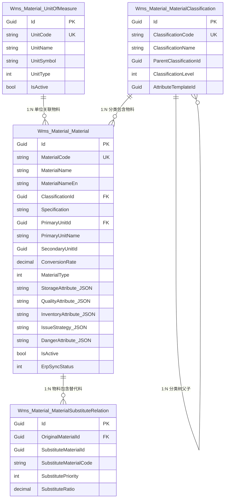

### 1.5 ER Diagram — BC-03 Inventory Context（库存核心）⚠️

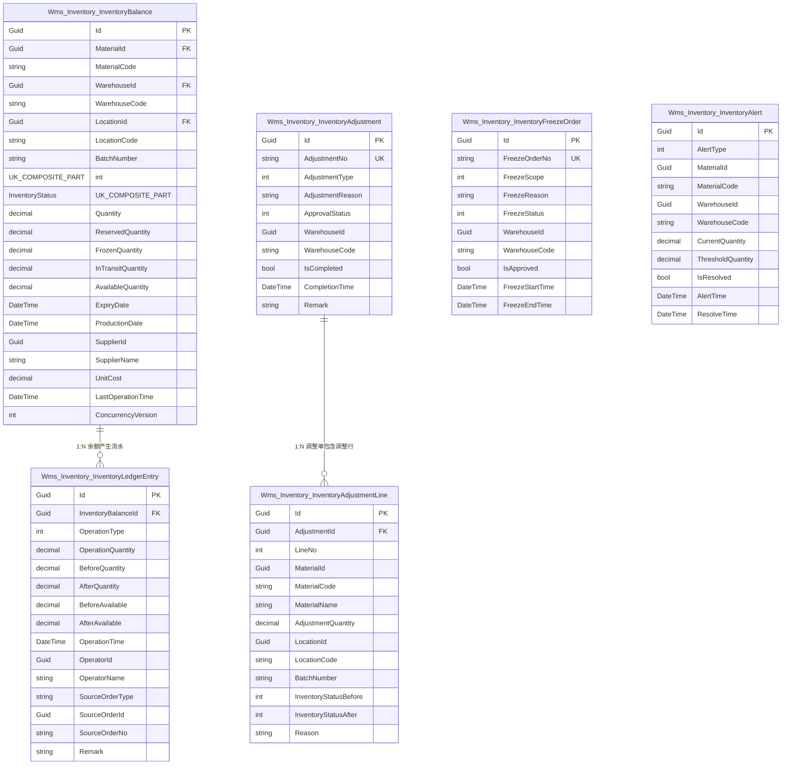

### 1.6 ER Diagram — BC-04 Inbound Context（入库）

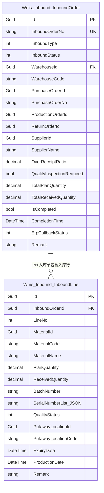

### 1.7 ER Diagram — BC-05 Outbound Context（出库）

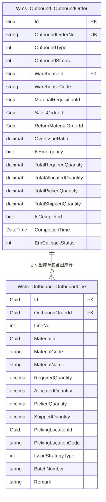

### 1.8 ER Diagram — BC-06 Transfer Context（调拨）

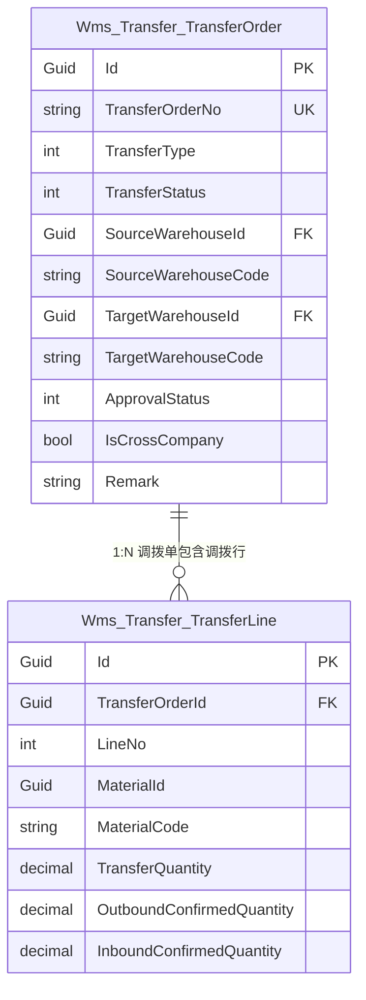

### 1.9 ER Diagram — BC-07 CycleCount Context（盘点）

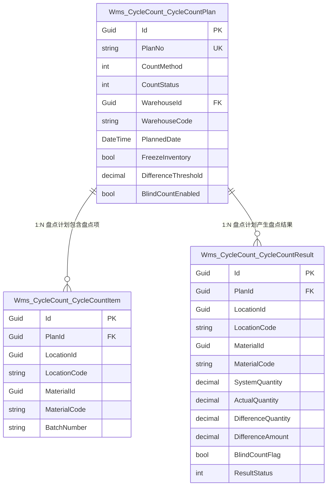

### 1.10 ER Diagram — BC-08 LineSide Context（线边仓）

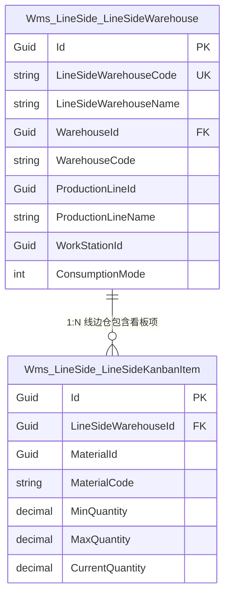

### 1.11 ER Diagram — BC-09 Production Context（生产协同）

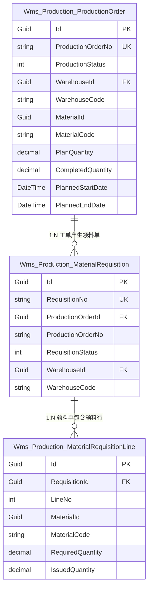

### 1.12 ER Diagram — BC-10 TaskCenter Context（任务中心）

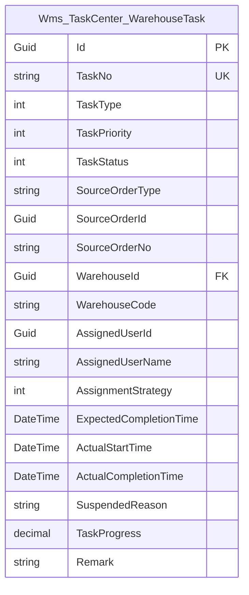

### 1.13 ER Diagram — BC-11 BarcodeLabel Context（条码标签）

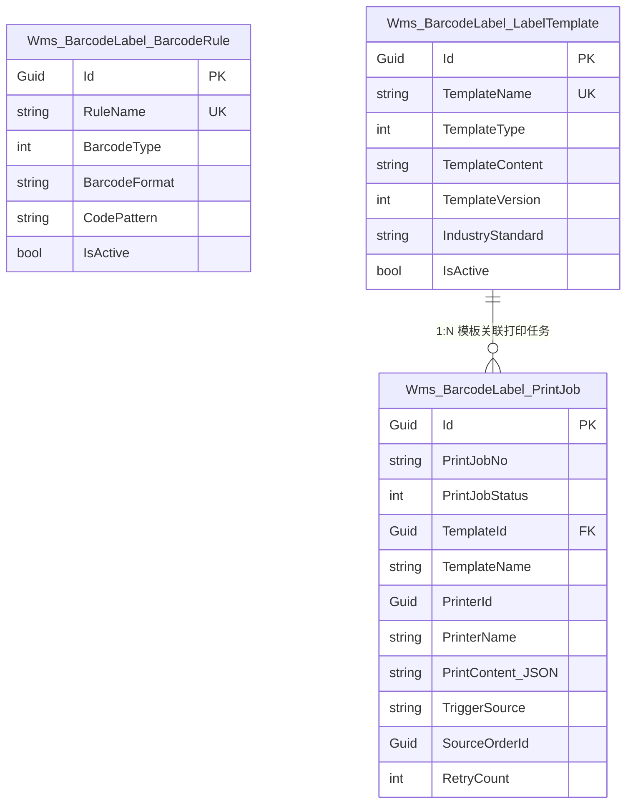

### 1.14 ER Diagram — BC-12 Workflow Context（工作流）

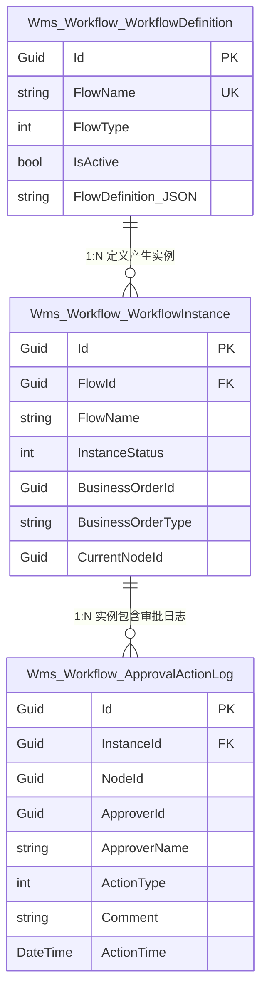

### 1.15 ER Diagram — BC-13 RuleEngine Context（规则引擎）

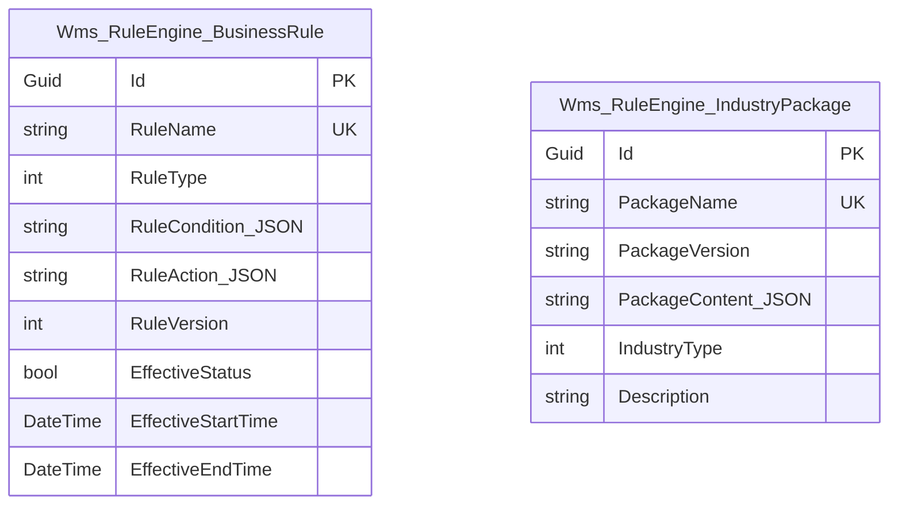

### 1.16 ER Diagram — BC-14 Notification Context（通知）

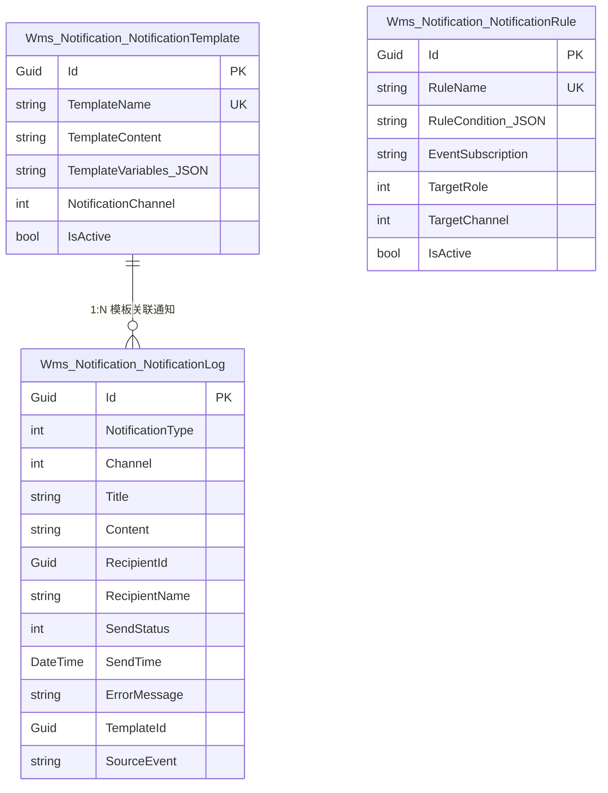

### 1.17 ER Diagram — 跨模块全局关系概览

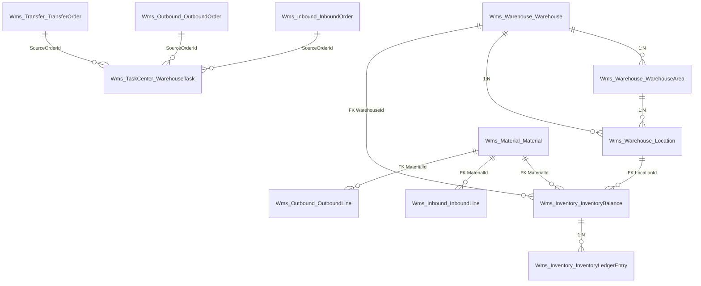

### 1.18 ER Diagram 统计汇总

| BC | 模块名 | 主表数 | 子实体表数 | 总表数 | 关系数 |
|----|--------|--------|-----------|--------|--------|
| BC-01 | Warehouse | 3 | 0 | 3 | 3 |
| BC-02 | Material | 3 | 1 | 4 | 4 |
| BC-03 | Inventory | 4 | 1 | 5 | 3 |
| BC-04 | Inbound | 1 | 1 | 2 | 1 |
| BC-05 | Outbound | 1 | 1 | 2 | 1 |
| BC-06 | Transfer | 1 | 1 | 2 | 1 |
| BC-07 | CycleCount | 1 | 2 | 3 | 2 |
| BC-08 | LineSide | 1 | 1 | 2 | 1 |
| BC-09 | Production | 2 | 1 | 3 | 2 |
| BC-10 | TaskCenter | 1 | 0 | 1 | 0 |
| BC-11 | BarcodeLabel | 3 | 0 | 3 | 1 |
| BC-12 | Workflow | 2 | 1 | 3 | 2 |
| BC-13 | RuleEngine | 2 | 0 | 2 | 0 |
| BC-14 | Notification | 3 | 0 | 3 | 1 |
| **合计** | | **27 主表** | **10 子实体** | **37 表** | **23 关系** |

### 1.19 Assumptions / Risks / Alternatives / Review Items / Future Evolution

| 类别 | 内容 |
|------|------|
| **Assumptions** | InboundLine/OutboundLine 同表存储为子实体而非分表；跨模块外键在应用层保证而非数据库物理外键（软删除兼容）；值对象嵌入主表列或 JSON 列 |
| **Risks** | 物理外键影响软删除查询 → 使用应用层约束；JSON 列查询性能 → SQL Server JSON 索引；同表子实体行数过多 → InboundLine 通常 ≤ 20 |
| **Alternatives** | 子实体分表存储 → 查询需 JOIN 但更灵活；物理外键 → v1.0 不使用（软删除兼容） |
| **Review Items** | 14 个 BC ER 图完整 ✅；37 表覆盖 30 聚合 ✅；关系标注 1:1/1:N/N:N ✅ |
| **Future Evolution** | v2.0 Inventory 独立分库；v1.1 序列号独立表 |

---

## 2. Table Design（表结构设计）

### 2.1 Purpose

为每个聚合/实体设计完整的数据库表结构，包含列定义、主键策略、唯一约束、外键关系和 ABP 审计字段。

### 2.2 Design Principles

1. **命名规范**：`Wms_{Module}_{Entity}`（如 `Wms_Inventory_InventoryBalance`）
2. **GUID 主键**：ABP `FullAuditedAggregateRoot<Guid>` 自动生成
3. **业务编码唯一索引**：如 WarehouseCode, MaterialCode, InboundOrderNo
4. **ABP 审计字段**：CreationTime, CreatorId, LastModificationTime, LastModifierId, IsDeleted, DeleterId, DeletionTime
5. **值对象 → JSON 列**：复杂属性组合 VO 用 JSON 列存储
6. **简单 VO → 同表列**：MaterialCode, WarehouseCode 等简单标识类 VO 用普通列存储
7. **枚举 → int 列**：所有枚举存储为 int

### 2.3 ABP 审计字段标准列（所有聚合根表通用）

| 列名 | 数据类型 | 是否必填 | 默认值 | 业务含义 |
|------|----------|----------|--------|----------|
| CreationTime | datetime2 | Y | — | ABP 创建时间 |
| CreatorId | uniqueidentifier | Y | — | ABP 创建人ID |
| LastModificationTime | datetime2 | N | null | ABP 最后修改时间 |
| LastModifierId | uniqueidentifier | N | null | ABP 最后修改人ID |
| IsDeleted | bit | Y | 0 | ABP 软删除标记 |
| DeleterId | uniqueidentifier | N | null | ABP 删除人ID |
| DeletionTime | datetime2 | N | null | ABP 删除时间 |

> **注意**：InventoryLedgerEntry 无 LastModificationTime/LastModifierId/IsDeleted/DeleterId/DeletionTime（不可修改不可删除）。

### 2.4 P0 核心表 — 完整列定义

#### TAB-001：Wms_Warehouse_Warehouse（仓库）

| 列名 | 数据类型 | 是否必填 | 默认值 | 业务含义 | 备注 |
|------|----------|----------|--------|----------|------|
| Id | uniqueidentifier | Y | NEWID() | 主键 | ABP 自动生成 |
| WarehouseCode | nvarchar(50) | Y | — | 仓库编码 | UK |
| WarehouseName | nvarchar(200) | Y | — | 仓库名称 | |
| WarehouseType | int | Y | — | 仓库类型枚举 | 12种 |
| OrganizationUnitId | uniqueidentifier | Y | — | 组织单元ID | |
| OrganizationUnitName | nvarchar(200) | Y | — | 组织名称冗余 | |
| PlantId | uniqueidentifier | Y | — | 工厂ID | |
| PlantName | nvarchar(100) | Y | — | 工厂名冗余 | |
| ResponsibleUserId | uniqueidentifier | N | null | 负责人ID | |
| ResponsibleUserName | nvarchar(100) | N | null | 负责人名冗余 | |
| Address | nvarchar(500) | N | null | 仓库地址 | |
| StorageConditionType | int | N | 0 | 默认存储条件 | |
| LocationLevelCount | int | Y | 3 | 库位层级数 | 3或4 |
| IsActive | bit | Y | 1 | 是否启用 | |
| Remark | nvarchar(1000) | N | null | 备注 | |
| + ABP审计字段 | | | | | 7列 |

**唯一约束**：UK_WH_WarehouseCode → WarehouseCode  
**检查约束**：CK_WH_LocationLevel → LocationLevelCount IN (3, 4)

#### TAB-002：Wms_Warehouse_WarehouseArea（库区）

| 列名 | 数据类型 | 是否必填 | 默认值 | 业务含义 | 备注 |
|------|----------|----------|--------|----------|------|
| Id | uniqueidentifier | Y | NEWID() | 主键 | |
| AreaCode | nvarchar(50) | Y | — | 库区编码 | UK_COMPOSITE(WarehouseId, AreaCode) |
| AreaName | nvarchar(200) | Y | — | 库区名称 | |
| WarehouseId | uniqueidentifier | Y | — | 所属仓库ID | FK→Warehouse.Id |
| WarehouseCode | nvarchar(50) | Y | — | 仓库编码冗余 | |
| AreaFunction | int | Y | — | 库区功能 | |
| StorageEnvironment | int | N | 0 | 存储环境 | |
| MaxCapacity | decimal(18,4) | N | null | 最大容量 | |
| CurrentCapacity | decimal(18,4) | N | null | 当前容量 | |
| IsActive | bit | Y | 1 | 是否启用 | |
| + ABP审计字段 | | | | | 7列 |

**唯一约束**：UK_WH_AreaCode_Warehouse → (WarehouseId, AreaCode)

#### TAB-003：Wms_Warehouse_Location（库位）

| 列名 | 数据类型 | 是否必填 | 默认值 | 业务含义 | 备注 |
|------|----------|----------|--------|----------|------|
| Id | uniqueidentifier | Y | NEWID() | 主键 | |
| LocationCode | nvarchar(50) | Y | — | 库位编码 | UK，扫码定位 |
| WarehouseId | uniqueidentifier | Y | — | 所属仓库ID | FK→Warehouse.Id |
| WarehouseCode | nvarchar(50) | Y | — | 仓库编码冗余 | |
| AreaId | uniqueidentifier | Y | — | 所属库区ID | FK→WarehouseArea.Id |
| AreaCode | nvarchar(50) | Y | — | 库区编码冗余 | |
| LocationType | int | N | 0 | 库位类型 | |
| MaxWeight | decimal(18,4) | N | null | 最大承重(kg) | |
| MaxCapacity | decimal(18,4) | N | null | 最大容量 | |
| CurrentWeight | decimal(18,4) | N | null | 当前承重 | |
| CurrentCapacity | decimal(18,4) | N | null | 当前容量 | |
| StorageCondition | int | N | 0 | 存储条件 | |
| BarcodeId | nvarchar(100) | Y | — | 条码标识 | |
| Row | nvarchar(10) | N | null | 行号 | |
| Column | nvarchar(10) | N | null | 列号 | |
| Layer | nvarchar(10) | N | null | 层号 | |
| IsActive | bit | Y | 1 | 是否启用 | |
| + ABP审计字段 | | | | | 7列 |

**唯一约束**：UK_WH_LocationCode → LocationCode

#### TAB-004：Wms_Material_Material（物料）

| 列名 | 数据类型 | 是否必填 | 默认值 | 业务含义 | 备注 |
|------|----------|----------|--------|----------|------|
| Id | uniqueidentifier | Y | NEWID() | 主键 | |
| MaterialCode | nvarchar(50) | Y | — | 物料编码 | UK，共享内核VO-04 |
| MaterialName | nvarchar(200) | Y | — | 物料名称 | |
| MaterialNameEn | nvarchar(200) | N | null | 英文名 | 国际化预留 |
| ClassificationId | uniqueidentifier | N | null | 分类ID | FK→MaterialClassification |
| Specification | nvarchar(500) | N | null | 规格描述 | |
| PrimaryUnitId | uniqueidentifier | Y | — | 主计量单位ID | FK→UnitOfMeasure |
| PrimaryUnitName | nvarchar(50) | Y | — | 主单位名冗余 | |
| SecondaryUnitId | uniqueidentifier | N | null | 辅计量单位ID | |
| ConversionRate | decimal(18,6) | N | null | 换算率 | |
| MaterialType | int | Y | — | 物料类型 | 8种 |
| StorageAttribute | nvarchar(max) | Y | — | 仓储属性JSON | VO-11 |
| QualityAttribute | nvarchar(max) | Y | — | 质量属性JSON | VO-12 |
| InventoryAttribute | nvarchar(max) | Y | — | 库存属性JSON | VO-13 |
| IssueStrategy | nvarchar(max) | Y | — | 发料策略JSON | VO-10 |
| DangerAttribute | nvarchar(max) | N | null | 危险品属性JSON | VO-14 |
| IsActive | bit | Y | 1 | 是否启用 | |
| ErpSyncStatus | int | N | 0 | ERP同步状态 | |
| + ABP审计字段 | | | | | 7列 |

**唯一约束**：UK_MT_MaterialCode → MaterialCode

#### TAB-005：Wms_Material_MaterialClassification（物料分类）

| 列名 | 数据类型 | 是否必填 | 默认值 | 业务含义 | 备注 |
|------|----------|----------|--------|----------|------|
| Id | uniqueidentifier | Y | NEWID() | 主键 | |
| ClassificationCode | nvarchar(50) | Y | — | 分类编码 | UK |
| ClassificationName | nvarchar(200) | Y | — | 分类名称 | |
| ParentClassificationId | uniqueidentifier | N | null | 父分类ID | 自引用FK |
| ClassificationLevel | int | Y | 1 | 分类层级 | |
| AttributeTemplateId | uniqueidentifier | N | null | 属性模板ID | |
| + ABP审计字段 | | | | | 7列 |

#### TAB-006：Wms_Material_MaterialSubstituteRelation（替代料关系）

| 列名 | 数据类型 | 是否必填 | 默认值 | 业务含义 | 备注 |
|------|----------|----------|--------|----------|------|
| Id | uniqueidentifier | Y | NEWID() | 主键 | 子实体 |
| OriginalMaterialId | uniqueidentifier | Y | — | 原物料ID | FK→Material.Id |
| SubstituteMaterialId | uniqueidentifier | Y | — | 替代料ID | |
| SubstituteMaterialCode | nvarchar(50) | Y | — | 替代料编码冗余 | |
| SubstitutePriority | int | Y | 1 | 替代优先级 | |
| SubstituteRatio | decimal(18,6) | Y | 1.0 | 替代比例 | |
| + ABP审计字段(子实体) | | | | | 7列 |

**唯一约束**：UK_MT_Substitute_Composite → (OriginalMaterialId, SubstituteMaterialId)

#### TAB-007：Wms_Material_UnitOfMeasure（计量单位）

| 列名 | 数据类型 | 是否必填 | 默认值 | 业务含义 | 备注 |
|------|----------|----------|--------|----------|------|
| Id | uniqueidentifier | Y | NEWID() | 主键 | |
| UnitCode | nvarchar(50) | Y | — | 单位编码 | UK |
| UnitName | nvarchar(100) | Y | — | 单位名称 | |
| UnitSymbol | nvarchar(20) | Y | — | 单位符号 | |
| UnitType | int | Y | — | 单位类型 | |
| IsActive | bit | Y | 1 | 是否启用 | |
| + ABP审计字段 | | | | | 7列 |

#### TAB-008：Wms_Inventory_InventoryBalance（库存余额）⚠️核心表

| 列名 | 数据类型 | 是否必填 | 默认值 | 业务含义 | 备注 |
|------|----------|----------|--------|----------|------|
| Id | uniqueidentifier | Y | NEWID() | 主键 | |
| MaterialId | uniqueidentifier | Y | — | 物料ID | UK_COMPOSITE一部分 |
| MaterialCode | nvarchar(50) | Y | — | 物料编码冗余 | |
| WarehouseId | uniqueidentifier | Y | — | 仓库ID | UK_COMPOSITE一部分 |
| WarehouseCode | nvarchar(50) | Y | — | 仓库编码冗余 | |
| LocationId | uniqueidentifier | Y | — | 库位ID | UK_COMPOSITE一部分 |
| LocationCode | nvarchar(50) | Y | — | 库位编码冗余 | |
| BatchNumber | nvarchar(50) | N | null | 批次号 | UK_COMPOSITE一部分 |
| InventoryStatus | int | Y | 0 | 库存状态 | UK_COMPOSITE一部分 |
| Quantity | decimal(18,4) | Y | 0 | 库存数量 | |
| ReservedQuantity | decimal(18,4) | Y | 0 | 预留数量 | |
| FrozenQuantity | decimal(18,4) | Y | 0 | 冻结数量 | |
| InTransitQuantity | decimal(18,4) | Y | 0 | 在途数量 | |
| AvailableQuantity | decimal(18,4) | Y | 0 | 可用数量 | 计算:Qty-Reserved-Frozen |
| ExpiryDate | datetime2 | N | null | 有效期 | |
| ProductionDate | datetime2 | N | null | 生产日期 | |
| SupplierId | uniqueidentifier | N | null | 供应商ID | |
| SupplierName | nvarchar(100) | N | null | 供应商名冗余 | |
| UnitCost | decimal(18,6) | N | null | 单位成本 | |
| LastOperationTime | datetime2 | Y | — | 最后操作时间 | |
| ConcurrencyVersion | int | Y | 0 | 乐观锁版本号 | EF Core并发控制 |
| + ABP审计字段 | | | | | 7列 |

**⚠️核心唯一约束**：UK_IV_Balance_Composite → (MaterialId, WarehouseId, LocationId, BatchNumber, InventoryStatus)  
**检查约束**：CK_IV_AvailableQty → AvailableQuantity = Quantity - ReservedQuantity - FrozenQuantity

> **关键设计说明**：BatchNumber 为 null 的记录通过唯一索引共存（SQL Server唯一索引将null视为不同值）。

#### TAB-009：Wms_Inventory_InventoryLedgerEntry（库存台账）⚠️不可修改不可删除

| 列名 | 数据类型 | 是否必填 | 默认值 | 业务含义 | 备注 |
|------|----------|----------|--------|----------|------|
| Id | uniqueidentifier | Y | NEWID() | 主键 | |
| InventoryBalanceId | uniqueidentifier | Y | — | 关联余额ID | FK→InventoryBalance.Id |
| OperationType | int | Y | — | 操作类型 | 10种枚举 |
| OperationQuantity | decimal(18,4) | Y | — | 操作数量 | 正增负减 |
| BeforeQuantity | decimal(18,4) | Y | — | 操作前数量 | |
| AfterQuantity | decimal(18,4) | Y | — | 操作后数量 | |
| BeforeAvailable | decimal(18,4) | Y | — | 操作前可用量 | |
| AfterAvailable | decimal(18,4) | Y | — | 操作后可用量 | |
| OperationTime | datetime2 | Y | — | 操作时间 | |
| OperatorId | uniqueidentifier | Y | — | 操作人ID | |
| OperatorName | nvarchar(100) | Y | — | 操作人名冗余 | |
| SourceOrderType | nvarchar(50) | Y | — | 来源单据类型 | |
| SourceOrderId | uniqueidentifier | Y | — | 来源单据ID | |
| SourceOrderNo | nvarchar(50) | Y | — | 来源单据号冗余 | |
| Remark | nvarchar(500) | N | null | 备注 | |
| CreationTime | datetime2 | Y | — | 创建时间 | 仅创建审计 |
| CreatorId | uniqueidentifier | Y | — | 创建人ID | |

> **⚠️ 不可删除不可修改规则**：此表**没有** LastModificationTime/IsDeleted等列。Repository Update/Delete 覆盖为 NotSupportedException。数据库层DENY UPDATE/DELETE权限。

#### TAB-010：Wms_Inventory_InventoryAdjustment（库存调整单）

| 列名 | 数据类型 | 是否必填 | 默认值 | 业务含义 | 备注 |
|------|----------|----------|--------|----------|------|
| Id | uniqueidentifier | Y | NEWID() | 主键 | |
| AdjustmentNo | nvarchar(50) | Y | — | 调整单号 | UK |
| AdjustmentType | int | Y | — | 调整类型 | Gain/Loss/Scrap/Revaluation |
| AdjustmentReason | nvarchar(500) | Y | — | 调整原因 | |
| ApprovalStatus | int | Y | 0 | 审批状态 | |
| WarehouseId | uniqueidentifier | Y | — | 仓库ID | |
| WarehouseCode | nvarchar(50) | Y | — | 仓库编码冗余 | |
| IsCompleted | bit | Y | 0 | 是否完成 | |
| CompletionTime | datetime2 | N | null | 完成时间 | |
| Remark | nvarchar(1000) | N | null | 备注 | |
| + ABP审计字段 | | | | | 7列 |

**子实体 TAB-010a：Wms_Inventory_InventoryAdjustmentLine**：Id, AdjustmentId(FK), LineNo, MaterialId, MaterialCode, MaterialName, AdjustmentQuantity, LocationId, LocationCode, BatchNumber, InventoryStatusBefore, InventoryStatusAfter, Reason

#### TAB-011：Wms_Inventory_InventoryFreezeOrder（库存冻结单）

| 列名 | 数据类型 | 是否必填 | 默认值 | 业务含义 | 备注 |
|------|----------|----------|--------|----------|------|
| Id | uniqueidentifier | Y | NEWID() | 主键 | |
| FreezeOrderNo | nvarchar(50) | Y | — | 冻结单号 | UK |
| FreezeScope | int | Y | — | 冻结范围 | ByBatch/ByMaterial/ByLocation/ByWarehouse |
| FreezeReason | nvarchar(500) | Y | — | 冻结原因 | |
| FreezeStatus | int | Y | 0 | 冻结状态 | Active/Released/Cancelled |
| WarehouseId | uniqueidentifier | Y | — | 仓库ID | |
| WarehouseCode | nvarchar(50) | Y | — | 仓库编码冗余 | |
| IsApproved | bit | Y | 0 | 是否审批通过 | |
| FreezeStartTime | datetime2 | Y | — | 冻结开始时间 | |
| FreezeEndTime | datetime2 | N | null | 冻结结束时间 | |
| + ABP审计字段 | | | | | 7列 |

#### TAB-012：Wms_Inventory_InventoryAlert（库存预警）

| 列名 | 数据类型 | 是否必填 | 默认值 | 业务含义 | 备注 |
|------|----------|----------|--------|----------|------|
| Id | uniqueidentifier | Y | NEWID() | 主键 | |
| AlertType | int | Y | — | 预警类型 | SafetyStock/Expiry/ZeroInventory/Overstock/Age |
| MaterialId | uniqueidentifier | Y | — | 物料ID | |
| MaterialCode | nvarchar(50) | Y | — | 物料编码冗余 | |
| WarehouseId | uniqueidentifier | Y | — | 仓库ID | |
| WarehouseCode | nvarchar(50) | Y | — | 仓库编码冗余 | |
| CurrentQuantity | decimal(18,4) | Y | — | 当前数量 | |
| ThresholdQuantity | decimal(18,4) | Y | — | 阈值数量 | |
| IsResolved | bit | Y | 0 | 是否已解决 | |
| AlertTime | datetime2 | Y | — | 预警时间 | |
| ResolveTime | datetime2 | N | null | 解决时间 | |
| + ABP审计字段 | | | | | 7列 |

#### TAB-013：Wms_Inbound_InboundOrder（入库单）

| 列名 | 数据类型 | 是否必填 | 默认值 | 业务含义 | 备注 |
|------|----------|----------|--------|----------|------|
| Id | uniqueidentifier | Y | NEWID() | 主键 | |
| InboundOrderNo | nvarchar(50) | Y | — | 入库单号 | UK |
| InboundType | int | Y | — | 入库类型 | Purchase/Production/Return |
| InboundStatus | int | Y | 0 | 入库状态 | 状态机 |
| WarehouseId | uniqueidentifier | Y | — | 目标仓库ID | |
| WarehouseCode | nvarchar(50) | Y | — | 仓库编码冗余 | |
| PurchaseOrderId | uniqueidentifier | N | null | 采购订单ID | |
| PurchaseOrderNo | nvarchar(50) | N | null | 采购订单号冗余 | |
| ProductionOrderId | uniqueidentifier | N | null | 生产工单ID | |
| ReturnOrderId | uniqueidentifier | N | null | 退货关联ID | |
| SupplierId | uniqueidentifier | N | null | 供应商ID | |
| SupplierName | nvarchar(100) | N | null | 供应商名冗余 | |
| OverReceiptRatio | decimal(18,4) | Y | 0 | 超收比例 | |
| QualityInspectionRequired | bit | Y | 1 | 是否需要质检 | |
| TotalPlanQuantity | decimal(18,4) | Y | 0 | 计划总数量 | |
| TotalReceivedQuantity | decimal(18,4) | Y | 0 | 实收总数量 | |
| IsCompleted | bit | Y | 0 | 是否完成 | |
| CompletionTime | datetime2 | N | null | 完成时间 | |
| ErpCallbackStatus | int | N | 0 | ERP回传状态 | |
| Remark | nvarchar(1000) | N | null | 备注 | |
| + ABP审计字段 | | | | | 7列 |

**子实体 TAB-013a：Wms_Inbound_InboundLine**：Id, InboundOrderId(FK), LineNo, MaterialId, MaterialCode, MaterialName, PlanQuantity, ReceivedQuantity, BatchNumber, SerialNumberList(nvarchar(max)), QualityStatus, PutawayLocationId, PutawayLocationCode, ExpiryDate, ProductionDate, Remark

#### TAB-014：Wms_Outbound_OutboundOrder（出库单）

| 列名 | 数据类型 | 是否必填 | 默认值 | 业务含义 | 备注 |
|------|----------|----------|--------|----------|------|
| Id | uniqueidentifier | Y | NEWID() | 主键 | |
| OutboundOrderNo | nvarchar(50) | Y | — | 出库单号 | UK |
| OutboundType | int | Y | — | 出库类型 | MaterialRequisition/Sales/ReturnMaterial |
| OutboundStatus | int | Y | 0 | 出库状态 | 状态机 |
| WarehouseId | uniqueidentifier | Y | — | 来源仓库ID | |
| WarehouseCode | nvarchar(50) | Y | — | 仓库编码冗余 | |
| MaterialRequisitionId | uniqueidentifier | N | null | 领料单ID | |
| SalesOrderId | uniqueidentifier | N | null | 销售订单ID | |
| ReturnMaterialOrderId | uniqueidentifier | N | null | 退料关联ID | |
| OverIssueRatio | decimal(18,4) | Y | 0 | 超领比例 | |
| IsEmergency | bit | Y | 0 | 是否紧急 | |
| TotalRequiredQuantity | decimal(18,4) | Y | 0 | 需求总数量 | |
| TotalAllocatedQuantity | decimal(18,4) | Y | 0 | 分配总数量 | |
| TotalPickedQuantity | decimal(18,4) | Y | 0 | 拣货总数量 | |
| TotalShippedQuantity | decimal(18,4) | Y | 0 | 发货总数量 | |
| IsCompleted | bit | Y | 0 | 是否完成 | |
| CompletionTime | datetime2 | N | null | 完成时间 | |
| ErpCallbackStatus | int | N | 0 | ERP回传状态 | |
| + ABP审计字段 | | | | | 7列 |

**子实体 TAB-014a：Wms_Outbound_OutboundLine**：Id, OutboundOrderId(FK), LineNo, MaterialId, MaterialCode, MaterialName, RequiredQuantity, AllocatedQuantity, PickedQuantity, ShippedQuantity, PickingLocationId, PickingLocationCode, IssueStrategyType, BatchNumber, Remark

#### TAB-015：Wms_TaskCenter_WarehouseTask（仓库任务）

| 列名 | 数据类型 | 是否必填 | 默认值 | 业务含义 | 备注 |
|------|----------|----------|--------|----------|------|
| Id | uniqueidentifier | Y | NEWID() | 主键 | |
| TaskNo | nvarchar(50) | Y | — | 任务编号 | UK |
| TaskType | int | Y | — | 任务类型 | 8种 |
| TaskPriority | int | Y | 2 | 任务优先级 | Emergency=4/High=3/Medium=2/Low=1 |
| TaskStatus | int | Y | 0 | 任务状态 | 状态机 |
| SourceOrderType | nvarchar(50) | Y | — | 来源单据类型 | |
| SourceOrderId | uniqueidentifier | Y | — | 来源单据ID | |
| SourceOrderNo | nvarchar(50) | Y | — | 来源单据号冗余 | |
| WarehouseId | uniqueidentifier | Y | — | 仓库ID | |
| WarehouseCode | nvarchar(50) | Y | — | 仓库编码冗余 | |
| AssignedUserId | uniqueidentifier | N | null | 执行人ID | |
| AssignedUserName | nvarchar(100) | N | null | 执行人名冗余 | |
| AssignmentStrategy | int | Y | 0 | 分配策略 | |
| ExpectedCompletionTime | datetime2 | N | null | 预期完成时间 | |
| ActualStartTime | datetime2 | N | null | 实际开始时间 | |
| ActualCompletionTime | datetime2 | N | null | 实际完成时间 | |
| SuspendedReason | nvarchar(500) | N | null | 挂起原因 | |
| TaskProgress | decimal(5,2) | Y | 0 | 完成百分比 | 0~100 |
| Remark | nvarchar(1000) | N | null | 备注 | |
| + ABP审计字段 | | | | | 7列 |

### 2.5 P1 表 — 关键列定义

| TAB-ID | 表名 | 关键列 | UK列 | 说明 |
|--------|------|--------|------|------|
| TAB-016 | Wms_Transfer_TransferOrder | TransferOrderNo(UK), TransferType, TransferStatus, SourceWarehouseId/Code, TargetWarehouseId/Code, ApprovalStatus, IsCrossCompany | TransferOrderNo | +子实体TransferLine |
| TAB-017 | Wms_CycleCount_CycleCountPlan | PlanNo(UK), CountMethod, CountStatus, WarehouseId/Code, PlannedDate, FreezeInventory, DifferenceThreshold, BlindCountEnabled | PlanNo | +子实体CycleCountItem |
| TAB-018 | Wms_CycleCount_CycleCountResult | PlanId(FK), LocationId/Code, MaterialId/Code, SystemQty, ActualQty, DifferenceQty, DifferenceAmount, BlindCountFlag, ResultStatus | — | |
| TAB-019 | Wms_LineSide_LineSideWarehouse | LineSideWarehouseCode(UK), Name, WarehouseId/Code, ProductionLineId/Name, WorkStationId, ConsumptionMode | LineSideWarehouseCode | +子实体KanbanItem |
| TAB-020 | Wms_Production_ProductionOrder | ProductionOrderNo(UK), ProductionStatus, WarehouseId/Code, MaterialId/Code, PlanQty, CompletedQty | ProductionOrderNo | |
| TAB-021 | Wms_Production_MaterialRequisition | RequisitionNo(UK), ProductionOrderId/No, RequisitionStatus, WarehouseId/Code | RequisitionNo | +子实体RequisitionLine |
| TAB-022 | Wms_BarcodeLabel_BarcodeRule | RuleName(UK), BarcodeType, BarcodeFormat, CodePattern, IsActive | RuleName | |
| TAB-023 | Wms_BarcodeLabel_LabelTemplate | TemplateName(UK), TemplateType, TemplateContent(nvarchar(max)), TemplateVersion, IndustryStandard | TemplateName | |
| TAB-024 | Wms_BarcodeLabel_PrintJob | PrintJobNo, PrintJobStatus, TemplateId/Name, PrinterId/Name, PrintContent_JSON, TriggerSource, SourceOrderId, RetryCount | — | |

### 2.6 P2 表 — 概要设计

| TAB-ID | 表名 | 关键列概要 |
|--------|------|-----------|
| TAB-025 | Wms_Workflow_WorkflowDefinition | Id, FlowName(UK), FlowType, IsActive, FlowDefinition_JSON |
| TAB-026 | Wms_Workflow_WorkflowInstance | Id, FlowId(FK), InstanceStatus, BusinessOrderId, BusinessOrderType, CurrentNodeId |
| TAB-027 | Wms_Workflow_ApprovalActionLog | Id, InstanceId(FK), NodeId, ApproverId/Name, ActionType, Comment, ActionTime |
| TAB-028 | Wms_RuleEngine_BusinessRule | Id, RuleName(UK), RuleType, RuleCondition_JSON, RuleAction_JSON, RuleVersion, EffectiveStatus |
| TAB-029 | Wms_RuleEngine_IndustryPackage | Id, PackageName(UK), PackageVersion, PackageContent_JSON, IndustryType |
| TAB-030 | Wms_Notification_NotificationTemplate | Id, TemplateName(UK), TemplateContent, TemplateVariables_JSON, NotificationChannel |
| TAB-031 | Wms_Notification_NotificationLog | Id, NotificationType, Channel, Title, Content, RecipientId/Name, SendStatus, SendTime, TemplateId |
| TAB-032 | Wms_Notification_NotificationRule | Id, RuleName(UK), RuleCondition_JSON, EventSubscription, TargetRole, TargetChannel |

### 2.7 值对象存储策略表

| VO-ID | 值对象名 | 存储策略 | 说明 |
|-------|----------|----------|------|
| VO-01 | Quantity | 同表列（拆分） | Quantity/UnitId/UnitName |
| VO-02 | WarehouseCode | 同表列 | 标识类VO直接列 |
| VO-03 | LocationCode | 同表列 | 标识类VO直接列 |
| VO-04 | MaterialCode | 同表列 | 共享内核VO |
| VO-05 | BatchNumber | 同表列 | 标识类VO |
| VO-06 | SerialNumber | JSON列 | List<string> |
| VO-07 | ExpiryDate | 同表列（拆分） | ExpiryDate+AlertDays |
| VO-08 | InventoryStatus | 同表列 | 枚举int |
| VO-09 | TaskPriority | 同表列 | 枚举int |
| VO-10 | IssueStrategy | JSON列 | 属性组合VO |
| VO-11 | StorageAttribute | JSON列 | 属性组合VO |
| VO-12 | QualityAttribute | JSON列 | 属性组合VO |
| VO-13 | InventoryAttribute | JSON列 | 属性组合VO |
| VO-14 | DangerAttribute | JSON列 | 属性组合VO |
| VO-15 | KanbanParameter | 同表列（拆分） | Min/Max/LeadTime |
| VO-16 | OrganizationUnit | 同表列（拆分） | UnitId/UnitName |
| VO-17 | PutawayStrategy | JSON列 | 属性组合VO |

### 2.8 表统计汇总

| 类别 | 表数 |
|------|------|
| P0 核心表（含子实体） | 19 |
| P1 表（含子实体） | 14 |
| P2 表（含子实体） | 9 |
| **总表数** | **42** |

### 2.9 Assumptions / Risks / Alternatives / Review Items / Future Evolution

| 类别 | 内容 |
|------|------|
| **Assumptions** | JSON列用于复杂VO存储；子实体同表而非分表；枚举存int；GUID主键 |
| **Risks** | JSON列查询性能 → SQL Server JSON索引优化；冗余字段不一致 → EventHandler同步 |
| **Alternatives** | 子实体分表 → 查询需JOIN；复杂VO独立表 → 增加表数量 |
| **Review Items** | P0表15+列定义完整 ✅；唯一约束覆盖 ✅；值对象存储策略明确 ✅ |
| **Future Evolution** | v1.1 序列号独立表；v2.0 Inventory独立库；v1.1 JSON→Owned Entity部分迁移 |

---

## 3. Index Strategy（索引策略）

### 3.1 Purpose

为每张核心表设计索引方案，查询场景→索引映射、覆盖索引、唯一索引和索引命名规范。

### 3.2 Design Principles

1. **命名规范**：IDX_{Module}_{Table}_{Columns}（查询）；UK_{Module}_{Table}_{Columns}（唯一）
2. **查询场景驱动**：每个索引对应高频查询
3. **覆盖索引优先**：高频查询设计覆盖索引
4. **ABP软删除兼容**：索引包含 IsDeleted=0 过滤条件

### 3.3 核心表索引设计

#### TAB-008：Wms_Inventory_InventoryBalance ⚠️最核心索引

| 紺引ID | 紺索引名 | 紺索引列 | INCLUDE列 | 类型 | 查询场景 |
|--------|--------|--------|----------|------|----------|
| IDX-001 | UK_IV_Balance_Composite | MaterialId,WarehouseId,LocationId,BatchNumber,InventoryStatus | — | UNIQUE | 精确查找余额 |
| IDX-002 | IDX_IV_Balance_MaterialWarehouse | MaterialId,WarehouseId,InventoryStatus | AvailableQuantity,Quantity,ReservedQuantity,FrozenQuantity | NON-CLUSTERED | 按物料+仓库查可用量(覆盖) |
| IDX-003 | IDX_IV_Balance_Warehouse | WarehouseId,InventoryStatus | MaterialId,MaterialCode,AvailableQuantity | NON-CLUSTERED | 按仓库+状态查库存 |
| IDX-004 | IDX_IV_Balance_MaterialStatus | MaterialId,InventoryStatus | WarehouseId,LocationCode,AvailableQuantity | NON-CLUSTERED | 安全库存预警扫描 |
| IDX-005 | IDX_IV_Balance_Expiry | ExpiryDate | MaterialId,MaterialCode,WarehouseId,BatchNumber | NON-CLUSTERED | 临期预警 |
| IDX-006 | IDX_IV_Balance_Batch | BatchNumber | MaterialId,WarehouseId,InventoryStatus,Quantity | NON-CLUSTERED | 按批次号查询 |
| IDX-007 | IDX_IV_Balance_LastOpTime | LastOperationTime | — | NON-CLUSTERED | 最近操作排序 |

> **IDX-001 是最核心索引**，5字段复合唯一索引确保余额唯一性。IDX-002是覆盖索引避免回表。所有索引加 HasFilter("[IsDeleted] = 0")。

#### TAB-009：InventoryLedgerEntry索引

| 紺引ID | 紺索引名 | 紺索引列 | 类型 | 查询场景 |
|--------|--------|--------|------|----------|
| IDX-008 | IDX_IV_Ledger_BalanceId | InventoryBalanceId | NON-CLUSTERED | 查余额流水 |
| IDX-009 | IDX_IV_Ledger_SourceOrder | SourceOrderType,SourceOrderId | NON-CLUSTERED | 查单据流水 |
| IDX-010 | IDX_IV_Ledger_TimeRange | OperationTime DESC | NON-CLUSTERED | 按时间范围 |
| IDX-011 | IDX_IV_Ledger_MaterialTime | MaterialId,OperationTime DESC | NON-CLUSTERED | 查物料时间段 |

#### TAB-013：InboundOrder索引

| 紺引ID | 紺索引名 | 紺索引列 | 类型 | 查询场景 |
|--------|--------|--------|------|----------|
| IDX-012 | UK_IN_InboundOrderNo | InboundOrderNo | UNIQUE | 精确查找 |
| IDX-013 | IDX_IN_Order_WarehouseStatus | WarehouseId,InboundStatus | NON-CLUSTERED | 按仓库+状态 |
| IDX-014 | IDX_IN_Order_TypeStatus | InboundType,InboundStatus | NON-CLUSTERED | 按类型+状态 |
| IDX-015 | IDX_IN_Order_CreationTime | CreationTime DESC | NON-CLUSTERED | 按时间排序 |

#### TAB-014：OutboundOrder索引

| 紺引ID | 紺索引名 | 紺索引列 | 类型 | 查询场景 |
|--------|--------|--------|------|----------|
| IDX-016 | UK_OB_OutboundOrderNo | OutboundOrderNo | UNIQUE | 精确查找 |
| IDX-017 | IDX_OB_Order_WarehouseStatus | WarehouseId,OutboundStatus | NON-CLUSTERED | 按仓库+状态 |
| IDX-018 | IDX_OB_Order_Emergency | IsEmergency,OutboundStatus | NON-CLUSTERED | 紧急出库 |

#### TAB-015：WarehouseTask索引

| 紺引ID | 紺索引名 | 紺索引列 | 类型 | 查询场景 |
|--------|--------|--------|------|----------|
| IDX-019 | UK_TC_TaskNo | TaskNo | UNIQUE | 精确查找 |
| IDX-020 | IDX_TC_Task_WarehouseStatus | WarehouseId,TaskStatus | NON-CLUSTERED | 按仓库+状态 |
| IDX-021 | IDX_TC_Task_AssignedUser | AssignedUserId,TaskStatus | NON-CLUSTERED | 查某人任务 |
| IDX-022 | IDX_TC_Task_SourceOrder | SourceOrderType,SourceOrderId | NON-CLUSTERED | 查单据任务 |
| IDX-023 | IDX_TC_Task_Priority | TaskPriority DESC,TaskStatus | NON-CLUSTERED | 按优先级排序 |
| IDX-024 | IDX_TC_Task_ExpectedTime | ExpectedCompletionTime,TaskStatus | NON-CLUSTERED | 超时预警扫描 |

#### TAB-004：Material索引

| 紺引ID | 紺索引名 | 紺索引列 | 类型 | 查询场景 |
|--------|--------|--------|------|----------|
| IDX-025 | UK_MT_MaterialCode | MaterialCode | UNIQUE | 精确查找 |
| IDX-026 | IDX_MT_Material_Classification | ClassificationId | NON-CLUSTERED | 按分类 |
| IDX-027 | IDX_MT_Material_Type | MaterialType | NON-CLUSTERED | 按类型 |
| IDX-028 | IDX_MT_Material_Name | MaterialName | NON-CLUSTERED | 名称搜索 |

### 3.4 P1/P2表索引概要

| 表 | 关键索引 |
|----|----------|
| TransferOrder | UK_TF_TransferOrderNo; IDX_TF_Status; IDX_TF_SourceWarehouse |
| CycleCountPlan | UK_CC_PlanNo; IDX_CC_Status; IDX_CC_Warehouse |
| LineSideWarehouse | UK_LS_Code; IDX_LS_ProductionLine |
| ProductionOrder | UK_PD_OrderNo; IDX_PD_Status |
| BarcodeRule | UK_BL_RuleName; IDX_BL_Type |
| NotificationLog | IDX_NT_Recipient; IDX_NT_Status; IDX_NT_Time (分区表) |

### 3.5 索引维护策略

| 维护项 | 策略 | 编号 |
|--------|------|------|
| 索引重建 | 月度：碎片>30% ONLINE REBUILD | IDX-MAINT-001 |
| 索引重组 | 周度：碎片10%~30% REORGANIZE | IDX-MAINT-002 |
| 碎片监控 | 日度：sys.dm_db_index_physical_stats | IDX-MAINT-003 |
| 未使用清理 | 季度：sys.dm_db_index_usage_stats 分析 | IDX-MAINT-004 |
| 统计信息更新 | 日度核心表；周度全库 | IDX-MAINT-005 |

### 3.6 读写分离预留索引策略

| 阶段 | 策略 |
|------|------|
| v1.0 | 写库精简索引，保证INSERT性能 |
| v1.1 | 只读副本增加覆盖索引 |
| v2.0 | 分库后独立索引设计 |

### 3.7 Assumptions / Risks / Alternatives / Review Items / Future Evolution

| 类别 | 内容 |
|------|------|
| **Assumptions** | SQL Server 2019+支持过滤索引和JSON索引 |
| **Risks** | 索引过多影响写入 → v1.0精简索引；覆盖索引占空间 → 监控 |
| **Alternatives** | 不用覆盖索引 → 回表多；不用过滤索引 → 预警全表扫描 |
| **Review Items** | InventoryBalance 7索引覆盖所有查询 ✅；唯一索引覆盖所有业务自然键 ✅ |
| **Future Evolution** | v1.1只读副本覆盖索引；v1.1 Redis缓存减少索引依赖 |

---

## 4. Partition Strategy（分区策略）

### 4.1 Purpose

为大数据量表设计 SQL Server 表分区方案。

### 4.2 需分区的大表清单

| 表名 | 预估月增量 | 分区键 | 编号 |
|------|-----------|--------|------|
| InventoryLedgerEntry | 50万~100万/月 | OperationTime | PART-001 |
| NotificationLog | 10万~30万/月 | CreationTime | PART-002 |

### 4.3 PART-001：InventoryLedgerEntry 按月分区

```sql
CREATE PARTITION FUNCTION PF_IV_Ledger_Monthly (datetime2)
AS RANGE RIGHT FOR VALUES (
    '2025-08-01','2025-09-01','2025-10-01','2025-11-01','2025-12-01',
    '2026-01-01','2026-02-01','2026-03-01','2026-04-01','2026-05-01',
    '2026-06-01','2026-07-01'
);

CREATE PARTITION SCHEME PS_IV_Ledger_Monthly
AS PARTITION PF_IV_Ledger_Monthly ALL TO ([PRIMARY]);
```

### 4.4 PART-002：NotificationLog 按月分区

```sql
CREATE PARTITION FUNCTION PF_NT_Log_Monthly (datetime2)
AS RANGE RIGHT FOR VALUES (
    '2025-08-01','2025-09-01',... ,'2026-07-01'
);

CREATE PARTITION SCHEME PS_NT_Log_Monthly
AS PARTITION PF_NT_Log_Monthly ALL TO ([PRIMARY]);
```

### 4.5 分区维护策略

| 维护项 | 策略 | 编号 | 频率 |
|--------|------|------|------|
| 添加新分区 | ALTER PARTITION SPLIT RANGE | PART-MAINT-001 | 每月1日 |
| 归档旧分区 | SWITCH OUT + MERGE RANGE | PART-MAINT-002 | 每季度 |
| 归档策略 | 12个月在线查询；超12月归档 | PART-MAINT-003 | — |

### 4.6 滑动窗口示例脚本

```sql
-- 每月：添加下月分区
ALTER PARTITION FUNCTION PF_IV_Ledger_Monthly()
SPLIT RANGE (DATEADD(MONTH, 13, '2025-08-01'));

-- 每季度：归档旧分区
-- 1. 创建临时表（同结构）
-- 2. SWITCH PARTITION 1 TO 临时表
-- 3. MERGE RANGE 旧边界
-- 4. INSERT INTO Archive表
-- 5. DROP 临时表
```

### 4.7 Assumptions / Risks / Alternatives / Review Items / Future Evolution

| 类别 | 内容 |
|------|------|
| **Assumptions** | v1.0单文件组分区；月增量基于≤100用户 |
| **Risks** | 分区维护脚本失败 → 手动回滚；分区切换锁表 → 低峰期执行 |
| **Alternatives** | 不分区 → 大表查询退化；按年分区 → 粒度太粗 |
| **Review Items** | Ledger和Notification分区设计 ✅；滑动窗口脚本 ✅ |
| **Future Evolution** | v2.0多文件组分区优化I/O；v2.0 Inventory独立库 |

---

## 5. Data Integrity Rules（数据完整性规则）

### 5.1 实体完整性（主键约束）

| 规则 | 实现 | 编号 |
|------|------|------|
| 所有表 GUID 主键 | EF Core NEWID() | DI-001 |
| 主键不可修改 | EF Core 配置 | DI-002 |

### 5.2 引用完整性（外键约束 vs 软删除兼容）

> **关键决策 DI-003**：v1.0 **不使用数据库物理外键**，使用应用层逻辑外键。

**理由**：
1. ABP 软删除导致物理外键引用冲突
2. Modular Monolith 单库但跨模块外键增加耦合
3. 应用层保证引用一致性

| 引用类型 | 应用层保证方式 | 编号 |
|----------|---------------|------|
| 跨聚合ID引用 | Repository查询前校验 | DI-004 |
| 冗余Name/Code | EventHandler同步更新 | DI-005 |
| 子实体→父实体 | EF Core Navigation + 应用层校验 | DI-006 |

### 5.3 业务完整性（唯一约束和检查约束）

| 规则 | 约束类型 | 实现方式 | 编号 |
|------|----------|----------|------|
| WarehouseCode唯一 | 唯一索引 | UK_WH_WarehouseCode | DI-007 |
| MaterialCode唯一 | 唯一索引 | UK_MT_MaterialCode | DI-008 |
| InventoryBalance复合唯一 | 唯一索引 | UK_IV_Balance_Composite | DI-009 |
| InboundOrderNo唯一 | 唯一索引 | UK_IN_InboundOrderNo | DI-010 |
| LocationLevelCount∈{3,4} | 检查约束 | CK_WH_LocationLevel | DI-011 |
| AvailableQty计算 | 应用层校验 | ApplyQuantityChange() | DI-012 |

### 5.4 库存台账不可删除的三层保障

| 层级 | 实现方式 | 说明 |
|------|----------|------|
| **L1-Repository层** | Update/Delete方法覆盖为NotSupportedException | 应用层强制 |
| **L2-EF Core层** | 不继承FullAuditedAggregateRoot，仅有CreationTime/CreatorId | EF Core层无修改/删除能力 |
| **L3-数据库层** | DENY UPDATE, DELETE ON InventoryLedgerEntry TO Wms_AppRole | 数据库层最底层保障 |

```sql
DENY UPDATE, DELETE ON Wms_Inventory_InventoryLedgerEntry TO Wms_AppRole;
GRANT SELECT, INSERT ON Wms_Inventory_InventoryLedgerEntry TO Wms_AppRole;
```

### 5.5 并发控制策略

| 场景 | 并发控制方式 | 编号 |
|------|-------------|------|
| InventoryBalance更新 | **乐观锁(ConcurrencyVersion)** + Polly重试3次 | DI-013 |
| 单据状态机流转 | ABP ConcurrencyStamp | DI-014 |
| 批量盘点 | 无并发（冻结期间单线程） | DI-015 |

```csharp
// 乐观锁实现
public class InventoryBalance : FullAuditedAggregateRoot<Guid>
{
    [ConcurrencyCheck]
    public int ConcurrencyVersion { get; set; }
    
    public void ApplyQuantityChange(...)
    {
        // 业务校验...
        Quantity += quantity;
        AvailableQuantity = Quantity - ReservedQuantity - FrozenQuantity;
        ConcurrencyVersion++;
    }
}

// Polly 重试策略配置
services.AddPollyRetry<InventoryAppService>(maxRetries: 3, retryInterval: 100ms);
```

### 5.6 Assumptions / Risks / Alternatives / Review Items / Future Evolution

| 类别 | 内容 |
|------|------|
| **Assumptions** | v1.0不使用物理外键；乐观锁满足≤100用户并发 |
| **Risks** | 物理外键缺失→应用层校验+EventHandler同步；乐观锁冲突频繁→Polly重试 |
| **Alternatives** | 物理外键→软删除兼容需额外处理；悲观锁→性能差 |
| **Review Items** | 唯一约束完整 ✅；InventoryLedger三层不可删除 ✅；乐观锁+Polly重试 ✅ |
| **Future Evolution** | v2.0分库后恢复物理外键；v1.1 Redis分布式锁 |

---

## 6. EF Core Mapping（EF Core 映射）

### 6.1 DbContext 设计

v1.0 单库场景，所有模块表注册在统一 `WmsDbContext` 中。

```csharp
[ReplaceService(typeof(IModelCacheKeyProvider))]
public class WmsDbContext : AbpDbContext<WmsDbContext>
{
    // BC-01 Warehouse
    public DbSet<Warehouse> Warehouses { get; set; }
    public DbSet<WarehouseArea> WarehouseAreas { get; set; }
    public DbSet<Location> Locations { get; set; }
    
    // BC-02 Material
    public DbSet<Material> Materials { get; set; }
    public DbSet<MaterialClassification> MaterialClassifications { get; set; }
    public DbSet<MaterialSubstituteRelation> MaterialSubstituteRelations { get; set; }
    public DbSet<UnitOfMeasure> UnitOfMeasures { get; set; }
    
    // BC-03 Inventory ⚠️
    public DbSet<InventoryBalance> InventoryBalances { get; set; }
    public DbSet<InventoryLedgerEntry> InventoryLedgerEntries { get; set; }
    public DbSet<InventoryAdjustment> InventoryAdjustments { get; set; }
    public DbSet<InventoryAdjustmentLine> InventoryAdjustmentLines { get; set; }
    public DbSet<InventoryFreezeOrder> InventoryFreezeOrders { get; set; }
    public DbSet<InventoryAlert> InventoryAlerts { get; set; }
    
    // BC-04~BC-14 所有模块 DbSet...
    
    protected override void OnModelCreating(ModelBuilder builder)
    {
        base.OnModelCreating(builder);
        builder.ApplyConfiguration(new InventoryBalanceEfCoreConfiguration());
        builder.ApplyConfiguration(new InventoryLedgerEfCoreConfiguration());
        builder.ApplyConfiguration(new MaterialEfCoreConfiguration());
        builder.ApplyConfiguration(new InboundOrderEfCoreConfiguration());
        // ... 所有 Configuration
    }
}
```

### 6.2 InventoryBalance EfCore Configuration（核心）

```csharp
public class InventoryBalanceEfCoreConfiguration : IEntityTypeConfiguration<InventoryBalance>
{
    public void Configure(EntityTypeBuilder<InventoryBalance> builder)
    {
        builder.ToTable("Wms_Inventory_InventoryBalance");
        builder.HasKey(e => e.Id);
        
        // ⚠️核心复合唯一索引
        builder.HasIndex(e => new { e.MaterialId, e.WarehouseId, e.LocationId, 
            e.BatchNumber, e.InventoryStatus })
            .IsUnique()
            .HasFilter("[IsDeleted] = 0")
            .HasName("UK_IV_Balance_Composite");
        
        // 覆盖索引
        builder.HasIndex(e => new { e.MaterialId, e.WarehouseId, e.InventoryStatus })
            .HasFilter("[IsDeleted] = 0")
            .HasName("IDX_IV_Balance_MaterialWarehouse");
        
        // 属性配置
        builder.Property(e => e.Quantity).HasColumnType("decimal(18,4)");
        builder.Property(e => e.ConcurrencyVersion).IsConcurrencyToken();
        // ... 所有列配置
    }
}
```

### 6.3 InventoryLedger Configuration（不可修改删除）

```csharp
public class InventoryLedgerEfCoreConfiguration : IEntityTypeConfiguration<InventoryLedgerEntry>
{
    public void Configure(EntityTypeBuilder<InventoryLedgerEntry> builder)
    {
        builder.ToTable("Wms_Inventory_InventoryLedgerEntry");
        builder.HasKey(e => e.Id);
        // 索引配置...
        // ⚠️此实体不继承FullAuditedAggregateRoot，仅有CreationTime/CreatorId
        // 无LastModificationTime/IsDeleted等字段
        // Repository Update/Delete 覆盖为 NotSupportedException
    }
}
```

### 6.4 Material Configuration（JSON列值对象映射）

```csharp
public class MaterialEfCoreConfiguration : IEntityTypeConfiguration<Material>
{
    public void Configure(EntityTypeBuilder<Material> builder)
    {
        builder.ToTable("Wms_Material_Material");
        // UK索引...
        
        // JSON列值对象映射
        builder.Property(e => e.StorageAttribute)
            .HasColumnType("nvarchar(max)")
            .HasConversion(
                vo => JsonSerializer.Serialize(vo, JsonOptions.Default),
                json => JsonSerializer.Deserialize<StorageAttribute>(json, JsonOptions.Default));
        
        builder.Property(e => e.QualityAttribute)
            .HasColumnType("nvarchar(max)")
            .HasConversion(/*同上*/);
        
        builder.Property(e => e.InventoryAttribute)
            .HasColumnType("nvarchar(max)")
            .HasConversion(/*同上*/);
        
        // 子实体导航
        builder.HasMany(e => e.SubstituteRelations)
            .WithOne().HasForeignKey(sr => sr.OriginalMaterialId)
            .OnDelete(DeleteBehavior.Cascade);
    }
}
```

### 6.5 InboundOrder Configuration（子实体同表存储）

```csharp
public class InboundOrderEfCoreConfiguration : IEntityTypeConfiguration<InboundOrder>
{
    public void Configure(EntityTypeBuilder<InboundOrder> builder)
    {
        builder.ToTable("Wms_Inbound_InboundOrder");
        // UK索引...
        
        builder.OwnsMany(e => e.Lines, lineBuilder =>
        {
            lineBuilder.ToTable("Wms_Inbound_InboundLine");
            lineBuilder.WithOwner().HasForeignKey(l => l.InboundOrderId);
            lineBuilder.HasKey(l => l.Id);
            lineBuilder.HasIndex(l => new { l.InboundOrderId, l.LineNo }).IsUnique();
            // 属性配置...
        });
    }
}
```

### 6.6 查询过滤器（ABP软删除+多租户预留）

```csharp
// ABP 软删除全局过滤器（内置）
// 所有 FullAuditedAggregateRoot 自动有 SoftDelete Filter

// 可选：多租户过滤器（v2.0启用）
builder.Entity<Warehouse>().HasQueryFilter(e => !e.IsDeleted);
builder.Entity<InventoryBalance>().HasQueryFilter(e => !e.IsDeleted);
// InventoryLedgerEntry 无软删除过滤器
```

### 6.7 CQRS 读写分离 EF Core 实现

| 层级 | 实现方式 | 编号 |
|------|----------|------|
| 写侧 | Domain Repository + UnitOfWork + Tracking | EFC-001 |
| 读侧 | QueryService + AsNoTracking() + Select()投影 | EFC-002 |
| v1.0 | 同库同 DbContext | EFC-003 |
| v2.0预留 | 读侧独立 DbContext + 只读副本连接 | EFC-004 |

### 6.8 Assumptions / Risks / Alternatives / Review Items / Future Evolution

| 类别 | 内容 |
|------|------|
| **Assumptions** | v1.0统一WmsDbContext；Fluent API配置；JSON列值对象映射 |
| **Risks** | JSON列映射兼容性 → EF Core 7+ JSON原生支持；OwnsMany子实体 → EF Core 6+默认分表 |
| **Alternatives** | 每Module独立DbContext → v1.0增加迁移复杂度 |
| **Review Items** | DbSet注册37表 ✅；Fluent API配置完整 ✅；JSON VO映射 ✅ |
| **Future Evolution** | v2.0分库DbContext；v1.1 EF Core 8 JSON列原生映射 |

---

## 7. Migration Strategy（迁移策略）

### 7.1 迁移管理策略

| 策略 | 说明 | 编号 |
|------|------|------|
| v1.0统一迁移 | 所有模块在WmsDbContext统一管理 | MIG-001 |
| 迁移命名 | {Module}_{Description}_{Timestamp} | MIG-002 |
| 迁移工具 | ABP DbMigrator CLI | MIG-003 |

### 7.2 迁移顺序（按依赖关系）

| 步骤 | 模块 | 表 | 原因 |
|------|------|-----|------|
| 1 | Warehouse | Warehouse, WarehouseArea, Location | 基础主数据 |
| 2 | Material | Material, Classification, UnitOfMeasure, SubstituteRelation | 主数据 |
| 3 | Inventory | Balance, Ledger, Adjustment, FreezeOrder, Alert | 核心 |
| 4 | Inbound | InboundOrder + InboundLine | 引用Warehouse,Material |
| 5 | Outbound | OutboundOrder + OutboundLine | 引用 |
| 6 | TaskCenter | WarehouseTask | 引用所有单据 |
| 7~15 | Transfer, CycleCount, LineSide, Production, BarcodeLabel, Workflow, RuleEngine, Notification | 各模块表 | 按依赖 |

### 7.3 数据种子策略

| 种子类别 | 内容 | 编号 |
|----------|------|------|
| 计量单位 | 20+基础单位 | MIG-004 |
| 条码规则 | 物料码/库位码/托盘码基础规则 | MIG-005 |
| 标签模板 | 入库/出库基础模板 | MIG-006 |
| 通知规则 | 安全库存预警/临期预警 | MIG-007 |
| ABP权限 | 14模块权限定义 | MIG-008 |
| Demo数据 | 示例仓库+物料+库存（仅开发环境） | MIG-009 |

### 7.4 生产环境迁移安全策略

| 安全项 | 策略 | 编号 |
|--------|------|------|
| 迁移前备份 | FULL BACKUP DATABASE | MIG-010 |
| 迁移测试 | staging环境先执行 | MIG-011 |
| 零停机 | SQL Server ONLINE操作 | MIG-012 |
| 迁移窗口 | 低峰期(凌晨2:00~5:00) | MIG-013 |
| 回滚准备 | 预准备SQL回滚脚本 | MIG-014 |

### 7.5 迁移回滚策略

| 方式 | 说明 | 编号 |
|------|------|------|
| EF Core Down方法 | 每个Migration的Down | MIG-015 |
| 手动SQL回滚 | 预准备脚本 | MIG-016 |
| 数据库恢复 | FULL BACKUP→RESTORE | MIG-017 |

### 7.6 Assumptions / Risks / Alternatives / Review Items / Future Evolution

| 类别 | 内容 |
|------|------|
| **Assumptions** | v1.0统一WmsDbContext迁移；ABP DbMigrator可用 |
| **Risks** | 迁移失败→RESTORE备份；大表分区锁表→低峰期 |
| **Alternatives** | 每Module独立迁移→v2.0分库后采用 |
| **Review Items** | 迁移顺序15步 ✅；数据种子 ✅；零停机 ✅；回滚 ✅ |

---

## 8. Performance Optimization（性能优化）

### 8.1 查询优化策略

| 优化项 | 策略 | 编号 |
|--------|------|------|
| 延迟加载禁用 | UseLazyLoadingProxies(false) | PERF-001 |
| N+1消除 | Select()投影 + AsNoTracking() | PERF-002 |
| 批量插入 | BulkInsertAsync() | PERF-003 |
| 批量更新 | BulkUpdateAsync() | PERF-004 |
| 分页查询 | Skip/Take + Count | PERF-005 |
| 列裁剪 | DTO投影仅查需要的列 | PERF-006 |

### 8.2 缓存策略

| 缓存层 | 对象 | 策略 | TTL | 编号 |
|--------|------|------|-----|------|
| v1.0内存缓存 | 物料主数据 | IMemoryCache | 30min | PERF-007 |
| v1.0内存缓存 | 仓库/库区/库位 | IMemoryCache | 30min | PERF-008 |
| v1.1 Redis缓存 | 库存余额 | IDistributedCache | 5min+滑动 | PERF-009 |
| v1.1 Redis缓存 | 可用量汇总 | IDistributedCache | 1min+滑动 | PERF-010 |

### 8.3 库存余额高频更新性能方案

| 优化项 | 策略 | 编号 |
|--------|------|------|
| 乐观锁重试 | Polly重试3次100ms间隔 | PERF-011 |
| 批量流水插入 | BulkInsertAsync | PERF-012 |
| 精确查找走唯一索引 | IDX-001 | PERF-013 |
| 覆盖索引避免回表 | IDX-002 | PERF-014 |
| 连接池配置 | Max=100 Min=10 | PERF-015 |
| 事务短快 | UnitOfWork尽量短 | PERF-016 |

### 8.4 大数据量场景优化

| 场景 | 优化 | 编号 |
|------|------|------|
| 库存台账查询 | 分区表+时间索引+AsNoTracking | PERF-017 |
| 盘点导出 | 分页+ClosedXML流式 | PERF-018 |
| 物料搜索 | 全文索引FULLTEXT | PERF-019 |

### 8.5 数据库连接池配置

| 配置项 | 值 | 编号 |
|--------|-----|------|
| Max Pool Size | 100 | PERF-020 |
| Min Pool Size | 10 | PERF-021 |
| Connection Timeout | 30秒 | PERF-022 |
| Command Timeout | 30秒(默认)/120秒(报表) | PERF-023 |

### 8.6 读写分离架构预留

| 阶段 | 架构 | 编号 |
|------|------|------|
| v1.0 | 单库读写 | PERF-024 |
| v1.1 | 主写从读（双连接字符串） | PERF-025 |
| v2.0 | InventoryDb独立+读写分离 | PERF-026 |

### 8.7 Assumptions / Risks / Alternatives / Review Items / Future Evolution

| 类别 | 内容 |
|------|------|
| **Assumptions** | v1.0内存缓存满足主数据查询；≤100用户乐观锁足够 |
| **Risks** | 高频更新瓶颈 → 乐观锁+覆盖索引+连接池 |
| **Alternatives** | 悲观锁→性能差；NoSQL库存缓存→事务一致性弱 |
| **Review Items** | N+1消除 ✅；缓存策略 ✅；连接池 ✅；读写分离预留 ✅ |

---

## 9. Review Checklist（评审检查清单）

### 9.1 Phase 5 交付物完整性评审项

| 评审项 | 评审标准 | 状态 |
|--------|----------|------|
| ER Diagram | 14个模块ER图完整；关系标注1:1/1:N/N:N | ✅ |
| P0表设计 | 15+张核心表完整列定义；唯一约束；ABP审计字段 | ✅ |
| P1/P2表设计 | P1关键列定义；P2概要设计 | ✅ |
| 值对象存储策略 | 17个VO存储策略明确 | ✅ |
| 索引策略 | InventoryBalance 7+索引；核心表索引覆盖高频查询 | ✅ |
| 分区策略 | Ledger+Notification分区设计；滑动窗口脚本 | ✅ |
| 数据完整性 | 唯一约束完整；InventoryLedger三层不可删除；乐观锁 | ✅ |
| EF Core映射 | DbContext 37+DbSet；Fluent API配置；JSON VO映射 | ✅ |
| 迁移策略 | 迁移顺序15步；数据种子；零停机；回滚 | ✅ |
| 性能优化 | N+1消除；缓存策略；连接池；读写分离预留 | ✅ |
| 编号规范 | TAB/IDX/PART/DI/EFC/MIG/PERF编号体系 | ✅ |

### 9.2 跨阶段一致性检查 — Phase 3 DDD → Phase 5 Database

| 检查项 | 评审标准 | 状态 |
|--------|----------|------|
| 聚合→表映射 | 30个聚合→37+张表 | ✅ |
| 实体→列映射 | P0 20个实体属性完整映射 | ✅ |
| 值对象→存储映射 | 17个VO有明确存储策略 | ✅ |
| 复合唯一键 | InventoryBalance (MaterialId,WarehouseId,LocationId,BatchNumber,InventoryStatus) | ✅ |
| 子实体存储 | InboundLine/OutboundLine同表(OwnsMany) | ✅ |
| InventoryLedger不可删除 | 三层保障(L1/L2/L3) | ✅ |

### 9.3 跨阶段一致性检查 — Phase 4 Architecture → Phase 5 Database

| 检查项 | 评审标准 | 状态 |
|--------|----------|------|
| 14 BC → 14 Module → 14 ER图 | ✅ | ✅ |
| 模块命名 Wms.{Module}.{Layer} | 表命名 Wms_{Module}_{Entity} | ✅ |
| 模块独立 DbContext | v1.0 统一 WmsDbContext | ✅ |
| ABP审计字段 FullAuditedAggregateRoot | 所有聚合根表7列审计字段 | ✅ |
| EF Core Fluent API | 不用Data Annotation | ✅ |
| CQRS同库读写分离接口 | AsNoTracking读侧 | ✅ |

### 9.4 数据库设计可行性检查项

| 检查项 | 评审标准 | 状态 |
|--------|----------|------|
| SQL Server 2019+可行性 | 分区函数/JSON索引/过滤索引均支持 | ✅ |
| 索引数量合理性 | InventoryBalance 7索引；总索引≤100 | ✅ |
| 分区表数量合理性 | 2张大表分区；其余不分区 | ✅ |
| JSON列查询性能 | SQL Server JSON_VALUE+索引 | ✅ |
| 并发控制可行性 | 乐观锁+Polly重试≤100用户 | ✅ |
| 零停机迁移可行性 | SQL Server ONLINE ALTER | ✅ |

### 9.5 Phase 5 → Phase 6 输入项映射

| Phase 5 产出 | Phase 6 输入 | 用途 |
|--------------|-------------|------|
| 表结构设计(TAB-xxx) | EF Core Entity类 + EfCoreConfiguration类 | 代码实现 |
| 索引策略(IDX-xxx) | EfCoreConfiguration HasIndex方法 | 索引配置 |
| 唯一约束(UK-xxx) | EfCoreConfiguration IsUnique方法 | 唯一约束配置 |
| 值对象存储策略 | MaterialEfCoreConfiguration JSON列映射 | VO映射代码 |
| DbContext设计 | WmsDbContext.cs | DbContext类 |
| 子实体配置 | OwnsMany/OwnsOne配置 | 子实体映射 |
| 迁移顺序 | 初始Migration脚本 | 数据库创建 |
| 数据种子 | IDataSeeder实现 | 种子数据 |
| 并发控制 | ConcurrencyVersion属性 | 乐观锁代码 |
| InventoryLedger不可删除 | Repository NotSupportedException覆盖 | 不可删除代码 |

### 9.6 关键数据库统计摘要

| 统计维度 | 数量 |
|----------|------|
| ER图 | 14 (每BC一张) + 1全局概览 |
| 数据表 | 42 (含子实体表) |
| 核心索引 | 28 (P0表) |
| 分区表 | 2 (Ledger + NotificationLog) |
| 唯一约束 | 15+ (所有业务自然键) |
| 值对象存储策略 | 17 (VO-01~VO-17) |
| EF Core Configuration类 | 15+ (所有聚合根) |
| 数据种子 | 6类 |
| 性能优化项 | 26 (PERF-001~PERF-026) |
| **编号总计** | **~150** |

---

## 附录

### A. 数据库统计摘要

| 模块 | 表数 | 索引数 | UK数 |
|------|------|--------|------|
| Warehouse | 3 | 4 | 3 |
| Material | 4 | 5 | 3 |
| Inventory | 5 | 8 | 2 |
| Inbound | 2 | 4 | 1 |
| Outbound | 2 | 4 | 1 |
| Transfer | 2 | 3 | 1 |
| CycleCount | 3 | 3 | 1 |
| LineSide | 2 | 2 | 1 |
| Production | 3 | 3 | 2 |
| TaskCenter | 1 | 6 | 1 |
| BarcodeLabel | 3 | 3 | 2 |
| Workflow | 3 | 3 | 1 |
| RuleEngine | 2 | 2 | 2 |
| Notification | 3 | 3 | 1 |
| **合计** | **42** | **~50** | **~20** |

### B. Phase 5 → Phase 6 输入项完整映射表

（见 Section 9.5）

---

> **文档结束** — Phase 5 Database Design v1.0  
> **下一步**: Phase 6 — API Design & Code Implementation  
