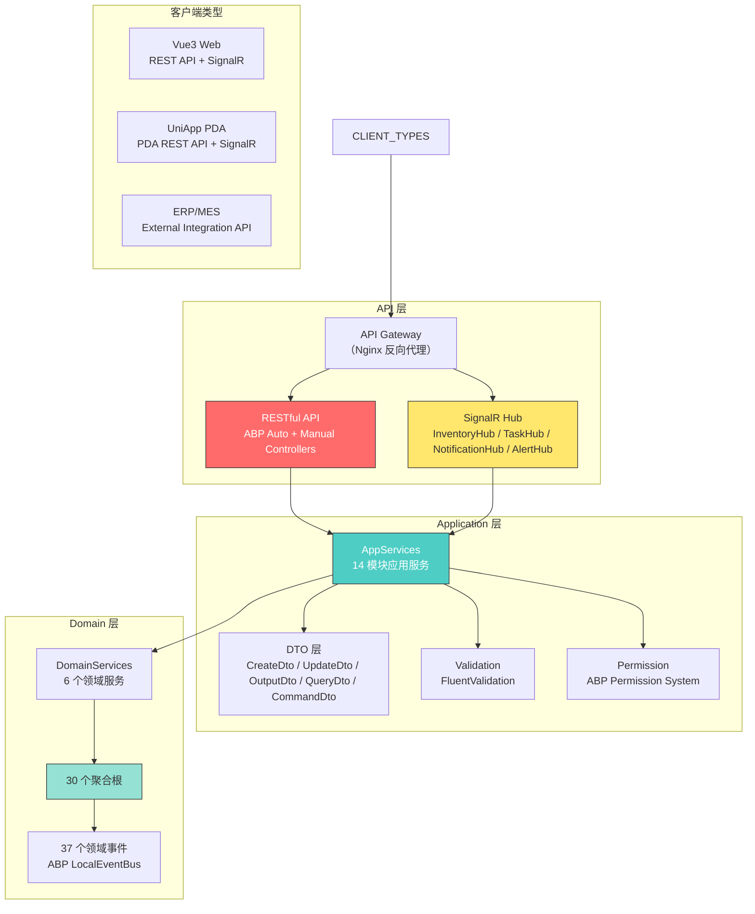
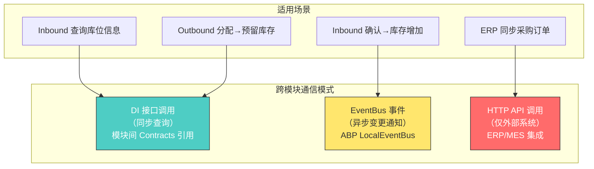
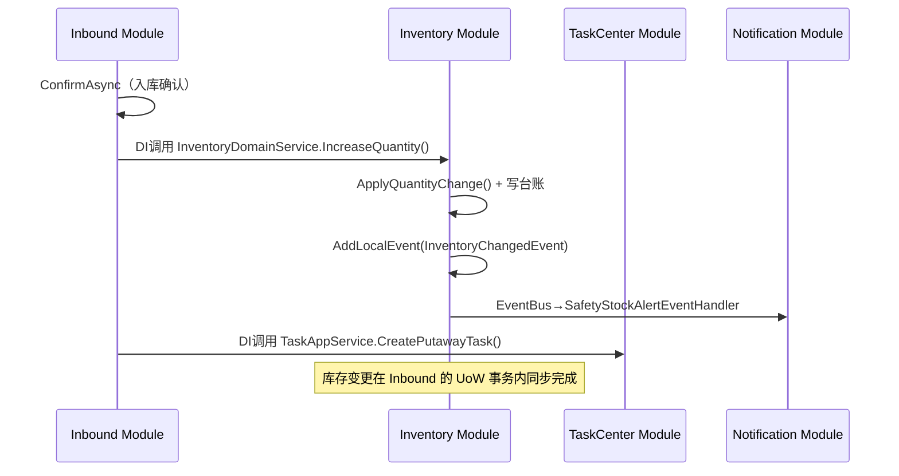

# Phase 6: Manufacturing WMS Platform — API 设计

> **文档版本**: v1.0  
> **撰写日期**: 2025-07  
> **撰写人**: 架构师 高见远（Gao）  
> **阶段**: Phase 6 — API Design（API 设计）  
> **项目**: Manufacturing WMS Platform（可复用制造业仓储管理平台）  
> **前置输入**: Phase 3 DDD Domain Design + Phase 4 Architecture Design + Phase 5 Database Design

---

## 文档说明

| 项目 | 内容 |
|------|------|
| **Purpose（目的）** | 基于 Phase 3 DDD 领域模型（14 BC / 30 AGG / 37 DE）、Phase 4 架构设计（14 ABP Module / 5 层结构）和 Phase 5 数据库设计（42 表 / 28 索引），设计完整的 RESTful API + SignalR 实时推送 + PDA 专用 + 外部集成 API 规范，为 Phase 7 代码实现提供 API 层蓝图 |
| **Scope（范围）** | 14 个模块完整 REST API 定义；DTO 分层体系；请求响应模型；错误处理规范；认证授权策略；版本控制；跨模块协作；SignalR Hub 设计；PDA API；外部集成 API；Swagger 规范 |
| **Design Principles（设计原则）** | 1. **RESTful 优先**：遵循 REST 规范，资源化 URL，HTTP 方法语义化；2. **模块边界隔离**：每个 BC 对应一个 API Controller Group，跨模块通过 DI 接口/EventBus 而非直接 HTTP；3. **DTO 扁平冗余**：跨聚合引用使用 ID + Name/Code 冗余策略减少查询复杂度；4. **CQRS 读写分离接口**：写侧 Tracking + Command DTO，读侧 AsNoTracking + Select 投影 + Query DTO；5. **幂等性保障**：关键业务操作（入库确认、出库发货、库存调整）需幂等设计 |
| **Assumptions（假设）** | 1. ABP Auto API Controller 为基础，手动补充业务操作 API；2. v1.0 单进程 ABP LocalEventBus，v2.0 RabbitMQ；3. JWT 为主要认证方式；4. SQL Server 单库，同库读写分离接口 |
| **Risks（风险）** | 1. API 数量庞大（~200+）需确保命名一致性；2. Inventory API 是核心下游，调用链路复杂；3. PDA API 需兼顾简化与功能完整性；4. SignalR 连接管理在高并发下需性能优化 |
| **Alternatives（替代方案）** | 1. GraphQL 替代部分复杂查询 API（v2.0 评估）；2. gRPC 替代 ERP/MES 集成 API（v2.0 评估）；3. 全部手动 Controller（当前选择 ABP Auto API + 手动补充） |
| **Review Items（评审项）** | 见 Section 13 |
| **Future Evolution（未来演进）** | v1.1 GraphQL 读侧 API；v2.0 gRPC 外部集成；v2.0 API Gateway 统一入口 |

---

## 目录

1. [API Architecture（API 架构概述）](#1-api-architectureapi-架构概述)
2. [REST API Specification（REST API 接口定义）](#2-rest-api-specificationrest-api-接口定义)
3. [DTO Definitions（DTO 定义）](#3-dto-definitionsdto-定义)
4. [Request/Response Models（请求响应模型）](#4-requestresponse-models请求响应模型)
5. [Error Handling（错误处理规范）](#5-error-handling错误处理规范)
6. [Authentication & Authorization（认证授权策略）](#6-authentication--authorization认证授权策略)
7. [API Versioning（API 版本控制）](#7-api-versioningapi-版本控制)
8. [Cross-Module API Coordination（跨模块 API 协作）](#8-cross-module-api-coordination跨模块-api-协作)
9. [SignalR Real-time API（SignalR 实时通信 API）](#9-signalr-real-time-apisignalr-实时通信-api)
10. [PDA API（PDA 专用 API）](#10-pda-apipda-专用-api)
11. [External Integration API（外部集成 API）](#11-external-integration-api外部集成-api)
12. [Swagger/OpenAPI Specification（Swagger/OpenAPI 规范）](#12-swaggeropenapi-specificationswaggeropenapi-规范)
13. [Review Checklist（评审检查清单）](#13-review-checklist评审检查清单)

---

## 1. API Architecture（API 架构概述）

### 1.1 Purpose

定义 API 总体架构策略、14 个模块的 API 边界划分、命名规范、版本控制策略和统一响应格式，为后续各模块 API 详细设计提供架构基础。

### 1.2 Design Principles

1. **RESTful 资源化**：URL 以资源为中心，HTTP 方法表达操作语义
2. **模块隔离**：每个 BC → 独立 Controller Group，URL 路径以模块名分隔
3. **命名一致性**：全平台统一的 URL、方法名、DTO 类名命名规范
4. **读写分离接口**：CQRS 在 API 层体现为查询 API（GET）和命令 API（POST/PUT/PATCH）

### 1.3 API 总体架构策略

#### API-ARCH-001：RESTful + SignalR 双通道架构



| 通道 | 协议 | 适用场景 | 说明 |
|------|------|----------|------|
| RESTful API | HTTPS REST | 所有 CRUD + 业务操作 | 主要通道 |
| SignalR Hub | WebSocket | 实时推送（库存变更/任务分配/预警/通知） | 辅助通道 |

### 1.4 14 个模块的 API 边界划分

#### API-ARCH-002：BC → API Controller Group 映射

| BC-ID | BC 名称 | Controller Group | URL 前缀 | ABP Module | 说明 |
|-------|---------|-----------------|----------|-----------|------|
| BC-01 | Warehouse | WarehouseController, WarehouseAreaController, LocationController | `/api/v1/warehouse` | Wms.Warehouse.HttpApi | 仓库/库区/库位 CRUD + 状态管理 |
| BC-02 | Material | MaterialController, MaterialClassificationController, UnitOfMeasureController | `/api/v1/material` | Wms.Material.HttpApi | 物料 CRUD + 分类 + 单位 + 替代料 |
| BC-03 | Inventory | InventoryBalanceController, InventoryLedgerController, InventoryAdjustmentController, InventoryFreezeController, InventoryAlertController | `/api/v1/inventory` | Wms.Inventory.HttpApi | ⚠️ 库存核心：查询+余额+台账+调整+冻结+预警 |
| BC-04 | Inbound | InboundOrderController | `/api/v1/inbound` | Wms.Inbound.HttpApi | 入库单 CRUD + 状态流转 |
| BC-05 | Outbound | OutboundOrderController | `/api/v1/outbound` | Wms.Outbound.HttpApi | 出库单 CRUD + 状态流转 |
| BC-06 | Transfer | TransferOrderController | `/api/v1/transfer` | Wms.Transfer.HttpApi | 调拨单 CRUD + 审批 |
| BC-07 | CycleCount | CycleCountPlanController | `/api/v1/cycle-count` | Wms.CycleCount.HttpApi | 盘点计划 CRUD + 执行 |
| BC-08 | LineSide | LineSideWarehouseController | `/api/v1/line-side` | Wms.LineSide.HttpApi | 线边仓 + 看板 + 补料 |
| BC-09 | Production | ProductionOrderController, MaterialRequisitionController | `/api/v1/production` | Wms.Production.HttpApi | 工单 + 领料单 |
| BC-10 | TaskCenter | WarehouseTaskController | `/api/v1/task-center` | Wms.TaskCenter.HttpApi | 任务 CRUD + 分配 + 异常处理 |
| BC-11 | BarcodeLabel | BarcodeRuleController, LabelTemplateController, PrintJobController | `/api/v1/barcode-label` | Wms.BarcodeLabel.HttpApi | 条码规则 + 标签模板 + 打印 |
| BC-12 | Workflow | WorkflowDefinitionController, WorkflowInstanceController | `/api/v1/workflow` | Wms.Workflow.HttpApi | 审批流定义 + 审批实例 |
| BC-13 | RuleEngine | BusinessRuleController, IndustryPackageController | `/api/v1/rule-engine` | Wms.RuleEngine.HttpApi | 业务规则 + 行业包 |
| BC-14 | Notification | NotificationTemplateController, NotificationLogController, NotificationRuleController | `/api/v1/notification` | Wms.Notification.HttpApi | 通知模板 + 日志 + 规则 |

### 1.5 API 命名规范

#### API-ARCH-003：URL 路径命名规范

| 规则 | 示例 | 说明 |
|------|------|------|
| 模块前缀 | `/api/v1/warehouse` | 与 BC 名称对应 |
| 资源名称用复数 | `/api/v1/warehouse/warehouses` | RESTful 约定 |
| 子资源路径 | `/api/v1/warehouse/warehouses/{id}/areas` | 仓库下的库区 |
| 业务操作路径 | `/api/v1/inbound/orders/{id}/confirm` | 动词路径用于非 CRUD 操作 |
| 查询路径 | `/api/v1/inventory/balances?materialCode=M001` | Query String 过滤 |

#### API-ARCH-004：方法名命名规范

| 操作类型 | Controller 方法名 | AppService 方法名 | 说明 |
|----------|-------------------|-------------------|------|
| 获取列表 | `GetListAsync` | `GetListAsync` | 分页查询 |
| 获取单个 | `GetAsync` | `GetAsync` | 按 ID 查询 |
| 创建 | `CreateAsync` | `CreateAsync` | POST |
| 更新 | `UpdateAsync` | `UpdateAsync` | PUT |
| 删除 | `DeleteAsync` | `DeleteAsync` | DELETE |
| 业务操作 | `ConfirmAsync`, `AllocateAsync`, `FreezeAsync` | 同名 | 非 CRUD 操作 |

#### API-ARCH-005：DTO 类名命名规范

| DTO 类型 | 命名格式 | 示例 | 说明 |
|----------|----------|------|------|
| CreateDto | `{Entity}CreateDto` | `WarehouseCreateDto` | 创建请求 |
| UpdateDto | `{Entity}UpdateDto` | `WarehouseUpdateDto` | 更新请求 |
| OutputDto | `{Entity}OutputDto` | `WarehouseOutputDto` | 查询响应 |
| QueryDto | `{Entity}QueryDto` | `WarehouseQueryDto` | 查询条件 |
| CommandDto | `{Operation}CommandDto` | `InboundConfirmCommandDto` | 业务操作请求 |
| PdaDto | `{Entity}PdaOutputDto` | `WarehouseTaskPdaOutputDto` | PDA 精简版响应 |

### 1.6 API 版本控制策略

#### API-ARCH-006：URL Path 版本控制

| 策略 | 说明 | 编号 |
|------|------|------|
| **URL Path 版本** | `/api/v1/...`, `/api/v2/...` | VER-001 |
| 当前版本 | v1 | VER-002 |
| 版本升级 | 仅在破坏性变更时升级版本号 | VER-003 |
| 多版本共存 | v1 和 v2 可同时运行至少 6 个月 | VER-004 |

**选择理由**：URL 版本直观、易于调试、Swagger 分组清晰、ABP API Versioning 包原生支持。

### 1.7 统一响应格式规范

#### API-ARCH-007：统一响应格式

**成功响应（单个对象）**：

```json
{
  "code": 200,
  "data": { ... },
  "message": "success"
}
```

**成功响应（分页列表）**：

```json
{
  "code": 200,
  "data": {
    "items": [ ... ],
    "totalCount": 100
  },
  "message": "success"
}
```

**错误响应**：

```json
{
  "code": 400,
  "message": "业务异常描述",
  "details": "详细错误信息",
  "errorCode": "IV-001",
  "validationErrors": null
}
```

| 响应类型 | 格式 | 编号 |
|----------|------|------|
| 单对象成功 | `WmsResultDto<T>` | RESP-001 |
| 分页列表成功 | `WmsPagedResultDto<T>` | RESP-002 |
| 错误响应 | `WmsErrorDto` | RESP-003 |
| 批量操作响应 | `WmsBatchResultDto<T>` | RESP-004 |

### 1.8 Assumptions

| 假设 | 说明 |
|------|------|
| ABP Auto API 生成基础 CRUD Controller | 减少手动编写 |
| 业务操作 API 手动补充 | 状态流转/分配/冻结等 |
| v1.0 所有 API 在同一 Host | 单进程 Modular Monolith |
| JWT 为主要认证方式 | Cookie 模式用于 Web SPA |

### 1.9 Risks

| 风险 | 应对 | 编号 |
|------|------|------|
| API 数量过多难以维护 | Swagger 分组 + API 版本管理 | API-R01 |
| Inventory API 被过多模块调用 | DI 接口 + EventBus 减少直接 HTTP 调用 | API-R02 |
| SignalR 连接数过多 | 按仓库分组 + 连接池管理 | API-R03 |
| PDA API 与 Web API 不一致 | PDA API 独立设计 + 共享 DTO 基类 | API-R04 |

### 1.10 Alternatives

| 替代方案 | 优劣 | 编号 |
|----------|------|------|
| GraphQL 替代复杂查询 | ✅ 灵活查询；❌ v1.0 过度设计 | API-A01 |
| 全部手动 Controller | ✅ 完全控制；❌ 代码量巨大 | API-A02 |
| Header 版本控制 | ✅ URL 干净；❌ 不直观、Swagger 分组复杂 | API-A03 |

### 1.11 Review Items

| 评审项 | 标准 |
|--------|------|
| 14 个 BC → 14 Controller Group 映射完整 | ✅ |
| 命名规范覆盖 URL/方法名/DTO | ✅ |
| 版本控制策略明确 | URL Path v1 |
| 统一响应格式定义完整 | 4 种响应格式 |

### 1.12 Future Evolution

| 演进方向 | 时间线 | 内容 |
|----------|--------|------|
| GraphQL 读侧 API | v1.1 | 复杂查询场景 |
| API Gateway | v2.0 | Ocelot/YARP 统一入口 |
| gRPC 外部集成 | v2.0 | ERP/MES 高性能调用 |
| API 限流 | v1.1 | Redis + Rate Limiting |

---

## 2. REST API Specification（REST API 接口定义）

### 2.1 Purpose

为每个模块设计完整的 REST API 接口规范，包括 HTTP Method、URL Path、请求/响应 DTO、权限要求。

### 2.2 Design Principles

1. **CRUD 标准化**：每个核心实体提供标准 CRUD 5 个 API
2. **业务操作动词化**：非 CRUD 操作使用 `/actions/{operation}` 或 `/orders/{id}/confirm` 路径
3. **CQRS 读写分离**：GET 查询用 AsNoTracking + Select 投影，POST/PUT 命令用 Tracking + UoW
4. **权限标注**：每个 API 明确标注 ABP Permission

### 2.3 P0 核心模块 API — Warehouse Module（仓库主数据）

#### 2.3.1 WarehouseController — 仓库 CRUD + 状态管理

| API-ID | HTTP Method | URL Path | 说明 | 权限 |
|--------|-------------|----------|------|------|
| API-WH-001 | GET | `/api/v1/warehouse/warehouses` | 获取仓库列表（分页） | Wms.Warehouse.Read |
| API-WH-002 | GET | `/api/v1/warehouse/warehouses/{id}` | 获取单个仓库 | Wms.Warehouse.Read |
| API-WH-003 | POST | `/api/v1/warehouse/warehouses` | 创建仓库 | Wms.Warehouse.Create |
| API-WH-004 | PUT | `/api/v1/warehouse/warehouses/{id}` | 更新仓库 | Wms.Warehouse.Update |
| API-WH-005 | DELETE | `/api/v1/warehouse/warehouses/{id}` | 删除仓库（软删除） | Wms.Warehouse.Delete |
| API-WH-006 | PATCH | `/api/v1/warehouse/warehouses/{id}/activate` | 启用仓库 | Wms.Warehouse.Update |
| API-WH-007 | PATCH | `/api/v1/warehouse/warehouses/{id}/deactivate` | 停用仓库 | Wms.Warehouse.Update |
| API-WH-008 | GET | `/api/v1/warehouse/warehouses/by-code/{code}` | 按编码查询仓库 | Wms.Warehouse.Read |
| API-WH-009 | GET | `/api/v1/warehouse/warehouses/{id}/areas` | 获取仓库下属库区 | Wms.Warehouse.Read |
| API-WH-010 | GET | `/api/v1/warehouse/warehouses/{id}/locations` | 获取仓库下属库位 | Wms.Warehouse.Read |
| API-WH-011 | GET | `/api/v1/warehouse/warehouses/all` | 获取所有仓库（不分页，用于选择器） | Wms.Warehouse.Read |

**API-WH-001 请求参数**：

| 参数 | 类型 | 来源 | 必填 | 说明 |
|------|------|------|------|------|
| pageIndex | int | Query | Y | 页码（默认 0） |
| pageSize | int | Query | Y | 每页数量（默认 10，最大 100） |
| sorting | string | Query | N | 排序字段（如 `warehouseCode ASC`） |
| warehouseCode | string | Query | N | 仓库编码过滤 |
| warehouseName | string | Query | N | 仓库名称模糊搜索 |
| warehouseType | int | Query | N | 仓库类型过滤 |
| isActive | bool | Query | N | 启用状态过滤 |
| organizationUnitId | Guid | Query | N | 组织单元过滤 |

**API-WH-003 请求 DTO**（WarehouseCreateDto）：

| 属性名 | 类型 | 必填 | 验证规则 | 说明 |
|--------|------|------|----------|------|
| WarehouseCode | string | Y | MaxLength(50), 正则 `^[A-Z0-9_-]+$` | 仓库编码 |
| WarehouseName | string | Y | MaxLength(200), NotEmpty | 仓库名称 |
| WarehouseType | int | Y | Range(0, 12) | 仓库类型枚举 |
| OrganizationUnitId | Guid | Y | NotEmpty | 组织单元ID |
| OrganizationUnitName | string | Y | MaxLength(200) | 组织名称 |
| PlantId | Guid | Y | NotEmpty | 工厂ID |
| PlantName | string | Y | MaxLength(100) | 工厂名 |
| ResponsibleUserId | Guid? | N | — | 负责人ID |
| ResponsibleUserName | string? | N | MaxLength(100) | 负责人名 |
| Address | string? | N | MaxLength(500) | 仓库地址 |
| StorageConditionType | int | N | Default(0) | 存储条件 |
| LocationLevelCount | int | Y | Range(3, 4) | 层级数 |
| IsActive | bool | Y | Default(true) | 启用状态 |
| Remark | string? | N | MaxLength(1000) | 备注 |

**API-WH-002 响应 DTO**（WarehouseOutputDto）：

| 属性名 | 类型 | 说明 |
|--------|------|------|
| Id | Guid | 主键 |
| WarehouseCode | string | 仓库编码 |
| WarehouseName | string | 仓库名称 |
| WarehouseType | int | 仓库类型 |
| OrganizationUnitId | Guid | 组织ID |
| OrganizationUnitName | string | 组织名冗余 |
| PlantId | Guid | 工厂ID |
| PlantName | string | 工厂名冗余 |
| ResponsibleUserId | Guid? | 负责人ID |
| ResponsibleUserName | string? | 负责人名冗余 |
| Address | string? | 地址 |
| StorageConditionType | int | 存储条件 |
| LocationLevelCount | int | 层级数 |
| IsActive | bool | 启用 |
| Remark | string? | 备注 |
| AreaCount | int? | 库区数量（扩展） |
| LocationCount | int? | 库位数量（扩展） |
| CreationTime | DateTime | ABP 创建时间 |
| CreatorId | Guid | ABP 创建人 |

**HTTP 状态码**：

| API | 成功状态码 | 错误状态码 |
|------|-----------|-----------|
| GET 列表 | 200 | 400（参数错误）、401（未认证）、403（无权限） |
| GET 单个 | 200 | 404（不存在） |
| POST 创建 | 201 | 400（验证失败）、409（编码重复） |
| PUT 更新 | 200 | 400（验证失败）、404（不存在）、409（并发冲突） |
| DELETE | 204 | 404（不存在） |

#### 2.3.2 WarehouseAreaController — 库区 CRUD

| API-ID | HTTP Method | URL Path | 说明 | 权限 |
|--------|-------------|----------|------|------|
| API-WH-012 | GET | `/api/v1/warehouse/areas` | 获取库区列表 | Wms.Warehouse.Read |
| API-WH-013 | GET | `/api/v1/warehouse/areas/{id}` | 获取单个库区 | Wms.Warehouse.Read |
| API-WH-014 | POST | `/api/v1/warehouse/areas` | 创建库区 | Wms.Warehouse.Create |
| API-WH-015 | PUT | `/api/v1/warehouse/areas/{id}` | 更新库区 | Wms.Warehouse.Update |
| API-WH-016 | DELETE | `/api/v1/warehouse/areas/{id}` | 删除库区 | Wms.Warehouse.Delete |
| API-WH-017 | PATCH | `/api/v1/warehouse/areas/{id}/activate` | 启用库区 | Wms.Warehouse.Update |
| API-WH-018 | PATCH | `/api/v1/warehouse/areas/{id}/deactivate` | 停用库区 | Wms.Warehouse.Update |

#### 2.3.3 LocationController — 库位 CRUD

| API-ID | HTTP Method | URL Path | 说明 | 权限 |
|--------|-------------|----------|------|------|
| API-WH-019 | GET | `/api/v1/warehouse/locations` | 获取库位列表 | Wms.Warehouse.Read |
| API-WH-020 | GET | `/api/v1/warehouse/locations/{id}` | 获取单个库位 | Wms.Warehouse.Read |
| API-WH-021 | POST | `/api/v1/warehouse/locations` | 创建库位 | Wms.Warehouse.Create |
| API-WH-022 | PUT | `/api/v1/warehouse/locations/{id}` | 更新库位 | Wms.Warehouse.Update |
| API-WH-023 | DELETE | `/api/v1/warehouse/locations/{id}` | 删除库位 | Wms.Warehouse.Delete |
| API-WH-024 | PATCH | `/api/v1/warehouse/locations/{id}/activate` | 启用库位 | Wms.Warehouse.Update |
| API-WH-025 | PATCH | `/api/v1/warehouse/locations/{id}/deactivate` | 停用库位 | Wms.Warehouse.Update |
| API-WH-026 | GET | `/api/v1/warehouse/locations/by-barcode/{barcodeId}` | 按条码查询库位 | Wms.Warehouse.Read |
| API-WH-027 | GET | `/api/v1/warehouse/locations/by-area/{areaId}` | 按库区获取库位 | Wms.Warehouse.Read |
| API-WH-028 | POST | `/api/v1/warehouse/locations/batch-create` | 批量创建库位 | Wms.Warehouse.Create |

### 2.4 P0 核心模块 API — Material Module（物料主数据）

| API-ID | HTTP Method | URL Path | 说明 | 权限 |
|--------|-------------|----------|------|------|
| API-MT-001 | GET | `/api/v1/material/materials` | 获取物料列表 | Wms.Material.Read |
| API-MT-002 | GET | `/api/v1/material/materials/{id}` | 获取单个物料 | Wms.Material.Read |
| API-MT-003 | POST | `/api/v1/material/materials` | 创建物料 | Wms.Material.Create |
| API-MT-004 | PUT | `/api/v1/material/materials/{id}` | 更新物料 | Wms.Material.Update |
| API-MT-005 | DELETE | `/api/v1/material/materials/{id}` | 删除物料 | Wms.Material.Delete |
| API-MT-006 | GET | `/api/v1/material/materials/by-code/{code}` | 按编码查询 | Wms.Material.Read |
| API-MT-007 | GET | `/api/v1/material/materials/all` | 全量物料（选择器） | Wms.Material.Read |
| API-MT-008 | PATCH | `/api/v1/material/materials/{id}/activate` | 启用物料 | Wms.Material.Update |
| API-MT-009 | PATCH | `/api/v1/material/materials/{id}/deactivate` | 停用物料 | Wms.Material.Update |
| API-MT-010 | GET | `/api/v1/material/materials/{id}/substitutes` | 查询替代料 | Wms.Material.Read |
| API-MT-011 | POST | `/api/v1/material/materials/{id}/substitutes` | 添加替代料关系 | Wms.Material.Create |
| API-MT-012 | DELETE | `/api/v1/material/materials/{id}/substitutes/{substituteId}` | 删除替代料 | Wms.Material.Delete |
| API-MT-013 | PATCH | `/api/v1/material/materials/{id}/issue-strategy` | 更新发料策略 | Wms.Material.Update |
| API-MT-014 | GET | `/api/v1/material/classifications` | 分类列表 | Wms.Material.Read |
| API-MT-015 | GET | `/api/v1/material/classifications/{id}` | 分类详情 | Wms.Material.Read |
| API-MT-016 | POST | `/api/v1/material/classifications` | 创建分类 | Wms.Material.Create |
| API-MT-017 | PUT | `/api/v1/material/classifications/{id}` | 更新分类 | Wms.Material.Update |
| API-MT-018 | DELETE | `/api/v1/material/classifications/{id}` | 删除分类 | Wms.Material.Delete |
| API-MT-019 | GET | `/api/v1/material/classifications/tree` | 分类树 | Wms.Material.Read |
| API-MT-020 | GET | `/api/v1/material/units` | 计量单位列表 | Wms.Material.Read |
| API-MT-021 | GET | `/api/v1/material/units/{id}` | 单位详情 | Wms.Material.Read |
| API-MT-022 | POST | `/api/v1/material/units` | 创建单位 | Wms.Material.Create |
| API-MT-023 | PUT | `/api/v1/material/units/{id}` | 更新单位 | Wms.Material.Update |
| API-MT-024 | DELETE | `/api/v1/material/units/{id}` | 删除单位 | Wms.Material.Delete |

### 2.5 P0 核心模块 API — Inventory Module（库存核心）⚠️

#### 2.5.1 InventoryBalanceController — 库存余额查询 + 管理

| API-ID | HTTP Method | URL Path | 说明 | 权限 |
|--------|-------------|----------|------|------|
| API-IV-001 | GET | `/api/v1/inventory/balances` | 库存余额列表（分页） | Wms.Inventory.Read |
| API-IV-002 | GET | `/api/v1/inventory/balances/{id}` | 库存余额详情 | Wms.Inventory.Read |
| API-IV-003 | GET | `/api/v1/inventory/balances/available` | 查询可用量汇总 | Wms.Inventory.Read |
| API-IV-004 | GET | `/api/v1/inventory/balances/by-material/{materialId}` | 按物料查库存 | Wms.Inventory.Read |
| API-IV-005 | GET | `/api/v1/inventory/balances/by-location/{locationId}` | 按库位查库存 | Wms.Inventory.Read |
| API-IV-006 | GET | `/api/v1/inventory/balances/by-warehouse/{warehouseId}` | 按仓库查库存 | Wms.Inventory.Read |
| API-IV-007 | GET | `/api/v1/inventory/balances/by-batch/{batchNumber}` | 按批次查库存 | Wms.Inventory.Read |
| API-IV-008 | GET | `/api/v1/inventory/balances/summary` | 库存汇总统计 | Wms.Inventory.Read |
| API-IV-009 | POST | `/api/v1/inventory/balances/initialize` | 库存初始化 | Wms.Inventory.Initialize |
| API-IV-010 | POST | `/api/v1/inventory/balances/snapshot` | 库存快照 | Wms.Inventory.Snapshot |

**API-IV-001 请求参数**：

| 参数 | 类型 | 来源 | 必填 | 说明 |
|------|------|------|------|------|
| pageIndex | int | Query | Y | 页码 |
| pageSize | int | Query | Y | 每页数量 |
| sorting | string | Query | N | 排序 |
| materialCode | string | Query | N | 物料编码过滤 |
| warehouseId | Guid | Query | N | 仓库过滤 |
| locationCode | string | Query | N | 库位编码过滤 |
| batchNumber | string | Query | N | 批次号过滤 |
| inventoryStatus | int | Query | N | 库存状态过滤 |
| hasExpiryAlert | bool | Query | N | 是否有临期预警 |

**API-IV-003 查询可用量汇总请求参数**：

| 参数 | 类型 | 来源 | 必填 | 说明 |
|------|------|------|------|------|
| materialId | Guid | Query | Y | 物料ID |
| warehouseId | Guid | Query | N | 仓库ID（可选过滤） |
| inventoryStatus | int | Query | N | 库存状态 |

**响应 DTO**（AvailableQuantityOutputDto）：

| 属性名 | 类型 | 说明 |
|--------|------|------|
| MaterialId | Guid | 物料ID |
| MaterialCode | string | 物料编码 |
| TotalQuantity | decimal | 总库存量 |
| TotalAvailable | decimal | 总可用量 |
| TotalReserved | decimal | 总预留量 |
| TotalFrozen | decimal | 总冻结量 |
| WarehouseDetails | List&lt;AvailableByWarehouseDto&gt; | 按仓库明细 |

#### 2.5.2 InventoryLedgerController — 库存台账查询

| API-ID | HTTP Method | URL Path | 说明 | 权限 |
|--------|-------------|----------|------|------|
| API-IV-011 | GET | `/api/v1/inventory/ledger-entries` | 台账列表（分页） | Wms.Inventory.Read |
| API-IV-012 | GET | `/api/v1/inventory/ledger-entries/{id}` | 台账详情 | Wms.Inventory.Read |
| API-IV-013 | GET | `/api/v1/inventory/ledger-entries/by-balance/{balanceId}` | 按余额查台账 | Wms.Inventory.Read |
| API-IV-014 | GET | `/api/v1/inventory/ledger-entries/by-source-order` | 按来源单据查台账 | Wms.Inventory.Read |
| API-IV-015 | GET | `/api/v1/inventory/ledger-entries/by-material-time` | 按物料+时间段查台账 | Wms.Inventory.Read |

#### 2.5.3 InventoryAdjustmentController — 库存调整

| API-ID | HTTP Method | URL Path | 说明 | 权限 |
|--------|-------------|----------|------|------|
| API-IV-016 | GET | `/api/v1/inventory/adjustments` | 调整单列表 | Wms.Inventory.Read |
| API-IV-017 | GET | `/api/v1/inventory/adjustments/{id}` | 调整单详情 | Wms.Inventory.Read |
| API-IV-018 | POST | `/api/v1/inventory/adjustments` | 创建调整单 | Wms.Inventory.Adjust.Create |
| API-IV-019 | PATCH | `/api/v1/inventory/adjustments/{id}/submit` | 提交审批 | Wms.Inventory.Adjust.Submit |
| API-IV-020 | PATCH | `/api/v1/inventory/adjustments/{id}/approve` | 审批通过 | Wms.Inventory.Adjust.Approve |
| API-IV-021 | PATCH | `/api/v1/inventory/adjustments/{id}/reject` | 审批驳回 | Wms.Inventory.Adjust.Approve |
| API-IV-022 | PATCH | `/api/v1/inventory/adjustments/{id}/execute` | 执行调整 | Wms.Inventory.Adjust.Execute |

#### 2.5.4 InventoryFreezeController — 库存冻结/解冻

| API-ID | HTTP Method | URL Path | 说明 | 权限 |
|--------|-------------|----------|------|------|
| API-IV-023 | GET | `/api/v1/inventory/freeze-orders` | 冻结单列表 | Wms.Inventory.Read |
| API-IV-024 | GET | `/api/v1/inventory/freeze-orders/{id}` | 冻结单详情 | Wms.Inventory.Read |
| API-IV-025 | POST | `/api/v1/inventory/freeze-orders` | 创建冻结单 | Wms.Inventory.Freeze.Create |
| API-IV-026 | PATCH | `/api/v1/inventory/freeze-orders/{id}/approve` | 审批冻结 | Wms.Inventory.Freeze.Approve |
| API-IV-027 | PATCH | `/api/v1/inventory/freeze-orders/{id}/release` | 解冻 | Wms.Inventory.Freeze.Release |
| API-IV-028 | PATCH | `/api/v1/inventory/freeze-orders/{id}/cancel` | 取消冻结 | Wms.Inventory.Freeze.Cancel |

#### 2.5.5 InventoryAlertController — 库存预警管理

| API-ID | HTTP Method | URL Path | 说明 | 权限 |
|--------|-------------|----------|------|------|
| API-IV-029 | GET | `/api/v1/inventory/alerts` | 预警列表 | Wms.Inventory.Read |
| API-IV-030 | GET | `/api/v1/inventory/alerts/{id}` | 预警详情 | Wms.Inventory.Read |
| API-IV-031 | GET | `/api/v1/inventory/alerts/active` | 未解决预警 | Wms.Inventory.Read |
| API-IV-032 | PATCH | `/api/v1/inventory/alerts/{id}/resolve` | 标记已解决 | Wms.Inventory.Alert.Resolve |
| API-IV-033 | POST | `/api/v1/inventory/alerts/scan` | 手动触发预警扫描 | Wms.Inventory.Alert.Scan |

### 2.6 P0 核心模块 API — Inbound Module（入库）

| API-ID | HTTP Method | URL Path | 说明 | 权限 |
|--------|-------------|----------|------|------|
| API-IN-001 | GET | `/api/v1/inbound/orders` | 入库单列表 | Wms.Inbound.Read |
| API-IN-002 | GET | `/api/v1/inbound/orders/{id}` | 入库单详情 | Wms.Inbound.Read |
| API-IN-003 | POST | `/api/v1/inbound/orders` | 创建入库单 | Wms.Inbound.Create |
| API-IN-004 | PUT | `/api/v1/inbound/orders/{id}` | 更新入库单 | Wms.Inbound.Update |
| API-IN-005 | DELETE | `/api/v1/inbound/orders/{id}` | 删除入库单 | Wms.Inbound.Delete |
| API-IN-006 | PATCH | `/api/v1/inbound/orders/{id}/confirm` | 确认入库 | Wms.Inbound.Confirm |
| API-IN-007 | PATCH | `/api/v1/inbound/orders/{id}/quality-inspect` | 质检 | Wms.Inbound.QualityInspect |
| API-IN-008 | PATCH | `/api/v1/inbound/orders/{id}/putaway` | 上架 | Wms.Inbound.Putaway |
| API-IN-009 | PATCH | `/api/v1/inbound/orders/{id}/complete` | 完成入库 | Wms.Inbound.Complete |
| API-IN-010 | PATCH | `/api/v1/inbound/orders/{id}/cancel` | 取消入库 | Wms.Inbound.Cancel |
| API-IN-011 | GET | `/api/v1/inbound/orders/{id}/recommend-locations` | 库位推荐 | Wms.Inbound.Read |
| API-IN-012 | POST | `/api/v1/inbound/orders/batch-create` | 批量创建入库单 | Wms.Inbound.Create |
| API-IN-013 | GET | `/api/v1/inbound/orders/by-no/{orderNo}` | 按单号查询 | Wms.Inbound.Read |

**API-IN-006 确认入库请求 DTO**（InboundConfirmCommandDto）：

| 属性名 | 类型 | 必填 | 验证规则 | 说明 |
|--------|------|------|----------|------|
| IdempotencyId | string | Y | NotEmpty | 幂等ID |
| Lines | List&lt;InboundConfirmLineDto&gt; | Y | NotEmpty | 确认行明细 |
| ConfirmedBy | Guid | Y | NotEmpty | 确认人ID |
| ConfirmedByName | string | Y | MaxLength(100) | 确认人名 |

**InboundConfirmLineDto**：

| 属性名 | 类型 | 必填 | 说明 |
|--------|------|------|------|
| LineId | Guid | Y | 入库行ID |
| ReceivedQuantity | decimal | Y | 实收数量 |
| BatchNumber | string? | N | 批次号 |
| ExpiryDate | DateTime? | N | 有效期 |
| ProductionDate | DateTime? | N | 生产日期 |
| QualityStatus | int | Y | 质检状态 |

### 2.7 P0 核心模块 API — Outbound Module（出库）

| API-ID | HTTP Method | URL Path | 说明 | 权限 |
|--------|-------------|----------|------|------|
| API-OB-001 | GET | `/api/v1/outbound/orders` | 出库单列表 | Wms.Outbound.Read |
| API-OB-002 | GET | `/api/v1/outbound/orders/{id}` | 出库单详情 | Wms.Outbound.Read |
| API-OB-003 | POST | `/api/v1/outbound/orders` | 创建出库单 | Wms.Outbound.Create |
| API-OB-004 | PUT | `/api/v1/outbound/orders/{id}` | 更新出库单 | Wms.Outbound.Update |
| API-OB-005 | DELETE | `/api/v1/outbound/orders/{id}` | 删除出库单 | Wms.Outbound.Delete |
| API-OB-006 | PATCH | `/api/v1/outbound/orders/{id}/allocate` | 库存分配 | Wms.Outbound.Allocate |
| API-OB-007 | PATCH | `/api/v1/outbound/orders/{id}/pick` | 拣货 | Wms.Outbound.Pick |
| API-OB-008 | PATCH | `/api/v1/outbound/orders/{id}/ship` | 发货 | Wms.Outbound.Ship |
| API-OB-009 | PATCH | `/api/v1/outbound/orders/{id}/complete` | 完成出库 | Wms.Outbound.Complete |
| API-OB-010 | PATCH | `/api/v1/outbound/orders/{id}/cancel` | 取消出库 | Wms.Outbound.Cancel |
| API-OB-011 | GET | `/api/v1/outbound/orders/{id}/issue-strategy-match` | 发料策略匹配 | Wms.Outbound.Read |
| API-OB-012 | PATCH | `/api/v1/outbound/orders/{id}/emergency-issue` | 紧急发料 | Wms.Outbound.EmergencyIssue |
| API-OB-013 | GET | `/api/v1/outbound/orders/by-no/{orderNo}` | 按单号查询 | Wms.Outbound.Read |

**API-OB-006 分配请求 DTO**（OutboundAllocateCommandDto）：

| 属性名 | 类型 | 必填 | 说明 |
|--------|------|------|------|
| IdempotencyId | string | Y | 幂等ID |
| StrategyType | int | N | 分配策略（FIFO/FEFO/LIFO/Manual） |
| ManualAllocations | List&lt;ManualAllocationDto&gt;? | N | 手动分配明细 |

### 2.8 P0 核心模块 API — TaskCenter Module（任务中心）

| API-ID | HTTP Method | URL Path | 说明 | 权限 |
|--------|-------------|----------|------|------|
| API-TC-001 | GET | `/api/v1/task-center/tasks` | 任务列表 | Wms.TaskCenter.Read |
| API-TC-002 | GET | `/api/v1/task-center/tasks/{id}` | 任务详情 | Wms.TaskCenter.Read |
| API-TC-003 | POST | `/api/v1/task-center/tasks` | 创建任务 | Wms.TaskCenter.Create |
| API-TC-004 | PATCH | `/api/v1/task-center/tasks/{id}/assign` | 分配任务 | Wms.TaskCenter.Assign |
| API-TC-005 | PATCH | `/api/v1/task-center/tasks/{id}/start` | 开始任务 | Wms.TaskCenter.Execute |
| API-TC-006 | PATCH | `/api/v1/task-center/tasks/{id}/complete` | 完成任务 | Wms.TaskCenter.Execute |
| API-TC-007 | PATCH | `/api/v1/task-center/tasks/{id}/suspend` | 挂起任务 | Wms.TaskCenter.Suspend |
| API-TC-008 | PATCH | `/api/v1/task-center/tasks/{id}/resume` | 恢复任务 | Wms.TaskCenter.Resume |
| API-TC-009 | PATCH | `/api/v1/task-center/tasks/{id}/cancel` | 取消任务 | Wms.TaskCenter.Cancel |
| API-TC-010 | GET | `/api/v1/task-center/tasks/my-tasks` | 我的任务 | Wms.TaskCenter.Read |
| API-TC-011 | GET | `/api/v1/task-center/tasks/by-source-order` | 按来源单据查任务 | Wms.TaskCenter.Read |
| API-TC-012 | POST | `/api/v1/task-center/tasks/batch-assign` | 批量分配 | Wms.TaskCenter.Assign |
| API-TC-013 | PATCH | `/api/v1/task-center/tasks/{id}/update-progress` | 更新进度 | Wms.TaskCenter.Execute |
| API-TC-014 | POST | `/api/v1/task-center/tasks/auto-assign` | 自动分配策略 | Wms.TaskCenter.Assign |

### 2.9 P1 模块 API — Transfer / CycleCount / LineSide / Production / BarcodeLabel

#### Transfer Module（调拨）

| API-ID | HTTP Method | URL Path | 说明 | 权限 |
|--------|-------------|----------|------|------|
| API-TF-001 | GET | `/api/v1/transfer/orders` | 调拨单列表 | Wms.Transfer.Read |
| API-TF-002 | GET | `/api/v1/transfer/orders/{id}` | 调拨单详情 | Wms.Transfer.Read |
| API-TF-003 | POST | `/api/v1/transfer/orders` | 创建调拨单 | Wms.Transfer.Create |
| API-TF-004 | PUT | `/api/v1/transfer/orders/{id}` | 更新调拨单 | Wms.Transfer.Update |
| API-TF-005 | DELETE | `/api/v1/transfer/orders/{id}` | 删除调拨单 | Wms.Transfer.Delete |
| API-TF-006 | PATCH | `/api/v1/transfer/orders/{id}/submit-approval` | 提交审批 | Wms.Transfer.Submit |
| API-TF-007 | PATCH | `/api/v1/transfer/orders/{id}/approve` | 审批通过 | Wms.Transfer.Approve |
| API-TF-008 | PATCH | `/api/v1/transfer/orders/{id}/outbound-confirm` | 源仓出库确认 | Wms.Transfer.Outbound |
| API-TF-009 | PATCH | `/api/v1/transfer/orders/{id}/inbound-confirm` | 目标仓入库确认 | Wms.Transfer.Inbound |
| API-TF-010 | PATCH | `/api/v1/transfer/orders/{id}/complete` | 完成调拨 | Wms.Transfer.Complete |

#### CycleCount Module（盘点）

| API-ID | HTTP Method | URL Path | 说明 | 权限 |
|--------|-------------|----------|------|------|
| API-CC-001 | GET | `/api/v1/cycle-count/plans` | 盘点计划列表 | Wms.CycleCount.Read |
| API-CC-002 | GET | `/api/v1/cycle-count/plans/{id}` | 盘点计划详情 | Wms.CycleCount.Read |
| API-CC-003 | POST | `/api/v1/cycle-count/plans` | 创建盘点计划 | Wms.CycleCount.Create |
| API-CC-004 | PATCH | `/api/v1/cycle-count/plans/{id}/start` | 开始盘点 | Wms.CycleCount.Execute |
| API-CC-005 | PATCH | `/api/v1/cycle-count/plans/{id}/submit-count` | 提交盘点数据 | Wms.CycleCount.Execute |
| API-CC-006 | PATCH | `/api/v1/cycle-count/plans/{id}/recount` | 重新盘点 | Wms.CycleCount.Execute |
| API-CC-007 | PATCH | `/api/v1/cycle-count/plans/{id}/confirm-difference` | 确认差异 | Wms.CycleCount.Confirm |
| API-CC-008 | PATCH | `/api/v1/cycle-count/plans/{id}/generate-adjustment` | 生成调整单 | Wms.CycleCount.Adjust |
| API-CC-009 | PATCH | `/api/v1/cycle-count/plans/{id}/complete` | 完成盘点 | Wms.CycleCount.Complete |

#### LineSide Module（线边仓）

| API-ID | HTTP Method | URL Path | 说明 | 权限 |
|--------|-------------|----------|------|------|
| API-LS-001 | GET | `/api/v1/line-side/warehouses` | 线边仓列表 | Wms.LineSide.Read |
| API-LS-002 | GET | `/api/v1/line-side/warehouses/{id}` | 线边仓详情 | Wms.LineSide.Read |
| API-LS-003 | POST | `/api/v1/line-side/warehouses` | 创建线边仓 | Wms.LineSide.Create |
| API-LS-004 | PUT | `/api/v1/line-side/warehouses/{id}` | 更新线边仓 | Wms.LineSide.Update |
| API-LS-005 | GET | `/api/v1/line-side/warehouses/{id}/kanban-items` | 看板项列表 | Wms.LineSide.Read |
| API-LS-006 | PATCH | `/api/v1/line-side/warehouses/{id}/trigger-replenishment` | 触发补料 | Wms.LineSide.Replenish |
| API-LS-007 | PATCH | `/api/v1/line-side/warehouses/{id}/backflush-consume` | 消耗倒推 | Wms.LineSide.Backflush |

#### Production Module（生产协同）

| API-ID | HTTP Method | URL Path | 说明 | 权限 |
|--------|-------------|----------|------|------|
| API-PD-001 | GET | `/api/v1/production/orders` | 工单列表 | Wms.Production.Read |
| API-PD-002 | GET | `/api/v1/production/orders/{id}` | 工单详情 | Wms.Production.Read |
| API-PD-003 | POST | `/api/v1/production/orders` | 创建工单 | Wms.Production.Create |
| API-PD-004 | GET | `/api/v1/production/requisitions` | 领料单列表 | Wms.Production.Read |
| API-PD-005 | GET | `/api/v1/production/requisitions/{id}` | 领料单详情 | Wms.Production.Read |
| API-PD-006 | POST | `/api/v1/production/requisitions/generate-from-order/{orderId}` | 由工单生成领料单 | Wms.Production.Create |
| API-PD-007 | PATCH | `/api/v1/production/orders/{id}/complete-production` | 完工入库 | Wms.Production.Complete |

#### BarcodeLabel/Print Module（条码标签/打印）

| API-ID | HTTP Method | URL Path | 说明 | 权限 |
|--------|-------------|----------|------|------|
| API-BL-001 | GET | `/api/v1/barcode-label/rules` | 条码规则列表 | Wms.BarcodeLabel.Read |
| API-BL-002 | GET | `/api/v1/barcode-label/rules/{id}` | 规则详情 | Wms.BarcodeLabel.Read |
| API-BL-003 | POST | `/api/v1/barcode-label/rules` | 创建规则 | Wms.BarcodeLabel.Create |
| API-BL-004 | GET | `/api/v1/barcode-label/templates` | 标签模板列表 | Wms.BarcodeLabel.Read |
| API-BL-005 | GET | `/api/v1/barcode-label/templates/{id}` | 模板详情 | Wms.BarcodeLabel.Read |
| API-BL-006 | POST | `/api/v1/barcode-label/templates` | 创建模板 | Wms.BarcodeLabel.Create |
| API-BL-007 | POST | `/api/v1/barcode-label/barcode/generate` | 生成条码 | Wms.BarcodeLabel.Generate |
| API-BL-008 | POST | `/api/v1/barcode-label/barcode/parse` | 解析条码 | Wms.BarcodeLabel.Read |
| API-BL-009 | POST | `/api/v1/barcode-label/print-jobs` | 创建打印任务 | Wms.BarcodeLabel.Print |
| API-BL-010 | GET | `/api/v1/barcode-label/print-jobs/{id}` | 打印任务状态 | Wms.BarcodeLabel.Read |
| API-BL-011 | PATCH | `/api/v1/barcode-label/print-jobs/{id}/retry` | 重试打印 | Wms.BarcodeLabel.Print |

### 2.10 P2 模块 API — Workflow / RuleEngine / Notification

#### Workflow Module（工作流）

| API-ID | HTTP Method | URL Path | 说明 | 权限 |
|--------|-------------|----------|------|------|
| API-WF-001 | GET | `/api/v1/workflow/definitions` | 审批流定义列表 | Wms.Workflow.Read |
| API-WF-002 | GET | `/api/v1/workflow/definitions/{id}` | 定义详情 | Wms.Workflow.Read |
| API-WF-003 | POST | `/api/v1/workflow/definitions` | 创建审批流 | Wms.Workflow.Create |
| API-WF-004 | PUT | `/api/v1/workflow/definitions/{id}` | 更新审批流 | Wms.Workflow.Update |
| API-WF-005 | GET | `/api/v1/workflow/instances` | 审批实例列表 | Wms.Workflow.Read |
| API-WF-006 | GET | `/api/v1/workflow/instances/{id}` | 审批实例详情 | Wms.Workflow.Read |
| API-WF-007 | POST | `/api/v1/workflow/instances/start` | 启动审批 | Wms.Workflow.Execute |
| API-WF-008 | PATCH | `/api/v1/workflow/instances/{id}/approve` | 审批通过 | Wms.Workflow.Approve |
| API-WF-009 | PATCH | `/api/v1/workflow/instances/{id}/reject` | 审批驳回 | Wms.Workflow.Approve |
| API-WF-010 | PATCH | `/api/v1/workflow/instances/{id}/resubmit` | 重新提交 | Wms.Workflow.Execute |

#### RuleEngine Module（规则引擎）

| API-ID | HTTP Method | URL Path | 说明 | 权限 |
|--------|-------------|----------|------|------|
| API-RE-001 | GET | `/api/v1/rule-engine/rules` | 业务规则列表 | Wms.RuleEngine.Read |
| API-RE-002 | GET | `/api/v1/rule-engine/rules/{id}` | 规则详情 | Wms.RuleEngine.Read |
| API-RE-003 | POST | `/api/v1/rule-engine/rules` | 创建规则 | Wms.RuleEngine.Create |
| API-RE-004 | PUT | `/api/v1/rule-engine/rules/{id}` | 更新规则 | Wms.RuleEngine.Update |
| API-RE-005 | POST | `/api/v1/rule-engine/rules/{id}/evaluate` | 执行规则 | Wms.RuleEngine.Execute |
| API-RE-006 | GET | `/api/v1/rule-engine/packages` | 行业包列表 | Wms.RuleEngine.Read |
| API-RE-007 | POST | `/api/v1/rule-engine/packages/{id}/import` | 导入行业包 | Wms.RuleEngine.Import |

#### Notification Module（通知）

| API-ID | HTTP Method | URL Path | 说明 | 权限 |
|--------|-------------|----------|------|------|
| API-NT-001 | GET | `/api/v1/notification/templates` | 通知模板列表 | Wms.Notification.Read |
| API-NT-002 | GET | `/api/v1/notification/templates/{id}` | 模板详情 | Wms.Notification.Read |
| API-NT-003 | POST | `/api/v1/notification/templates` | 创建模板 | Wms.Notification.Create |
| API-NT-004 | GET | `/api/v1/notification/logs` | 通知日志列表 | Wms.Notification.Read |
| API-NT-005 | GET | `/api/v1/notification/logs/my` | 我的未读通知 | Wms.Notification.Read |
| API-NT-006 | PATCH | `/api/v1/notification/logs/{id}/mark-read` | 标记已读 | Wms.Notification.Read |
| API-NT-007 | GET | `/api/v1/notification/rules` | 通知规则列表 | Wms.Notification.Read |
| API-NT-008 | POST | `/api/v1/notification/rules` | 创建通知规则 | Wms.Notification.Create |

### 2.11 API 统计汇总

| 模块 | CRUD API 数 | 业务操作 API 数 | 总 API 数 |
|------|-------------|---------------|-----------|
| Warehouse | 14 | 7 | 28 |
| Material | 16 | 5 | 24 |
| Inventory | 10 | 23 | 33 |
| Inbound | 5 | 8 | 13 |
| Outbound | 5 | 8 | 13 |
| TaskCenter | 2 | 12 | 14 |
| Transfer | 5 | 5 | 10 |
| CycleCount | 2 | 7 | 9 |
| LineSide | 4 | 3 | 7 |
| Production | 4 | 3 | 7 |
| BarcodeLabel | 5 | 6 | 11 |
| Workflow | 4 | 6 | 10 |
| RuleEngine | 4 | 3 | 7 |
| Notification | 4 | 4 | 8 |
| **总计** | **70** | **93** | **~180** |

### 2.12 Assumptions / Risks / Alternatives / Review Items / Future Evolution

| 类别 | 内容 |
|------|------|
| **Assumptions** | ABP Auto API 生成基础 CRUD Controller；业务操作手动补充 |
| **Risks** | API 数量多→Swagger 分组管理；Inventory API 调用链路→DI 接口解耦 |
| **Alternatives** | OData 替代列表查询→灵活但学习成本高；GraphQL→v2.0 评估 |
| **Review Items** | P0 模块 API 完整覆盖 ✅；P1/P2 关键业务 API ✅ |
| **Future Evolution** | v1.1 GraphQL 读侧；v2.0 API Gateway 统一入口 |

---

## 3. DTO Definitions（DTO 定义）

### 3.1 Purpose

定义完整的 DTO 类体系，包括分层策略、P0 核心实体完整 DTO 定义、映射策略和跨模块引用策略。

### 3.2 Design Principles

1. **分层 DTO**：CreateDto / UpdateDto / OutputDto / QueryDto / CommandDto 五类分离
2. **扁平冗余**：跨聚合引用使用 ID + Name/Code 冗余，减少嵌套
3. **验证分离**：DTO 验证在 Application 层（FluentValidation），业务规则在 Domain 层
4. **ABP 审计字段**：OutputDto 包含 CreationTime / CreatorId 等审计信息

### 3.3 分层 DTO 策略定义

#### DTO-STRAT-001：五类 DTO 分层

| DTO 类型 | 职责 | 包含内容 | 命名格式 | ABP 基类 |
|----------|------|----------|----------|----------|
| CreateDto | 创建请求 | 核心必填属性 + 可选属性 | `{Entity}CreateDto` | 无（自定义） |
| UpdateDto | 更新请求 | 可更新属性（不含编码/类型等不可改字段） | `{Entity}UpdateDto` | 无 |
| OutputDto | 查询响应 | 所有属性 + ABP审计字段 + 冗余字段 | `{Entity}OutputDto` | 无（包含审计字段） |
| QueryDto | 查询条件 | 分页 + 过滤 + 排序 | `{Entity}QueryDto` | `WmsPagedQueryDto` |
| CommandDto | 业务操作请求 | 操作参数 + 幂等ID | `{Operation}CommandDto` | 无 |

### 3.4 P0 核心实体 DTO 定义

#### DTO-WH-001：WarehouseCreateDto

| 属性名 | 类型 | 必填 | 验证规则 | 说明 |
|--------|------|------|----------|------|
| WarehouseCode | string | Y | MaxLength(50), 正则^[A-Z0-9_-]+$ | 仓库编码 |
| WarehouseName | string | Y | MaxLength(200), NotEmpty | 仓库名称 |
| WarehouseType | int | Y | Range(0,12) | 仓库类型 |
| OrganizationUnitId | Guid | Y | NotEmpty | 组织ID |
| OrganizationUnitName | string | Y | MaxLength(200) | 组织名冗余 |
| PlantId | Guid | Y | NotEmpty | 工厂ID |
| PlantName | string | Y | MaxLength(100) | 工厂名冗余 |
| ResponsibleUserId | Guid? | N | — | 负责人ID |
| ResponsibleUserName | string? | N | MaxLength(100) | 负责人名冗余 |
| Address | string? | N | MaxLength(500) | 地址 |
| StorageConditionType | int | N | Default(0) | 存储条件 |
| LocationLevelCount | int | Y | Range(3,4) | 层级数 |
| IsActive | bool | Y | Default(true) | 启用 |
| Remark | string? | N | MaxLength(1000) | 备注 |

#### DTO-WH-002：WarehouseUpdateDto

| 属性名 | 类型 | 必填 | 验证规则 | 说明 |
|--------|------|------|----------|------|
| WarehouseName | string | Y | MaxLength(200) | 仓库名称 |
| OrganizationUnitId | Guid | Y | NotEmpty | 组织ID |
| OrganizationUnitName | string | Y | MaxLength(200) | 组织名冗余 |
| PlantId | Guid | Y | NotEmpty | 工厂ID |
| PlantName | string | Y | MaxLength(100) | 工厂名冗余 |
| ResponsibleUserId | Guid? | N | — | 负责人ID |
| ResponsibleUserName | string? | N | MaxLength(100) | 负责人名冗余 |
| Address | string? | N | MaxLength(500) | 地址 |
| StorageConditionType | int | N | — | 存储条件 |
| LocationLevelCount | int | Y | Range(3,4) | 层级数 |
| IsActive | bool | Y | — | 启用 |
| Remark | string? | N | MaxLength(1000) | 备注 |

> **注意**：WarehouseCode 不可更新（业务自然键），不在 UpdateDto 中。

#### DTO-WH-003：WarehouseOutputDto

| 属性名 | 类型 | 说明 |
|--------|------|------|
| Id | Guid | 主键 |
| WarehouseCode | string | 仓库编码 |
| WarehouseName | string | 仓库名称 |
| WarehouseType | int | 仓库类型 |
| OrganizationUnitId | Guid | 组织ID |
| OrganizationUnitName | string | 组织名冗余 |
| PlantId | Guid | 工厂ID |
| PlantName | string | 工厂名冗余 |
| ResponsibleUserId | Guid? | 负责人ID |
| ResponsibleUserName | string? | 负责人名冗余 |
| Address | string? | 地址 |
| StorageConditionType | int | 存储条件 |
| LocationLevelCount | int | 层级数 |
| IsActive | bool | 启用 |
| Remark | string? | 备注 |
| CreationTime | DateTime | ABP 创建时间 |
| CreatorId | Guid | ABP 创建人 |
| LastModificationTime | DateTime? | ABP 修改时间 |
| LastModifierId | Guid? | ABP 修改人 |

#### DTO-WH-004：WarehouseQueryDto

| 属性名 | 类型 | 必填 | 说明 |
|--------|------|------|------|
| PageIndex | int | Y | 页码（默认0） |
| PageSize | int | Y | 每页数量（默认10） |
| Sorting | string? | N | 排序（如 warehouseCode ASC） |
| WarehouseCode | string? | N | 编码过滤 |
| WarehouseName | string? | N | 名称模糊搜索 |
| WarehouseType | int? | N | 类型过滤 |
| IsActive | bool? | N | 启用过滤 |
| OrganizationUnitId | Guid? | N | 组织过滤 |

#### DTO-IV-001：InventoryBalanceOutputDto（⚠️核心）

| 属性名 | 类型 | 说明 |
|--------|------|------|
| Id | Guid | 主键 |
| MaterialId | Guid | 物料ID |
| MaterialCode | string | 物料编码冗余 |
| MaterialName | string | 物料名称冗余（扩展） |
| WarehouseId | Guid | 仓库ID |
| WarehouseCode | string | 仓库编码冗余 |
| LocationId | Guid | 库位ID |
| LocationCode | string | 库位编码冗余 |
| BatchNumber | string? | 批次号 |
| InventoryStatus | int | 库存状态 |
| InventoryStatusName | string | 库存状态名称（扩展） |
| Quantity | decimal | 库存数量 |
| ReservedQuantity | decimal | 预留数量 |
| FrozenQuantity | decimal | 冻结数量 |
| InTransitQuantity | decimal | 在途数量 |
| AvailableQuantity | decimal | 可用数量 |
| ExpiryDate | DateTime? | 有效期 |
| ProductionDate | DateTime? | 生产日期 |
| SupplierId | Guid? | 供应商ID |
| SupplierName | string? | 供应商名冗余 |
| UnitCost | decimal? | 单位成本 |
| LastOperationTime | DateTime | 最后操作时间 |
| CreationTime | DateTime | ABP 创建时间 |
| CreatorId | Guid | ABP 创建人 |

#### DTO-IV-002：InventoryBalanceQueryDto

| 属性名 | 类型 | 必填 | 说明 |
|--------|------|------|------|
| PageIndex | int | Y | 页码 |
| PageSize | int | Y | 每页数量 |
| Sorting | string? | N | 排序 |
| MaterialCode | string? | N | 物料编码 |
| WarehouseId | Guid? | N | 仓库ID |
| LocationCode | string? | N | 库位编码 |
| BatchNumber | string? | N | 批次号 |
| InventoryStatus | int? | N | 库存状态 |
| HasExpiryAlert | bool? | N | 临期预警标记 |

#### DTO-IV-003：InventoryAdjustmentCreateDto

| 属性名 | 类型 | 必填 | 验证规则 | 说明 |
|--------|------|------|----------|------|
| AdjustmentType | int | Y | Range(0,4) | 调整类型（盘盈/盘亏/报废/重估） |
| AdjustmentReason | string | Y | MaxLength(500), NotEmpty | 调整原因 |
| WarehouseId | Guid | Y | NotEmpty | 仓库ID |
| WarehouseCode | string | Y | MaxLength(50) | 仓库编码冗余 |
| Remark | string? | N | MaxLength(1000) | 备注 |
| Lines | List&lt;AdjustmentLineCreateDto&gt; | Y | NotEmpty, MinLength(1) | 调整行 |

**AdjustmentLineCreateDto**：

| 属性名 | 类型 | 必填 | 说明 |
|--------|------|------|------|
| MaterialId | Guid | Y | 物料ID |
| MaterialCode | string | Y | 物料编码冗余 |
| MaterialName | string | Y | 物料名称冗余 |
| AdjustmentQuantity | decimal | Y | 调整数量（正增负减） |
| LocationId | Guid | Y | 库位ID |
| LocationCode | string | Y | 库位编码冗余 |
| BatchNumber | string? | N | 批次号 |
| InventoryStatusBefore | int | Y | 原状态 |
| InventoryStatusAfter | int | Y | 目标状态 |
| Reason | string | Y | 行级原因 |

#### DTO-IV-004：InventoryFreezeCreateDto

| 属性名 | 类型 | 必填 | 说明 |
|--------|------|------|------|
| FreezeScope | int | Y | 冻结范围（ByBatch/ByMaterial/ByLocation/ByWarehouse） |
| FreezeReason | string | Y | 冻结原因 |
| WarehouseId | Guid | Y | 仓库ID |
| WarehouseCode | string | Y | 仓库编码冗余 |
| FreezeStartTime | DateTime | Y | 冻结开始时间 |
| FreezeEndTime | DateTime? | N | 冻结结束时间 |
| MaterialId | Guid? | N | 物料ID（按物料冻结时必填） |
| LocationId | Guid? | N | 库位ID（按库位冻结时必填） |
| BatchNumber | string? | N | 批次号（按批次冻结时必填） |

#### DTO-IN-001：InboundOrderCreateDto

| 属性名 | 类型 | 必填 | 说明 |
|--------|------|------|------|
| InboundType | int | Y | 入库类型 |
| WarehouseId | Guid | Y | 目标仓库ID |
| WarehouseCode | string | Y | 仓库编码冗余 |
| PurchaseOrderId | Guid? | N | 采购订单ID |
| PurchaseOrderNo | string? | N | 采购订单号冗余 |
| SupplierId | Guid? | N | 供应商ID |
| SupplierName | string? | N | 供应商名冗余 |
| OverReceiptRatio | decimal | Y | 超收比例（默认0） |
| QualityInspectionRequired | bool | Y | 是否需要质检 |
| Remark | string? | N | 备注 |
| Lines | List&lt;InboundLineCreateDto&gt; | Y | 入库行 |

**InboundLineCreateDto**：

| 属性名 | 类型 | 必填 | 说明 |
|--------|------|------|------|
| MaterialId | Guid | Y | 物料ID |
| MaterialCode | string | Y | 物料编码冗余 |
| MaterialName | string | Y | 物料名称冗余 |
| PlanQuantity | decimal | Y | 计划数量 |
| BatchNumber | string? | N | 批次号 |
| ExpiryDate | DateTime? | N | 有效期 |
| ProductionDate | DateTime? | N | 生产日期 |
| Remark | string? | N | 备注 |

#### DTO-OB-001：OutboundOrderCreateDto

| 属性名 | 类型 | 必填 | 说明 |
|--------|------|------|------|
| OutboundType | int | Y | 出库类型 |
| WarehouseId | Guid | Y | 来源仓库ID |
| WarehouseCode | string | Y | 仓库编码冗余 |
| MaterialRequisitionId | Guid? | N | 领料单ID |
| IsEmergency | bool | Y | 是否紧急（默认false） |
| OverIssueRatio | decimal | Y | 超领比例（默认0） |
| Remark | string? | N | 备注 |
| Lines | List&lt;OutboundLineCreateDto&gt; | Y | 出库行 |

#### DTO-TC-001：WarehouseTaskCreateDto

| 属性名 | 类型 | 必填 | 说明 |
|--------|------|------|------|
| TaskType | int | Y | 任务类型 |
| TaskPriority | int | Y | 优先级 |
| SourceOrderType | string | Y | 来源单据类型 |
| SourceOrderId | Guid | Y | 来源单据ID |
| SourceOrderNo | string | Y | 来源单据号冗余 |
| WarehouseId | Guid | Y | 仓库ID |
| WarehouseCode | string | Y | 仓库编码冗余 |
| AssignmentStrategy | int | Y | 分配策略 |
| ExpectedCompletionTime | DateTime? | N | 预期完成时间 |
| Remark | string? | N | 备注 |

### 3.5 DTO 与实体映射策略

#### DTO-STRAT-002：AutoMapper Profile 配置

```csharp
// WmsWarehouseApplicationModule.AutoMapperProfile
public class WarehouseAutoMapperProfile : Profile
{
    public WarehouseAutoMapperProfile()
    {
        CreateMap&lt;WarehouseCreateDto, Warehouse&gt;()
            .ForMember(d => d.Id, opt => opt.Ignore())
            .ForMember(d => d.WarehouseCode, opt => opt.MapFrom(s => s.WarehouseCode));
        
        CreateMap&lt;WarehouseUpdateDto, Warehouse&gt;()
            .ForMember(d => d.Id, opt => opt.Ignore())
            .ForMember(d => d.WarehouseCode, opt => opt.Ignore()); // 编码不可修改
        
        CreateMap&lt;Warehouse, WarehouseOutputDto&gt;();
    }
}
```

**映射策略规则**：

| 规则 | 说明 | 编号 |
|------|------|------|
| CreateDto → Entity | 所有可设置属性映射，Id 忽略 | DTO-MAP-001 |
| UpdateDto → Entity | 可更新属性映射，编码等不可改属性忽略 | DTO-MAP-002 |
| Entity → OutputDto | 全属性映射，包含冗余字段 | DTO-MAP-003 |
| CommandDto → Domain Method | 不直接映射到实体，而是转为领域方法参数 | DTO-MAP-004 |

### 3.6 DTO 嵌套策略

#### DTO-STRAT-003：扁平 vs 嵌套

| 场景 | 策略 | 说明 | 编号 |
|------|------|------|------|
| 单据 + 单据行 | **嵌套** | `InboundOrderCreateDto.Lines` 包含 `List&lt;InboundLineCreateDto&gt;` | DTO-NEST-001 |
| 跨聚合引用 | **扁平冗余** | `MaterialId + MaterialCode + MaterialName` 三字段冗余 | DTO-NEST-002 |
| 值对象 JSON 列 | **嵌套子 DTO** | `StorageAttributeDto` 作为 MaterialCreateDto 的子属性 | DTO-NEST-003 |
| ABP 审计字段 | **扁平** | 直接在 OutputDto 中包含 7 个审计字段 | DTO-NEST-004 |

### 3.7 跨模块 DTO 引用策略

#### DTO-STRAT-004：ID + Name/Code 冗余

| 引用场景 | DTO 属性设计 | 说明 |
|----------|-------------|------|
| InventoryBalance → Material | `MaterialId, MaterialCode, MaterialName` | 三字段冗余 |
| InventoryBalance → Warehouse | `WarehouseId, WarehouseCode` | ID+编码冗余 |
| InventoryBalance → Location | `LocationId, LocationCode` | ID+编码冗余 |
| InboundLine → Material | `MaterialId, MaterialCode, MaterialName` | 三字段冗余 |
| InboundOrder → Warehouse | `WarehouseId, WarehouseCode` | ID+编码冗余 |
| WarehouseTask → SourceOrder | `SourceOrderId, SourceOrderType, SourceOrderNo` | 三字段冗余 |

> **关键规则**：跨模块 DTO 引用**不使用嵌套对象**（如不使用 `WarehouseOutputDto` 作为子属性），而是使用 `Id + Code/Name` 扁平冗余策略。原因是：1）减少跨模块 Contracts 依赖；2）减少 JSON 序列化深度；3）与 Phase 5 数据库冗余策略一致。

### 3.8 Assumptions / Risks / Alternatives / Review Items / Future Evolution

| 类别 | 内容 |
|------|------|
| **Assumptions** | AutoMapper 为 ABP 默认映射工具；FluentValidation 验证 DTO |
| **Risks** | 冗余字段不一致→EventHandler 同步；DTO 数量多→代码生成 |
| **Alternatives** | Mapster 替代 AutoMapper→性能更好但非 ABP 默认 |
| **Review Items** | P0 核心 DTO 定义完整 ✅；分层策略明确 ✅；跨模块冗余策略 ✅ |
| **Future Evolution** | v1.1 DTO 代码生成工具；v2.0 GraphQL Schema 自动生成 |

---

## 4. Request/Response Models（请求响应模型）

### 4.1 Purpose

定义统一请求模型（分页/过滤/排序）、统一响应模型（成功/分页/错误/批量）和 ABP 异常处理集成。

### 4.2 统一请求模型

#### REQ-001：WmsPagedQueryDto（基础分页查询）

```csharp
public class WmsPagedQueryDto
{
    public int PageIndex { get; set; } = 0;    // 页码（从0开始）
    public int PageSize { get; set; } = 10;    // 每页数量（默认10，最大100）
    public string? Sorting { get; set; }       // 排序字段（如 "warehouseCode ASC, creationTime DESC"）
}
```

> 扩展 ABP `PagedAndSortedResultRequestDto`，增加默认值约束和最大值限制。

#### REQ-002：过滤条件规范

| 方式 | 适用场景 | 说明 | 编号 |
|------|----------|------|------|
| Query String | 简单过滤（单值、枚举） | `?warehouseType=1&isActive=true` | REQ-FILTER-001 |
| JSON Filter | 复杂组合过滤 | POST body 中传递复杂查询条件 | REQ-FILTER-002 |

**简单过滤（Query String）示例**：

```
GET /api/v1/inventory/balances?materialCode=M001&warehouseId=xxx&inventoryStatus=1
```

**复杂过滤（JSON Filter）示例**（用于高级查询 API）：

```json
POST /api/v1/inventory/balances/query
{
  "pageIndex": 0,
  "pageSize": 20,
  "sorting": "materialCode ASC",
  "filter": {
    "materialCodes": ["M001", "M002"],
    "warehouseIds": ["guid1", "guid2"],
    "inventoryStatuses": [1, 2],
    "expiryDateRange": { "from": "2025-01-01", "to": "2025-12-31" }
  }
}
```

### 4.3 统一响应模型

#### RESP-001：WmsResultDto&lt;T&gt;（单对象成功响应）

```csharp
public class WmsResultDto&lt;T&gt;
{
    public int Code { get; set; } = 200;
    public T? Data { get; set; }
    public string Message { get; set; } = "success";
}
```

#### RESP-002：WmsPagedResultDto&lt;T&gt;（分页列表响应）

> 使用 ABP 内置 `PagedResultDto&lt;T&gt;`，包含 `Items` 和 `TotalCount`。

```json
{
  "items": [...],
  "totalCount": 100
}
```

#### RESP-003：WmsErrorDto（错误响应）

```csharp
public class WmsErrorDto
{
    public int Code { get; set; }
    public string Message { get; set; }
    public string? Details { get; set; }
    public string? ErrorCode { get; set; }        // 业务错误码（如 IV-001）
    public List&lt;ValidationError&gt;? ValidationErrors { get; set; }
}
```

#### RESP-004：WmsBatchResultDto&lt;T&gt;（批量操作响应）

```csharp
public class WmsBatchResultDto&lt;T&gt;
{
    public int TotalCount { get; set; }
    public int SuccessCount { get; set; }
    public int FailCount { get; set; }
    public List&lt;BatchResultItem&lt;T&gt;&gt; Items { get; set; }
}

public class BatchResultItem&lt;T&gt;
{
    public bool Success { get; set; }
    public T? Data { get; set; }
    public string? ErrorMessage { get; set; }
    public string? ErrorCode { get; set; }
}
```

### 4.4 ABP 异常处理框架集成

#### RESP-005：ABP ExceptionHandler 中间件配置

```csharp
// WmsWebHostModule.ConfigureServices
services.AddAbpExceptionHandler(options =>
{
    options.MapCodeToHttpStatus = true;
});

// WmsWebHostModule.OnApplicationInitialization
app.UseAbpExceptionHandler();
```

**ABP 异常自动转换规则**：

| ABP 异常类型 | HTTP 状态码 | WmsErrorDto.ErrorCode | 说明 |
|-------------|-------------|----------------------|------|
| AbpValidationException | 400 | VALIDATION | 验证失败 |
| BusinessException | 400/409 | 业务错误码 | 业务异常 |
| EntityNotFoundException | 404 | NOT_FOUND | 资源不存在 |
| AuthorizationException | 403 | FORBIDDEN | 权限不足 |
| AbpRemoteCallException | 500 | REMOTE_CALL | 外部调用失败 |
| ConcurrencyException | 409 | CONCURRENCY | 并发冲突 |

### 4.5 验证错误响应格式

#### RESP-006：AbpValidationException 响应示例

```json
{
  "code": 400,
  "message": "Validation failed",
  "details": "The following validation errors occurred:",
  "errorCode": "VALIDATION",
  "validationErrors": [
    {
      "propertyName": "WarehouseCode",
      "errorMessage": "WarehouseCode must match pattern ^[A-Z0-9_-]+$",
      "severity": "Error"
    },
    {
      "propertyName": "WarehouseName",
      "errorMessage": "WarehouseName is required",
      "severity": "Error"
    }
  ]
}
```

### 4.6 Assumptions / Risks / Alternatives / Review Items / Future Evolution

| 类别 | 内容 |
|------|------|
| **Assumptions** | ABP PagedResultDto 作为基础；ABP ExceptionHandler 自动转换 |
| **Risks** | 统一格式与 ABP 默认格式冲突→自定义中间件处理 |
| **Alternatives** | 不使用 WmsResultDto 包装→直接返回 T（ABP 默认方式） |
| **Review Items** | 4 种响应格式 ✅；验证错误格式 ✅；ABP 集成 ✅ |
| **Future Evolution** | v1.1 HATEOAS 链接；v2.0 GraphQL 响应 |

---

## 5. Error Handling（错误处理规范）

### 5.1 Purpose

定义完整的错误分类体系、错误码规范、30+ 核心业务异常定义和 ABP 异常处理集成。

### 5.2 Design Principles

1. **错误码分层**：模块前缀 + 序号的错误码体系
2. **语义化 HTTP 状态码**：业务异常不滥用 500
3. **幂等性保障**：并发冲突返回 409 + 重试提示
4. **ABP BusinessException 集成**：所有业务异常继承 ABP BusinessException

### 5.3 错误分类体系

#### ERR-CLASS-001：五大异常类别

| 异常类型 | ABP 基类 | HTTP 状态码 | 错误码前缀 | 说明 |
|----------|----------|-------------|-----------|------|
| 业务异常 | BusinessException | 400/409 | 模块前缀 | 库存不足、状态不允许 |
| 验证异常 | AbpValidationException | 400 | VALIDATION | 参数校验失败 |
| 授权异常 | AuthorizationException | 403 | FORBIDDEN | 权限不足 |
| 未找到异常 | EntityNotFoundException | 404 | NOT_FOUND | 资源不存在 |
| 并发冲突 | ConcurrencyException | 409 | CONCURRENCY | 乐观锁冲突 |

### 5.4 错误码规范

#### ERR-CODE-001：错误码命名规范

| 格式 | 说明 | 示例 |
|------|------|------|
| `{Module}-{Seq}` | 模块前缀 + 3位序号 | `IV-001`（库存不足） |
| `VALIDATION` | 全局验证错误 | `VALIDATION` |
| `NOT_FOUND` | 全局资源不存在 | `NOT_FOUND` |
| `CONCURRENCY` | 全局并发冲突 | `CONCURRENCY` |

### 5.5 核心业务异常错误码定义（30+）

#### Inventory Module 错误码（ERR-IV）

| 错误码 | 错误消息 | HTTP 状态码 | 触发场景 | 说明 |
|--------|----------|-------------|----------|------|
| IV-001 | 库存不足，可用量无法满足扣减需求 | 400 | 出库扣减/分配时 AvailableQuantity < RequiredQuantity | 核心错误 |
| IV-002 | 库存状态不允许此操作 | 400 | 对冻结/隔离状态库存执行出库 | 状态校验 |
| IV-003 | 库存余额记录不存在 | 404 | 查询余额 ID 不存在 | |
| IV-004 | 库存余额复合唯一键冲突 | 409 | 创建重复的 MaterialId+WarehouseId+LocationId+BatchNumber+InventoryStatus | |
| IV-005 | 库存台账不可修改或删除 | 400 | 尝试更新或删除 LedgerEntry | 不可变数据 |
| IV-006 | 负库存不允许（配置关闭时） | 400 | 扣减后 Quantity < 0 且 AllowNegativeInventory=false | |
| IV-007 | 冻结库存无法操作 | 400 | 对已冻结库存执行出库/调整 | |
| IV-008 | 冻结单审批未通过 | 400 | 未审批的冻结单生效 | |
| IV-009 | 调整单审批未通过 | 400 | 未审批的调整单执行 | |
| IV-010 | 预警已解决，不可重复解决 | 400 | 对已解决预警再次标记 | |
| IV-011 | 库存快照正在执行中 | 409 | 重复发起快照 | |

#### Inbound Module 错误码（ERR-IN）

| 错误码 | 错误消息 | HTTP 状态码 | 触发场景 |
|--------|----------|-------------|----------|
| IN-001 | 入库单状态不允许此操作 | 400 | 在非 Draft 状态创建行/在非 Confirmed 状态质检 |
| IN-002 | 超收比例超出允许范围 | 400 | ReceivedQuantity > PlanQuantity × (1 + OverReceiptRatio) |
| IN-003 | 入库行物料不存在 | 404 | 引用不存在的 MaterialId |
| IN-004 | 入库单已完成，不可修改 | 400 | 对 Completed 状态入库单更新 |
| IN-005 | 质检不合格物料不允许上架 | 400 | QualityStatus=Failed 的入库行上架 |
| IN-006 | 上架库位容量不足 | 400 | Location.CurrentCapacity + Quantity > Location.MaxCapacity |

#### Outbound Module 错误码（ERR-OB）

| 错误码 | 错误消息 | HTTP 状态码 | 触发场景 |
|--------|----------|-------------|----------|
| OB-001 | 出库单状态不允许此操作 | 400 | 非正确状态流转 |
| OB-002 | 分配失败，可用量不足 | 400 | 可用量不够分配 |
| OB-003 | 超领比例超出允许范围 | 400 | PickedQuantity > RequiredQuantity × (1 + OverIssueRatio) |
| OB-004 | 发料策略未匹配到合适库存 | 400 | FIFO/FEFO/LIFO 无匹配 |
| OB-005 | 紧急发料权限不足 | 403 | 非 EmergencyIssue 权限 |
| OB-006 | 发货数量与拣货数量不一致 | 400 | ShippedQuantity ≠ PickedQuantity |

#### TaskCenter Module 错误码（ERR-TC）

| 错误码 | 错误消息 | HTTP 状态码 | 触发场景 |
|--------|----------|-------------|----------|
| TC-001 | 任务状态不允许此操作 | 400 | 非正确状态流转 |
| TC-002 | 任务已分配给其他操作员 | 409 | 重复分配 |
| TC-003 | 任务超时未完成 | 400 | ExpectedCompletionTime 已过 |
| TC-004 | 挂起原因不能为空 | 400 | Suspend 时 SuspendedReason 为空 |

#### Warehouse Module 错误码（ERR-WH）

| 错误码 | 错误消息 | HTTP 状态码 | 触发场景 |
|--------|----------|-------------|----------|
| WH-001 | 仓库编码已存在 | 409 | 创建重复编码 |
| WH-002 | 库区编码在仓库内已存在 | 409 | 仓库+库区编码组合重复 |
| WH-003 | 库位编码已存在 | 409 | 创建重复编码 |
| WH-004 | 仓库已停用，不允许操作 | 400 | 对 IsActive=false 的仓库操作 |

#### Material Module 错误码（ERR-MT）

| 错误码 | 错误消息 | HTTP 状态码 | 触发场景 |
|--------|----------|-------------|----------|
| MT-001 | 物料编码已存在 | 409 | 创建重复编码 |
| MT-002 | 替代料循环引用 | 400 | A→B→A 替代循环 |
| MT-003 | 物料已停用 | 400 | 引用 IsActive=false 物料 |
| MT-004 | 分类编码已存在 | 409 | 重复编码 |

#### Transfer Module 错误码（ERR-TF）

| 错误码 | 错误消息 | HTTP 状态码 | 触发场景 |
|--------|----------|-------------|----------|
| TF-001 | 调拨单状态不允许此操作 | 400 | 非正确状态 |
| TF-002 | 跨仓调拨需要审批 | 400 | 未审批即执行 |

#### CycleCount Module 错误码（ERR-CC）

| 错误码 | 错误消息 | HTTP 状态码 | 触发场景 |
|--------|----------|-------------|----------|
| CC-001 | 盘点期间不允许库存操作 | 400 | 盘点冻结期间出入库 |
| CC-002 | 盘点差异超阈值需审批 | 400 | DifferenceQuantity > Threshold |

#### Common Module 错误码（ERR-COM）

| 错误码 | 错误消息 | HTTP 状态码 | 触发场景 |
|--------|----------|-------------|----------|
| COM-001 | 并发冲突，请重试 | 409 | 乐观锁版本号不匹配 |
| COM-002 | 数据权限不足，无权访问此仓库 | 403 | 仓库级别数据权限过滤 |
| COM-003 | 重复提交，操作已执行 | 409 | 幂等ID重复 |

### 5.6 ABP BusinessException 自定义扩展

```csharp
// 自定义业务异常基类
public class WmsBusinessException : BusinessException
{
    public string ErrorCode { get; }
    
    public WmsBusinessException(string errorCode, string message) 
        : base(message)
    {
        ErrorCode = errorCode;
        Code = errorCode; // ABP BusinessException.Code
    }
}

// 使用示例
throw new WmsBusinessException("IV-001", "库存不足，可用量无法满足扣减需求");
```

### 5.7 异常到 HTTP 状态码映射规则

| 异常 | 映射规则 | 编号 |
|------|----------|------|
| WmsBusinessException(IV-001~IV-006) | 400 | ERR-MAP-001 |
| WmsBusinessException(IV-004/IV-011) | 409 | ERR-MAP-002 |
| WmsBusinessException(WH-001/WH-002/WH-003) | 409 | ERR-MAP-003 |
| WmsBusinessException(MT-001/MT-004) | 409 | ERR-MAP-004 |
| EntityNotFoundException | 404 | ERR-MAP-005 |
| AuthorizationException | 403 | ERR-MAP-006 |
| AbpValidationException | 400 | ERR-MAP-007 |
| ConcurrencyException | 409 | ERR-MAP-008 |

### 5.8 Assumptions / Risks / Alternatives / Review Items / Future Evolution

| 类别 | 内容 |
|------|------|
| **Assumptions** | ABP BusinessException 基类满足需求；自定义 WmsBusinessException 扩展 ErrorCode |
| **Risks** | 错误码数量增加→维护表；409 使用过多→前端处理复杂 |
| **Alternatives** | 全部用 400→简单但语义弱；自定义 HTTP 头→不标准 |
| **Review Items** | 30+ 错误码覆盖核心场景 ✅；HTTP 状态码语义化 ✅；ABP 集成 ✅ |
| **Future Evolution** | v1.1 错误码国际化；v2.0 错误码管理中心 |

---

## 6. Authentication & Authorization（认证授权策略）

### 6.1 Purpose

定义 ABP Identity 集成方案、JWT 认证策略、角色与权限设计、数据权限策略、PDA 认证和 API Key 策略。

### 6.2 ABP Identity 集成方案

#### AUTH-001：JWT + Cookie 双模式

| 模式 | 适用场景 | Token 存储 | 说明 |
|------|----------|-----------|------|
| JWT Access Token | Web SPA + PDA + 外部集成 | Authorization Header | 主要模式 |
| Cookie + Session | Web SPA（可选） | Cookie | 辅助模式 |

#### AUTH-002：Token 策略

| 配置项 | JWT Access Token | Refresh Token | 说明 |
|--------|------------------|---------------|------|
| 有效期 | 30 分钟 | 7 天 | 可配置 |
| 签名算法 | RS256 | RS256 | 非对称签名 |
| 存储 | Bearer Header | HttpOnly Cookie | |
| 刷新机制 | Refresh Token API | — | `/api/v1/auth/refresh-token` |

**认证 API**：

| API-ID | HTTP Method | URL Path | 说明 |
|--------|-------------|----------|------|
| AUTH-003 | POST | `/api/v1/auth/login` | 登录获取 Token |
| AUTH-004 | POST | `/api/v1/auth/refresh-token` | 刷新 Token |
| AUTH-005 | POST | `/api/v1/auth/logout` | 登出 |
| AUTH-006 | GET | `/api/v1/auth/current-user` | 当前用户信息 |
| AUTH-007 | GET | `/api/v1/auth/current-user/permissions` | 当前用户权限列表 |

### 6.3 角色定义

#### AUTH-008：7 个预置角色

| 角色 | 角色名 | 说明 | 模块权限范围 |
|------|--------|------|-------------|
| 仓库管理员 | WmsWarehouseManager | 仓库日常管理 | 全模块 Read + Warehouse/Inbound/Outbound/Inventory/TaskCenter 全权限 |
| 仓库主管 | WmsWarehouseSupervisor | 仓库审批管理 | 全模块 Read + Warehouse/Inbound/Outbound/Inventory 全权限 + 审批权限 |
| 采购员 | WmsPurchaser | 采购入库 | Inbound Read/Create + Material Read |
| 生产计划员 | WmsProductionPlanner | 生产领料 | Outbound Read/Create + Production Read/Create + Inventory Read |
| 产线操作员 | WmsProductionOperator | PDA 操作 | TaskCenter Execute + Inbound/Outbound PDA 权限 |
| 系统管理员 | WmsSystemAdmin | 全权限 | 全模块全权限 |
| PDA 操作员 | WmsPdaOperator | PDA 简化权限 | TaskCenter Execute + Inbound/Outbound PDA 权限 |

### 6.4 每个模块的 Permission 定义

#### AUTH-009：权限命名规范

格式：`Wms.{Module}.{Operation}`

| 模块 | 权限定义 | 编号 |
|------|----------|------|
| Warehouse | Wms.Warehouse.Read, Wms.Warehouse.Create, Wms.Warehouse.Update, Wms.Warehouse.Delete | PERM-WH |
| Material | Wms.Material.Read, Wms.Material.Create, Wms.Material.Update, Wms.Material.Delete | PERM-MT |
| Inventory | Wms.Inventory.Read, Wms.Inventory.Initialize, Wms.Inventory.Adjust.Create, Wms.Inventory.Adjust.Submit, Wms.Inventory.Adjust.Approve, Wms.Inventory.Adjust.Execute, Wms.Inventory.Freeze.Create, Wms.Inventory.Freeze.Approve, Wms.Inventory.Freeze.Release, Wms.Inventory.Snapshot, Wms.Inventory.Alert.Resolve, Wms.Inventory.Alert.Scan | PERM-IV |
| Inbound | Wms.Inbound.Read, Wms.Inbound.Create, Wms.Inbound.Update, Wms.Inbound.Delete, Wms.Inbound.Confirm, Wms.Inbound.QualityInspect, Wms.Inbound.Putaway, Wms.Inbound.Complete, Wms.Inbound.Cancel | PERM-IN |
| Outbound | Wms.Outbound.Read, Wms.Outbound.Create, Wms.Outbound.Update, Wms.Outbound.Delete, Wms.Outbound.Allocate, Wms.Outbound.Pick, Wms.Outbound.Ship, Wms.Outbound.Complete, Wms.Outbound.Cancel, Wms.Outbound.EmergencyIssue | PERM-OB |
| TaskCenter | Wms.TaskCenter.Read, Wms.TaskCenter.Create, Wms.TaskCenter.Assign, Wms.TaskCenter.Execute, Wms.TaskCenter.Suspend, Wms.TaskCenter.Cancel | PERM-TC |
| Transfer | Wms.Transfer.Read, Wms.Transfer.Create, Wms.Transfer.Update, Wms.Transfer.Delete, Wms.Transfer.Submit, Wms.Transfer.Approve, Wms.Transfer.Outbound, Wms.Transfer.Inbound, Wms.Transfer.Complete | PERM-TF |
| CycleCount | Wms.CycleCount.Read, Wms.CycleCount.Create, Wms.CycleCount.Execute, Wms.CycleCount.Confirm, Wms.CycleCount.Adjust, Wms.CycleCount.Complete | PERM-CC |
| LineSide | Wms.LineSide.Read, Wms.LineSide.Create, Wms.LineSide.Update, Wms.LineSide.Replenish, Wms.LineSide.Backflush | PERM-LS |
| Production | Wms.Production.Read, Wms.Production.Create, Wms.Production.Complete | PERM-PD |
| BarcodeLabel | Wms.BarcodeLabel.Read, Wms.BarcodeLabel.Create, Wms.BarcodeLabel.Generate, Wms.BarcodeLabel.Print | PERM-BL |
| Workflow | Wms.Workflow.Read, Wms.Workflow.Create, Wms.Workflow.Update, Wms.Workflow.Execute, Wms.Workflow.Approve | PERM-WF |
| RuleEngine | Wms.RuleEngine.Read, Wms.RuleEngine.Create, Wms.RuleEngine.Update, Wms.RuleEngine.Execute, Wms.RuleEngine.Import | PERM-RE |
| Notification | Wms.Notification.Read, Wms.Notification.Create, Wms.Notification.Update, Wms.Notification.Delete | PERM-NT |

**权限统计**：14 模块 × ~6 权限/模块 ≈ **85 个权限定义**

### 6.5 数据权限策略（仓库级别权限过滤）

#### AUTH-010：仓库级别数据权限

| 策略 | 说明 | 实现 |
|------|------|------|
| WarehouseAccessFilter | 用户仅能访问被授权的仓库数据 | ABP Data Filter + IDataFilter |

```csharp
// 数据权限过滤实现
public class WarehouseDataFilter : IDataFilter&lt;WarehouseAccessFilter&gt;
{
    public bool IsEnabled { get; set; } = true;
}

// AppService 中自动过滤
[Authorize(Wms.Inventory.Read)]
public async Task&lt;PagedResultDto&lt;InventoryBalanceOutputDto&gt;&gt; GetListAsync(InventoryBalanceQueryDto query)
{
    // 自动应用仓库级别数据权限过滤
    var allowedWarehouseIds = await _dataPermissionService.GetAllowedWarehouseIdsAsync();
    // ...
}
```

### 6.6 PDA 专用认证策略

#### AUTH-011：PDA Token + 设备绑定

| 配置项 | 说明 |
|--------|------|
| Token 有效期 | 8 小时（比 Web 更长） |
| 设备绑定 | Token 包含 DeviceId，校验请求 DeviceId 与 Token 一致 |
| 简化登录 | 支持 工号 + 密码 快速登录 |
| 离线认证 | Token 本地缓存，断网后仍可用（过期后强制重新登录） |

### 6.7 API Key 策略（供外部 ERP/MES 系统调用）

#### AUTH-012：API Key 认证

| 配置项 | 说明 |
|--------|------|
| Key 格式 | `wms_{system}_{random32}`（如 `wms_erp_a1b2c3d4e5f6...`） |
| Key 存储 | SQL Server Wms_ApiKey 表 |
| 验证方式 | Header `X-Wms-ApiKey: wms_erp_xxx` |
| IP 白名单 | 配置允许的 IP 地址范围 |
| 签名验证 | HMAC-SHA256 签名防篡改 |
| 有效期 | 可配置，支持永久/年度/月度 |

### 6.8 Assumptions / Risks / Alternatives / Review Items / Future Evolution

| 类别 | 内容 |
|------|------|
| **Assumptions** | ABP Identity Module 提供用户/角色管理；7 个预置角色覆盖核心场景 |
| **Risks** | 权限数量多→管理复杂→简化为角色驱动；API Key 泄露→IP 白名单+签名双重保障 |
| **Alternatives** | Policy-Based 替代 Role-Based→更灵活但复杂；OAuth2 替代 JWT→v2.0 评估 |
| **Review Items** | 7 角色 ✅；85 权限 ✅；数据权限 ✅；PDA 认证 ✅；API Key ✅ |
| **Future Evolution** | v2.0 OAuth2/OIDC；v1.1 权限管理 UI；v2.0 多租户权限 |

---

## 7. API Versioning（API 版本控制）

### 7.1 Purpose

定义 API 版本控制策略、演进规则、多版本共存和废弃通知机制。

### 7.2 版本控制策略

#### VER-001：URL Path 版本控制

| 策略 | 说明 |
|------|------|
| 版本格式 | `/api/v{major}/...` |
| 当前版本 | v1（`/api/v1/...`） |
| ABP 集成 | `Volo.Abp.ApiVersioning` 包 |

**选择 URL Path 版本的理由**：

| 维度 | URL Path 版本 | Header 版本 |
|------|-------------|-------------|
| 直观性 | ✅ URL 可见 | ❌ 不可见 |
| Swagger 分组 | ✅ 自动分组 | ❌ 需配置 |
| 缓存友好 | ✅ URL 区分 | ❌ 同 URL 不同版本 |
| 客户端实现 | ✅ 简单 | ❌ 需设置 Header |

### 7.3 版本演进规则

#### VER-002：向后兼容原则

| 变更类型 | 是否升级版本 | 说明 |
|----------|-------------|------|
| 新增 API | ❌ 不升级 | v1 内新增，兼容 |
| 新增 DTO 字段 | ❌ 不升级 | 可选字段，兼容 |
| 删除 API | ✅ 升级 v2 | 破坏性变更 |
| 修改 DTO 字段类型 | ✅ 升级 v2 | 破坏性变更 |
| 修改 URL 路径 | ✅ 升级 v2 | 破坏性变更 |
| 修改响应格式 | ✅ 升级 v2 | 破坏性变更 |

### 7.4 多版本共存策略

#### VER-003：版本共存

| 规则 | 说明 |
|------|------|
| v1 和 v2 同时运行 | 至少 6 个月过渡期 |
| v1 标记为 Deprecated | Swagger 标注 `[Obsolete]` |
| v1 最终移除 | 过渡期结束后移除 v1 Controller |
| 版本通知 | v1 响应 Header 添加 `Sunset: date` |

### 7.5 ABP API Versioning 包集成

```csharp
// WmsWebHostModule.ConfigureServices
services.AddAbpApiVersioning(options =>
{
    options.DefaultApiVersion = new ApiVersion(1, 0);
    options.AssumeDefaultVersionWhenUnspecified = true;
    options.ReportApiVersions = true;
});

// Controller 标注版本
[ApiController]
[Route("api/v{version:apiVersion}/warehouse/warehouses")]
[ApiVersion("1.0")]
public class WarehouseController : AbpControllerBase
{
    // ...
}
```

### 7.6 Assumptions / Risks / Alternatives / Review Items / Future Evolution

| 类别 | 内容 |
|------|------|
| **Assumptions** | v1.0 仅一个版本；v2.0 时才引入版本升级 |
| **Risks** | 版本过多维护成本高→限制同时 2 个版本 |
| **Alternatives** | Header 版本→不直观；无版本→无演进能力 |
| **Review Items** | 版本策略明确 ✅；ABP 集成 ✅；演进规则 ✅ |
| **Future Evolution** | v2.0 版本升级实战 |

---

## 8. Cross-Module API Coordination（跨模块 API 协作）

### 8.1 Purpose

定义跨模块 API 调用策略、Inventory API 核心下游调用模式、领域事件通知策略、批量操作、链路追踪和幂等性设计。

### 8.2 跨模块 API 调用策略

#### CROSS-001：三种通信模式



| 通信模式 | 适用场景 | 示例 | 说明 |
|----------|----------|------|------|
| DI 接口 | 模块间同步查询 | Inbound 查询库位信息 | 通过 Contracts 接口 |
| EventBus | 模块间异步变更 | Inbound 完成→库存增加 | ABP LocalEventBus |
| HTTP API | 外部系统调用 | ERP 同步采购订单 | ACL 适配层 |

### 8.3 Inventory API 作为核心下游的调用模式

#### CROSS-002：Inventory 下游调用模式



**关键规则**：
1. 库存增减在业务 BC 的 Command Handler 中**同步调用**（保证事务一致性）
2. 库存变更完成后发布 `InventoryChangedEvent`（异步通知其他模块）
3. 任务创建通过 DI 接口**同步调用** TaskCenter

### 8.4 领域事件触发后的 API 通知策略

#### CROSS-003：37 个领域事件 → 通知映射

| 事件源 | 领域事件 | 通知目标 | 通知方式 |
|--------|----------|----------|----------|
| Inbound | InboundCompletedEvent | Inventory（+库存）+ TaskCenter（创建上架任务） | EventBus + DI |
| Outbound | OutboundCompletedEvent | Inventory（-库存）+ TaskCenter（创建拣货任务） | EventBus + DI |
| Inventory | SafetyStockAlertEvent | Notification（预警通知）+ SignalR（实时推送） | EventBus + SignalR |
| Inventory | ExpiryAlertEvent | Notification（临期通知）+ SignalR | EventBus + SignalR |
| Inventory | InventoryChangedEvent | Notification（变更通知）+ SignalR（看板更新） | EventBus + SignalR |
| TaskCenter | TaskAssignedEvent | Notification + SignalR | EventBus + SignalR |
| Workflow | ApprovalPendingEvent | Notification + SignalR | EventBus + SignalR |

### 8.5 批量操作 API

#### CROSS-004：批量操作设计

| 批量操作 | API | 说明 | 编号 |
|----------|-----|------|------|
| 批量创建入库单 | POST `/api/v1/inbound/orders/batch-create` | ERP 批量推送采购订单 | BATCH-001 |
| 批量创建库位 | POST `/api/v1/warehouse/locations/batch-create` | 新仓库初始化 | BATCH-002 |
| 批量分配任务 | POST `/api/v1/task-center/tasks/batch-assign` | 批量分配任务 | BATCH-003 |
| 批量库存调整 | POST `/api/v1/inventory/adjustments/batch-execute` | 盘点后批量调整 | BATCH-004 |

**批量操作响应**：使用 `WmsBatchResultDto&lt;T&gt;`，包含每个操作项的成功/失败详情。

### 8.6 API 调用链路追踪

#### CROSS-005：CorrelationId 传递

```csharp
// 中间件自动注入 CorrelationId
app.Use(async (context, next) =>
{
    var correlationId = context.Request.Headers["X-Correlation-Id"].FirstOrDefault()
        ?? Guid.NewGuid().ToString();
    context.Items["CorrelationId"] = correlationId;
    context.Response.Headers.Add("X-Correlation-Id", correlationId);
    await next();
});
```

### 8.7 API 幂等性设计

#### CROSS-006：关键操作幂等保障

| 操作 | 幂等实现 | 说明 |
|------|----------|------|
| 入库确认 | CommandDto.IdempotencyId | 前端生成唯一ID，后端检查已处理则返回原结果 |
| 出库发货 | CommandDto.IdempotencyId | 同上 |
| 库存调整执行 | CommandDto.IdempotencyId | 同上 |
| 库存冻结 | CommandDto.IdempotencyId | 同上 |
| 创建打印任务 | 自动生成 PrintJobNo | 单号唯一性保证 |

**幂等实现机制**：

```csharp
// AppService 层幂等检查
public async Task&lt;InboundOrderOutputDto&gt; ConfirmAsync(InboundConfirmCommandDto command)
{
    // 幂等检查
    var existingResult = await _idempotencyService.GetResultAsync(command.IdempotencyId);
    if (existingResult != null)
        return existingResult; // 已处理，返回原结果
    
    // 正常处理...
    var result = await _inboundDomainService.ConfirmAsync(...);
    
    // 记录幂等结果
    await _idempotencyService.SaveResultAsync(command.IdempotencyId, result);
    return result;
}
```

### 8.8 Assumptions / Risks / Alternatives / Review Items / Future Evolution

| 类别 | 内容 |
|------|------|
| **Assumptions** | DI 接口为模块间主要通信方式；EventBus 为变更通知方式 |
| **Risks** | DI 接口调用→同步耦合→严格控制调用方向 |
| **Alternatives** | 全 EventBus→事务一致性弱；全 HTTP→v2.0 微服务 |
| **Review Items** | 三种通信模式 ✅；Inventory 下游模式 ✅；幂等性 ✅ |
| **Future Evolution** | v2.0 RabbitMQ 分布式 EventBus；v2.0 gRPC 跨服务调用 |

---

## 9. SignalR Real-time API（SignalR 实时通信 API）

### 9.1 Purpose

设计 SignalR Hub 架构、Hub 方法、连接管理、消息协议和频道管理。

### 9.2 Design Principles

1. **推送优先**：服务端→客户端推送为主
2. **按仓库分组**：连接按仓库 ID 分组，减少推送范围
3. **消息轻量**：推送消息仅包含关键变更信息，客户端再拉取完整数据
4. **断线重连**：SignalR 自动重连 + 客户端状态恢复

### 9.3 SignalR Hub 设计

#### HUB-001：4 个 SignalR Hub

| Hub | URL | 推送内容 | 目标客户端 | 说明 |
|-----|-----|----------|-----------|------|
| InventoryHub | `/signalr/inventory` | 库存变更、预警、冻结 | Web 看板 | 库存实时看板 |
| TaskHub | `/signalr/task` | 任务分配、状态变更、超时 | Web + PDA | 任务实时推送 |
| NotificationHub | `/signalr/notification` | 通知消息、审批提醒 | Web | 站内通知 |
| AlertHub | `/signalr/alert` | 库存预警、临期预警 | Web | 预警实时推送 |

### 9.4 Hub 方法定义（服务端 → 客户端推送方法）

#### HUB-002：InventoryHub 推送方法

| 方法名 | 参数类型 | 触发场景 | 说明 |
|--------|----------|----------|------|
| `InventoryBalanceChanged` | InventoryChangeMessage | 库存增减后推送 | 库存余额变更 |
| `SafetyStockAlertReceived` | AlertMessage | 安全库存低于阈值 | 安全库存预警 |
| `ExpiryAlertReceived` | AlertMessage | 物料临期 | 临期预警 |
| `InventoryFrozen` | FreezeMessage | 库存冻结 | 冻结通知 |
| `InventoryReleased` | FreezeMessage | 库存解冻 | 解冻通知 |

**InventoryChangeMessage**：

```json
{
  "balanceId": "guid",
  "materialCode": "M001",
  "warehouseCode": "WH-01",
  "locationCode": "A-01-01",
  "changeType": "Increase",
  "changeQuantity": 100.0,
  "afterQuantity": 500.0,
  "afterAvailable": 450.0,
  "sourceOrderNo": "IN-2025-001",
  "correlationId": "guid"
}
```

#### HUB-003：TaskHub 推送方法

| 方法名 | 参数类型 | 触发场景 |
|--------|----------|----------|
| `TaskAssigned` | TaskAssignMessage | 任务分配给操作员 |
| `TaskStatusChanged` | TaskStatusMessage | 任务状态流转 |
| `TaskTimeoutWarning` | TaskTimeoutMessage | 任务即将超时 |
| `TaskCompleted` | TaskCompleteMessage | 任务完成 |

#### HUB-004：NotificationHub 推送方法

| 方法名 | 参数类型 | 触发场景 |
|--------|----------|----------|
| `NotificationReceived` | NotificationMessage | 新通知 |
| `ApprovalPending` | ApprovalMessage | 审批待处理 |
| `ApprovalResult` | ApprovalResultMessage | 审批结果 |

#### HUB-005：AlertHub 推送方法

| 方法名 | 参数类型 | 触发场景 |
|--------|----------|----------|
| `SafetyStockAlert` | AlertMessage | 安全库存预警 |
| `ExpiryAlert` | AlertMessage | 临期预警 |
| `ZeroInventoryAlert` | AlertMessage | 零库存预警 |
| `OverstockAlert` | AlertMessage | 超储预警 |

### 9.5 客户端调用方法（客户端 → 服务端）

| Hub | 方法名 | 参数 | 说明 |
|-----|--------|------|------|
| TaskHub | `JoinWarehouseGroup` | warehouseId | 加入仓库分组 |
| TaskHub | `LeaveWarehouseGroup` | warehouseId | 离开仓库分组 |
| TaskHub | `AcknowledgeTask` | taskId | 确认接收任务 |
| NotificationHub | `MarkNotificationRead` | notificationId | 标记通知已读 |
| InventoryHub | `SubscribeMaterial` | materialCode | 订阅特定物料变更 |
| InventoryHub | `UnsubscribeMaterial` | materialCode | 取消订阅 |

### 9.6 SignalR 认证和连接管理

#### HUB-006：SignalR 认证

| 配置项 | 说明 |
|--------|------|
| 认证方式 | JWT Token（query string `?access_token=xxx`） |
| 连接限制 | 单用户最多 5 个连接 |
| 心跳间隔 | 15 秒 |
| 断线重连 | 自动重连策略（0/2/10/30 秒递增） |

### 9.7 连接组和频道管理

#### HUB-007：按仓库分组

```csharp
// 加入仓库分组
public async Task JoinWarehouseGroup(string warehouseCode)
{
    await Groups.AddToGroupAsync(Context.ConnectionId, $"warehouse-{warehouseCode}");
}

// 推送到仓库分组
await _hubContext.Clients.Group($"warehouse-{warehouseCode}")
    .SendAsync("InventoryBalanceChanged", message);
```

| 分组策略 | 组名格式 | 说明 |
|----------|----------|------|
| 仓库分组 | `warehouse-{warehouseCode}` | 按仓库推送库存/任务变更 |
| 用户分组 | `user-{userId}` | 按用户推送通知/审批 |
| 全局分组 | `all` | 全局预警推送 |

### 9.8 Assumptions / Risks / Alternatives / Review Items / Future Evolution

| 类别 | 内容 |
|------|------|
| **Assumptions** | SignalR WebSocket 为主要实时通道；≤100 用户并发连接 |
| **Risks** | 连接数过多→分组减少推送范围；断线丢失消息→客户端拉取补偿 |
| **Alternatives** | Server-Sent Events→单向推送、无双向；WebSocket 原生→无自动重连 |
| **Review Items** | 4 Hub 定义 ✅；推送方法 ✅；分组策略 ✅；认证 ✅ |
| **Future Evolution** | v2.0 Redis Backplane 多实例；v1.1 消息压缩 |

---

## 10. PDA API（PDA 专用 API）

### 10.1 Purpose

为 PDA（UniApp）设计专用 API，遵循简化响应、减少数据量、优化网络的原则。

### 10.2 Design Principles

1. **简化响应**：PDA OutputDto 仅包含操作必需字段，不含完整审计字段
2. **扫码驱动**：所有操作以扫码为入口，条码解析 API 为核心
3. **任务视角**：PDA 操作员以任务列表为核心界面
4. **离线友好**：关键操作支持离线缓存 + 恢复后批量上传

### 10.3 PDA 专用 API

#### PDA-001：PDA 认证 API

| API-ID | HTTP Method | URL Path | 说明 |
|--------|-------------|----------|------|
| PDA-AUTH-001 | POST | `/api/v1/pda/auth/login` | PDA 快速登录（工号+密码） |
| PDA-AUTH-002 | POST | `/api/v1/pda/auth/refresh-token` | PDA 刷新 Token |

#### PDA-002：PDA 扫码操作 API

| API-ID | HTTP Method | URL Path | 说明 |
|--------|-------------|----------|------|
| PDA-SCAN-001 | POST | `/api/v1/pda/barcode/parse` | 条码解析 + 自动跳转 |
| PDA-SCAN-002 | GET | `/api/v1/pda/barcode/parse/{barcodeContent}` | GET 方式条码解析 |

**PDA-SCAN-001 响应 DTO**（BarcodeParseResultDto）：

| 属性名 | 类型 | 说明 |
|--------|------|------|
| BarcodeType | int | 条码类型（Material/Location/Pallet/Box/Serial） |
| EntityType | string | 解析后实体类型（Material/Location/InboundOrder/OutboundOrder） |
| EntityId | Guid | 解析后实体ID |
| EntityCode | string | 解析后编码 |
| ActionUrl | string | PDA 跳转URL（如 `/pda/putaway?locationCode=A-01-01`） |

#### PDA-003：PDA 任务操作 API

| API-ID | HTTP Method | URL Path | 说明 |
|--------|-------------|----------|------|
| PDA-TASK-001 | GET | `/api/v1/pda/tasks/my-pending` | 我的待执行任务（精简） |
| PDA-TASK-002 | GET | `/api/v1/pda/tasks/{id}` | 任务详情（精简） |
| PDA-TASK-003 | PATCH | `/api/v1/pda/tasks/{id}/start` | 开始任务 |
| PDA-TASK-004 | PATCH | `/api/v1/pda/tasks/{id}/complete` | 完成任务 |
| PDA-TASK-005 | PATCH | `/api/v1/pda/tasks/{id}/suspend` | 挂起任务 |
| PDA-TASK-006 | GET | `/api/v1/pda/tasks/history` | 已完成任务历史 |

**PDA-TASK-001 响应 DTO**（WarehouseTaskPdaOutputDto）：

| 属性名 | 类型 | 说明 |
|--------|------|------|
| Id | Guid | 任务ID |
| TaskNo | string | 任务编号 |
| TaskType | int | 任务类型 |
| TaskTypeName | string | 任务类型名称（中文） |
| TaskPriority | int | 优先级 |
| SourceOrderNo | string | 来源单号 |
| WarehouseCode | string | 仓库编码 |
| TargetLocationCode | string? | 目标库位编码 |
| TargetMaterialCode | string? | 目标物料编码 |
| TargetQuantity | decimal? | 目标数量 |
| ExpectedCompletionTime | DateTime? | 预期完成时间 |

#### PDA-004：PDA 入库简化流程 API

| API-ID | HTTP Method | URL Path | 说明 |
|--------|-------------|----------|------|
| PDA-IN-001 | GET | `/api/v1/pda/inbound/pending-orders` | 待入库单列表 |
| PDA-IN-002 | GET | `/api/v1/pda/inbound/orders/{id}` | 入库单详情 |
| PDA-IN-003 | PATCH | `/api/v1/pda/inbound/orders/{id}/confirm-line` | 逐行确认入库 |
| PDA-IN-004 | PATCH | `/api/v1/pda/inbound/orders/{id}/putaway` | PDA 扫码上架 |

#### PDA-005：PDA 出库简化流程 API

| API-ID | HTTP Method | URL Path | 说明 |
|--------|-------------|----------|------|
| PDA-OB-001 | GET | `/api/v1/pda/outbound/pending-orders` | 待拣货出库单 |
| PDA-OB-002 | PATCH | `/api/v1/pda/outbound/orders/{id}/pick-line` | 逐行拣货 |
| PDA-OB-003 | PATCH | `/api/v1/pda/outbound/orders/{id}/ship` | PDA 扫码发货 |

#### PDA-006：PDA 盘点简化流程 API

| API-ID | HTTP Method | URL Path | 说明 |
|--------|-------------|----------|------|
| PDA-CC-001 | GET | `/api/v1/pda/cycle-count/my-plans` | 我的盘点计划 |
| PDA-CC-002 | PATCH | `/api/v1/pda/cycle-count/plans/{id}/submit-count-item` | 逐项提交盘点数据 |

### 10.4 PDA 网络异常处理策略

#### PDA-NET-001：离线队列 + 重试

| 策略 | 说明 |
|------|------|
| 离线检测 | `uni.getNetworkType()` 检测网络状态 |
| 离线缓存 | 操作数据存入本地 Storage（键值：`offline_queue`） |
| 重试上传 | 网络恢复后批量上传，使用 IdempotencyId 防重复 |
| 冲突处理 | 上传时检查数据版本，如有冲突提示操作员重新操作 |
| 最大缓存 | 本地最多缓存 50 条操作记录 |

### 10.5 Assumptions / Risks / Alternatives / Review Items / Future Evolution

| 类别 | 内容 |
|------|------|
| **Assumptions** | PDA 使用 UniApp；扫码为主要操作入口；网络可能不稳定 |
| **Risks** | 离线数据冲突→IdempotencyId + 版本检查 |
| **Alternatives** | 不提供 PDA 专用 API→PDA 用 Web API 但数据量大 |
| **Review Items** | PDA 专用 API ✅；扫码 API ✅；离线策略 ✅ |
| **Future Evolution** | v1.1 PDA 批量扫码；v2.0 PDA 离线完整模式 |

---

## 11. External Integration API（外部集成 API）

### 11.1 Purpose

设计 ERP 和 MES 集成 API，包括 API Key 认证、IP 白名单、数据同步策略和签名验证。

### 11.2 ERP 集成 API

#### EXT-001：采购订单接收 API

| API-ID | HTTP Method | URL Path | 说明 | 认证 |
|--------|-------------|----------|------|------|
| EXT-ERP-001 | POST | `/api/v1/external/erp/purchase-orders` | 接收采购订单→创建入库单 | API Key + IP 白名单 |
| EXT-ERP-002 | POST | `/api/v1/external/erp/purchase-orders/batch` | 批量接收采购订单 | API Key + IP 白名单 |

**请求 DTO**（ErpPurchaseOrderDto）：

| 属性名 | 类型 | 必填 | 说明 |
|--------|------|------|------|
| PurchaseOrderNo | string | Y | 采购订单号 |
| SupplierCode | string | Y | 供应商编码 |
| SupplierName | string | Y | 供应商名称 |
| WarehouseCode | string | Y | 目标仓库编码 |
| Lines | List&lt;ErpPurchaseOrderLineDto&gt; | Y | 订单行 |

#### EXT-002：物料主数据同步 API

| API-ID | HTTP Method | URL Path | 说明 |
|--------|-------------|----------|------|
| EXT-ERP-003 | POST | `/api/v1/external/erp/materials/sync` | 批量同步物料主数据 |
| EXT-ERP-004 | GET | `/api/v1/external/erp/materials/sync-status` | 同步状态查询 |

#### EXT-003：出库确认回调 API

| API-ID | HTTP Method | URL Path | 说明 |
|--------|-------------|----------|------|
| EXT-ERP-005 | POST | `/api/v1/external/erp/outbound-confirm-callback` | 出库完成回调 ERP |

#### EXT-004：库存余额查询 API

| API-ID | HTTP Method | URL Path | 说明 |
|--------|-------------|----------|------|
| EXT-ERP-006 | GET | `/api/v1/external/erp/inventory-balance` | 查询库存余额 |
| EXT-ERP-007 | GET | `/api/v1/external/erp/inventory-balance/summary` | 库存汇总 |

### 11.3 MES 集成 API

| API-ID | HTTP Method | URL Path | 说明 |
|--------|-------------|----------|------|
| EXT-MES-001 | POST | `/api/v1/external/mes/material-requisition` | 接收领料请求→创建出库单 |
| EXT-MES-002 | POST | `/api/v1/external/mes/production-completion` | 成品入库通知→创建入库单 |
| EXT-MES-003 | GET | `/api/v1/external/mes/line-side-status` | 线边仓状态查询 |

### 11.4 API Key 认证 + IP 白名单策略

#### EXT-005：双重认证

```csharp
// API Key + IP 白名单中间件
app.Use(async (context, next) =>
{
    if (context.Request.Path.StartsWith("/api/v1/external"))
    {
        var apiKey = context.Request.Headers["X-Wms-ApiKey"].FirstOrDefault();
        var clientIp = context.Connection.RemoteIpAddress?.ToString();
        
        if (!await _apiKeyService.ValidateAsync(apiKey, clientIp))
        {
            context.Response.StatusCode = 401;
            return;
        }
    }
    await next();
});
```

### 11.5 API 签名验证（防篡改）

#### EXT-006：HMAC-SHA256 签名

| 步骤 | 说明 |
|------|------|
| 1. 客户端 | 将请求体 + timestamp + nonce 按规则排序拼接 |
| 2. 客户端 | 使用 API Key Secret 计算 HMAC-SHA256 签名 |
| 3. 客户端 | Header 添加 `X-Wms-Signature: {signature}` |
| 4. 服务端 | 验证签名 + timestamp 有效期（±5 分钟）+ nonce 不重复 |

### 11.6 数据同步频率和批量策略

| 同步项 | 频率 | 批量大小 | 说明 |
|--------|------|----------|------|
| 采购订单 | 实时（ERP 推送） | 单条或 ≤ 50 | 入库触发 |
| 物料主数据 | 每日同步 | ≤ 200 | 定时全量+增量 |
| 出库确认回调 | 实时 | 单条 | 出库完成触发 |
| 库存余额查询 | 每 15 分钟 | 按物料+仓库 | MES 定时拉取 |

### 11.7 Assumptions / Risks / Alternatives / Review Items / Future Evolution

| 类别 | 内容 |
|------|------|
| **Assumptions** | ERP 支持 HTTP API 推送；MES 支持 HTTP API 调用 |
| **Risks** | ERP 接口格式不一致→ACL 适配层；网络不稳定→重试+Polly |
| **Alternatives** | gRPC 替代 HTTP→v2.0 高性能；消息队列替代推送→v2.0 RabbitMQ |
| **Review Items** | ERP 6 API ✅；MES 3 API ✅；双重认证 ✅；签名验证 ✅ |
| **Future Evolution** | v2.0 gRPC；v2.0 RabbitMQ 消息队列；v1.1 SAP/金蝶适配器 |

---

## 12. Swagger/OpenAPI Specification（Swagger/OpenAPI 规范）

### 12.1 Purpose

定义 ABP Swagger 模块配置、API 描述规范、分组策略和 OpenAPI 文档发布。

### 12.2 ABP Swagger 模块配置

#### SWAG-001：Swagger 配置

```csharp
// WmsWebHostModule.ConfigureServices
services.AddAbpSwaggerGen(options =>
{
    options.SwaggerDoc("v1", new OpenApiInfo 
    {
        Title = "Manufacturing WMS API", 
        Version = "v1",
        Description = "制造业仓储管理平台 RESTful API"
    });
    
    // 按模块分组
    options.SwaggerDoc("warehouse", new OpenApiInfo { Title = "Warehouse Module", Version = "v1" });
    options.SwaggerDoc("material", new OpenApiInfo { Title = "Material Module", Version = "v1" });
    options.SwaggerDoc("inventory", new OpenApiInfo { Title = "Inventory Module", Version = "v1" });
    options.SwaggerDoc("inbound", new OpenApiInfo { Title = "Inbound Module", Version = "v1" });
    options.SwaggerDoc("outbound", new OpenApiInfo { Title = "Outbound Module", Version = "v1" });
    options.SwaggerDoc("task-center", new OpenApiInfo { Title = "TaskCenter Module", Version = "v1" });
    options.SwaggerDoc("pda", new OpenApiInfo { Title = "PDA API", Version = "v1" });
    options.SwaggerDoc("external", new OpenApiInfo { Title = "External Integration", Version = "v1" });
    
    options.DocInclusionPredicate((docName, description) =>
    {
        var group = description.GroupName;
        return group == docName || docName == "v1";
    });
    
    // JWT 认证
    options.AddSecurityDefinition("Bearer", new OpenApiSecurityScheme
    {
        Type = SecuritySchemeType.Http,
        Scheme = "bearer",
        BearerFormat = "JWT"
    });
    
    // API Key 认证
    options.AddSecurityDefinition("ApiKey", new OpenApiSecurityScheme
    {
        Type = SecuritySchemeType.ApiKey,
        In = ParameterLocation.Header,
        Name = "X-Wms-ApiKey"
    });
});
```

### 12.3 API 描述规范

#### SWAG-002：Controller / Action 描述规范

```csharp
[ApiController]
[Route("api/v1/warehouse/warehouses")]
[ApiVersion("1.0")]
[SwaggerTag("仓库管理", Description = "仓库/库区/库位的 CRUD 和状态管理")]
public class WarehouseController : AbpControllerBase, IWarehouseAppService
{
    /// <summary>
    /// 获取仓库列表（分页）
    /// </summary>
    /// <remarks>
    /// 支持按编码、名称、类型、启用状态等条件过滤。
    /// 排序格式：warehouseCode ASC, creationTime DESC
    /// </remarks>
    /// <param name="query">分页查询条件</param>
    /// <returns>分页仓库列表</returns>
    [HttpGet]
    [Authorize(Wms.Warehouse.Read)]
    [SwaggerOperation("获取仓库列表", OperationId = "Warehouse_GetList")]
    [SwaggerResponse(200, "成功返回分页列表", typeof(PagedResultDto&lt;WarehouseOutputDto&gt;))]
    [SwaggerResponse(400, "参数错误")]
    [SwaggerResponse(401, "未认证")]
    [SwaggerResponse(403, "无权限")]
    public Task&lt;PagedResultDto&lt;WarehouseOutputDto&gt;&gt; GetListAsync(WarehouseQueryDto query)
    {
        return AppService.GetListAsync(query);
    }
}
```

### 12.4 Swagger UI 定制

#### SWAG-003：Swagger UI 配置

| 配置项 | 值 | 说明 |
|--------|-----|------|
| 品牌标题 | Manufacturing WMS API | |
| 默认分组 | v1（全部） | |
| 排序 | 模块分组 > 全量 | |
| 示例 | 每个 DTO 提供 JSON 示例 | |
| Try-it-out | 启用 | |
| 显示请求持续时间 | 启用 | |

### 12.5 OpenAPI 文档版本和发布策略

| 策略 | 说明 | 编号 |
|------|------|------|
| 文档自动生成 | ABP Swagger 自动生成 OpenAPI JSON | SWAG-004 |
| 版本锁定 | 每个 API 版本生成独立 OpenAPI 文档 | SWAG-005 |
| 文档发布 | CI/CD 自动发布到内部文档站点 | SWAG-006 |
| 前端类型生成 | OpenAPI JSON → TypeScript 类型定义（NSwag） | SWAG-007 |

### 12.6 Assumptions / Risks / Alternatives / Review Items / Future Evolution

| 类别 | 内容 |
|------|------|
| **Assumptions** | ABP Swashbuckle 自动生成；Swagger UI 可用 |
| **Risks** | API 数量多→Swagger 加载慢→分组优化 |
| **Alternatives** | ReDoc 替代 Swagger UI→更适合文档阅读 |
| **Review Items** | Swagger 配置 ✅；分组策略 ✅；描述规范 ✅ |
| **Future Evolution** | v1.1 NSwag TypeScript 生成；v2.0 ReDoc 文档站点 |

---

## 13. Review Checklist（评审检查清单）

### 13.1 Phase 6 交付物完整性评审项

| 评审项 | 评审标准 | 状态 |
|--------|----------|------|
| API 架构概述 | 14 BC → 14 Controller Group 映射完整；命名规范覆盖 URL/方法名/DTO | ✅ |
| REST API 接口定义 | P0 6 模块完整 API（~180 API）；P1/P2 关键业务 API | ✅ |
| DTO 定义 | 五类 DTO 分层策略；P0 核心实体完整 DTO；跨模块冗余策略 | ✅ |
| 请求响应模型 | 4 种统一响应格式；ABP 异常处理集成 | ✅ |
| 错误处理 | 30+ 错误码；5 类异常分类；HTTP 状态码映射 | ✅ |
| 认证授权 | 7 角色；85 权限；数据权限；PDA 认证；API Key | ✅ |
| 版本控制 | URL Path v1 策略；演进规则 | ✅ |
| 跨模块协作 | DI 接口 + EventBus + HTTP 三种模式；幂等性 | ✅ |
| SignalR | 4 Hub；推送方法；分组策略 | ✅ |
| PDA API | 20+ PDA 专用 API；离线策略 | ✅ |
| 外部集成 | ERP 6 API + MES 3 API；双重认证；签名验证 | ✅ |
| Swagger | 分组策略；描述规范 | ✅ |

### 13.2 跨阶段一致性检查 — Phase 3 DDD

| 检查项 | 评审标准 | 状态 |
|--------|----------|------|
| 14 BC → 14 Controller Group | BC-01~BC-14 全映射 | ✅ |
| 30 AGG → API 资源 | 每个 AGG 对应 REST API 资源 | ✅ |
| 37 DE → EventBus 通知 | 领域事件触发 API 通知 | ✅ |
| 6 DS → AppService 封装 | 领域服务通过 AppService 暴露 | ✅ |
| 5 SM → 状态流转 API | 状态机→PATCH 状态操作 API | ✅ |

### 13.3 跨阶段一致性检查 — Phase 4 Architecture

| 检查项 | 评审标准 | 状态 |
|--------|----------|------|
| 14 Module → 14 API Controller Group | ✅ | ✅ |
| 命名规范 Wms.{Module}.{Layer} | Controller 在 Wms.{Module}.HttpApi | ✅ |
| 模块间仅 Contracts | 跨模块 DTO 仅引用 Contracts | ✅ |
| ABP Auto API + 手动补充 | 基础 CRUD 自动 + 业务操作手动 | ✅ |
| 10 扩展点 → API | 扩展点接口可在 AppService 中调用 | ✅ |

### 13.4 跨阶段一致性检查 — Phase 5 Database

| 检查项 | 评审标准 | 状态 |
|--------|----------|------|
| 42 表 → 42 REST API 资源 | 每张表对应 API 资源 | ✅ |
| 表命名 Wms_{Module}_{Entity} | URL `/api/v1/{module}/{entities}` | ✅ |
| ABP 审计字段 → OutputDto | OutputDto 包含 CreationTime/CreatorId 等 | ✅ |
| 冗余字段策略 → DTO 冗余 | DTO 使用 ID + Code/Name 冗余 | ✅ |
| InventoryLedger 不可删除 | API 仅提供 GET（无 PUT/DELETE） | ✅ |
| CQRS 读写分离 | GET→AsNoTracking；POST/PUT→Tracking | ✅ |

### 13.5 API 设计可行性检查项

| 检查项 | 评审标准 | 状态 |
|--------|----------|------|
| API 数量合理性 | ~180 API，按模块分组可管理 | ✅ |
| 权限定义完整性 | 85 权限覆盖 14 模块 | ✅ |
| 错误码覆盖核心场景 | 30+ 错误码 | ✅ |
| SignalR 连接数可行性 | ≤100 用户 × 5 连接 = 500 连接 | ✅ |
| PDA API 简化程度 | 精简 DTO 减少数据量 | ✅ |
| 外部集成安全 | API Key + IP 白名单 + 签名 | ✅ |

### 13.6 Phase 6 → Phase 7 输入项映射

| Phase 6 产出 | Phase 7 输入 | 用途 |
|--------------|-------------|------|
| Controller 定义 | HttpApi Controller 类 | 代码实现 |
| DTO 定义 | Application.Contracts DTO 类 | DTO