# Phase 7-Plus: 前端架构设计 + 任务分解

> **文档版本**: v1.0
> **撰写日期**: 2026-06-30
> **撰写人**: 架构师 高见远(Gao)
> **前置输入**: Phase 7 增量 PRD / P0 现有代码库 / Phase 7 UI Design
> **目标**: 为 32 个占位符页面提供可执行的实现方案和有序任务列表

---

## 1. 实现方案与框架选型

### 1.1 前端框架

| 维度 | 选型 | 说明 |
|------|------|------|
| 核心框架 | **Vue 3.3+** (Composition API) | 继承 P0，`<script setup lang="ts">` 标准 |
| UI 库 | **Element Plus** 2.x | 组件按需引入，Wms 设计系统 token |
| 图表库 | **ECharts 5.x** + vue-echarts | P0 Home.vue 已集成，浅色主题 |
| 状态管理 | **Pinia** | 已在用（app/auth/permission/notification 4 stores） |
| HTTP | **Axios** (src/api/index.ts 封装) | JWT 拦截器 + ABP 错误格式 |
| 路由 | **Vue Router 4** | dynamicRoutes.ts 已配所有 32 页路由 |
| 实时通信 | **SignalR** (WebSocket 模拟) | 已有 `useSignalR` hook |
| TypeScript | **严格模式** | 已有 tsconfig strict，0 错误目标 |

### 1.2 状态管理策略

- **轻量 store**：仅在跨页面共享状态时使用 Pinia（调拨状态机、仪表盘缓存）
- **单页状态**：非共享数据用 `ref/reactive` 保持在组件内，由 `useTable`/`useForm` hooks 管理
- **实时状态**：SignalR 事件直接写入组件级状态，不走 store 中转
- **全量 store 列表**：

| Store | 用途 | 新增/现有 | 消费者 |
|-------|------|----------|--------|
| `transferStore` | 调拨单跨页面状态同步(List→Detail，SignalR 更新) | **新增** | Transfer 4页 |
| `dashboardStore` | 仪表盘图表数据缓存 | **新增** | Dashboard 5页 |
| `appStore` | 侧边栏/全局配置 | 现有 | 全局 |
| `authStore` | 用户登录状态 | 现有 | 全局 |
| `permissionStore` | 动态路由/权限 | 现有 | 路由 |
| `notificationStore` | 未读通知数 | 现有 | Layout |

### 1.3 实时通信方案

- **传输层**：`src/utils/signalr.ts` → `useSignalR(hubUrl)` hook
- **Hub 映射**：

| Hub 路径 | 用途 | 订阅页面 | 兜底方案 |
|----------|------|----------|----------|
| `/hubs/transfer` | 调拨状态变更 | Transfer/List.vue Tracking.vue | 30s 轮询 |
| `/hubs/inventory` | 库存变化(看板) | LineSide/Kanban.vue Overview.vue | 30s 轮询 |
| `/hubs/notification` | 通知推送 | Notification/Logs.vue | 手动刷新 |
| `/hubs/task` | 任务变更 | Production 3页 | 手动刷新 |

- **自动重连**：SignalR 断开时 WmsSignalRIndicator 显示红色，重连3次，失败退回轮询

---

## 2. 组件复用矩阵

### 2.1 布局模式 → 组件映射表

| # | 页面 | 布局模式 | 复用 P0 模板 | 复用组件 | 需新建组件 |
|---|------|----------|-------------|----------|-----------|
| 1 | Transfer/List.vue | 列表页 | Inbound/List.vue | WmsSearch + WmsTable + WmsStatusTag + WmsExportButton | 无 |
| 2 | Transfer/Detail.vue | 详情页 | Outbound/Detail.vue | WmsSteps + WmsTimeline + WmsStatusTag + el-tabs | 无 |
| 3 | Transfer/Create.vue | 表单页 | Inbound/Create.vue | WmsForm + WmsOrderLineEditor + WmsWarehouseSelector | 无 |
| 4 | Transfer/Tracking.vue | 列表页(特殊) | Inbound/List.vue | WmsTable + WmsStatusTag + WmsSignalRIndicator | 无 |
| 5 | CycleCount/Plans.vue | 列表页 | Inbound/List.vue | WmsSearch + WmsTable + WmsStatusTag | 无 |
| 6 | CycleCount/Execute.vue | 详情页(盲盘) | Outbound/Detail.vue | el-table(el-input 内联编辑) + el-switch | 无 |
| 7 | CycleCount/Difference.vue | 详情页(差异) | Outbound/Detail.vue | el-table(阈值标红) + el-button(生成调整单) | 无 |
| 8 | LineSide/Overview.vue | 列表页 | Inbound/List.vue | WmsSearch + WmsTable + WmsStatusTag | 无 |
| 9 | LineSide/Kanban.vue | 看板页 | 无(N/A) | WmsKanbanBoard + el-progress + WmsSignalRIndicator | **KanbanCard.vue** (单个卡片组件) |
| 10 | LineSide/Replenishment.vue | 列表页 | Inbound/List.vue | WmsSearch + WmsTable + WmsStatusTag | 无 |
| 11 | Production/Requisitions.vue | 列表页 | Inbound/List.vue | WmsSearch + WmsTable + WmsStatusTag | 无 |
| 12 | Production/FinishedGoods.vue | 表单页 | Inbound/Create.vue | WmsForm + WmsOrderLineEditor + WmsWarehouseSelector | 无 |
| 13 | Production/Subcontract.vue | 列表页 | Inbound/List.vue | WmsSearch + WmsTable + WmsStatusTag(el-tag 超期) | 无 |
| 14 | BarcodeLabel/Rules.vue | 列表页 | Inbound/List.vue | WmsSearch + WmsTable + WmsStatusTag + el-switch(启停) | 无 |
| 15 | BarcodeLabel/Templates.vue | 列表页 | Inbound/List.vue | WmsSearch + WmsTable + WmsDialog(JSON编辑) | 无 |
| 16 | BarcodeLabel/PrintJobs.vue | 列表页 | Inbound/List.vue | WmsSearch + WmsTable + WmsStatusTag | 无 |
| 17 | Workflow/Definitions.vue | 列表页 | Inbound/List.vue | WmsSearch + WmsTable + WmsDialog(节点表格) | **NodeTableEditor.vue** (弹窗内节点表格) |
| 18 | Workflow/Approval.vue | 列表页 | Inbound/List.vue | WmsSearch + WmsTable + WmsDialog(通过/驳回) | 无 |
| 19 | RuleEngine/Rules.vue | 列表页 | Inbound/List.vue | WmsSearch + WmsTable + el-switch + el-button(导入) | 无 |
| 20 | RuleEngine/Test.vue | 表单页(特殊) | 无 | el-form + el-input(JSON) + el-table(结果) | 无 |
| 21 | Notification/Logs.vue | 列表页 | Inbound/List.vue | WmsSearch + WmsTable + el-button(标记已读) | 无 |
| 22 | Notification/Config.vue | 表单页(Tabs) | 无 | el-tabs + WmsTable * 2(规则+模板) | 无 |
| 23 | Dashboard/Warehouse.vue | 仪表盘 | Home.vue | WmsStatisticsCard + ECharts(vue-echarts) | 无 |
| 24 | Dashboard/Inventory.vue | 仪表盘 | Home.vue | WmsStatisticsCard + ECharts(vue-echarts) | 无 |
| 25 | Dashboard/Task.vue | 仪表盘 | Home.vue | WmsStatisticsCard + ECharts(vue-echarts) | 无 |
| 26 | Dashboard/InboundStatistics.vue | 仪表盘 | Home.vue | WmsStatisticsCard + ECharts(vue-echarts) | 无 |
| 27 | Dashboard/Index.vue | 仪表盘 | Home.vue | WmsStatisticsCard + ECharts(vue-echarts) | 无 |
| 28 | System/Index.vue (5子页) | 列表页(用户/角色/权限/组织) + 表单(设置) | Inbound/List.vue 模式 | WmsSearch + WmsTable + WmsForm | 无 |

### 2.2 组件复用统计

| 类别 | 数量 | 明细 |
|------|------|------|
| **完全复用 P0 模板** | 17 页 | 所有列表页用 Inbound/List.vue 结构 |
| **完全复用 P0 模板** | 5 页 | 所有详情页用 Outbound/Detail.vue 结构 |
| **完全复用 P0 模板** | 3 页 | 表单页用 Inbound/Create.vue 结构 |
| **完全复用 P0 模板** | 5 页 | 仪表盘用 Home.vue ECharts 结构 |
| **模板不适用** | 2 页 | Kanban.vue(看板) + RuleEngine/Test.vue(特殊表单) |
| **需新建组件** | 2 个 | KanbanCard.vue + NodeTableEditor.vue |

**复用率**: 30/32 = **93.75%** 复用已确立的布局模式，17/32 = **53%** 完全复用 P0 页面模板。

### 2.3 18 个 Wms 组件各页面使用频次

| 组件 | 使用页面数 | 主要用途 |
|------|-----------|----------|
| WmsTable | 20 | 所有列表页 + 详情页行明细 |
| WmsSearch | 17 | 所有列表页筛选 |
| WmsStatusTag | 20 | 状态列显示 |
| WmsSteps | 2 | Transfer/Detail, CycleCount/Difference |
| WmsTimeline | 1 | Transfer/Detail |
| WmsForm | 4 | Transfer/Create, Production/FinishedGoods, BarcodeLabel/Templates, System/Settings |
| WmsOrderLineEditor | 2 | Transfer/Create, Production/FinishedGoods |
| WmsWarehouseSelector | 2 | Transfer/Create, Production/FinishedGoods |
| WmsMaterialSelector | 2 | Transfer/Create, Production/FinishedGoods |
| WmsExportButton | 17 | 所有列表页导出 |
| WmsSignalRIndicator | 3 | Transfer/List/Tracking, LineSide/Kanban |
| WmsStatisticsCard | 5 | Dashboard 5页 |
| WmsKanbanBoard | 1 | LineSide/Kanban |
| WmsDialog | 3 | BarcodeLabel/Templates, Workflow/Definitions/Approval |
| WmsBarcodeInput | 0 | (保留但本期不用) |
| WmsLocationMap | 0 | (保留但本期不用) |
| WmsLocationSelector | 0 | (保留但本期不用) |
| WmsApprovalFlow | 0 | (保留但本期不用) |

---

## 3. 文件列表及依赖关系

### 3.1 完整文件路径清单

#### 模块1: Transfer(调拨) — 4 文件
```
src/views/transfer/List.vue          (~280 行) 列表页,SignalR 实时刷新
src/views/transfer/Detail.vue        (~350 行) 详情页,7态状态机 + WmsSteps(6节点) + WmsTimeline
src/views/transfer/Create.vue        (~300 行) 表单页,源/目标仓双选 + WmsOrderLineEditor
src/views/transfer/Tracking.vue      (~200 行) 在途跟踪列表,SignalR 实时事件
src/stores/transfer.ts              (~80 行)  **新增** Pinia store,调拨状态跨页面同步
```

#### 模块2: CycleCount(盘点) — 3 文件
```
src/views/cycle-count/Plans.vue      (~250 行) 列表页,状态机(草稿/进行中/已完成)
src/views/cycle-count/Execute.vue    (~350 行) 执行页,盲盘模式 el-switch + 逐行实盘输入
src/views/cycle-count/Difference.vue (~250 行) 差异页,阈值标红 + 确认差异 + 生成调整单
```

#### 模块3: LineSide(线边仓) — 4 文件
```
src/views/line-side/Overview.vue        (~220 行) 列表页,工位库存阈值展示
src/views/line-side/Kanban.vue          (~280 行) 看板页,卡片网格 + el-progress + CSS闪烁
src/views/line-side/Replenishment.vue   (~220 行) 列表页,补料任务 + 完成操作
src/components/common/KanbanCard.vue    (~120 行) **新建** 单个看板卡片,进度条+闪烁+补料弹窗
```

#### 模块4: Production(生产) — 3 文件
```
src/views/production/Requisitions.vue   (~250 行) 列表页,领料单 + 创建/下发
src/views/production/FinishedGoods.vue  (~280 行) 表单页,成品入库 + 关联工单/物料/库位
src/views/production/Subcontract.vue    (~220 行) 列表页,委外单 + 超期标记
```

#### 模块5: BarcodeLabel(条码) — 3 文件
```
src/views/barcode-label/Rules.vue       (~230 行) 列表页,条码规则 CRUD + el-switch 启停
src/views/barcode-label/Templates.vue   (~240 行) 列表页,标签模板 + WmsDialog(JSON编辑)
src/views/barcode-label/PrintJobs.vue   (~200 行) 列表页,打印任务 + 重试按钮
```

#### 模块6: Workflow(工作流) — 3 文件
```
src/views/workflow/Definitions.vue      (~280 行) 列表页 + WmsDialog(节点表格编辑器)
src/views/workflow/Approval.vue         (~230 行) 列表页,待审批 + WmsDialog(通过/驳回)
src/components/common/NodeTableEditor.vue (~150 行) **新建** 弹窗内节点表格(新增/删除/排序)
```

#### 模块7: RuleEngine(规则引擎) — 2 文件
```
src/views/rule-engine/Rules.vue         (~240 行) 列表页,规则 CRUD + 启停 + 导入行业包
src/views/rule-engine/Test.vue          (~250 行) 特殊表单页,el-input(JSON) + el-table(结果)
```

#### 模块8: Notification(通知) — 2 文件
```
src/views/notification/Logs.vue         (~220 行) 列表页,通知列表 + 标记已读/全部已读
src/views/notification/Config.vue       (~250 行) 表单页,el-tabs(规则/模板) + WmsTable *2
```

#### 模块9: Dashboard(仪表盘) — 6 文件
```
src/views/dashboard/Index.vue           (~300 行) 首页仪表盘,组合 getDashboardStats + 趋势 + 分布
src/views/dashboard/Warehouse.vue       (~300 行) 仓库仪表盘,KPI+热力图+趋势
src/views/dashboard/Inventory.vue       (~300 行) 库存仪表盘,分布+预警+冻结
src/views/dashboard/Task.vue            (~280 行) 任务仪表盘,执行率+效率+人员负荷
src/views/dashboard/InboundStatistics.vue (~280 行) 入库统计,KPI+供应商分布+合格率
src/stores/dashboard.ts               (~60 行)  **新增** Pinia store,图表数据缓存
```

#### 模块10: System(系统管理) — 1 文件(单文件分发)
```
src/views/system/Index.vue              (~600 行) 单文件5子路由分发(含 users/roles/permissions/organization/settings 全部渲染逻辑)
```

### 3.2 文件依赖关系图(Mermaid)

```mermaid
graph TB
    subgraph "通用组件层(18个,已就绪)"
        WmsTable[WmsTable]
        WmsSearch[WmsSearch]
        WmsStatusTag[WmsStatusTag]
        WmsSteps[WmsSteps]
        WmsTimeline[WmsTimeline]
        WmsForm[WmsForm]
        WmsOrderLineEditor[WmsOrderLineEditor]
        WmsWarehouseSelector[WmsWarehouseSelector]
        WmsMaterialSelector[WmsMaterialSelector]
        WmsExportButton[WmsExportButton]
        WmsSignalRIndicator[WmsSignalRIndicator]
        WmsStatisticsCard[WmsStatisticsCard]
        WmsKanbanBoard[WmsKanbanBoard]
        WmsDialog[WmsDialog]
    end

    subgraph "新建组件(2个)"
        KanbanCard[KanbanCard.vue]
        NodeTableEditor[NodeTableEditor.vue]
    end

    subgraph "API 层(已就绪)"
        transferAPI[api/transfer.ts]
        cycleCountAPI[api/cycleCount.ts]
        lineSideAPI[api/lineSide.ts]
        productionAPI[api/production.ts]
        barcodeAPI[api/barcodeLabel.ts]
        workflowAPI[api/workflow.ts]
        ruleAPI[api/ruleEngine.ts]
        notifyAPI[api/notification.ts]
        dashboardAPI[api/dashboard.ts]
    end

    subgraph "Hook 层(已就绪)"
        useTable[useTable.ts]
        useForm[useForm.ts]
        useCrud[useCrud.ts]
        useSignalR[utils/signalr.ts]
    end

    subgraph "Store 层"
        transferStore[transferStore.ts **NEW**]
        dashboardStore[dashboardStore.ts **NEW**]
        notificationStore[notificationStore.ts]
    end

    subgraph "Transfer 调拨(4页)"
        T_List[Transfer/List.vue]
        T_Detail[Transfer/Detail.vue]
        T_Create[Transfer/Create.vue]
        T_Tracking[Transfer/Tracking.vue]
    end

    subgraph "CycleCount 盘点(3页)"
        C_Plans[CycleCount/Plans.vue]
        C_Execute[CycleCount/Execute.vue]
        C_Diff[CycleCount/Difference.vue]
    end

    subgraph "LineSide 线边仓(3页)"
        L_Overview[LineSide/Overview.vue]
        L_Kanban[LineSide/Kanban.vue]
        L_Replen[LineSide/Replenishment.vue]
    end

    subgraph "Production 生产(3页)"
        P_Req[Production/Requisitions.vue]
        P_FG[Production/FinishedGoods.vue]
        P_Sub[Production/Subcontract.vue]
    end

    subgraph "BarcodeLabel 条码(3页)"
        B_Rules[BarcodeLabel/Rules.vue]
        B_Tpl[BarcodeLabel/Templates.vue]
        B_Jobs[BarcodeLabel/PrintJobs.vue]
    end

    subgraph "Workflow 工作流(2页)"
        W_Defs[Workflow/Definitions.vue]
        W_Appr[Workflow/Approval.vue]
    end

    subgraph "RuleEngine 规则(2页)"
        R_Rules[RuleEngine/Rules.vue]
        R_Test[RuleEngine/Test.vue]
    end

    subgraph "Notification 通知(2页)"
        N_Logs[Notification/Logs.vue]
        N_Config[Notification/Config.vue]
    end

    subgraph "Dashboard 仪表盘(5页)"
        D_Index[Dashboard/Index.vue]
        D_WH[Dashboard/Warehouse.vue]
        D_Inv[Dashboard/Inventory.vue]
        D_Task[Dashboard/Task.vue]
        D_Stats[Dashboard/InboundStatistics.vue]
    end

    subgraph "System 管理(1文件)"
        S_Index[System/Index.vue]
    end

    %% Transfer 依赖
    T_List --> useTable
    T_List --> useSignalR
    T_List --> transferStore
    T_List --> transferAPI
    T_List --> WmsSearch
    T_List --> WmsTable
    T_List --> WmsStatusTag
    T_List --> WmsExportButton
    T_List --> WmsSignalRIndicator

    T_Detail --> transferAPI
    T_Detail --> WmsSteps
    T_Detail --> WmsTimeline
    T_Detail --> WmsStatusTag

    T_Create --> transferAPI
    T_Create --> WmsForm
    T_Create --> WmsOrderLineEditor
    T_Create --> WmsWarehouseSelector
    T_Create --> WmsMaterialSelector

    T_Tracking --> useTable
    T_Tracking --> useSignalR
    T_Tracking --> transferAPI
    T_Tracking --> WmsTable
    T_Tracking --> WmsStatusTag
    T_Tracking --> WmsSignalRIndicator

    %% CycleCount
    C_Plans --> useTable
    C_Plans --> cycleCountAPI
    C_Plans --> WmsSearch
    C_Plans --> WmsTable
    C_Plans --> WmsStatusTag

    C_Execute --> cycleCountAPI
    C_Execute --> WmsTable

    C_Diff --> cycleCountAPI
    C_Diff --> WmsTable

    %% LineSide
    L_Overview --> useTable
    L_Overview --> lineSideAPI
    L_Overview --> WmsSearch
    L_Overview --> WmsTable
    L_Overview --> WmsStatusTag

    L_Kanban --> useSignalR
    L_Kanban --> lineSideAPI
    L_Kanban --> WmsKanbanBoard
    L_Kanban --> WmsSignalRIndicator
    L_Kanban --> KanbanCard

    L_Replen --> useTable
    L_Replen --> lineSideAPI
    L_Replen --> WmsSearch
    L_Replen --> WmsTable
    L_Replen --> WmsStatusTag

    %% Production
    P_Req --> useTable
    P_Req --> productionAPI
    P_Req --> WmsSearch
    P_Req --> WmsTable
    P_Req --> WmsStatusTag

    P_FG --> productionAPI
    P_FG --> WmsForm
    P_FG --> WmsOrderLineEditor
    P_FG --> WmsWarehouseSelector

    P_Sub --> useTable
    P_Sub --> productionAPI
    P_Sub --> WmsSearch
    P_Sub --> WmsTable
    P_Sub --> WmsStatusTag

    %% BarcodeLabel
    B_Rules --> useTable
    B_Rules --> barcodeAPI
    B_Rules --> WmsSearch
    B_Rules --> WmsTable
    B_Rules --> WmsStatusTag

    B_Tpl --> useTable
    B_Tpl --> barcodeAPI
    B_Tpl --> WmsSearch
    B_Tpl --> WmsTable
    B_Tpl --> WmsDialog

    B_Jobs --> useTable
    B_Jobs --> barcodeAPI
    B_Jobs --> WmsSearch
    B_Jobs --> WmsTable
    B_Jobs --> WmsStatusTag

    %% Workflow
    W_Defs --> useTable
    W_Defs --> workflowAPI
    W_Defs --> WmsSearch
    W_Defs --> WmsTable
    W_Defs --> WmsDialog
    W_Defs --> NodeTableEditor

    W_Appr --> useTable
    W_Appr --> workflowAPI
    W_Appr --> WmsSearch
    W_Appr --> WmsTable
    W_Appr --> WmsDialog

    %% RuleEngine
    R_Rules --> useTable
    R_Rules --> ruleAPI
    R_Rules --> WmsSearch
    R_Rules --> WmsTable

    R_Test --> ruleAPI

    %% Notification
    N_Logs --> useTable
    N_Logs --> notifyAPI
    N_Logs --> notificationStore
    N_Logs --> WmsSearch
    N_Logs --> WmsTable

    N_Config --> useTable
    N_Config --> notifyAPI
    N_Config --> WmsTable

    %% Dashboard
    D_Index --> dashboardAPI
    D_Index --> dashboardStore
    D_Index --> WmsStatisticsCard

    D_WH --> dashboardAPI
    D_WH --> dashboardStore
    D_WH --> WmsStatisticsCard

    D_Inv --> dashboardAPI
    D_Inv --> dashboardStore
    D_Inv --> WmsStatisticsCard

    D_Task --> dashboardAPI
    D_Task --> dashboardStore
    D_Task --> WmsStatisticsCard

    D_Stats --> dashboardAPI
    D_Stats --> dashboardStore
    D_Stats --> WmsStatisticsCard

    %% System
    S_Index --> useTable
```



### 3.3 需要 Pinia Store 的页面

| Store | 数据共享目的 | 共享范围 |
|-------|-------------|----------|
| **transferStore** | 调拨单状态变更(List→Detail 保持一致，SignalR 更新后同步) | Transfer 4页 |
| **dashboardStore** | 图表数据缓存(用户切换时间范围时避免重新请求相同数据) | Dashboard 5页 |

---

## 4. 数据流设计

### 4.1 API → Component 数据流

```
┌─────────────────────────────────────────────────────────────┐
│                      数据流架构                              │
│                                                             │
│  [后端 API]                                                  │
│     │                                                       │
│     ▼                                                       │
│  [api/*.ts] ── Axios 封装 + TypeScript 类型 ──────┐         │
│     │                                               │         │
│     ├── 列表页: useTable(fetchData) → WmsTable     │         │
│     ├── 详情页: ref(order) → el-descriptions       │         │
│     ├── 表单页: reactive(formData) → WmsForm       │         │
│     ├── 仪表盘: dashboardStore(fetchDash) → ECharts│         │
│     └── 看板页: ref(kanbanData) → KanbanCard       │         │
│                                                      │         │
│  [SignalR Hub] ← useSignalR(hubUrl)                  │         │
│     │                                                │         │
│     ├── 调拨: transferStore.updateStatus()          │         │
│     ├── 看板: 直接更新 kanbanData ref                │         │
│     └── 通知: notificationStore.addNotification()   │         │
└─────────────────────────────────────────────────────────────┘
```

### 4.2 各模块数据流详述

#### Transfer(调拨)
```
GET /api/wms/transfer            → useTable → Transfer/List.vue(表格)
GET /api/wms/transfer/:id        → ref      → Transfer/Detail.vue(详情+步骤+时间线)
POST /api/wms/transfer            → router.push → 跳转列表
PUT /api/wms/transfer/:id         → router.push → 跳转列表
PATCH /:id/approve                → loadOrder  → 刷新详情(步骤前进)
PATCH /:id/outbound-confirm       → loadOrder
PATCH /:id/inbound-confirm        → loadOrder
PATCH /:id/complete               → loadOrder
PATCH /:id/cancel                 → loadOrder
GET /:id/tracking                 → useTable → Transfer/Tracking.vue
SignalR /hubs/transfer            → transferStore.updateStatus()
```

#### CycleCount(盘点)
```
GET /api/wms/cycle-count/plan           → useTable → Plans.vue
POST/GET/PUT/DEL /:id                   → Plans.vue(列表操作)
PATCH /:id/start                        → router.push → Execute.vue
GET /:id/counts                         → ref → Execute.vue(盘点行)
POST /:id/count                         → loadCounts(刷新行)
GET /:id/difference                     → ref → Difference.vue(差异行)
PATCH /:id/confirm-difference           → loadDifferences
POST /:id/adjustment                    → ElMessage.success
PATCH /:id/complete                     → loadPlans
```

#### LineSide(线边仓)
```
GET /api/wms/line-side/station         → useTable → Overview.vue
GET /api/wms/line-side/kanban          → ref → Kanban.vue(卡片渲染)
SignalR /hubs/inventory                → 更新 kanbanData ref
POST /api/wms/line-side/replenishment  → ref → KanbanCard(触发补料弹窗)
GET /api/wms/line-side/replenishment   → useTable → Replenishment.vue
PATCH /:id/complete                    → fetchData
```

#### Production(生产)
```
GET /api/wms/production/requisition      → useTable → Requisitions.vue
POST /api/wms/production/requisition     → useForm  → Requisitions.vue(弹窗创建)
PATCH /:id/issue                         → fetchData
GET/POST /api/wms/production/finished-goods → useForm → FinishedGoods.vue
GET /api/wms/production/subcontract      → useTable → Subcontract.vue
```

#### BarcodeLabel(条码)
```
GET /api/wms/barcode-label/rule          → useTable → Rules.vue
PATCH /:id/status                        → fetchData(启停)
GET /api/wms/barcode-label/template      → useTable → Templates.vue
GET /:id → JSON 弹窗编辑                 → WmsDialog
GET /api/wms/barcode-label/print-job     → useTable → PrintJobs.vue
POST /:id/retry                          → fetchData
```

#### Dashboard(仪表盘)
```
GET /api/dashboard/stats + /inbound-trend + /outbound-trend + /inventory-distribution + /task-execution-rate + /alerts
  → Promise.allSettled → dashboardStore → Dashboard/Index.vue
GET /api/dashboard/warehouse            → ref → Dashboard/Warehouse.vue
GET /api/dashboard/inventory            → ref → Dashboard/Inventory.vue
GET /api/dashboard/task                 → ref → Dashboard/Task.vue
GET /api/dashboard/inbound-stats        → ref → Dashboard/InboundStatistics.vue
```

#### System(管理)
```
(待后端确认 ABP Identity API 端点)
预期: /api/identity/users  → useTable → System/Index.vue(users 子路由)
预期: /api/identity/roles  → useTable → System/Index.vue(roles 子路由)
预期: /api/identity/organization  → useTable + el-tree → System/Index.vue(organization)
```

---

## 5. 有序任务列表

### 5.0 先决条件
- [ ] P0: **新建 2 个 Pinia Store**: `src/stores/transfer.ts` + `src/stores/dashboard.ts`
- [ ] P1: **新建 2 个组件**: `src/components/common/KanbanCard.vue` + `src/components/common/NodeTableEditor.vue`
- 以上 4 个文件应在 Batch 1 开始前完成，作为所有工程师的共享依赖。

### Batch 1 — 简单列表页(8页) — 预估 1850 行

| 编号 | 模块 | 页面 | 文件路径 | 预估行数 | 依赖 | 并行组 |
|------|------|------|----------|----------|------|--------|
| T01 | Production | 领料单列表 | `views/production/Requisitions.vue` | ~250 | 无 | A |
| T02 | Production | 成品入库表单 | `views/production/FinishedGoods.vue` | ~280 | 无 | A |
| T03 | Production | 委外追踪列表 | `views/production/Subcontract.vue` | ~220 | 无 | A |
| T04 | BarcodeLabel | 条码规则列表 | `views/barcode-label/Rules.vue` | ~230 | 无 | B |
| T05 | BarcodeLabel | 标签模板列表 | `views/barcode-label/Templates.vue` | ~240 | 无 | B |
| T06 | BarcodeLabel | 打印任务列表 | `views/barcode-label/PrintJobs.vue` | ~200 | 无 | B |
| T07 | Notification | 通知日志列表 | `views/notification/Logs.vue` | ~220 | 无 | C |
| T08 | Notification | 通知配置 Tabs | `views/notification/Config.vue` | ~250 | 无 | C |

**并行策略**: 工程师A(T01-03) + 工程师B(T04-06) + 工程师C(T07-08),3人并行完成无依赖。

**验收标准**:
- T01: WmsSearch筛选(领料单号/工单/产线/状态) + WmsTable分页 + [创建领料单]按钮 + 下发操作 + WmsExportButton
- T02: WmsForm + WmsWarehouseSelector + WmsOrderLineEditor + 保存并确认流程
- T03: 委外单列表 + el-tag(type="danger" 超期>7天)超期标记
- T04: 条码规则列表 + el-switch启停 + 创建/编辑弹窗
- T05: 标签模板列表 + WmsDialog(JSON editor, textarea + JSON.parse验证)
- T06: 打印任务列表 + [重试]按钮
- T07: 通知列表 + [标记已读] [全部已读] 按钮 + 未读行加粗
- T08: el-tabs(通知规则/通知模板) + 各含 WmsTable + CRUD

### Batch 2 — 列表+表单+详情(8页) — 预估 2340 行

| 编号 | 模块 | 页面 | 文件路径 | 预估行数 | 依赖 | 并行组 |
|------|------|------|----------|----------|------|--------|
| T09 | Transfer | 调拨单列表 | `views/transfer/List.vue` | ~280 | transferStore(P0) | D |
| T10 | Transfer | 调拨单创建 | `views/transfer/Create.vue` | ~300 | transferStore, T09 | D |
| T11 | Transfer | 调拨单详情 | `views/transfer/Detail.vue` | ~350 | transferStore, T09 | E |
| T12 | Transfer | 在途跟踪 | `views/transfer/Tracking.vue` | ~200 | T09 | E |
| T13 | LineSide | 线边仓概览 | `views/line-side/Overview.vue` | ~220 | 无 | F |
| T14 | LineSide | 线边仓看板 | `views/line-side/Kanban.vue` | ~280 | KanbanCard(P1), T13 | F |
| T15 | LineSide | 补料任务 | `views/line-side/Replenishment.vue` | ~220 | T13 | F |
| T16 | CycleCount | 盘点计划列表 | `views/cycle-count/Plans.vue` | ~250 | 无 | G |

**并行策略**: 工程师D(T09-10) + 工程师E(T11-12) + 工程师F(T13-15) + 工程师G(T16),4人并行。

**验收标准**:
- T09: WmsSearch(调拨单号/源仓/目标仓/状态7态) + WmsTable + 状态列使用WmsStatusTag(7态) + SignalR实时刷新(WmsSignalRIndicator) + WmsExportButton
- T10: 源仓/目标仓双WmsWarehouseSelector + WmsOrderLineEditor + 保存草稿/提交
- T11: el-page-header + 关键信息el-descriptions + Tabs(基本信息/行明细/WmsSteps(6节点)/WmsTimeline) + 动态操作按钮(当前状态决定)
- T12: 只显示InTransit状态 + SignalR事件列表 + WmsTimeline
- T13: 工位列表 + 库存列显示"当前/最小/最大"三值 + el-progress 库存占比
- T14: WmsKanbanBoard + KanbanCard网格 + CSS .blink动画 + [触发补料]按钮 → 弹窗 → triggerReplenishment API + SignalR实时更新
- T15: 补料任务列表 + 优先级排序 + [完成]按钮 + WmsExportButton
- T16: 盘点计划列表 + 状态机3态(Draft/InProgress/Completed) + [创建计划] [开始盘点] [删除]按钮 + WmsExportButton

### Batch 3 — 复杂交互(7页) — 预估 1840 行

| 编号 | 模块 | 页面 | 文件路径 | 预估行数 | 依赖 | 并行组 |
|------|------|------|----------|----------|------|--------|
| T17 | CycleCount | 盘点执行(盲盘) | `views/cycle-count/Execute.vue` | ~350 | T16 | H |
| T18 | CycleCount | 差异处理 | `views/cycle-count/Difference.vue` | ~250 | T17 | H |
| T19 | Workflow | 审批流定义 | `views/workflow/Definitions.vue` | ~280 | NodeTableEditor(P1) | I |
| T20 | Workflow | 待审批列表 | `views/workflow/Approval.vue` | ~230 | 无 | I |
| T21 | RuleEngine | 规则列表 | `views/rule-engine/Rules.vue` | ~240 | 无 | J |
| T22 | RuleEngine | 规则测试 | `views/rule-engine/Test.vue` | ~250 | T21 | J |
| T23 | Dashboard | 首页仪表盘 | `views/dashboard/Index.vue` | ~300 | dashboardStore(P0) | K |

**并行策略**: 工程师H(T17-18) + 工程师I(T19-20) + 工程师J(T21-22) + 工程师K(T23),4人并行。

**验收标准**:
- T17: 盲盘模式el-switch + 实盘数el-input(各物料行) + 逐行[确认]按钮 + 批量[确认] + [全部完成]按钮
- T18: 差异行el-table + 差异绝对值>阈值行tr红色class + [确认差异]弹窗(输入原因) + [一键生成调整单]按钮
- T19: WmsSearch审批流列表 + [新建]按钮 → WmsDialog(名称/实体类型/节点表格) + NodeTableEditor + 发布/删除操作
- T20: 待审批列表 + 每行[通过] [驳回]按钮 → WmsDialog(意见文本域) → approveInstance/rejectInstance
- T21: 规则CRUD列表 + el-switch启停 + [导入行业包]按钮 → 弹窗选择行业包
- T22: el-form(规则类型select + 输入JSON textarea) + [执行]按钮 → 渲染 RuleExecutionResult(el-table 结果行/消息)
- T23: KPI卡片行(4列 WmsStatisticsCard) + ECharts折线柱状(出入库趋势,el-radio-group 7天/30天切换) + 饼图(库存分布) + 任务执行率(el-progress列表) + 预警信息(el-tag列表)

### Batch 4 — 图表+系统管理(9页) — 预估 2080 行

| 编号 | 模块 | 页面 | 文件路径 | 预估行数 | 依赖 | 并行组 |
|------|------|------|----------|----------|------|--------|
| T24 | Dashboard | 仓库仪表盘 | `views/dashboard/Warehouse.vue` | ~300 | dashboardStore, T23 | L |
| T25 | Dashboard | 库存仪表盘 | `views/dashboard/Inventory.vue` | ~300 | dashboardStore, T23 | L |
| T26 | Dashboard | 任务仪表盘 | `views/dashboard/Task.vue` | ~280 | dashboardStore, T23 | M |
| T27 | Dashboard | 入库统计 | `views/dashboard/InboundStatistics.vue` | ~280 | dashboardStore, T23 | M |
| T28 | System | 用户管理(index) | `views/system/Index.vue`(users) | ~150 | Q4 ABP API | N |
| T29 | System | 角色管理(index) | `views/system/Index.vue`(roles) | ~150 | Q4 ABP API | N |
| T30 | System | 权限管理(index) | `views/system/Index.vue`(permissions) | ~100 | Q4 ABP API | O |
| T31 | System | 组织架构(index) | `views/system/Index.vue`(organization) | ~150 | Q4 ABP API | O |
| T32 | System | 系统设置(index) | `views/system/Index.vue`(settings) | ~100 | Q4 ABP API | O |

**并行策略**: 工程师L(T24-25) + 工程师M(T26-27) + 工程师N(T28-29) + 工程师O(T30-32),4人并行。

**验收标准**:
- T24: WmsStatisticsCard(KPI: 库位占用率/入库量/出库量/任务率) + ECharts折线(出入库趋势) + ECharts热力图(库位占用) + el-date-picker(时间范围)
- T25: WmsStatisticsCard(KPI) + ECharts饼图(库存类分布) + ECharts折线(预警趋势) + ECharts柱状(冻结统计)
- T26: WmsStatisticsCard(KPI) + ECharts柱状(任务执行率) + ECharts热力图(效率时段) + ECharts柱状(人员负荷) + el-progress(异常率)
- T27: WmsStatisticsCard(KPI) + ECharts饼图(供应商分布) + ECharts仪表盘(合格率) + ECharts柱状(类型分布) + ECharts折线(入库趋势)
- T28-32: 重构 System/Index.vue → 根据 route.path 子路径分发渲染:
  - `/system/users` → WmsSearch + WmsTable(用户列表) + 创建/编辑弹窗
  - `/system/roles` → WmsSearch + WmsTable(角色列表) + 权限分配弹窗
  - `/system/permissions` → el-tree(权限分组树) + 授权策略
  - `/system/organization` → el-tree(组织架构树) + 增删改节点操作
  - `/system/settings` → el-tabs(基础/通知/数据字典) + WmsForm

### 5.1 任务执行顺序总结

```
P0(2 Store + 2 Component)  ← 先决条件,所有工程师就绪后开始
    │
    ├── Batch 1(简单列表,8页,预估 1850行) 并行3人
    │       ├── 工程师A: T01-T03(Production)
    │       ├── 工程师B: T04-T06(BarcodeLabel)
    │       └── 工程师C: T07-T08(Notification)
    │
    ├── Batch 2(列表+表单+详情,8页,预估 2340行) 并行4人
    │       ├── 工程师D: T09-T10(Transfer List+Create)
    │       ├── 工程师E: T11-T12(Transfer Detail+Tracking)
    │       ├── 工程师F: T13-T15(LineSide)
    │       └── 工程师G: T16(CycleCount Plans)  ← 可分配其他模块
    │
    ├── Batch 3(复杂交互,7页,预估 1840行) 并行4人
    │       ├── 工程师H: T17-T18(CycleCount Execute+Difference)
    │       ├── 工程师I: T19-T20(Workflow)
    │       ├── 工程师J: T21-T22(RuleEngine)
    │       └── 工程师K: T23(Dashboard Index)
    │
    └── Batch 4(图表+系统,9页,预估 2080行) 并行4人
            ├── 工程师L: T24-T25(Dashboard WH+Inv)
            ├── 工程师M: T26-T27(Dashboard Task+Stats)
            ├── 工程师N: T28-T29(System Users+Roles)
            └── 工程师O: T30-T32(System Perms+Org+Settings)
```

**总预估代码量**: 先决条件 ~400 行 + Batch1 ~1850 + Batch2 ~2340 + Batch3 ~1840 + Batch4 ~2080 = **~8510 行**

---

## 6. 共享知识(跨文件约定)

### 6.1 TypeScript 类型定义约定

- **类型定义位置**: 模块 API 文件内部 `export interface` (与 P0 一致，不在独立 types/ 目录)
- **枚举状态映射**: 各页面本地 `Record<number, string>` 而非全局枚举
- **导入规范**:
  ```typescript
  // API 类型导入
  import type { TransferDto, TransferDetailDto } from '@/api/transfer';
  // 组件类型导入(如 WmsOrderLine)
  import type { WmsOrderLine } from '@/components/common/WmsOrderLineEditor.vue';
  ```
- **页面内部类型**: 使用 `interface` 而非 `type` 关键字
- **Props 定义**: 使用 `defineProps<Props>()` 纯类型语法

### 6.2 ECharts 图表配置约定

- **主题**: 浅色主题，与 P0 Home.vue 一致
- **颜色序列**: `['#2563EB', '#D97706', '#16A34A', '#0EA5E9', '#DC2626', '#475569']`
- **示例配置片段(折线图)**:
  ```typescript
  const chartOption = computed(() => ({
    tooltip: { trigger: 'axis' },
    grid: { left: '3%', right: '4%', bottom: '12%', top: '8%', containLabel: true },
    xAxis: { type: 'category', data: dates.value, boundaryGap: false },
    yAxis: { type: 'value' },
    series: [{
      name: '系列名', type: 'line', data: values.value,
      smooth: true, lineStyle: { color: '#2563EB', width: 2 },
      itemStyle: { color: '#2563EB' },
      areaStyle: { color: { type: 'linear', x: 0, y: 0, x2: 0, y2: 1,
        colorStops: [{ offset: 0, color: 'rgba(37,99,235,0.25)' }, { offset: 1, color: 'rgba(37,99,235,0.02)' }]
      }},
    }],
  }));
  ```
- **echarts 注册**: 按需注册(`use([CanvasRenderer, LineChart, BarChart, PieChart, ...])`)在每个仪表盘页面本地
- **响应式**: `autoresize` 属性 + `computed()` 响应数据变化

### 6.3 错误处理约定

- **列表页 API 错误**: `useTable` hook 内部 `catch` + `console.error`，不阻塞页面(显示空数据)
- **详情页 API 错误**: `ElMessage.error` 提示 + 返回列表页
- **表单页 API 错误**: `ElMessage.error` 提示 + 保持在表单页
- **SignalR 连接错误**: `WmsSignalRIndicator` 自动显示红色，30s 轮询兜底

### 6.4 Mock 数据策略

- **当前状态**: 所有 API 文件已就绪(`src/api/*.ts`)，指向真实端点 `/api/wms/...`
- **Mock 方案**: 不引入 mock 库。后端未就绪时：
  1. 优先: 各页面本地 `onMounted` 中注入 mock ref 数据(仅开发环境)
  2. 兜底: 页面加载失败显示空状态 + 提示"后端 API 未就绪"
- **Mock 示例(列表页)**:
  ```typescript
  // 仅开发环境,后端未就绪时使用
  if (import.meta.env.DEV && tableData.value.length === 0) {
    tableData.value = [
      { id: '1', transferNo: 'TF-20240630-001', ... } as TransferDto
    ];
    total.value = 1;
  }
  ```
- **Mock 示例(仪表盘)**:
  ```typescript
  if (import.meta.env.DEV && !statsResult.fulfilled) {
    Object.assign(stats, { inventoryValue: 1258000, todayInbound: 42, todayOutbound: 38, pendingTasks: 15, alertCount: 3 });
    inboundTrend.value = Array.from({ length: 7 }, (_, i) => ({ date: `06-${24 + i}`, quantity: Math.floor(Math.random() * 50 + 20) }));
  }
  ```

### 6.5 CSS 约定

- **闪烁动画(看板红色告警)**:
  ```css
  .kanban-card.blink {
    animation: blink-warning 1s ease-in-out infinite;
  }
  @keyframes blink-warning {
    0%, 100% { background-color: rgba(220, 38, 38, 0.05); }
    50% { background-color: rgba(220, 38, 38, 0.15); }
  }
  ```
- **超期标记**:
  ```css
  .overdue-row { background-color: #FEF2F2; }
  .overdue-tag { color: #DC2626; }
  ```
- **差异行标红**:
  ```css
  :deep(.difference-row) { background-color: #FEF2F2; }
  ```
- **样式作用域**: 统一使用 `<style scoped lang="scss">` + `@use '@/styles/variables.scss'`

### 6.6 文件命名约定

| 约定项 | 规则 | 示例 |
|--------|------|------|
| 页面组件 | PascalCase,单文件 `.vue` | `List.vue`, `Detail.vue`, `Create.vue` |
| 公共组件 | Wms 前缀 + PascalCase | `WmsTable.vue`, `KanbanCard.vue` |
| Store | kebab-case,模块名 | `transfer.ts`, `dashboard.ts` |
| API | kebab-case,模块名 | `transfer.ts`, `cycleCount.ts` |
| Hook | useHumpCase | `useTable.ts`, `useForm.ts` |

---

## 7. 待明确事项

### 7.1 需后端确认的 API 端点

| 编号 | 问题 | 影响范围 | 优先级 |
|------|------|----------|--------|
| Q2 | LineSide SignalR Hub URL 是什么？(`/hubs/inventory` 还是 `/hubs/line-side`？) | Kanban.vue | **高** |
| Q4 | System 管理的 ABP Identity API 端点列表(用户/角色/组织) | System/Index.vue(5子页) | **高** |
| Q5 | 委外超期阈值配置端点是哪个？(sys settings key？) | Subcontract.vue | 中 |
| Q6 | 盘点阈值(5%)后端返回字段名？在 record 还是 plan 上？ | Execute.vue, Difference.vue | 中 |

### 7.2 需产品确认的交互细节

| 编号 | 问题 | 影响范围 | 优先级 |
|------|------|----------|--------|
| Q7 | 调拨单入库确认后是否自动跳转到库存调整页？ | Detail.vue | 低 |
| Q8 | 看板闪烁告警需要声音提示吗？(v1.0 关闭，v1.1 加) | Kanban.vue | 低 |
| Q9 | 通知模板 v1.0 是否仅支持纯文本(占位符替换)？ | Config.vue | 低 |
| Q10 | Dashboard 自定义布局 v1.0 是否不做？(固定布局) | Dashboard 5页 | 低 |
| Q11 | System 5 页是否保持单 Index.vue 路径分发？(建议保持) | System/Index.vue | 低 |

### 7.3 技术选型待定项

| 编号 | 待定项 | 当前建议 | 风险 |
|------|--------|----------|------|
| Q1 | 审批流编辑器 v1.0 用节点表格模式 | **已确认: 节点表格** | 无 |
| Q3 | Dashboard ECharts 浅色主题 | **已确认: 浅色** | 无 |
| -- | System/Index.vue 是否需要继续拆分为 5 独立文件？ | **PRD 要求保持单文件**。5 个子路由全部在 Index.vue 内按 path 分发 | 单文件 > 600 行，后期维护成本。建议在 Index.vue 内使用子组件拆分逻辑 |

---

## 8. 验收 Checklist

- [ ] 32 个 `.vue` 文件全部移除 `<UnderDevelopment>` 组件引用
- [ ] 所有列表页支持: 分页(WmsTable) / 筛选(WmsSearch) / 导出(WmsExportButton)
- [ ] 所有详情页 Tabs 切换无白屏
- [ ] 所有表单页支持: 保存草稿 / 取消 / 返回列表
- [ ] 调拨 7 态状态机在 UI 完整走通(Draft→Pending→Approved→Outbounding→InTransit→Inbounding→Completed)
- [ ] 盘点盲盘模式: 开关切换正常，隐藏/显示账面数
- [ ] 看板卡片: 库存 < 最小值红色闪烁 + 补料弹窗
- [ ] 5 个仪表盘 ECharts 图表渲染(基于 mock 数据 + 后端 API)
- [ ] 2 个 Pinia Store(transferStore, dashboardStore) 正常工作
- [ ] 2 个新建组件(KanbanCard, NodeTableEditor) 正常工作
- [ ] TypeScript 严格模式 0 错误
- [ ] Element Plus 按需引入，无 console 警告
- [ ] 路由 32 条全部已在 `dynamicRoutes.ts` 注册(已完成)
- [ ] 复用率 ≥ 70%(组件复用 18/20, 模板复用 30/32)

---

**文档结束。工程师团队可按第5节任务列表顺序执行实现。**
